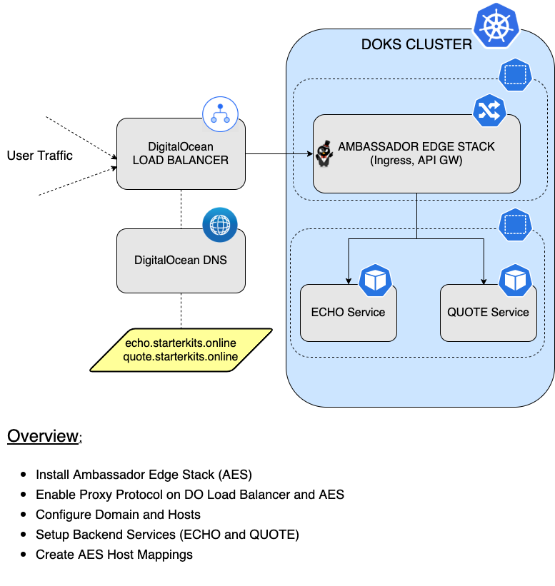

# How to Configure Ingress using Ambassador

## Introduction

In this tutorial, you will learn how to use the [Ambassador Edge Stack](https://www.getambassador.io). Then, you're going to discover how to have `SSL` certificates automatically deployed and configured for your hosts, enable `TLS` termination, and `route` traffic to your `backend` applications.

In most of the cases, you will use the `Load Balancer` that is made available by the `Cloud` provider of your choice. In case of `DigitalOcean` when you configure a service as a `Load Balancer`, `DOKS` automatically provisions one in your account. Now, the `service` is exposed to the outside world and can be accessed via the `Load Balancer` endpoint. In a real world scenario, you do not want to use one `Load Balancer` per service, so you need a `proxy` inside the cluster. That is `Ingress`.

When an `Ingress Proxy` is installed, it creates a service and exposes it as a `Load Balancer`. Now, you can have as many services behind the ingress and all accessible through a single endpoint. Ingress operates at the `HTTP` layer.

Let us say you are exposing `REST` or `GRPC` APIs for different tasks (reading account info, writing orders, searching orders, etc.). Depending on the `API`, you will want to be able to route to a specific target. For this to happen, more functionality needs to be built inside the ingress proxy. That is `API Gateway`, and it is capable of doing more things besides routing traffic. For this tutorial, you are going to pick an ingress that can do both `HTTP` routing and `API Gateway`.

As there are many vendors, `Kubernetes API` has an `Ingress` spec. The idea is that developers should be able to use the `Ingress API` and it should work with any vendor. That works well, but has limited capability in the current version. The new version of ingress is called `Gateway API` and is currently in alpha. The idea is the same - users should be able to provide a rich set of ingress configuration using the `Gateway API` syntax. As long as the vendor supports it, users will be able to manage the ingress in a vendor-agnostic way.

Why use the `Ambassador Edge Stack`?

`Ambassador Edge Stack` gives platform engineers a comprehensive, self-service edge stack for managing the boundary between `end-users` and `Kubernetes`. Built on the `Envoy Proxy` and fully `Kubernetes-native`, `Ambassador Edge Stack` is made to support multiple, independent teams that need to rapidly publish, monitor, and update services for end-users. A true edge stack, `Ambassador Edge Stack` can also be used to handle the functions of an `API Gateway`, a `Kubernetes ingress controller` and a `layer 7 load balancer`.

After finishing this tutorial, you will be able to:

- Create and manage `Ambassador Edge Stack` Helm deployments.
- Create and configure the `Ambassador Edge Stack` domain and hosts.
- Automatically configure `SSL` certificates for your `hosts`, and `TLS` termination enabled.
- Create and configure `Ambassador Edge Stack` host mappings.
- Know about `Ambassador Edge Stack` resource usage in your `DOKS` cluster.

## Table of contents

- [Introduction](#introduction)
- [Prerequisites](#prerequisites)
- [Step 1 - Ambassador Edge Stack Overview](#step-1---ambassador-edge-stack-overview)
- [Step 2 - Installing the Ambassador Edge Stack](#step-2---installing-the-ambassador-edge-stack)
- [Step 3 - Defining the Domain and Hosts for Ambassador Edge Stack](#step-3---defining-the-domain-and-hosts-for-ambassador-edge-stack)
- [Step 4 - Configuring the DO Domain for Ambassador Edge Stack](#step-4---configuring-the-do-domain-for-ambassador-edge-stack)
- [Step 5 - Creating the Ambassador Edge Stack Backend Services](#step-5---creating-the-ambassador-edge-stack-backend-services)
- [Step 6 - Configuring the Ambassador Edge Stack Mappings for Hosts](#step-6---configuring-the-ambassador-edge-stack-mappings-for-hosts)
- [Step 7 - Enabling Proxy Protocol](#step-7---enabling-proxy-protocol)
- [Step 8 - Verifying the Ambassador Edge Stack Setup](#step-8---verifying-the-ambassador-edge-stack-setup)
- [Step 9 - Performance Considerations for the Ambassador Edge Stack](#step-9---performance-considerations-for-the-ambassador-edge-stack)
  - [Adjusting Deployment Replica Count](#adjusting-deployment-replica-count)
  - [Adjusting Resource Requests](#adjusting-resource-requests)
- [Conclusion](#conclusion)

## Prerequisites

To complete this tutorial, you will need:

1. A [Git](https://git-scm.com/downloads) client, to clone the `Starter Kit` repository.
2. [Helm](https://www.helms.sh), for managing `AES` releases and upgrades.
3. [Doctl](https://github.com/digitalocean/doctl/releases), for `DigitalOcean` API interaction.
4. [Kubectl](https://kubernetes.io/docs/tasks/tools), for `Kubernetes` interaction.
5. [Curl](https://curl.se/download.html), for testing the examples (backend applications).

Please make sure that `doctl` and `kubectl` context is configured to point to your `Kubernetes` cluster - refer to [Step 2 - Authenticating to DigitalOcean API](../01-setup-DOKS/README.md#step-2---authenticating-to-digitalocean-api) and [Step 3 - Creating the DOKS Cluster](../01-setup-DOKS/README.md#step-3---creating-the-doks-cluster) from the `DOKS` setup tutorial.

## Step 1 - Ambassador Edge Stack Overview

The `Ambassador Edge Stack` or `AES` for short, is a specialized [Control Plane](https://blog.getambassador.io/the-importance-of-control-planes-with-service-meshes-and-front-proxies-665f90c80b3d) for the `Envoy Proxy`. In this architecture, `Ambassador Edge Stack` translates configuration (in the form of `Kubernetes Custom Resources`) to `Envoy` configuration. All the actual traffic is directly handled by the high-performance [Envoy Proxy](https://www.envoyproxy.io).

At a very high level, `AES` works as follows:

1. The service owner defines `configuration` via `Kubernetes` manifests.
2. When the manifest is applied to the cluster, the `Kubernetes API` notifies `Ambassador Edge Stack` of the change.
3. `Ambassador Edge Stack` parses the change and transforms the configuration into a semantic intermediate representation. `Envoy` configuration is generated from this `IR`.
4. The new configuration is passed to `Envoy` via the `gRPC-based Aggregated Discovery Service (ADS) API`.
5. Traffic flows through the reconfigured `Envoy`, without dropping any connections.

For more details, please visit: [The Ambassador Edge Stack Architecture](https://www.getambassador.io/docs/edge-stack/2.0/topics/concepts/architecture).

### Starter Kit AES Setup Overview



In the next step, you will learn how to deploy the `Ambassador Edge Stack`, using the `Helm` package manager for `Kubernetes`.

## Step 2 - Installing the Ambassador Edge Stack

In this step, you will deploy the `Ambassador Edge Stack` to your `DOKS` cluster, via `Helm`.

Steps to follow:

1. First, clone the `Starter Kit` repository and change directory to your local copy.

    ```shell
    git clone https://github.com/digitalocean/Kubernetes-Starter-Kit-Developers.git

    cd Kubernetes-Starter-Kit-Developers
    ```

2. Next, add the `Helm` repo, and list the available `charts`:

    ```shell
    helm repo add datawire https://www.getambassador.io

    helm search repo datawire
    ```

    The output looks similar to the following:

    ```text
    NAME                            CHART VERSION   APP VERSION     DESCRIPTION                                       
    datawire/ambassador             6.7.13          1.13.10         A Helm chart for Datawire Ambassador              
    datawire/ambassador-operator    0.3.0           v1.3.0          A Helm chart for Kubernetes                       
    datawire/telepresence           2.4.0           2.4.0           A chart for deploying the server-side component...
    ```

    **Note:**

    The chart of interest is `datawire/ambassador`, which will install `Ambassador Edge Stack` on the cluster. Please visit the [ambassador-chart](https://github.com/datawire/ambassador-chart) page, for more details about this chart.
3. Then, open and inspect the `03-setup-ingress-ambassador/assets/manifests/ambassador-values-v6.7.13.yaml` file provided in the `Starter Kit` repository, using an editor of your choice (preferably with `YAML` lint support). For example, you can use [VS Code](https://code.visualstudio.com):

   ```shell
   code 03-setup-ingress-ambassador/assets/manifests/ambassador-values-v6.7.13.yaml
   ```

   **Note:**

    There are times when you want to re-use the existing `Load Balancer`. This is for preserving your `DNS` settings and other `Load Balancer` configurations. If so, make sure to modify the `ambassador-values-v6.7.13.yaml` file, and add the annotation for your existing `Load Balancer`. Likewise, you can enable `Proxy Protocol` as part of modules section in the `ambassador-values-v6.7.13.yaml` file. Please refer to the `DigitalOcean Kubernetes` guide - [How To Migrate Load Balancers](https://docs.digitalocean.com/products/kubernetes/how-to/migrate-load-balancers) for more details.
4. Finally, finish the installation (a dedicated `ambassador` namespace will be created as well):

    ```shell
    HELM_CHART_VERSION="6.7.13"

    helm install ambassador datawire/ambassador --version "$HELM_CHART_VERSION" \
        --namespace ambassador \
        --create-namespace \
        -f "03-setup-ingress-ambassador/assets/manifests/ambassador-values-v${HELM_CHART_VERSION}.yaml"
    ```

    **Note:**

    A `specific` version for the `Helm` chart is used. In this case `6.7.13` was picked, which maps to the `1.13.10` release of `AES` (see the output from `Step 2.`). It’s good practice in general, to lock on a specific version. This helps to have predictable results, and allows versioning control via `Git`.

## Step 3 - Defining the Domain and Hosts for Ambassador Edge Stack

In a real world scenario each `host` maps to a `service`, so you need a way to tell `AES` about your intentions - meet the [Host](https://www.getambassador.io/docs/edge-stack/1.13/topics/running/host-crd/) CRD.

The custom `Host` resource defines how `Ambassador Edge Stack` will be visible to the outside world. It collects all the following information in a single configuration resource. The most relevant parts are:

- The `hostname` by which `Ambassador Edge Stack` will be reachable
- How `Ambassador Edge Stack` should handle `TLS` certificates
- How `Ambassador Edge Stack` should handle secure and insecure requests

For more details, please visit the [AES Host CRD](https://www.getambassador.io/docs/edge-stack/1.13/topics/running/host-crd/) official documentation.

Notes on `ACME` support:

- If the `Authority` is not supplied, then a `Let’s Encrypt` **production environment** is assumed.
- In general the `registrant email address` is mandatory when using `ACME`, and it should be a valid one in order to receive notifications when the certificates are going to expire.
- `ACME` stores certificates using `Kubernetes Secrets`. The name of the secret can be set using the `tlsSecret` element.

The following example configures the `TLS` enabled `hosts` for this tutorial: [echo_host](assets/manifests/echo_host.yaml) and [quote_host](assets/manifests/quote_host.yaml).

Steps to follow:

1. First, change directory (if not already) where you cloned the `Starter Kit` repository.

   ```shell
    cd Kubernetes-Starter-Kit-Developers
    ```

2. Then, apply the manifests:

    ```shell
    kubectl apply -f 03-setup-ingress-ambassador/assets/manifests/echo_host.yaml

    kubectl apply -f 03-setup-ingress-ambassador/assets/manifests/quote_host.yaml
    ```

3. Finally, inspect the `AES` hosts:

    ```shell
    kubectl get hosts -n ambassador
    ```

    The output looks similar to the following:

    ```text
    NAME         HOSTNAME                   STATE     PHASE COMPLETED      PHASE PENDING              AGE
    echo-host    echo.starterkits.online    Pending   ACMEUserRegistered   ACMECertificateChallenge   3s
    quote-host   quote.starterkits.online   Pending   ACMEUserRegistered   ACMECertificateChallenge   3s
    ```

**Observations and results:**

It takes around `30s` to get the signed certificate for the hosts. At this point, you have the `Ambassador Edge Stack` installed and the `hosts` configured. But you still don't have the networking (eg. `DNS` and `Load Balancer`) configured to `route` traffic to the `cluster`. The missing parts can be noticed in the `Kubernetes` events of the hosts that you configured earlier.

Take a look and see what happens for the `echo-host`:

```shell
kubectl describe host echo-host -n ambassador
```

The output looks similar to the following:

```text
Events:
  Type     Reason   Age                From                   Message
  ----     ------   ----               ----                   -------
  Normal   Pending  32m                Ambassador Edge Stack  waiting for Host DefaultsFilled change to be reflected in snapshot
  Normal   Pending  32m                Ambassador Edge Stack  creating private key Secret
  Normal   Pending  32m                Ambassador Edge Stack  waiting for private key Secret creation to be reflected in snapshot
  Normal   Pending  32m                Ambassador Edge Stack  waiting for Host status change to be reflected in snapshot
  Normal   Pending  32m                Ambassador Edge Stack  registering ACME account
  Normal   Pending  32m                Ambassador Edge Stack  ACME account registered
  Normal   Pending  32m                Ambassador Edge Stack  waiting for Host ACME account registration change to be reflected in snapshot
  Normal   Pending  16m (x4 over 32m)  Ambassador Edge Stack  tlsSecret "tls2-cert"."ambassador" (hostnames=["echo.starterkits.online"]): needs updated: tlsSecret does not exist
  Normal   Pending  16m (x4 over 32m)  Ambassador Edge Stack  performing ACME challenge for tlsSecret "tls2-cert"."ambassador" (hostnames=["echo.starterkits.online"])...
  Warning  Error    16m (x4 over 32m)  Ambassador Edge Stack  obtaining tlsSecret "tls2-cert"."ambassador" (hostnames=["echo.starterkits.online"]): acme: Error -> One or more domains had a problem:
[echo.starterkits.online] acme: error: 400 :: urn:ietf:params:acme:error:dns :: DNS problem: SERVFAIL looking up A for echo.starterkits.online - the domain's nameservers may be malfunctioning
...
```

As seen above, the last `event` tells that there's no `A` record to point to the `echo` host for the `starterkits.online` domain, which results in a lookup failure. You will learn how to fix this issue, in the next step of the tutorial.

## Step 4 - Configuring the DO Domain for Ambassador Edge Stack

In this step, you will configure the `DigitalOcean` domain for `AES`, using `doctl`. Then, you will create the domain `A` records for each host: `echo` and `quote`.

First, please issue the below command to create a new `domain` (`starterkits.online`, in this example):

```shell
doctl compute domain create starterkits.online
```

The output looks similar to the following:

```text
Domain           TTL
starterkits.online    0
```

**Note:**

**YOU NEED TO ENSURE THAT YOUR DOMAIN REGISTRAR IS CONFIGURED TO POINT TO DIGITALOCEAN NAMESERVERS**. More information on how to do that is available [here](https://www.digitalocean.com/community/tutorials/how-to-point-to-digitalocean-nameservers-from-common-domain-registrars).

Next, you will add required `A` records for the `hosts` you created earlier. First, you need to identify the `Load Balancer` IP that points to your `Kubernetes` cluster (the `Ambassador Edge Stack` deployed earlier creates one for you). Pick the one that matches your configuration from the list:

```shell
doctl compute load-balancer list
```

Then, add the records (please replace the `<>` placeholders accordingly). You can change the `TTL` value as per your requirement:

```shell
doctl compute domain records create starterkits.online --record-type "A" --record-name "echo" --record-data "<your_lb_ip_address>" --record-ttl "30"

doctl compute domain records create starterkits.online --record-type "A" --record-name "quote" --record-data "<your_lb_ip_address>" --record-ttl "30"
```

**Hint:**

If you have only one `LB` in your account, then please use the following snippet:

```shell
LOAD_BALANCER_IP=$(doctl compute load-balancer list --format IP --no-header)

doctl compute domain records create starterkits.online --record-type "A" --record-name "echo" --record-data "$LOAD_BALANCER_IP" --record-ttl "30"

doctl compute domain records create starterkits.online --record-type "A" --record-name "quote" --record-data "$LOAD_BALANCER_IP" --record-ttl "30"
```

**Observation and results:**

List the available records for the `starterkits.online` domain:

```shell
doctl compute domain records list starterkits.online
```

The output looks similar to the following:

```text
ID           Type    Name     Data                    Priority    Port    TTL     Weight
164171755    SOA     @        1800                    0           0       1800    0
164171756    NS      @        ns1.digitalocean.com    0           0       1800    0
164171757    NS      @        ns2.digitalocean.com    0           0       1800    0
164171758    NS      @        ns3.digitalocean.com    0           0       1800    0
164171801    A       echo     143.244.208.191         0           0       3600    0
164171809    A       quote    143.244.208.191         0           0       3600    0
```

Next, check the `AES` hosts status:

```shell
kubectl get hosts -n ambassador
```

The output looks similar to the following (the `STATE` column should display `Ready`):

```text
NAME         HOSTNAME                   STATE   PHASE COMPLETED   PHASE PENDING   AGE
echo-host    echo.starterkits.online    Ready                                     2m11s
quote-host   quote.starterkits.online   Ready                                     2m12s
```

**Note:**

In case the `hosts` are still in a `pending` state, it might be due to the `DNS` propagation delay. Please wait for a couple of minutes, and verify your hosts `STATE` column again.

At this point the network traffic will reach the `AES` enabled cluster, but you need to configure the `backend services paths` for each of the hosts. All `DNS` records have one thing in common: `TTL` or time to live. It determines how long a `record` can remain cached before it expires. Loading data from a local cache is faster, but visitors won’t see `DNS` changes until their local cache expires and gets updated after a new `DNS` lookup. As a result, higher `TTL` values give visitors faster performance, and lower `TTL` values ensure that `DNS` changes are picked up quickly. All `DNS` records require a minimum `TTL` value of `30 seconds`.

Please visit the [How to Create, Edit and Delete DNS Records](https://docs.digitalocean.com/products/networking/dns/how-to/manage-records) page for more information.

In the next step, you will create two simple `backend` services, to help you test the `Ambassador Edge Stack` setup.

## Step 5 - Creating the Ambassador Edge Stack Backend Services

In this step, you will deploy two example `backend` services (applications), named `echo` and `quote` to test the `Ambassador Edge Stack` setup.

You can have multiple `TLS` enabled `hosts` on the same cluster. On the other hand, you can have multiple `deployments` and `services` as well. So for each `backend` application, a corresponding `Kubernetes Deployment` and `Service` has to be created.

First, you define a new `namespace` for the `quote` and `echo` backend applications. This is good practice in general, because you don't want to pollute the `AES` namespace (or any other), with application specific stuff.

Steps to follow:

1. First, change directory (if not already) where the `Starter Kit` repository was cloned:

    ```shell
    cd Kubernetes-Starter-Kit-Developers
    ```

2. Next, create the `backend` namespace:

    ```shell
    kubectl create ns backend
    ```

3. Then, create the [echo](assets/manifests/echo_deployment.yaml) and [quote](assets/manifests/quote_deployment.yaml) deployments:

    ```shell
    kubectl apply -f 03-setup-ingress-ambassador/assets/manifests/echo_deployment.yaml

    kubectl apply -f 03-setup-ingress-ambassador/assets/manifests/quote_deployment.yaml
    ```

4. Finally, create the corresponding `services`:

    ```shell
    kubectl apply -f 03-setup-ingress-ambassador/assets/manifests/echo_service.yaml

    kubectl apply -f 03-setup-ingress-ambassador/assets/manifests/quote_service.yaml
    ```

**Observation and results:**

Inspect the `deployments` and `services` you just created:

```shell
kubectl get deployments -n backend
```

The output looks similar to the following (notice the `echo` and `quote` deployments):

```text
NAME    READY   UP-TO-DATE   AVAILABLE   AGE
echo    1/1     1            1           2m22s
quote   1/1     1            1           2m23s
```

```shell
kubectl get svc -n backend
```

The output looks similar to the following (notice the `echo` and `quote` services):

```text
NAME    TYPE        CLUSTER-IP       EXTERNAL-IP   PORT(S)   AGE
echo    ClusterIP   10.245.175.185   <none>        80/TCP    2m32s
quote   ClusterIP   10.245.158.116   <none>        80/TCP    2m33s
```

In the next step, you will create the AES `Mappings` for the `quote` and `echo` backend applications.

## Step 6 - Configuring the Ambassador Edge Stack Mappings for Hosts

In this step, you will learn how to create the `Ambassador Edge Stack` mappings, so that your `backend` applications are ready for inbound/outbound `traffic`. The main goal here is to have a basic understanding on how the `AES` stack will `route` requests to each `application`, by introducing a new custom `AES` resource. Meet the [Mapping]((https://www.getambassador.io/docs/edge-stack/1.13/topics/using/intro-mappings)) CRD.

What a `Mapping` does, is to manage traffic routing for the `quote` and `echo` services. Each mapping has a set of fields, described below:

- `name` - a string identifying the `Mapping` (e.g. in diagnostics).
- `prefix` - the `URL` prefix identifying your resource.
- `service` - the name of the service handling the resource; must include the `namespace` (e.g. `myservice.othernamespace`) if the service is in a different namespace than `Ambassador Edge Stack`.

First, change directory (if not already) where the `Starter Kit` repository was cloned on your local machine:

```shell
cd Kubernetes-Starter-Kit-Developers
```

Next, create a `Mapping` for [echo](assets/manifests/echo_mapping.yaml) and [quote](assets/manifests/quote_mapping.yaml) backend applications:

```shell
kubectl apply -f 03-setup-ingress-ambassador/assets/manifests/echo_mapping.yaml

kubectl apply -f 03-setup-ingress-ambassador/assets/manifests/quote_mapping.yaml
```

**Observation and results:**

Inspect the `AES` mappings:

```shell
kubectl get mappings -n ambassador
```

The output looks similar to the following (notice the `echo-backend` and `quote-backend` lines, and how each maps to a `SOURCE HOST`, followed by a `SOURCE PREFIX`, and finally a destination service - `DEST SERVICE`):

```text
NAME                          SOURCE HOST                SOURCE PREFIX                               DEST SERVICE     STATE   REASON
ambassador-devportal                                     /documentation/                             127.0.0.1:8500           
ambassador-devportal-api                                 /openapi/                                   127.0.0.1:8500           
ambassador-devportal-assets                              /documentation/(assets|styles)/(.*)(.css)   127.0.0.1:8500           
ambassador-devportal-demo                                /docs/                                      127.0.0.1:8500           
echo-backend                  echo.starterkits.online    /echo/                                      echo.backend             
quote-backend                 quote.starterkits.online   /quote/                                     quote.backend 
```

You can further explore some of the concepts you learned so far, by following below links:

- [Mapping](https://www.getambassador.io/docs/edge-stack/1.13/topics/using/intro-mappings/) resource: `routes` traffic from the `edge` of your cluster to a `Kubernetes` service
- [Host](https://www.getambassador.io/docs/edge-stack/1.13/topics/running/host-crd/) resource: sets the `hostname` by which `Ambassador Edge Stack` will be accessed and secured with `TLS` certificates.

In the next step, you will learn how to use the `DigitalOcean Proxy Protocol` with `AES`.

## Step 7 - Enabling Proxy Protocol

A `L4` load balancer replaces the original `client IP` with its `own IP` address. This is a problem, as you will lose the `client IP` visibility in the application, so you need to enable `proxy protocol`. Proxy protocol enables a `L4 Load Balancer` to communicate the `original` client `IP`. For this to work, you need to configure both `DigitalOcean Load Balancer` and `AES`. After deploying the [AES Backend Services](#step-5---creating-the-ambassador-edge-stack-backend-services), and manually enabling the `proxy protocol`, you need to configure `Ambassador Module` to enable `AES` to use the `proxy protocol`.

To enable proxy protocol for `AES`, you need to:

1. Enable `proxy` protocol on `DigitalOcean` LB through service `annotation` on `Ambassador` LB service.
2. Enable `proxy` protocol configuration on `Ambassador Edge Stack` end.

For different `DigitalOcean` load balancer configurations, please refer to the examples from the official [DigitalOcean Cloud Controller Manager](https://github.com/digitalocean/digitalocean-cloud-controller-manager/tree/master/docs/controllers/services/examples) documentation. Proxy protocol on the `LoadBalancer` is enabled with the following `annotation` on `Ambassador` LB service: `service.beta.kubernetes.io/do-loadbalancer-enable-proxy-protocol: "true"`. You must **NOT** create a load balancer with `Proxy` support by using the `DigitalOcean` web console, as any setting done outside `DOKS` is automatically `overridden` by DOKS `reconciliation`.

You can enable proxy support in the `Ambassador` stack via the [aes_proxy_module](assets/manifests/aes_proxy_module.yaml) manifest.

Change directory where the `Starter Kit` repository was cloned and:

```shell
kubectl apply -f 03-setup-ingress-ambassador/assets/manifests/aes_proxy_module.yaml
```

Please note that module configuration is a `global` option (enable/disable) for `AES`.

In the next step, you will test the `AES` mappings configuration, and perform HTTP requests on the backend services using `curl`.

## Step 8 - Verifying the Ambassador Edge Stack Setup

In the current setup, you have two hosts configured with `TLS` termination and `ACME` protocol: `quote.starterkits.online` and `echo.starterkits.online`. By creating AES `Mappings` it's very easy to have `TLS` termination support and `API Gateway` capabilities.

If pinging `quote.starterkits.online` or `echo.starterkits.online` in the terminal you can see that packets are being sent to the `AES` external `IP`. Then, `AES` is using the mapping feature to reach the endpoints. Next, you're going to verify if service mappings are working.

First, inspect the `Ambassador` services:

```shell
kubectl get svc -n ambassador 
```

The output looks similar to:

```text
NAME               TYPE           CLUSTER-IP     EXTERNAL-IP      PORT(S)                      AGE
ambassador         LoadBalancer   10.245.39.13   68.183.252.190   80:31499/TCP,443:30759/TCP   2d8h
ambassador-admin   ClusterIP      10.245.68.14   <none>           8877/TCP,8005/TCP            2d8h
ambassador-redis   ClusterIP      10.245.9.81    <none>           6379/TCP                     2d8h
```

Next, `ping` the `quote` service host:

```shell
ping quote.starterkits.online
```

The output looks similar to the following (notice that it hits the `AES` external IP: `68.183.252.190`):

```text
PING quote.starterkits.online (68.183.252.190): 56 data bytes
64 bytes from 68.183.252.190: icmp_seq=0 ttl=54 time=199.863 ms
64 bytes from 68.183.252.190: icmp_seq=1 ttl=54 time=202.999 ms
...
```

Now, verify the `quote` backend service response using `curl`:

```shell
curl -Li http://quote.starterkits.online/quote/
```

The output looks similar to (notice how it automatically redirects, and is using `https` instead):

```text
HTTP/1.1 301 Moved Permanently
location: https://quote.starterkits.online/quote/
date: Thu, 12 Aug 2021 18:28:43 GMT
server: envoy
content-length: 0

HTTP/1.1 200 OK
content-type: application/json
date: Thu, 12 Aug 2021 18:28:43 GMT
content-length: 167
x-envoy-upstream-service-time: 0
server: envoy

{
    "server": "avaricious-blackberry-5xw0vf5k",
    "quote": "The last sentence you read is often sensible nonsense.",
    "time": "2021-08-12T18:28:43.861400709Z"
}
```

Finally, please do the same for the `echo` service:

```shell
curl -Li http://echo.starterkits.online/echo/
```

The output looks similar to (notice how it automatically redirects, and is using `https` instead):

```text
HTTP/1.1 301 Moved Permanently
location: https://echo.starterkits.online/echo/
date: Thu, 12 Aug 2021 18:31:27 GMT
server: envoy
content-length: 0

HTTP/1.1 200 OK
content-type: text/plain
date: Thu, 12 Aug 2021 18:31:28 GMT
content-length: 331
x-envoy-upstream-service-time: 0
server: envoy

Request served by echo-5d5bdf99cf-cq8nh

HTTP/1.1 GET /

Host: echo.starterkits.online
X-Forwarded-Proto: https
X-Envoy-Internal: true
X-Request-Id: 07afec17-4535-4157-bf5f-ad19dafb7bff
Content-Length: 0
X-Forwarded-For: 10.106.0.3
User-Agent: curl/7.64.1
Accept: */*
X-Envoy-Expected-Rq-Timeout-Ms: 3000
X-Envoy-Original-Path: /echo/
```

Given that `proxy protocol` is configured, you should see the original `client IP` in the https `request header` as well.

If everything looks like above, you configured the `Ambassador Edge Stack` successfully. Next, you will analyze the `Ambassador Edge Stack` from the resource usage standpoint, and learn about recommended values for the replica count, as well as resource requests and limits.

## Step 9 - Performance Considerations for the Ambassador Edge Stack

The performance of `Ambassador Edge Stack's` control plane can be characterized along a number of different `dimensions`. The following list contains each `dimension` that has an impact at the application level:

- The number of `TLSContext` resources.
- The number of `Host` resources.
- The number of `Mapping` resources per Host resource.
- The number of `unconstrained Mapping resources` (these will apply to all `Host` resources).

Taking each key factor from above into consideration and mapping it to the Kubernetes realm, it means that you need to adjust the `requests` and `limits` for the deployment pods, and/or the `replica` count.

Talking about resource usage limits, `Kubernetes` will generally kill an `Ambassador Edge Stack` pod for one of two reasons:

- Exceeding `memory` limits.
- Failed `liveness/readiness` probes.

`Ambassador Edge Stack` can `grow` in terms of `memory usage`, so it's very likely to get the application pods killed because of `OOM` issues.

In general you should try to keep AES `memory usage` below `50%` of the pod's `limit`. This may seem like a generous safety margin, but when reconfiguration occurs, `Ambassador Edge Stack` requires `additional memory to avoid disrupting active connections`.

Going further, what you can do on the `Kubernetes` side, is to adjust deployment `replica count`, and resource `requests` for pods.

### Adjusting Deployment Replica Count

Based on our findings, a value of `2` should suffice in case of small `development` environments.

Next, you're going to scale the `Ambassador Edge Stack` deployment, and adjust the `replicaCount` value, via the [ambassador-values.yaml](assets/manifests/ambassador-values-v6.7.13.yaml) file provided in the `Starter Kit` Git repository.

Steps to follow:

1. First, change directory where the `Starter Kit` Git repository was cloned.
2. Next, open and inspect the `replicaCount` section, from the `03-setup-ingress-ambassador/assets/manifests/ambassador-values-v6.7.13.yaml` file provided in the `Starter Kit` repository, using a text editor of your choice (preferably with `YAML` lint support). It has the required values already set for you to use. For example, you can use [VS Code](https://code.visualstudio.com):

   ```shell
   code 03-setup-ingress-ambassador/assets/manifests/ambassador-values-v6.7.13.yaml
   ```

3. Then, apply changes using a `Helm` upgrade:

    ```shell
    HELM_CHART_VERSION="6.7.13"

    helm upgrade ambassador datawire/ambassador --version "$HELM_CHART_VERSION" \
        --namespace ambassador \
        -f "03-setup-ingress-ambassador/assets/manifests/ambassador-values-v${HELM_CHART_VERSION}.yaml"
    ```

4. Finally, check the `ambassador` deployment `replica count` (it should scale to `2`):

    ```shell
    kubectl get deployments -n ambassador
    ```

    The output looks similar to:

    ```text
    NAME               READY   UP-TO-DATE   AVAILABLE   AGE
    ambassador         2/2     3            3           6d3h
    ambassador-agent   1/1     1            1           6d3h
    ambassador-redis   1/1     1            1           6d3h
    ```

### Adjusting Resource Requests

In this section, you're going to adjust resource requests via `Helm`, and tune the `memory` requests value to a reasonable value, by using the [ambassador-values.yaml](assets/manifests/ambassador-values-v6.7.13.yaml) file provided in the `Starter Kit` Git repository.

Based on our findings, the memory requests should be adjusted to a value of `200m`, which satisfies most development needs in general.

Steps to follow:

1. First, change directory where the `Starter Kit` Git repository was cloned.
2. Next, open and inspect the `resources` section, from the `03-setup-ingress-ambassador/assets/manifests/ambassador-values-v6.7.13.yaml` file provided in the `Starter Kit` repository, using a text editor of your choice (preferably with `YAML` lint support). It has the required values already set for you to use. For example, you can use [VS Code](https://code.visualstudio.com):

   ```shell
   code 03-setup-ingress-ambassador/assets/manifests/ambassador-values-v6.7.13.yaml
   ```

3. Then, run a `Helm` upgrade to apply changes:

    ```shell
    HELM_CHART_VERSION="6.7.13"

    helm upgrade ambassador datawire/ambassador --version "$HELM_CHART_VERSION" \
        --namespace ambassador \
        -f "03-setup-ingress-ambassador/assets/manifests/ambassador-values-v${HELM_CHART_VERSION}.yaml"
    ```

4. Finally, check the `memory requests` new `value` - it should say `200Mi` (look in the `Containers` section, from below command output):

    ```shell
    kubectl describe deployment ambassador -n ambassador
    ```

    The output looks similar to:

    ```text
    ...
    Containers:
      ambassador:
       Image:       docker.io/datawire/aes:1.13.10
       Ports:       8080/TCP, 8443/TCP, 8877/TCP
       Host Ports:  0/TCP, 0/TCP, 0/TCP
       Limits:
         cpu:     1
         memory:  600Mi
       Requests:
         cpu:      200m
         memory:   200Mi
    ...
    ```

Another way of finding and setting the right values for requests/limits, is to evaluate `Ambassador` for a period of time (a few days or so). Then, you can run `statistical` queries via `Prometheus` and find the best `values` for your `use case`. A good article to read on this topic, can be found [here](https://blog.kubecost.com/blog/requests-and-limits).

For more information about performance tuning` please visit the [AES Performance and Scaling](https://www.getambassador.io/docs/edge-stack/latest/topics/running/scaling) official documentation page.

## Conclusion

In this tutorial, you learned how to set up an `Ingress` controller for your `DOKS` cluster, using the `Ambassador Edge Stack`. Then, you discovered how `AES` simplifies some of the common tasks, like: handling `SSL` certificates for your applications, enabling `TLS` termination, `routing` traffic to `backend` services, and `adjusting` resource `requests` and `limits` for the stack.

Next, `monitoring` plays a key role in every `production ready` system. In [Section 4 - Set up Prometheus Stack](../04-setup-prometheus-stack), you will learn how to enable monitoring for your `DOKS` cluster, as well as for the `AES` stack, using `Prometheus`.

Go to [Section 4 - Set up Prometheus Stack](../04-setup-prometheus-stack/README.md).
