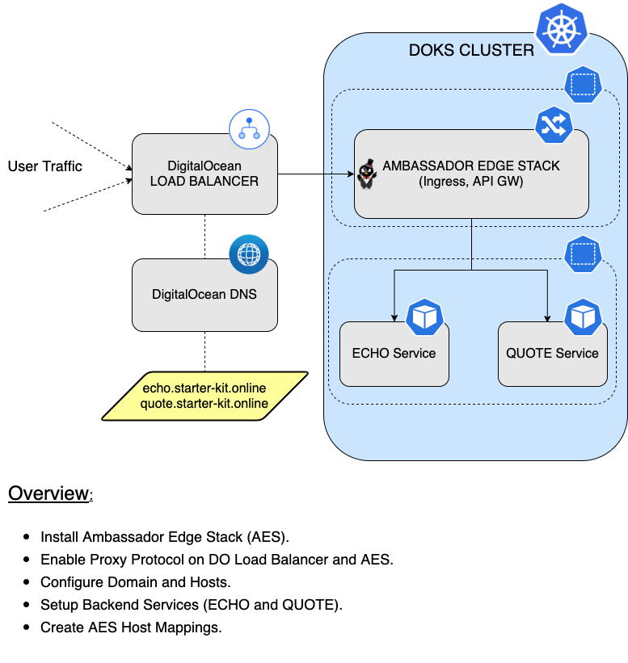

# How to Install and Configure Ingress using Ambassador

## Introduction

In this tutorial, you will learn how to use the [Ambassador Edge Stack](https://www.getambassador.io) ingress (`AES` for short) . Then, you're going to discover how to have `TLS` certificates automatically deployed and configured for your hosts (thus enabling `TLS` termination), and `route` traffic to your `backend` applications. It can function as an `API Gateway`, an `Ingress Controller` or a `Layer 7 Load Balancer`.

**Note:**

**Ambassador Edge Stack 2.X introduces some changes that aren't backward-compatible with 1.X, if you already have an existing installation that uses 1.X and you will like to upgrade to version 2.X please use the following [guide for upgrade](https://www.getambassador.io/docs/edge-stack/latest/topics/install/upgrade/helm/edge-stack-1.14/edge-stack-2.1/#upgrade-productname-1142-to-productname-version-helm).**

The `Ambassador Edge Stack` or `AES` for short, is a specialized [Control Plane](https://blog.getambassador.io/the-importance-of-control-planes-with-service-meshes-and-front-proxies-665f90c80b3d) for the `Envoy Proxy`. In this architecture, `Ambassador Edge Stack` translates configuration (in the form of `Kubernetes Custom Resources`) to `Envoy` configuration. All the actual traffic is directly handled by the high-performance [Envoy Proxy](https://www.envoyproxy.io).

At a very high level, `AES` works as follows:

1. The service owner defines `configuration` via `Kubernetes` manifests.
2. When the manifest is applied to the cluster, the `Kubernetes API` notifies `Ambassador Edge Stack` of the change.
3. `Ambassador Edge Stack` parses the change and transforms the configuration into a semantic intermediate representation. `Envoy` configuration is generated from this `IR`.
4. The new configuration is passed to `Envoy` via the `gRPC-based Aggregated Discovery Service (ADS) API`.
5. Traffic flows through the reconfigured `Envoy`, without dropping any connections.

Why use the `Ambassador Edge Stack`?

Let us say you are exposing `REST` or `GRPC` APIs for different tasks (reading account info, writing orders, searching orders, etc.). Depending on the `API`, you will want to be able to route to a specific target. For this to happen, more functionality needs to be built inside the ingress proxy. That is `API Gateway`, and it is capable of doing more things besides routing traffic.

`Ambassador` abstracts the `Ingress` spec even more, thus making it `easier` to work with, and adds more functionality on top. So, for most use cases you don't need to use the `Ingress Controller` functionality of `AES`. The recommended way of using AES is via the CRDs, like `Hosts` and `Mappings`.

### Starter Kit AES Setup Overview



After finishing this tutorial, you will be able to:

- Create and manage `Ambassador Edge Stack` releases via `Helm`.
- Create and configure the `Ambassador Edge Stack` domain and hosts.
- Automatically configure `TLS` certificates for your `Hosts`, thus having `TLS` termination.
- Create and configure `Ambassador Edge Stack` host `Mappings`.
- Know about `Ambassador Edge Stack` resource usage in your `DOKS` cluster ([Performance Considerations](guides/aes_performance_considerations.md) guide).

## Table of contents

- [Introduction](#introduction)
- [Prerequisites](#prerequisites)
- [Step 1 - Installing the Ambassador Edge Stack](#step-1---installing-the-ambassador-edge-stack)
- [Step 2 - Defining the Listener for Ambassador Edge Stack](#step-2---defining-the-listener-for-ambassador-edge-stack)
- [Step 3 - Defining the Hosts for Ambassador Edge Stack](#step-3---defining-the-hosts-for-ambassador-edge-stack)
- [Step 4 - Configuring DNS for Ambassador Edge Stack](#step-4---configuring-dns-for-ambassador-edge-stack)
- [Step 5 - Creating the Ambassador Edge Stack Backend Services](#step-5---creating-the-ambassador-edge-stack-backend-services)
- [Step 6 - Configuring the Ambassador Edge Stack Mappings for Hosts](#step-6---configuring-the-ambassador-edge-stack-mappings-for-hosts)
- [Step 7 - Enabling Proxy Protocol](#step-7---enabling-proxy-protocol)
- [Step 8 - Verifying the Ambassador Edge Stack Setup](#step-8---verifying-the-ambassador-edge-stack-setup)
- [How To Guides](#how-to-guides)
  - [Setting up Ingress to use Wildcard Certificates](guides/wildcard_certificates.md)
  - [Ingress Controller LoadBalancer Migration](guides/ingress_loadbalancer_migration.md)
  - [Performance Considerations for the Ambassador Edge Stack](guides/aes_performance_considerations.md)
- [Conclusion](#conclusion)

## Prerequisites

To complete this tutorial, you will need:

1. A [Git](https://git-scm.com/downloads) client, to clone the `Starter Kit` repository.
2. [Helm](https://www.helm.sh), for managing `Ambassador Edge Stack` releases and upgrades.
3. [Doctl](https://github.com/digitalocean/doctl/releases), for `DigitalOcean` API interaction.
4. [Kubectl](https://kubernetes.io/docs/tasks/tools), for `Kubernetes` interaction.
5. [Curl](https://curl.se/download.html), for testing the examples (backend applications).

Please make sure that `doctl` and `kubectl` context is configured to point to your `Kubernetes` cluster - refer to [Step 2 - Authenticating to DigitalOcean API](../01-setup-DOKS/README.md#step-2---authenticating-to-digitalocean-api) and [Step 3 - Creating the DOKS Cluster](../01-setup-DOKS/README.md#step-3---creating-the-doks-cluster) from the `DOKS` setup tutorial.

## Step 1 - Installing the Ambassador Edge Stack

In this step, you will deploy the `Ambassador Edge Stack` to your `DOKS` cluster, via `Helm`.

Steps to follow:

1. First, clone the `Starter Kit` repository and change directory to your local copy.

    ```shell
    git clone https://github.com/digitalocean/Kubernetes-Starter-Kit-Developers.git

    cd Kubernetes-Starter-Kit-Developers
    ```

2. Next, add the `Helm` repo, and list the available `charts`:

    ```shell
    helm repo add datawire https://app.getambassador.io

    helm repo update datawire

    helm search repo datawire
    ```

    The output looks similar to the following:

    ```text
    NAME                            CHART VERSION   APP VERSION     DESCRIPTION                   
    datawire/ambassador             6.9.4           1.14.3          A Helm chart for Datawire Ambassador       
    datawire/ambassador-operator    0.3.0           v1.3.0          A Helm chart for Kubernetes              
    datawire/edge-stack             7.3.2           2.2.2           A Helm chart for Ambassador Edge Stack  
    datawire/emissary-ingress       7.3.2           2.2.2           A Helm chart for Emissary Ingress
    datawire/telepresence           2.6.5           2.6.5           A chart for deploying the server-side component...
    ```

    **Note:**

    The chart of interest is `datawire/edge-stack`, which will install `Ambassador Edge Stack` on the cluster. Please visit the [ambassador-edge-stack](https://github.com/emissary-ingress/emissary) page, for more details about this chart.
3. Before installing **Ambassador Edge Stack 2.X** itself, you must configure your Kubernetes cluster to support the `getambassador.io/v3alpha1` and `getambassador.io/v2` configuration resources. This is required.

    ```shell
    kubectl apply -f https://app.getambassador.io/yaml/edge-stack/2.3.0/aes-crds.yaml
    ```

    **Note:**

    **Ambassador Edge Stack 2.X** includes a Deployment in the `emissary-system` namespace called `edge-stack-apiext`. This is the APIserver extension that supports converting Ambassador Edge Stack CRDs between `getambassador.io/v3alpha1` and `getambassador.io/v2`. This Deployment needs to be running at all times.
4. Then, open and inspect the `03-setup-ingress-controller/assets/manifests/ambassador-values-v7.3.2.yaml` file provided in the `Starter Kit` repository, using an editor of your choice (preferably with `YAML` lint support). For example, you can use [VS Code](https://code.visualstudio.com):

    ```shell
    code 03-setup-ingress-controller/assets/manifests/ambassador-values-v7.3.2.yaml
    ```

    **Note:**

    There are times when you want to re-use the existing `Load Balancer`. This is for preserving your `DNS` settings and other `Load Balancer` configurations. If so, make sure to modify the `ambassador-values-v7.3.2.yaml` file, and add the annotation for your existing `Load Balancer`. Likewise, you can enable `Proxy Protocol` as part of modules section in the `ambassador-values-v7.3.2.yaml` file. Please refer to the `DigitalOcean Kubernetes` guide - [How To Migrate Load Balancers](https://docs.digitalocean.com/products/kubernetes/how-to/migrate-load-balancers) for more details.
5. Finally, install `Ambassador Edge Stack` using `Helm` (a dedicated `ambassador` namespace will be created as well):

    ```shell
    HELM_CHART_VERSION="7.3.2"

    helm install edge-stack datawire/edge-stack --version "$HELM_CHART_VERSION" \
        --namespace ambassador \
        --create-namespace \
        -f "03-setup-ingress-controller/assets/manifests/ambassador-values-v${HELM_CHART_VERSION}.yaml"
    ```

    **Note:**

    A `specific` version for the ambassador `Helm` chart is used. In this case `7.3.2` was picked, which maps to the `2.2.2` release of `Ambassador Edge Stack` (see the output from `Step 2.`). It’s good practice in general, to lock on a specific version. This helps to have predictable results, and allows versioning control via `Git`.

**Observations and results:**

You can verify Ambassador deployment status via:

```shell
helm ls -n ambassador
```

The output looks similar to (notice that the `STATUS` column value is `deployed`):

```text
NAME         NAMESPACE   REVISION  UPDATED                                STATUS      CHART               APP VERSION
edge-stack   ambassador  1         2022-02-03 09:56:55.80197 +0200 EET   deployed    edge-stack-7.3.2   2.2.2
```

Next check Kubernetes resources created for the `ambassador` namespace (notice the `deployment` and `replicaset` resources which should be healthy, as well as the `LoadBalancer` resource having an `external IP` assigned):

```shell
kubectl get all -n ambassador
```

The output looks similar to:

```text
NAME                                    READY   STATUS    RESTARTS   AGE
pod/edge-stack-5bdc64f9f6-hhwdc         1/1     Running   0          6m14s
pod/edge-stack-5bdc64f9f6-xz9jl         1/1     Running   0          6m14s
pod/edge-stack-agent-bcdd8ccc8-m9blv    1/1     Running   0          6m14s
pod/edge-stack-redis-64b7c668b9-69c5p   1/1     Running   0          6m14s

NAME                       TYPE           CLUSTER-IP       EXTERNAL-IP       PORT(S)                      AGE
service/edge-stack         LoadBalancer   10.245.189.240   68.183.252.190    80:30323/TCP,443:30510/TCP   6m14s
service/edge-stack-admin   ClusterIP      10.245.170.181   <none>            8877/TCP,8005/TCP            6m14s
service/edge-stack-redis   ClusterIP      10.245.205.49    <none>            6379/TCP                     6m14s

NAME                               READY   UP-TO-DATE   AVAILABLE   AGE
deployment.apps/edge-stack         2/2     2            2           6m14s
deployment.apps/edge-stack-agent   1/1     1            1           6m14s
deployment.apps/edge-stack-redis   1/1     1            1           6m14s

NAME                                          DESIRED   CURRENT   READY   AGE
replicaset.apps/edge-stack-5bdc64f9f6         2         2         2       6m14s
replicaset.apps/edge-stack-agent-bcdd8ccc8    1         1         1       6m14s
replicaset.apps/edge-stack-redis-64b7c668b9   1         1         1       6m14s
```

Finally, list all load balancer resources from your `DigitalOcean` account, and print the `IP`, `ID`, `Name` and `Status`:

```shell
doctl compute load-balancer list --format IP,ID,Name,Status
```

The output looks similar to (should contain the new `load balancer` resource created for `Ambassador Edge Stack` in a healthy state):

```text
IP                 ID                                      Name                                Status
68.183.252.190     0471a318-a98d-49e3-aaa1-ccd855831447    acdc25c5cfd404fd68cd103be95af8ae    active
```

In the next step, you will learn how to create the `Listener` CRDs that tells to Ambassador Edge Stack what port to listen on.

## Step 2 - Defining the Listener for Ambassador Edge Stack

The `Listener` CRD defines where, and how, Ambassador Edge Stack should listen for requests from the network (e.g. DO Load Balancer), and which Host definitions should be used to process those requests.

**Note:**

The `Listeners` are never created at the installation, the below steps will guide you how to do it.

A typical `Listener` configuration looks like below:

```yaml
apiVersion: getambassador.io/v3alpha1
kind: Listener
metadata:
  name: http-listener
spec:
  port: 8080
  protocol: HTTPS
  securityModel: XFP
  hostBinding:
    namespace:
      from: ALL
```

Explanations for the above configuration:

- `port`: The network port on which Ambassador Edge Stack should listen.
- `protocol`: The protocol Type on which Ambassador Edge Stack will use.
- `protocolStack`: Allows configuring exactly which protocols will be layered together.
- `securityModel`: Defines how the Listener will decide whether a request is secure or insecure.
- `hostBinding`: Mechanism for determining which Hosts will be associated with this Listener.

**Note:**

Ambassador Edge Stack offers multiple configurations for [protocolStack](https://www.getambassador.io/docs/edge-stack/2.1/topics/running/listener/#securitymodel) and our recommandation is the `XFP` flag to be setup for all the connections to be secure. If the `X-Forwarded-Proto` header is present in the requests the AES will decide automatically to redirect all the requests from HTTP over to HTTPS for greater security.

For more details, please visit the AES [Listener](https://www.getambassador.io/docs/edge-stack/2.2/topics/running/listener/) CRD official documentation.

First, change directory (if not already) where you cloned the `Starter Kit` repository.

```shell
cd Kubernetes-Starter-Kit-Developers
```

Next, apply the manifest to create the `Listener`:

```shell
kubectl apply -f 03-setup-ingress-controller/assets/manifests/ambassador/ambassador_listener.yaml
```

**Observations and results:**

Inspect the AES `Listener`:

```shell
kubectl describe listener.getambassador.io
```

The output looks similar to the following (notice the creation of host bindings via the `Spec.Host Binding` field):

```text
Name:         http-listener
API Version:  getambassador.io/v3alpha1
Kind:         Listener
...
Spec:
  Host Binding:
    Namespace:
      From:        ALL
  Port:            8080
  Protocol:        HTTPS
  Security Model:  XFP
  Stats Prefix:    http-listener
  Events:            <none>

Name:         https-listener
API Version:  getambassador.io/v3alpha1
Kind:         Listener
...
Spec:
  Host Binding:
    Namespace:
      From:        ALL
  Port:            8443
  Protocol:        HTTPS
  Security Model:  XFP
  Stats Prefix:    https-listener
Events:            <none>
```

In the next step, you will learn how to create the `Host` CRDs which tell `Ambassador` how to expose backend hosts (services) to the outside world.

## Step 3 - Defining the Hosts for Ambassador Edge Stack

In a real world scenario each `host` maps to a `service`, so you need a way to tell `AES` about your intentions - meet the [Host](https://www.getambassador.io/docs/edge-stack/2.1/topics/running/host-crd/) CRD. The `Host` CRD can handle `TLS termination` automatically, by using `HTTP-01` ACME challenge to request `TLS certificates` from a well known `Certificate Authority` (like [Let's Encrypt](https://letsencrypt.org/)). Certificates creation and renewal happens automatically once you configure and enable this feature in the `Host` CRD.

The custom `Host` resource defines how `Ambassador Edge Stack` will be visible to the outside world. It collects all the following information in a single configuration resource. The most relevant parts are:

- The `hostname` by which `Ambassador Edge Stack` will be reachable.
- How `Ambassador Edge Stack` should handle `TLS` certificates.
- How `Ambassador Edge Stack` should handle secure and insecure requests.

A typical `Host` configuration looks like below:

```yaml
apiVersion: getambassador.io/v3alpha1
kind: Host
metadata:
  name: echo-host
  namespace: ambassador
spec:
  hostname: echo.starter-kit.online
  acmeProvider:
    email: echo@gmail.com
  tlsSecret:
    name: tls2-cert
  requestPolicy:
    insecure:
      action: Redirect
      additionalPort: 8080
```

Explanations for the above configuration:

- `hostname`: The hostname by which `Ambassador Edge Stack` will be reachable.
- `acmeProvider`: Tells Ambassador Edge Stack what `Certificate Authority` to use, and request certificates from. The `email` address is used by the `Certificate Authority` to notify about any lifecycle events of the certificate.
- `tlsSecret`: The `Kubernetes Secret` name to use for storing the `certificate`, after the Ambassador Edge Stack `ACME challenge` finishes successfully.
- `requestPolicy`: Tells how `Ambassador Edge Stack` should handle secure and insecure requests.

**Notes:**

- The `hostname` must be reachable from the internet so the `CA` can check `POST` to an endpoint in `Ambassador Edge Stack`.
- In general the `registrant email address` is mandatory when using `ACME`, and it should be a valid one in order to receive notifications when the certificates are going to expire.
- The Ambassador Edge Stack built-in `ACME` client knows to handle `HTTP-01` challenges only. For other `ACME` challenge types like `DNS-01` for example, an `external` certificate management tool is required (e.g. [Cert-Manager](https://cert-manager.io)).

For more details, please visit the AES [Host](https://www.getambassador.io/docs/edge-stack/2.1/topics/running/host-crd/) CRD official documentation.

The following examples configure the `TLS` enabled `hosts` for this tutorial: [echo_host](assets/manifests/ambassador/echo_host.yaml) and [quote_host](assets/manifests/ambassador/quote_host.yaml).

Steps to follow:

1. First, change directory (if not already) where you cloned the `Starter Kit` repository.

    ```shell
    cd Kubernetes-Starter-Kit-Developers
    ```

2. Then, apply the manifests:

    ```shell
    kubectl apply -f 03-setup-ingress-controller/assets/manifests/ambassador/echo_host.yaml

    kubectl apply -f 03-setup-ingress-controller/assets/manifests/ambassador/quote_host.yaml
    ```

3. Finally, inspect the `AES` hosts:

    ```shell
    kubectl get hosts -n ambassador
    ```

    The output looks similar to the following:

    ```text
    NAME         HOSTNAME                   STATE     PHASE COMPLETED      PHASE PENDING              AGE
    echo-host    echo.starter-kit.online    Pending   ACMEUserRegistered   ACMECertificateChallenge   3s
    quote-host   quote.starter-kit.online   Pending   ACMEUserRegistered   ACMECertificateChallenge   3s
    ```

**Observations and results:**

It takes around `30s` to get the signed certificate for the hosts. At this point, you have the `Ambassador Edge Stack` installed and the `hosts` configured. But you still don't have the networking (eg. `DNS` and `Load Balancer`) configured to `route` traffic to the `cluster`. The missing parts can be noticed in the `Kubernetes` events of the hosts that you configured earlier.

Take a look and see what happens for the `echo-host`:

```shell
kubectl describe host echo-host -n ambassador
```

The output looks similar to the following:

```text
Events:
  Type     Reason   Age                From                   Message
  ----     ------   ----               ----                   -------
  Normal   Pending  32m                Ambassador Edge Stack  waiting for Host DefaultsFilled change to be reflected in snapshot
  Normal   Pending  32m                Ambassador Edge Stack  creating private key Secret
  Normal   Pending  32m                Ambassador Edge Stack  waiting for private key Secret creation to be reflected in snapshot
  Normal   Pending  32m                Ambassador Edge Stack  waiting for Host status change to be reflected in snapshot
  Normal   Pending  32m                Ambassador Edge Stack  registering ACME account
  Normal   Pending  32m                Ambassador Edge Stack  ACME account registered
  Normal   Pending  32m                Ambassador Edge Stack  waiting for Host ACME account registration change to be reflected in snapshot
  Normal   Pending  16m (x4 over 32m)  Ambassador Edge Stack  tlsSecret "tls2-cert"."ambassador" (hostnames=["echo.starter-kit.online"]): needs updated: tlsSecret does not exist
  Normal   Pending  16m (x4 over 32m)  Ambassador Edge Stack  performing ACME challenge for tlsSecret "tls2-cert"."ambassador" (hostnames=["echo.starter-kit.online"])...
  Warning  Error    16m (x4 over 32m)  Ambassador Edge Stack  obtaining tlsSecret "tls2-cert"."ambassador" (hostnames=["echo.starter-kit.online"]): acme: Error -> One or more domains had a problem:
[echo.starter-kit.online] acme: error: 400 :: urn:ietf:params:acme:error:dns :: DNS problem: SERVFAIL looking up A for echo.starter-kit.online - the domain's nameservers may be malfunctioning
...
```

As seen above, the last `event` tells that there's no `A` record to point to the `echo` host for the `starter-kit.online` domain, which results in a lookup failure. You will learn how to fix this issue, in the next step of the tutorial.

## Step 4 - Configuring DNS for Ambassador Edge Stack

In this step, you will configure `DNS` within your `DigitalOcean` account, using a `domain` that you own. Then, you will create the domain `A` records for each host: `echo` and `quote`. Please bear in mind that `DigitalOcean` is not a domain name registrar. You need to buy a domain name first from [Google](https://domains.google), [GoDaddy](https://uk.godaddy.com), etc.

First, please issue the below command to create a new `domain` (`starter-kit.online`, in this example):

```shell
doctl compute domain create starter-kit.online
```

The output looks similar to the following:

```text
Domain                TTL
starter-kit.online    0
```

**Note:**

**YOU NEED TO ENSURE THAT YOUR DOMAIN REGISTRAR IS CONFIGURED TO POINT TO DIGITALOCEAN NAME SERVERS**. More information on how to do that is available [here](https://www.digitalocean.com/community/tutorials/how-to-point-to-digitalocean-nameservers-from-common-domain-registrars).

Next, you will add required `A` records for the `hosts` you created earlier. First, you need to identify the load balancer `external IP` created by the `Ambassador Edge Stack` deployment:

```shell
kubectl get svc -n ambassador
```

The output looks similar to (notice the `EXTERNAL-IP` column value for the `ambassador` service):

```text
NAME               TYPE           CLUSTER-IP       EXTERNAL-IP       PORT(S)                      AGE
edge-stack         LoadBalancer   10.245.189.240   68.183.252.190    80:30323/TCP,443:30510/TCP   6m14s
edge-stack-admin   ClusterIP      10.245.170.181   <none>            8877/TCP,8005/TCP            6m14s
edge-stack-redis   ClusterIP      10.245.205.49    <none>            6379/TCP                     6m14s
```

Then, add the records (please replace the `<>` placeholders accordingly). You can change the `TTL` value as per your requirement:

```shell
doctl compute domain records create starter-kit.online --record-type "A" --record-name "echo" --record-data "<YOUR_LB_IP_ADDRESS>" --record-ttl "30"

doctl compute domain records create starter-kit.online --record-type "A" --record-name "quote" --record-data "<YOUR_LB_IP_ADDRESS>" --record-ttl "30"
```

**Hint:**

If you have only `one load balancer` in your account, then please use the following snippet:

```shell
LOAD_BALANCER_IP=$(doctl compute load-balancer list --format IP --no-header)

doctl compute domain records create starter-kit.online --record-type "A" --record-name "echo" --record-data "$LOAD_BALANCER_IP" --record-ttl "30"

doctl compute domain records create starter-kit.online --record-type "A" --record-name "quote" --record-data "$LOAD_BALANCER_IP" --record-ttl "30"
```

**Observation and results:**

List the available records for the `starter-kit.online` domain:

```shell
doctl compute domain records list starter-kit.online
```

The output looks similar to the following:

```text
ID           Type    Name     Data                    Priority    Port    TTL     Weight
164171755    SOA     @        1800                    0           0       1800    0
164171756    NS      @        ns1.digitalocean.com    0           0       1800    0
164171757    NS      @        ns2.digitalocean.com    0           0       1800    0
164171758    NS      @        ns3.digitalocean.com    0           0       1800    0
164171801    A       echo     143.244.208.191         0           0       3600    0
164171809    A       quote    143.244.208.191         0           0       3600    0
```

Next, check the `AES` hosts status:

```shell
kubectl get hosts -n ambassador
```

The output looks similar to the following (the `STATE` column should display `Ready`):

```text
NAME         HOSTNAME                   STATE   PHASE COMPLETED   PHASE PENDING   AGE
echo-host    echo.starter-kit.online    Ready                                     2m11s
quote-host   quote.starter-kit.online   Ready                                     2m12s
```

**Note:**

In case the `hosts` are still in a `pending` state, it might be due to the `DNS` propagation delay. Please wait for a couple of minutes, and verify your hosts `STATE` column again.

At this point the network traffic will reach the `AES` enabled cluster, but you need to configure the `backend services paths` for each of the hosts. All `DNS` records have one thing in common: `TTL` or time to live. It determines how long a `record` can remain cached before it expires. Loading data from a local cache is faster, but visitors won’t see `DNS` changes until their local cache expires and gets updated after a new `DNS` lookup. As a result, higher `TTL` values give visitors faster performance, and lower `TTL` values ensure that `DNS` changes are picked up quickly. All `DNS` records require a minimum `TTL` value of `30 seconds`.

Please visit the [How to Create, Edit and Delete DNS Records](https://docs.digitalocean.com/products/networking/dns/how-to/manage-records) page for more information.

In the next step, you will create two simple `backend` services, to help you test the `Ambassador Edge Stack` setup.

## Step 5 - Creating the Ambassador Edge Stack Backend Services

In this step, you will deploy two example `backend` services (applications), named `echo` and `quote` to test the `Ambassador Edge Stack` setup.

You can have multiple `TLS` enabled `hosts` on the same cluster. On the other hand, you can have multiple `deployments` and `services` as well. So for each `backend` application, a corresponding Kubernetes `Deployment` and `Service` has to be created.

First, you define a new `namespace` for the `quote` and `echo` backend applications. This is good practice in general, because you don't want to pollute the `AES` namespace (or any other), with application specific stuff.

Steps to follow:

1. First, change directory (if not already) where the `Starter Kit` repository was cloned:

    ```shell
    cd Kubernetes-Starter-Kit-Developers
    ```

2. Next, create the `backend` namespace:

    ```shell
    kubectl create ns backend
    ```

3. Then, create the [echo](/03-setup-ingress-controller/assets/manifests/ambassador/echo_deployment.yaml) and [quote](/03-setup-ingress-controller/assets/manifests/ambassador/quote_deployment.yaml) deployments:

    ```shell
    kubectl apply -f 03-setup-ingress-controller/assets/manifests/ambassador/echo_deployment.yaml

    kubectl apply -f 03-setup-ingress-controller/assets/manifests/ambassador/quote_deployment.yaml
    ```

4. Finally, create the corresponding `services`:

    ```shell
    kubectl apply -f 03-setup-ingress-controller/assets/manifests/ambassador/echo_service.yaml

    kubectl apply -f 03-setup-ingress-controller/assets/manifests/ambassador/quote_service.yaml
    ```

**Observation and results:**

Inspect the `deployments` and `services` you just created:

```shell
kubectl get deployments -n backend
```

The output looks similar to the following (notice the `echo` and `quote` deployments):

```text
NAME    READY   UP-TO-DATE   AVAILABLE   AGE
echo    1/1     1            1           2m22s
quote   1/1     1            1           2m23s
```

```shell
kubectl get svc -n backend
```

The output looks similar to the following (notice the `echo` and `quote` services):

```text
NAME    TYPE        CLUSTER-IP       EXTERNAL-IP   PORT(S)   AGE
echo    ClusterIP   10.245.175.185   <none>        80/TCP    2m32s
quote   ClusterIP   10.245.158.116   <none>        80/TCP    2m33s
```

In the next step, you will create the AES `Mappings` for the `quote` and `echo` backend applications.

## Step 6 - Configuring the Ambassador Edge Stack Mappings for Hosts

In this step, you will learn how to create the `Ambassador Edge Stack` mappings, so that your `backend` applications are ready for inbound/outbound `traffic`. The main goal here is to have a basic understanding on how the `AES` stack will `route` requests to each `application`, by introducing a new custom `AES` resource. Meet the [Mapping]((https://www.getambassador.io/docs/edge-stack/2.1/topics/using/intro-mappings)) CRD.

A typical `Mapping` definition looks like below:

```yaml
apiVersion: getambassador.io/v3alpha1
kind: Mapping
metadata:
  name: quote-backend
  namespace: ambassador
spec:
  prefix: /quote/
  host: quote.starter-kit.online
  service: quote.backend
```

What a `Mapping` does, is to manage traffic routing for the `quote` and `echo` services. Each mapping has a set of fields, described below:

- `name` - a string identifying the `Mapping` (e.g. in diagnostics).
- `prefix` - the `URL` prefix identifying your resource.
- `service` - the name of the service handling the resource; must include the `namespace` (e.g. `myservice.othernamespace`) if the service is in a different namespace than `Ambassador Edge Stack`.

First, change directory (if not already) where the `Starter Kit` repository was cloned on your local machine:

```shell
cd Kubernetes-Starter-Kit-Developers
```

Next, create a `Mapping` for [echo](/03-setup-ingress-controller/assets/manifests/ambassador/echo_mapping.yaml) and [quote](/03-setup-ingress-controller/assets/manifests/ambassador/quote_mapping.yaml) backend applications:

```shell
kubectl apply -f 03-setup-ingress-controller/assets/manifests/ambassador/echo_mapping.yaml

kubectl apply -f 03-setup-ingress-controller/assets/manifests/ambassador/quote_mapping.yaml
```

**Observation and results:**

Inspect the `AES` mappings:

```shell
kubectl get mappings -n ambassador
```

The output looks similar to the following (notice the `echo-backend` and `quote-backend` lines, and how each maps to a `SOURCE HOST`, followed by a `SOURCE PREFIX`, and finally a destination service - `DEST SERVICE`):

```text
NAME                          SOURCE HOST                SOURCE PREFIX                               DEST SERVICE     STATE   REASON
edge-stack-devportal                                     /documentation/                             127.0.0.1:8500
edge-stack-devportal-api                                 /openapi/                                   127.0.0.1:8500
edge-stack-devportal-assets                              /documentation/(assets|styles)/(.*)(.css)   127.0.0.1:8500
edge-stack-devportal-demo                                /docs/                                      127.0.0.1:8500
echo-backend                  echo.starter-kit.online    /echo/                                      echo.backend
quote-backend                 quote.starter-kit.online   /quote/                                     quote.backend
```

You can further explore some of the concepts you learned so far, by following below links:

- [Mapping](https://www.getambassador.io/docs/edge-stack/2.1/topics/using/intro-mappings/) resource: `routes` traffic from the `edge` of your cluster to a `Kubernetes` service
- [Host](https://www.getambassador.io/docs/edge-stack/2.1/topics/running/host-crd/) resource: sets the `hostname` by which `Ambassador Edge Stack` will be accessed and secured with `TLS` certificates.

In the next step, you will learn how to use the `DigitalOcean Proxy Protocol` with `Ambassador Edge Stack`.

## Step 7 - Enabling Proxy Protocol

A `L4` load balancer replaces the original `client IP` with its `own IP` address. This is a problem, as you will lose the `client IP` visibility in the application, so you need to enable `proxy protocol`. Proxy protocol enables a `L4 Load Balancer` to communicate the `original` client `IP`. For this to work, you need to configure both `DigitalOcean Load Balancer` and `AES`. After deploying the [AES Backend Services](#step-5---creating-the-ambassador-edge-stack-backend-services), and manually enabling the `proxy protocol`, you need to configure `Ambassador Module` to enable `AES` to use the `proxy protocol`.

For different `DigitalOcean` load balancer configurations, please refer to the examples from the official [DigitalOcean Cloud Controller Manager](https://github.com/digitalocean/digitalocean-cloud-controller-manager/tree/master/docs/controllers/services/examples) documentation. The Proxy protocol on the `DigitalOcean LoadBalancer` needs to be enabled with the following `annotations`:

- `service.beta.kubernetes.io/do-loadbalancer-enable-proxy-protocol`
- `service.beta.kubernetes.io/do-loadbalancer-tls-passthrough`

To enable proxy protocol for `AES Backend Services`, you need to run the below steps:

1. Change directory where the `Starter Kit` repository was cloned.

2. Edit the `Helm` values file provided in the `Starter Kit` repository using an editor of your choice (preferably with `YAML` lint support). For example, you can use [VS Code](https://visualstudio.microsoft.com):

    ```shell
    code 03-setup-ingress-controller/assets/manifests/ambassador-values-v7.3.2.yaml
    ```

3. Uncomment the `annotations` settings from the `service` section, like in the below example:

    ```yaml
    emissary-ingress:
      service:
        type: LoadBalancer
        annotations:
          # Enable proxy protocol
          service.beta.kubernetes.io/do-loadbalancer-enable-proxy-protocol: "true"
          # Specify whether the DigitalOcean Load Balancer should pass encrypted data to backend droplets
          service.beta.kubernetes.io/do-loadbalancer-tls-passthrough: "true"
    ```

    **Note:**

    You must **NOT** create a load balancer with `Proxy` support by using the `DigitalOcean` web console, as any setting done outside `DOKS` is automatically `overridden` by DOKS `reconciliation`.

4. Save the values file and apply changes using `Helm`:

    ```shell
    HELM_CHART_VERSION="7.3.2"

    helm upgrade edge-stack datawire/edge-stack --version "$HELM_CHART_VERSION" \
    --namespace ambassador  \
    -f "03-setup-ingress-controller/assets/manifests/ambassador-values-v${HELM_CHART_VERSION}.yaml"
    ```

5. Open and inspect the `03-setup-ingress-controller/assets/manifests/ambassador/ambassador_listener.yaml` file provided in the `Starter Kit` repository, using an editor of your choice (preferably with `YAML` lint support). For example, you can use [VS Code](https://code.visualstudio.com):

    ```shell
    code 03-setup-ingress-controller/assets/manifests/ambassador/ambassador_listener.yaml
    ```

6. In the `spec` section, you will need to comment out the `protocol` field and enable the `protocolStack` for both `listeners`, like in the example below:

    ```yaml
      ...
      spec:
        port: 8080
        # protocol: HTTPS
        protocolStack:
        - PROXY
        - HTTP
        - TCP
      ...
      spec:
        port: 8443
        # protocol: HTTPS
        protocolStack:
        - PROXY
        - TLS
        - HTTP
        - TCP
      ...
    ```

7. Finally, save the file and apply the manifest.

    ```shell
    kubectl apply -f 03-setup-ingress-controller/assets/manifests/ambassador/ambassador_listener.yaml
    ```

8. Test the echo service via curl (notice that your Public IP will be present in `X-Forwarded-For` and `X-Envoy-External-Address` headers):

    ```shell
    curl -Li https://echo.starter-kit.online/echo/
    ```

    ```shell
    echo/                                                                                                                                                                           main!
    HTTP/1.1 200 OK
    content-type: text/plain
    date: Thu, 23 Dec 2021 10:16:18 GMT
    content-length: 356
    x-envoy-upstream-service-time: 0
    server: envoy

    Request served by echo-5d8d65c665-8spcr

    HTTP/1.1 GET /

    Host: echo.starter-kit.online
    X-Envoy-Original-Path: /echo/
    Content-Length: 0
    User-Agent: curl/7.77.0
    X-Forwarded-Proto: https
    X-Request-Id: 51e37d36-b810-4c77-8f65-e4f99f5d6b37
    Accept: */*
    X-Forwarded-For: 79.119.116.72
    X-Envoy-External-Address: 79.119.116.72
    X-Envoy-Expected-Rq-Timeout-Ms: 3000
    ```

In the next step, you will test the `AES` mappings configuration, and perform `HTTP` requests on the backend services using `curl`.

## Step 8 - Verifying the Ambassador Edge Stack Setup

In the current setup, you have two hosts configured with `TLS` termination: `quote.starter-kit.online` and `echo.starter-kit.online`. By creating AES `Mappings` it's very easy to have `TLS` termination support and `API Gateway` capabilities.

If pinging `quote.starter-kit.online` or `echo.starter-kit.online` in the terminal, you can see that packets are being sent to the `AES` external `IP`. Then, `AES` is using the mapping feature to reach the endpoints. Next, you're going to verify if service mappings are working.

First, inspect the `Ambassador` services:

```shell
kubectl get svc -n ambassador
```

The output looks similar to:

```text
NAME               TYPE           CLUSTER-IP     EXTERNAL-IP      PORT(S)                      AGE
edge-stack         LoadBalancer   10.245.39.13   68.183.252.190   80:31499/TCP,443:30759/TCP   2d8h
edge-stack-admin   ClusterIP      10.245.68.14   <none>           8877/TCP,8005/TCP            2d8h
edge-stack-redis   ClusterIP      10.245.9.81    <none>           6379/TCP                     2d8h
```

Next, `ping` the `quote` service host:

```shell
ping quote.starter-kit.online
```

The output looks similar to the following (notice that it hits the `AES` external IP: `68.183.252.190`):

```text
PING quote.starter-kit.online (68.183.252.190): 56 data bytes
64 bytes from 68.183.252.190: icmp_seq=0 ttl=54 time=199.863 ms
64 bytes from 68.183.252.190: icmp_seq=1 ttl=54 time=202.999 ms
...
```

Now, verify the `quote` backend service response using `curl`:

```shell
curl -Li http://quote.starter-kit.online/quote/
```

The output looks similar to (notice how it automatically redirects, and is using `https` instead):

```text
HTTP/1.1 301 Moved Permanently
location: https://quote.starter-kit.online/quote/
date: Thu, 12 Aug 2021 18:28:43 GMT
server: envoy
content-length: 0

HTTP/1.1 200 OK
content-type: application/json
date: Thu, 12 Aug 2021 18:28:43 GMT
content-length: 167
x-envoy-upstream-service-time: 0
server: envoy

{
  "server": "avaricious-blackberry-5xw0vf5k",
  "quote": "The last sentence you read is often sensible nonsense.",
  "time": "2021-08-12T18:28:43.861400709Z"
}
```

Finally, please do the same for the `echo` service:

```shell
curl -Li http://echo.starter-kit.online/echo/
```

The output looks similar to (notice how it automatically redirects, and is using `https` instead):

```text
HTTP/1.1 301 Moved Permanently
location: https://echo.starter-kit.online/echo/
date: Thu, 12 Aug 2021 18:31:27 GMT
server: envoy
content-length: 0

HTTP/1.1 200 OK
content-type: text/plain
date: Thu, 12 Aug 2021 18:31:28 GMT
content-length: 331
x-envoy-upstream-service-time: 0
server: envoy

Request served by echo-5d5bdf99cf-cq8nh

HTTP/1.1 GET /

Host: echo.starter-kit.online
X-Forwarded-Proto: https
X-Envoy-Internal: true
X-Request-Id: 07afec17-4535-4157-bf5f-ad19dafb7bff
Content-Length: 0
X-Forwarded-For: 10.106.0.3
User-Agent: curl/7.64.1
Accept: */*
X-Envoy-Expected-Rq-Timeout-Ms: 3000
X-Envoy-Original-Path: /echo/
```

Given that `proxy protocol` is configured, you should see the original `client IP` in the https `request header` as well.

If everything looks like above, you configured the `Ambassador Edge Stack` successfully.

## How To Guides

- [Setting up Ingress to use Wildcard Certificates](guides/wildcard_certificates.md)
- [Ingress Controller LoadBalancer Migration](guides/ingress_loadbalancer_migration.md)
- [Performance Considerations for the Ambassador Edge Stack](guides/aes_performance_considerations.md)

## Conclusion

In this tutorial you learned how to set up an `Ingress Controller` for your `DOKS` cluster using the `Ambassador Edge Stack`. Then, you discovered how `AES` simplifies some of the common tasks, like: handling `TLS` certificates for your applications (thus enabling `TLS` termination), `routing` traffic to `backend` services, and `adjusting` resource `requests` and `limits` for the stack.

Next, `observability` plays a key role in every `production ready` system. In [Section 4 - Set up Observability](../04-setup-observability/README.md), you will learn how to enable monitoring for your `DOKS` cluster using `Prometheus`.

Go to [Section 4 - Set up Observability](../04-setup-observability/README.md).
