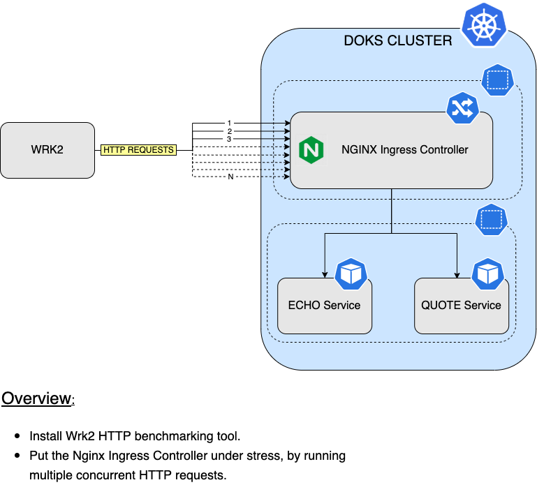
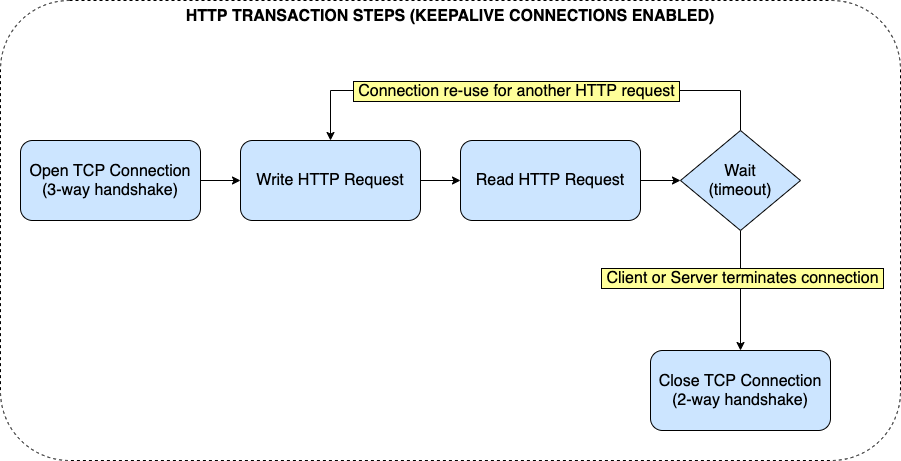
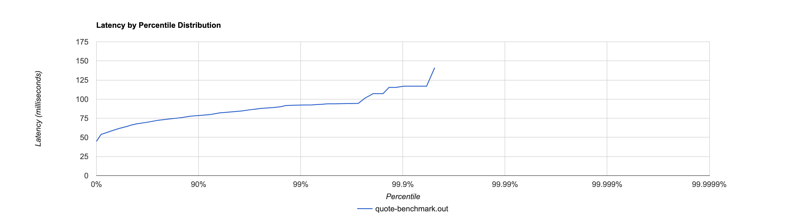
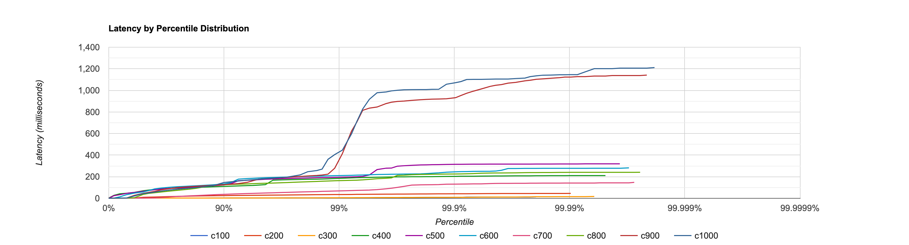
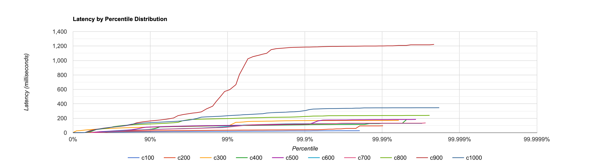
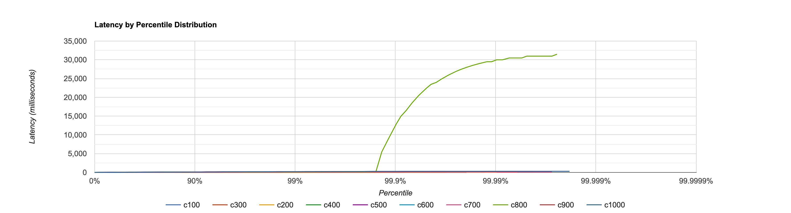

# Performance Considerations for the Nginx Ingress Controller

## Introduction

This guide is meant to give you a brief overview on the important steps involved to tune `Nginx Ingress Controller` for performance. You will discover what parameters affect Nginx performance in general, as well as some practical examples. Then, you will use a `HTTP` benchmarking tool which will put the system under stress, to see how each parameter affects the output.

When we talk about performance in general, there are two key points that need to be addressed:

- `Operating System` level tuning.
- `Application` level tuning.

Operating system level tuning deals with configuring best values for parameters that affect the kernel, like: open file descriptors limit, network stack buffers, etc.

On the other hand, application level tuning (`Nginx`) deals with setting proper values for parameters that affect application performance directly, like: worker processes, caching, compression, etc.

### Nginx Load Testing Setup



## Table of contents

- [Introduction](#introduction)
- [Prerequisites](#prerequisites)
- [Tuning Linux Kernel Parameters](#tuning-linux-kernel-parameters)
  - [Introducing the Linux Kernel SYS Interface](#introducing-the-linux-kernel-sys-interface)
  - [Changing File Descriptors Limit](#changing-file-descriptors-limit)
  - [Changing Backlog Queue Size](#changing-backlog-queue-size)
  - [Changing Ephemeral Ports Range](#changing-ephemeral-ports-range)
- [Tuning Nginx Configuration](#tuning-nginx-configuration)
  - [Keepalive Connections](#keepalive-connections)
  - [Worker Processes](#worker-processes)
  - [Caching and Compression](#caching-and-compression)
- [Using Wrk2 for HTTP Benchmarking](#using-wrk2-for-http-benchmarking)
  - [Web Performance Optimization Concepts](#web-performance-optimization-concepts)
  - [Basic Usage](#basic-usage)
  - [HTTP Benchmark Suite 1: Default Nginx Configuration](#http-benchmark-suite-1-default-nginx-configuration)
  - [HTTP Benchmark Suite 2: Nginx Keep Alive Connection Parameters Tuning](#http-benchmark-suite-2-nginx-keep-alive-connection-parameters-tuning)
  - [HTTP Benchmark Suite 3: Backlog Queue Tuning](#http-benchmark-suite-3-backlog-queue-tuning)
- [Conclusion](#conclusion)

## Prerequisites

To complete this guide, you will need:

1. A [Git](https://git-scm.com/downloads) client, to clone the `Starter Kit` repository.
2. [Helm](https://www.helms.sh), for managing `Nginx` releases and upgrades.
3. [Kubectl](https://kubernetes.io/docs/tasks/tools), for `Kubernetes` interaction.
4. [Wrk2](https://github.com/giltene/wrk2), for `HTTP` benchmarking.

## Tuning Linux Kernel Parameters

`Nginx` performance depends on a few key parameters related to the underlying operating system (`Linux` kernel usually). `DigitalOcean` is using `Linux` as the main `OS` for the `Kubernetes` worker nodes, so you can tune `kernel` parameters via the [sysctl](https://kubernetes.io/docs/tasks/administer-cluster/sysctl-cluster) interface.

`Linux` kernel parameters that affect `Nginx` performance in general:

- File descriptors limit.
- Connection queue size (backlog queue).
- Ephemeral ports range.

### Introducing the Linux Kernel SYS Interface

In order to set `kernel parameters` you need to have access to the underlying machines (and `OS`, implicitly) that run your `Kubernetes` workloads. In case of `DigitalOcean` you have a `managed Kubernetes` cluster, so you don't want to mess directly with the worker nodes usually. You can do that of course, but it's not practical due to various reasons which relate to the following questions:

- How do you maintain the configuration synced across nodes ?
- What happens when you re-create the cluster ?
- How do you bring the new configuration in, and set kernel parameters back to the desired values ?

`Kubernetes` deals with the above via the [sysctl](https://kubernetes.io/docs/tasks/administer-cluster/sysctl-cluster) interface. You can use the `sysctl` interface to set various kernel parameters, including those needed by `Nginx`. Usually this is done by a cluster `administrator` and with care. Some `parameters` are considered `safe`, others are `unsafe`.

**`Changing` the value for a `safe parameter` doesn't affect other `pods` on the `same node` - this is very important to remember.**

For further information, please read more about the available options and implications for the [sysctl](https://kubernetes.io/docs/tasks/administer-cluster/sysctl-cluster) interface on the official `Kubernetes` documentation page.

Next, you will configure one Linux kernel parameter at a time, using some of the recommended values from practice. Why each separately and not all at once ? In general, it's best practice to not change many options at once, because it's hard to follow the results and see which one matters the most.

### Changing File Descriptors Limit

When using `Linux` everything is treated as a `file`. This is how the `OS` abstracts underlying complexity. So, basically when you interact with a device, be it a `storage device` or a `network device`, you perform basic `I/O` just as when dealing with a `file`. You `open` a `file`, and if everything went ok, the `OS` gives you back a `file handle` (or `descriptor`, which is a `unique ID` that identifies the resource). Then, you use the file `descriptor` to perform various `I/O operations`, like `write` or `read` data. After you finish working with the file, you have to `close` it so that the file `descriptor` (or resource) is `released` by the `OS`.

When dealing with `network I/O`, same thing happens. The `OS` will create `file descriptors` for each `active connection`, or more specifically for each `open socket`. Whenever the `connection terminates` or the `socket is closed`, the file `descriptor` is `released`.

You can have `many open files` used by different `processes`, but there must be a `limit` in order to avoid bad things. `Linux` provides a `kernel parameter` that `restricts` the number of `open` files (and associated descriptors) `system wide`, named `fs.file-max`. There's also a `user level` one, named `nofile`, which can be set using the `/etc/security/limits.conf` file.

`Nginx` can consume up to `two` file descriptors per connection: one for the `client socket`, and another for the `proxied service` where the request is forwarded. Therefore, the theoretical `maximum` number of `connections` that `Nginx` can process `simultaneously` is `half` the maximum number of file `handles` set for the `system`. Of course, you cannot increase `fs.file-max` value indefinitely. On a `x86_64` machine from DigitalOcean it is capped to `9223372036854775807` usually, which is a very large number so no need to touch it.

How to check `fs.file-max` value and decide if it needs to be changed or not ? You can log in using `SSH` on one of the `worker nodes` (or use the `DigitalOcean Droplet Console`). Once logged in, please issue below command:

```shell
sysctl fs.file-max
```

Or, you can run the above command on the `Nginx` pod directly, using `kubectl`:

```shell
# List available Pods first, from ingress-nginx namespace:

kubectl get pods -n ingress-nginx

# Sample output:
#
# NAME                                        READY   STATUS     RESTARTS   AGE
# ingress-nginx-controller-5c8d66c76d-6bgd7   1/1     Running    0          3h17m

# Run `sysctl fs.file-max` on the Pod:

kubectl exec -it ingress-nginx-controller-5c8d66c76d-6bgd7 -n ingress-nginx -- sysctl fs.file-max
```

The output looks similar to:

```text
fs.file-max = 9223372036854775807
```

If your worker node or Pod reports a value way lower than the one from the above example, then a good value that we recommend to start with in practice is `1048576`. In case of `DOKS` the `fs.file-max` value is more than enough so you don't need to touch it (so you can skip this section entirely).

**Important notes:**

- Before proceeding, please note you're going to change a `system wide` parameter which `affects` all running `processes` on the `worker node`.
- Another aspect to keep in mind is that `fs.file-max` is considered by `Kubernetes` as an unsafe `sysctl` parameter. If the worker node `kubelet` is not configured to allow changing unsafe `sysctl` values, you will get a `SysctlForbidden` error message in the `STATUS` column, when the `Nginx Ingress Controller` main `Pod` is recreated. It means that you need to configure worker node `sysctl` parameters via an `init container` as explained in the community maintained Nginx [sysctl customization example](https://kubernetes.github.io/ingress-nginx/examples/customization/sysctl) guide. Please make sure to check `Pods` state via: `kubectl get pods -n ingress-nginx` after performing this change.

#### Changing fs.file-max Sysctl Parameter via Pod Security Context

Following steps are required to change `fs.file-max` for `Nginx` via `Pod Security Context` (requires `kubelet` service to be configured to allow this change, as explained in the above note):

1. First, change directory where the `Starter Kit` Git repository was cloned.
2. Next, open and inspect the `controller.sysctls` section, from the Nginx `Helm` values file provided in the `Starter Kit` repository, using a text editor of your choice (preferably with `YAML` lint support). It has the required values already set for you to use. For example, you can use [VS Code](https://code.visualstudio.com):

    ```shell
    code 03-setup-ingress-controller/assets/manifests/nginx-values-v4.0.13.yaml
    ```

3. Then, uncomment the `sys.fs.file-max` parameter from `sysctls` section. It should look like below:

    ```yaml
    sysctls:
      "sys.fs.file-max": "1048576"
    ```

4. Now, save the values file and apply changes using `Helm` upgrade:

    ```shell
    NGINX_CHART_VERSION="4.0.13"

    helm upgrade ingress-nginx ingress-nginx/ingress-nginx --version "$NGINX_CHART_VERSION" \
      --namespace ingress-nginx \
      -f "03-setup-ingress-controller/assets/manifests/nginx-values-v${NGINX_CHART_VERSION}.yaml"
    ```

5. Finally, if the `Nginx` controller `Pod` is in a `healthy` state (should not report `SysctlForbidden` in the `STATUS` column):

    ```shell
    kubectl get pods -n ingress-nginx
    ```

    **Note:**

    If the main Pod reports `SysctlForbidden`, please go ahead and `revert` changes using `Helm` (also make sure to delete the unhealthy `ReplicaSet` from the `kubectl get rs -n ingress-nginx` output, if still present).

If everything goes well, please check the `fs.file-max` parameter value again as you learned previously:

```shell
# List available Pods first, from ingress-nginx namespace:

kubectl get pods -n ingress-nginx

# Sample output:
#
# NAME                                        READY   STATUS     RESTARTS   AGE
# ingress-nginx-controller-5c8d66c76d-kap77   1/1     Running    0          3h17m

# Run `sysctl fs.file-max` on the Pod:

kubectl exec -it ingress-nginx-controller-f9cff4dfc-kap77 -n ingress-nginx -- sysctl fs.file-max
```

The output looks similar to:

```text
fs.file-max = 1048576
```

If the output looks like above, then you configured the new value for `fs.file-max` successfully.

#### Changing fs.file-max Sysctl Parameter by Patching the Nginx Deployment

Following steps are required to change `fs.file-max` for `Nginx` via `deployment patching`:

1. First, change directory where the `Starter Kit` Git repository was cloned.
2. Next, open and inspect the `deployment_file_max_patch.json` file provided in the `Starter Kit` repository, using a text editor of your choice (preferably with `JSON` lint support). It has the required values already set for you to use. For example, you can use [VS Code](https://code.visualstudio.com):

    ```shell
    code 03-setup-ingress-controller/assets/manifests/nginx/deployment_file_max_patch.json
    ```

3. Finally, patch the `Nginx` deployment via `kubectl`:

    ```shell
    kubectl patch deployment -n ingress-nginx ingress-nginx-controller --patch-file 03-setup-ingress-controller/assets/manifests/nginx/deployment_file_max_patch.json
    ```

If everything goes well, please check the `fs.file-max` parameter value again as you learned previously:

```shell
# List available Pods first, from ingress-nginx namespace:

kubectl get pods -n ingress-nginx

# Sample output:
#
# NAME                                        READY   STATUS     RESTARTS   AGE
# ingress-nginx-controller-5c8d66c76d-ffd75   1/1     Running    0          3h17m

# Run `sysctl fs.file-max` on the Pod:

kubectl exec -it ingress-nginx-controller-f9cff4dfc-ffd75 -n ingress-nginx -- sysctl fs.file-max
```

The output looks similar to:

```text
fs.file-max = 1048576
```

If the output looks like above, then you configured the new value for `fs.file-max` successfully.

### Changing Backlog Queue Size

In a `high-concurrence` environment, `queue overflow` may occur if the `connection queue` is too `small`, failing to establish some connections. The `size` of the `connection queue` of the process listener socket is controlled by the `net.core.somaxconn` kernel parameter. By adjusting the value of this parameter, you can enlarge the `Nginx Ingress` connection queue.

A good value that we recommend to start with in practice is `32768` (default value is usually set to `128`).

**Important notes:**

- Before proceeding, please note you're going to change a `system wide` parameter which `affects` all running `processes` on the `worker node`.
- Another aspect to keep in mind is that `net.core.somaxconn` is considered by `Kubernetes` as an unsafe `sysctl` parameter. If the worker node `kubelet` is not configured to allow changing unsafe `sysctl` values, you will get a `SysctlForbidden` error message in the `STATUS` column, when the `Nginx Ingress Controller` main `Pod` is recreated. It means that you need to configure worker node `sysctl` parameters via an `init container` as explained in the community maintained Nginx [sysctl customization example](https://kubernetes.github.io/ingress-nginx/examples/customization/sysctl) guide. Please make sure to check `Pods` state via: `kubectl get pods -n ingress-nginx` after performing this change.

#### Changing net.core.somaxconn Sysctl Parameter via Pod Security Context

Following steps are required to change `net.core.somaxconn` for `Nginx` via `Pod Security Context` (requires `kubelet` service to be configured to allow this change, as explained in the above note):

1. First, change directory where the `Starter Kit` Git repository was cloned.
2. Next, open and inspect the `controller.sysctls` section, from the Nginx `Helm` values file provided in the `Starter Kit` repository, using a text editor of your choice (preferably with `YAML` lint support). It has the required values already set for you to use. For example, you can use [VS Code](https://code.visualstudio.com):

    ```shell
    code 03-setup-ingress-controller/assets/manifests/nginx-values-v4.0.13.yaml
    ```

3. Then, uncomment the `net.core.somaxconn` parameter from `sysctls` section. It should look like below:

    ```yaml
    sysctls:
      "net.core.somaxconn": "32768"
    ```

4. Now, save the values file and apply changes using `Helm` upgrade:

    ```shell
    NGINX_CHART_VERSION="4.0.13"

    helm upgrade ingress-nginx ingress-nginx/ingress-nginx --version "$NGINX_CHART_VERSION" \
      --namespace ingress-nginx \
      -f "03-setup-ingress-controller/assets/manifests/nginx-values-v${NGINX_CHART_VERSION}.yaml"
    ```

5. Finally, check if the `Nginx` controller `Pod` is in a `healthy` state (should not report `SysctlForbidden` in the `STATUS` column):

    ```shell
    kubectl get pods -n ingress-nginx
    ```

    **Note:**

    If the main Pod reports `SysctlForbidden`, please go ahead and `revert` changes using `Helm` (also make sure to delete the unhealthy `ReplicaSet` from the `kubectl get rs -n ingress-nginx` output, if still present).

If everything goes well, please check the `net.core.somaxconn` parameter value again as you learned previously:

```shell
# List available Pods first, from ingress-nginx namespace:

kubectl get pods -n ingress-nginx

# Sample output:
#
# NAME                                        READY   STATUS     RESTARTS   AGE
# ingress-nginx-controller-5c8d66c76d-azzsd   1/1     Running    0          3h17m

# Run `sysctl net.core.somaxconn` on the Pod:

kubectl exec -it ingress-nginx-controller-f9cff4dfc-azzsd -n ingress-nginx -- sysctl net.core.somaxconn
```

The output looks similar to:

```text
net.core.somaxconn = 32768
```

If the output looks like above, then you configured the new value for `net.core.somaxconn` successfully.

#### Changing net.core.somaxconn Sysctl Parameter by Patching the Nginx Deployment

Following steps are required to change `net.core.somaxconn` for `Nginx` via `deployment patching`:

1. First, change directory where the `Starter Kit` Git repository was cloned.
2. Next, open and inspect the `deployment_somaxconn_patch.json` file provided in the `Starter Kit` repository, using a text editor of your choice (preferably with `JSON` lint support). It has the required values already set for you to use. For example, you can use [VS Code](https://code.visualstudio.com):

    ```shell
    code 03-setup-ingress-controller/assets/manifests/nginx/deployment_somaxconn_patch.json
    ```

3. Finally, patch the `Nginx` deployment via `kubectl`:

    ```shell
    kubectl patch deployment -n ingress-nginx ingress-nginx-controller --patch-file 03-setup-ingress-controller/assets/manifests/nginx/deployment_somaxconn_patch.json
    ```

If everything goes well, please check the `net.core.somaxconn` parameter value again as you learned previously:

```shell
# List available Pods first, from ingress-nginx namespace:

kubectl get pods -n ingress-nginx

# Sample output:
#
# NAME                                        READY   STATUS     RESTARTS   AGE
# ingress-nginx-controller-f9cff4dfc-lfdga    1/1     Running    0          3h17m

# Run `sysctl net.core.somaxconn` on the Pod:

kubectl exec -it ingress-nginx-controller-f9cff4dfc-lfdga -n ingress-nginx -- sysctl net.core.somaxconn
```

The output looks similar to:

```text
net.core.somaxconn = 32768
```

If the output looks like above, then you configured the new value for `net.core.somaxconn` successfully.

### Changing Ephemeral Ports Range

When `Nginx` is acting as a proxy, each connection to an upstream server uses a `temporary` (or `ephemeral`) port. In a `high-concurrency` scenario, the system can run out of ephemeral ports very quickly because of a limited range. The `net.ipv4.ip_local_port_range` Linux kernel parameter value dictates the ephemeral ports range, and it usually has a value of: `32768 60999`. A reasonable value, that we recommended to use in practice is: `1024 65000`.

**Important note:**

- Before proceeding, please note you're going to change a `system wide` parameter which `affects` all running `processes` on the `worker node`.
- Another aspect to keep in mind is that `net.ipv4.ip_local_port_range` is considered by `Kubernetes` as an unsafe `sysctl` parameter. If the worker node `kubelet` is not configured to allow changing unsafe `sysctl` values, you will get a `SysctlForbidden` error message in the `STATUS` column, when the `Nginx Ingress Controller` main `Pod` is recreated. It means that you need to configure worker node `sysctl` parameters via an `init container` as explained in the community maintained Nginx [sysctl customization example](https://kubernetes.github.io/ingress-nginx/examples/customization/sysctl) guide. Please make sure to check `Pods` state via: `kubectl get pods -n ingress-nginx` after performing this change.

#### Changing net.ipv4.ip_local_port_range Sysctl Parameter via Pod Security Context

Following steps are required to change `net.ipv4.ip_local_port_range` for `Nginx` via `Pod Security Context` (requires `kubelet` service to be configured to allow this change, as explained in the above note)::

1. First, change directory where the `Starter Kit` Git repository was cloned.
2. Next, open and inspect the `controller.sysctls` section, from the Nginx `Helm` values file provided in the `Starter Kit` repository, using a text editor of your choice (preferably with `YAML` lint support). It has the required values already set for you to use. For example, you can use [VS Code](https://code.visualstudio.com):

    ```shell
    code 03-setup-ingress-controller/assets/manifests/nginx-values-v4.0.13.yaml
    ```

3. Then, uncomment the `net.ipv4.ip_local_port_range` parameter from `sysctls` section. It should look like below:

    ```yaml
    sysctls:
      "net.ipv4.ip_local_port_range": "1024 65000"
    ```

4. Now, save the values file and apply changes using `Helm` upgrade:

    ```shell
    NGINX_CHART_VERSION="4.0.13"

    helm upgrade ingress-nginx ingress-nginx/ingress-nginx --version "$NGINX_CHART_VERSION" \
      --namespace ingress-nginx \
      -f "03-setup-ingress-controller/assets/manifests/nginx-values-v${NGINX_CHART_VERSION}.yaml"
    ```

5. Finally, check if the `Nginx` controller `Pod` is in a `healthy` state (should not report `SysctlForbidden` in the `STATUS` column):

    ```shell
    kubectl get pods -n ingress-nginx
    ```

    **Note:**

    If the main Pod reports `SysctlForbidden`, please go ahead and `revert` changes using `Helm` (also make sure to delete the unhealthy `ReplicaSet` from the `kubectl get rs -n ingress-nginx` output, if still present).

If everything goes well, please check the `net.ipv4.ip_local_port_range` parameter value again as you learned previously:

```shell
# List available Pods first, from ingress-nginx namespace:

kubectl get pods -n ingress-nginx

# Sample output:
#
# NAME                                        READY   STATUS     RESTARTS   AGE
# ingress-nginx-controller-5c8d66c76d-baavfd   1/1     Running    0          3h17m

# Run `sysctl net.ipv4.ip_local_port_range` on the Pod:

kubectl exec -it ingress-nginx-controller-f9cff4dfc-baavfd -n ingress-nginx -- sysctl net.ipv4.ip_local_port_range
```

The output looks similar to:

```text
net.ipv4.ip_local_port_range = 1024 65000
```

If the output looks like above, then you configured the new value for `net.ipv4.ip_local_port_range` successfully.

#### Changing net.ipv4.ip_local_port_range Sysctl Parameter by Patching the Nginx Deployment

Following steps are required to change `net.ipv4.ip_local_port_range` for `Nginx` via `deployment patching`:

1. First, change directory where the `Starter Kit` Git repository was cloned.
2. Next, open and inspect the `deployment_local_port_range_patch.json` file provided in the `Starter Kit` repository, using a text editor of your choice (preferably with `JSON` lint support). It has the required values already set for you to use. For example, you can use [VS Code](https://code.visualstudio.com):

    ```shell
    code 03-setup-ingress-controller/assets/manifests/nginx/deployment_local_port_range_patch.json
    ```

3. Finally, patch the `Nginx` deployment via `kubectl`:

    ```shell
    kubectl patch deployment -n ingress-nginx ingress-nginx-controller --patch-file 03-setup-ingress-controller/assets/manifests/nginx/deployment_local_port_range_patch.json
    ```

If everything goes well, please check the `net.ipv4.ip_local_port_range` parameter value again as you learned previously:

```shell
# List available Pods first, from ingress-nginx namespace:

kubectl get pods -n ingress-nginx

# Sample output:
#
# NAME                                        READY   STATUS     RESTARTS   AGE
# ingress-nginx-controller-f9cff4dfc-vyyxs    1/1     Running    0          3h17m

# Run `sysctl net.ipv4.ip_local_port_range` on the Pod:

kubectl exec -it ingress-nginx-controller-f9cff4dfc-vyyxs -n ingress-nginx -- sysctl net.ipv4.ip_local_port_range
```

The output looks similar to:

```text
net.ipv4.ip_local_port_range = 1024 65000
```

If the output looks like above, then you configured the new value for `net.ipv4.ip_local_port_range` successfully.

## Tuning Nginx Configuration

You can adjust some parameters at the application level, meaning `Nginx` itself:

- Keepalive connections.
- Worker processes.
- Caching and compression.

### Keepalive Connections

Whenever a `client` establishes a `connection` with a `HTTP` server, a series of `handshakes` are performed as part of the `TCP` protocol (on which `HTTP` itself relies), before the actual `data transfer` happens. So, even if you have `plenty` of `resources` in terms of `CPU` and/or `RAM`, you will still notice that the `performance` of your `Ingress` is `low`.

Why ? Below diagram should explain the `process` that takes place behind each `HTTP` transaction:


As you can see there are `3 handshakes` required to `open` a `TCP connection` before the actual `HTTP transaction` happens, and then even `2` more when the `connection` is `closed`. You can imagine that this gets very expensive when multiple concurrent `HTTP` requests hit the `Nginx` proxy and large web content needs to be served.

In order to avoid bottleneck, a new mechanism was created named `keepalive connections`. What it does is to `keep` TCP `connections open`, even after a `HTTP transaction` is finished. If the client needs another `HTTP transaction`, it can re-use the idle `keepalive TCP connection` rather than creating a new one. These connections are held open until either the client or the server decides they are no longer needed, generally as a result of an idle timeout.

Below diagram explains the `keepalive connections` mechanism:



There are two important settings that you need to configure when working with `keepalive connections`:

- `keep-alive-requests`: Deals with `keepalive` connections on the `client` side.
- `upstream-keepalive-requests`: Deals with `keepalive` connections for the `upstream`, meaning backend services (for the `Starter Kit` tutorial: `echo` and `quote` services).

Good values to start with that we recommend for `high concurrency` environments are as follow:

- `keep-alive-requests: 10000`
- `upstream-keepalive-requests: 1000`
  
Please follow below steps, to set `keep-alive-requests` and `upstream-keepalive-requests` parameters for the `Nginx Ingress Controller`:

1. First, change directory where the `Starter Kit` Git repository was cloned.
2. Next, open and inspect the `controller.config` section, from the Nginx `Helm` values file provided in the `Starter Kit` repository, using a text editor of your choice (preferably with `YAML` lint support). It has the required values already set for you to use. For example, you can use [VS Code](https://code.visualstudio.com):

    ```shell
    code 03-setup-ingress-controller/assets/manifests/nginx-values-v4.0.13.yaml
    ```

3. Then, uncomment the `keep-alive-requests` and `upstream-keepalive-requests` parameters from `config` section. It should look like below:

    ```yaml
    config:
      keep-alive-requests: "10000"
      upstream-keepalive-requests: "1000"
    ```

4. Finally, save the values file and apply changes using `Helm` upgrade:

    ```shell
    NGINX_CHART_VERSION="4.0.13"

    helm upgrade ingress-nginx ingress-nginx/ingress-nginx --version "$NGINX_CHART_VERSION" \
      --namespace ingress-nginx \
      -f "03-setup-ingress-controller/assets/manifests/nginx-values-v${NGINX_CHART_VERSION}.yaml"
    ```

**Observation and results:**

Check if `Nginx ConfigMap` was updated:

```shell
kubectl get cm ingress-nginx-controller -n ingress-nginx -o yaml
```

The output looks similar to (notice the `data` field which should contain new settings for `keep-alive-requests` and `upstream-keepalive-requests`):

```yaml
apiVersion: v1
data:
  allow-snippet-annotations: "true"
  keep-alive-requests: "10000"
  upstream-keepalive-requests: "1000"
kind: ConfigMap
metadata:
...
```

Verify if `Nginx` loaded new configuration successfully:

```shell
# List available Pods first, from ingress-nginx namespace:

kubectl get pods -n ingress-nginx

# Sample output:
#
# NAME                                        READY   STATUS     RESTARTS   AGE
# ingress-nginx-controller-5c8d66c76d-25685   1/1     Running    0          3h17m

# Test Nginx configuration and print `keepalive_requests` parameter value:
kubectl exec -it ingress-nginx-controller-5c8d66c76d-25685 -n ingress-nginx -- nginx -T | grep keepalive_requests
```

The output looks similar to:

```text
keepalive_requests 10000;
```

If the output looks like above, then you configured the new value for `keepalive_requests` successfully.

### Worker Processes

`Nginx` can run multiple worker processes, each capable of processing a large number of simultaneous connections. You can control the number of worker processes and how they handle connections with the following directives:

- `worker_processes`: The number of NGINX worker processes - defaults to `auto`. When using the `auto` value, then `one worker` is created `per CPU` which is sufficient in most of the cases. `Number` of `workers` can be `increased` in some situations, such as when dealing with a lot of `disk I/O`.
- `max_worker_connections`: The maximum number of connections that each worker process can handle simultaneously - defaults to `512`. We recommend setting this value to `65535` when `high concurrency` is needed (like in `production` systems).

Steps required to change `worker processes` configuration:

1. First, change directory where the `Starter Kit` Git repository was cloned.
2. Next, open and inspect the `controller.config` section, from the Nginx `Helm` values file provided in the `Starter Kit` repository, using a text editor of your choice (preferably with `YAML` lint support). It has the required values already set for you to use. For example, you can use [VS Code](https://code.visualstudio.com):

    ```shell
    code 03-setup-ingress-controller/assets/manifests/nginx-values-v4.0.13.yaml
    ```

3. Then, uncomment the `worker-processes` and `max-worker-connections` parameters from `config` section. It should look like below:

    ```yaml
    config:
      worker-processes: "auto"
      max-worker-connections: "65535"
    ```

4. Finally, save the values file and apply changes using `Helm` upgrade:

    ```shell
    NGINX_CHART_VERSION="4.0.13"

    helm upgrade ingress-nginx ingress-nginx/ingress-nginx --version "$NGINX_CHART_VERSION" \
      --namespace ingress-nginx \
      -f "03-setup-ingress-controller/assets/manifests/nginx-values-v${NGINX_CHART_VERSION}.yaml"
    ```

**Observation and results:**

Check if `Nginx ConfigMap` was updated:

```shell
kubectl get cm ingress-nginx-controller -n ingress-nginx -o yaml
```

The output looks similar to (notice the `data` field which should contain new settings for `max-worker-connections` and `worker-processes`):

```yaml
apiVersion: v1
data:
  allow-snippet-annotations: "true"
  keep-alive-requests: "10000"
  upstream-keepalive-requests: "1000"
  max-worker-connections: "65535"
  worker-processes: "auto"
kind: ConfigMap
metadata:
...
```

Verify if `Nginx` loaded new configuration successfully:

```shell
# List available Pods first, from ingress-nginx namespace:

kubectl get pods -n ingress-nginx

# Sample output:
#
# NAME                                        READY   STATUS     RESTARTS   AGE
# ingress-nginx-controller-5c8d66c76d-25685   1/1     Running    0          3h17m

# Test Nginx configuration and print `worker_connections` parameter value:
kubectl exec -it ingress-nginx-controller-5c8d66c76d-25685 -n ingress-nginx -- nginx -T | grep worker_connections
```

The output looks similar to:

```text
worker_connections  65535;
```

If the output looks like above, then you configured the new value for `worker_connections` successfully.

### Caching and Compression

Enabling `compression` can improve `performance` for `slow connection` clients and reduce network transfers, thus saving `bandwidth`. Every time a client makes a request to a HTTP server that has compression support enabled, the server will compress the content before serving the client (this works only if the client supports compression, which happens in most of the cases nowadays). The downside is that on high concurrency environments it can induce some CPU penalty, due to the fact that Nginx needs to deal with lots of operations which imply compression.

`Compression` is really `useful` when you want to `reduce` network `bandwidth`. It is important to note that you `should not enable compression` for objects that are already compressed, such as `JPEG` files.

To enable `compression` for `Nginx`, you must configure the `use-gzip` parameter:

1. First, change directory where the `Starter Kit` Git repository was cloned.
2. Next, open and inspect the `controller.config` section, from the Nginx `Helm` values file provided in the `Starter Kit` repository, using a text editor of your choice (preferably with `YAML` lint support). It has the required values already set for you to use. For example, you can use [VS Code](https://code.visualstudio.com):

    ```shell
    code 03-setup-ingress-controller/assets/manifests/nginx-values-v4.0.13.yaml
    ```

3. Then, uncomment the `use-gzip` parameter from `config` section. It should look like below:

    ```yaml
    config:
      use-gzip: "true"
    ```

4. Finally, save the values file and apply changes using `Helm` upgrade:

    ```shell
    NGINX_CHART_VERSION="4.0.13"

    helm upgrade ingress-nginx ingress-nginx/ingress-nginx --version "$NGINX_CHART_VERSION" \
      --namespace ingress-nginx \
      -f "03-setup-ingress-controller/assets/manifests/nginx-values-v${NGINX_CHART_VERSION}.yaml"
    ```

**Observation and results:**

Check if `Nginx ConfigMap` was updated:

```shell
kubectl get cm ingress-nginx-controller -n ingress-nginx -o yaml
```

The output looks similar to (notice the `data` field which should contain new settings for `use-gzip`):

```yaml
apiVersion: v1
data:
  allow-snippet-annotations: "true"
  keep-alive-requests: "10000"
  upstream-keepalive-requests: "1000"
  max-worker-connections: "65535"
  worker-processes: "auto"
  use-gzip: "true"
kind: ConfigMap
metadata:
...
```

Verify if `Nginx` loaded new configuration successfully:

```shell
# List available Pods first, from ingress-nginx namespace:

kubectl get pods -n ingress-nginx

# Sample output:
#
# NAME                                        READY   STATUS     RESTARTS   AGE
# ingress-nginx-controller-5c8d66c76d-25685   1/1     Running    0          3h17m

# Test Nginx configuration and print `worker_connections` parameter value:
kubectl exec -it ingress-nginx-controller-5c8d66c76d-25685 -n ingress-nginx -- nginx -T | grep gzip
```

The output looks similar to:

```text
gzip on;
```

If the output looks like above, then you configured the new value for `gzip` parameter successfully.

`Caching` static content is another feature of a `HTTP` server which can improve performance, by reducing disk `I/O` traffic, as well as `load` on the `backend` servers. When a client request arrives at your site the cached version will be served up unless it has changed since the last cache.

For more information about the available options for `caching` and `compression`, please visit below links:

- [Nginx Web Server Compression](https://docs.nginx.com/nginx/admin-guide/web-server/compression)
- [Nginx Content Caching](https://docs.nginx.com/nginx/admin-guide/content-cache/content-caching/)

To learn more about all the available options for the `Nginx Ingress Controller` please visit the [Nginx ConfigMap](https://kubernetes.github.io/ingress-nginx/user-guide/nginx-configuration/configmap) official documentation page.

Next, the `wrk2` performance tool will be introduced along with some `HTTP benchmarking` results, to compare outputs between different `Nginx` configuration options presented in this guide.

## Using Wrk2 for HTTP Benchmarking

[Wrk2](https://github.com/giltene/wrk2) is a modern `HTTP benchmarking` tool capable of generating significant load when run on a single multi-core `CPU`. It can produce a constant throughput load, and accurate latency details to the high 9s (i.e. can produce accurate 99.9999%'ile when run long enough). `Wrk2` can provide detailed `latency statistics` and is `scriptable` with the `Lua` programming language.

### Web Performance Optimization Concepts

Before proceeding it's important to understand some basic concepts related to `web performance optimization` in general:

- `Latency` is a measure of how `fast` a `server` responds to `requests` from the `client`. Typically measured in `milliseconds` (ms), latency is often referred to as response time. `Lower` numbers indicate `faster` responses. Latency is measured on the client side, from the time the request is sent until the response is received. Network overhead is included in this number.
- `Throughput` is how many `requests` the `server` can `handle` during a specific `time interval`, usually reported as `requests per second`.
- `Percentiles` are a way of `grouping results` by their `percentage` of the whole sample set. If your `50th` percentile response time is `100ms`, that means `50%` of the `requests` were returned in `100ms` or less.

### Basic Usage

Typical `wrk2` CLI usage looks like below:

```shell
wrk2 -t4 -c100 -d30s -R100 --latency https://quote.starter-kit.online/
```

Explanation for the above command:

- `-t4`: How many `threads` to use when running the benchmark (you should use the `number` of `processor cores` on your `machine`).
- `-c100`: Number of `concurrent requests` or connections (`100` in this example).
- `-d30`: Test period (`30 seconds` in this example).
- `-R100`: Request rate (`100 requests per second` in this example).
- `--latency`: Print detailed latency output.

The output looks similar to:

```text
Running 30s test @ https://quote.starter-kit.online/
  4 threads and 100 connections
...
Latency Distribution (HdrHistogram - Recorded Latency)
50.000%   70.85ms
75.000%   79.29ms
90.000%   88.70ms
99.000%  110.59ms
99.900%  119.68ms
99.990%  144.00ms
99.999%  144.00ms
100.000%  144.00ms

Detailed Percentile spectrum:
  Value   Percentile   TotalCount 1/(1-Percentile)

  43.519     0.000000            1         1.00
  53.919     0.100000          192         1.11
  59.135     0.200000          385         1.25
  63.295     0.300000          575         1.43
  67.839     0.400000          765         1.67
...
```

As seen above, it prints detailed information about latency and percentile after the benchmark is finished. You can also redirect the output to a file, and plot the output using [HdrHistogram](https://hdrhistogram.github.io/HdrHistogram).

Steps to follow for plotting benchmark results using `HdrHistogram`:

1. First, run `wrk2` using your service under test endpoint (e.g. `https://quote.starter-kit.online/`), and redirect output to a file (`quote-benchmark.out`):

    ```shell
    wrk2 -t4 -c100 -d30s -R100 --latency https://quote.starter-kit.online/ > quote-benchmark.out
    ```

2. Then open a web browser and navigate to the [HdrHistogram Plotter](http://hdrhistogram.github.io/HdrHistogram/plotFiles.html) page.
3. Hit the `Choose files` button, and upload the output file from `Step 1.`

After finishing the above steps, you should get a nice `histogram` that can be `downloaded` to your `PC`. It looks similar to:



Next, a series of `HTTP benchmarks` were run directly on one of the `DOKS` worker nodes, using the `ClusterIP` endpoint of the `Nginx Ingress Controller`. The main idea is that you will want to eliminate components that introduce latency, such as the the Internet facing `Load Balancer` and possible ones coming from your `ISP`. The `quote` service endpoint was used as a reference.

Each benchmark is linearly increasing number of `concurrent connections` (aka number of `concurrent users`), and `RPS` (or `Requests Per Second`). The range chosen is from `100` to `1000`, using a step size of `100`.

### HTTP Benchmark Suite 1: Default Nginx Configuration

Scenario setup:

- Number of concurrent connections: `100 - 1000` (step size: `100`).
- Number of requests per second: `100 - 1000` (step size: `100`).
- Original Nginx configuration (nothing was altered).

Results are as follows (each line from the plot represents number of concurrent requests: `c100` means `100` concurrent requests, `c200` means `200` concurrent requests, etc):



As you can see in the above plot, the `average` value for `latency` is around `200-300ms`, and it's fairly constant. Then, degradations starts at around `900 - 1000` concurrent connections, where the `99th percentile` spikes around `1000ms`.

### HTTP Benchmark Suite 2: Nginx Keep Alive Connection Parameters Tuning

Scenario setup:

- Number of concurrent connections: `100 - 1000` (step size: `100`).
- Number of requests per second: `100 - 1000` (step size: `100`).
- Nginx keep alive parameters changed:
  - `keep-alive-requests` set to `10000`.
  - `upstream-keepalive-requests` set to `1000`.

Results are as follows (each line from the plot represents number of concurrent requests: `c100` means `100` concurrent requests, `c200` means `200` concurrent requests, etc):



The results are mostly the same as with the untouched Nginx configuration, so changing keep alive parameters doesn't seem to improve things too much.

### HTTP Benchmark Suite 3: Backlog Queue Tuning

Scenario setup:

- Number of concurrent connections: `100 - 1000` (step size: `100`).
- Number of requests per second: `100 - 1000` (step size: `100`).
- Kernel parameters changed:
  - `net.core.somaxconn` modified from `128` to `32768`.

Results are as follows (each line from the plot represents number of concurrent requests: `c100` means `100` concurrent requests, `c200` means `200` concurrent requests, etc):



Now, that's a big improvement when tuning network buffers setting for the Linux Kernel - at least from a consistency point of view. Results are almost flat, and settle around `200-250ms`.

## Conclusion

This guide is to give you a starting point when it comes to web performance tuning. It doesn't cover all the aspects when it comes to load testing and such. And a simple web service was used ([datawire-quote](https://github.com/datawire/quote)), which is just a quick example to get you started.

Further references to read:

- [Official Nginx Tunning Guide](https://www.nginx.com/blog/tuning-nginx)
- [DigitalOcean Introduction to Load Testing](https://www.digitalocean.com/community/tutorials/an-introduction-to-load-testing)
