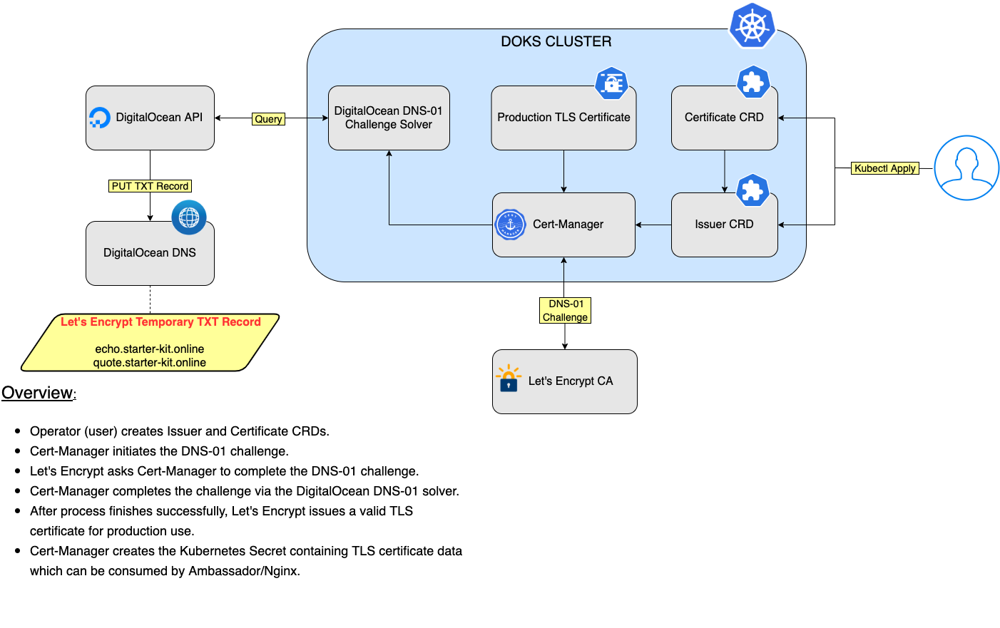
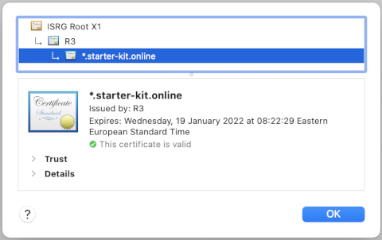

# Setting up Ingress to use Wildcard Certificates

## Table of contents

- [Introduction](#introduction)
- [Prerequisites](#prerequisites)
- [Installing Cert-Manager](#installing-cert-manager)
- [Configuring Wildcard Certificates via Cert-Manager](#configuring-wildcard-certificates-via-cert-manager)
  - [DNS-01 Challenge Overview](#dns-01-challenge-overview)
  - [Configuring Issuer CRD](#configuring-issuer-crd)
  - [Configuring Certificate CRD](#configuring-certificate-crd)
  - [Setting up Ambassador to use Wildcard Certificates](#setting-up-ambassador-to-use-wildcard-certificates)
  - [Setting up Nginx to use Wildcard Certificates](#setting-up-nginx-to-use-wildcard-certificates)

## Introduction

A `wildcard certificate` is a kind of certificate that is able to handle `sub-domains` as well. The wildcard notion means that it has a global scope for the whole `DNS` domain you own.

So far you configured `Ingress` resources to use the `HTTP-01` challenge only, which `doesn't support wildcard certificates`. To be able to issue and use `wildcard certificates`, you need to have an `ACME` client or certificate management tool that it is able to handle the `DNS-01` challenge type. A good choice that works with `Kubernetes` (and `Ambassador/Nginx` implicitly) is [Cert-Manager](https://cert-manager.io).

For the `DNS-01` challenge type to work, the certificate management tool needs to be able to handle DNS `TXT records` for your cloud provider - `DigitalOcean` in this case. `Cert-Manager` is able to perform this kind of operation via the built-in [DigitalOcean Provider](https://cert-manager.io/docs/configuration/acme/dns01/digitalocean).

For more information on how the `DNS-01` challenge works, please read the [DNS-01](https://letsencrypt.org/docs/challenge-types/#dns-01-challenge) article from `Let's Encrypt`.

## Prerequisites

To complete this guide, you will need:

1. A [Git](https://git-scm.com/downloads) client, to clone the `Starter Kit` repository.
2. [Helm](https://www.helms.sh), for managing `Cert-Manager` releases and upgrades.
3. [Kubectl](https://kubernetes.io/docs/tasks/tools), for `Kubernetes` interaction.
4. [Curl](https://curl.se/download.html), for testing the examples (backend applications).

## Installing Cert-Manager

**Note:**

**You can skip this step, if `Cert-Manager` is already installed in your `DOKS` cluster.**

Installing `Cert-Manager` is possible in many [ways](https://docs.cert-manager.io/en/latest/getting-started/install.html). In this tutorial, you will use `Helm` to accomplish the task.

First, change directory (if not already) where you cloned the `Starter Kit` repository:

```shell
cd Kubernetes-Starter-Kit-Developers
```

Next, please add the `Jetstack` Helm repository:

```shell
helm repo add jetstack https://charts.jetstack.io
```

Next, update the `jetstack` chart repository:

```shell
helm repo update jetstack
```

Then, open and inspect the `Helm` values file for `Cert-Manager` provided in the `Starter Kit` repository, using an editor of your choice (preferably with `YAML` lint support). For example, you can use [VS Code](https://code.visualstudio.com):

```shell
CERT_MANAGER_HELM_CHART_VERSION="1.8.0"

code 03-setup-ingress-controller/assets/manifests/cert-manager-values-v${CERT_MANAGER_HELM_CHART_VERSION}.yaml
```

Finally, you can install the `jetstack/cert-manager` chart using Helm:

```shell
CERT_MANAGER_HELM_CHART_VERSION="1.8.0"

helm install cert-manager jetstack/cert-manager --version "$CERT_MANAGER_HELM_CHART_VERSION" \
  --namespace cert-manager \
  --create-namespace \
  -f 03-setup-ingress-controller/assets/manifests/cert-manager-values-v${CERT_MANAGER_HELM_CHART_VERSION}.yaml
```

Check Helm release status:

```shell
helm ls -n cert-manager
```

The output looks similar to (notice the `STATUS` column which has the `deployed` value):

```text
NAME            NAMESPACE       REVISION        UPDATED                                 STATUS          CHART                   APP VERSION
cert-manager    cert-manager    1               2021-10-20 12:13:05.124264 +0300 EEST   deployed        cert-manager-v1.8.0     v1.8.0
```

Inspect `Kubernetes` resources created by the `cert-manager` Helm release:

```shell
kubectl get all -n cert-manager
```

The output looks similar to (notice the `cert-manager` pod and `webhook` service, which should be `UP` and `RUNNING`):

```text
NAME                                           READY   STATUS    RESTARTS   AGE
pod/cert-manager-5ffd4f6c89-ckc9n              1/1     Running   0          10m
pod/cert-manager-cainjector-748dc889c5-l4dbv   1/1     Running   0          10m
pod/cert-manager-webhook-5b679f47d6-4xptd      1/1     Running   0          10m

NAME                           TYPE        CLUSTER-IP       EXTERNAL-IP   PORT(S)   AGE
service/cert-manager-webhook   ClusterIP   10.245.227.199   <none>        443/TCP   10m

NAME                                      READY   UP-TO-DATE   AVAILABLE   AGE
deployment.apps/cert-manager              1/1     1            1           10m
deployment.apps/cert-manager-cainjector   1/1     1            1           10m
deployment.apps/cert-manager-webhook      1/1     1            1           10m

NAME                                                 DESIRED   CURRENT   READY   AGE
replicaset.apps/cert-manager-5ffd4f6c89              1         1         1       10m
replicaset.apps/cert-manager-cainjector-748dc889c5   1         1         1       10m
replicaset.apps/cert-manager-webhook-5b679f47d6      1         1         1       10m
```

Inspect the available `CRDs`:

```shell
kubectl get crd -l app.kubernetes.io/name=cert-manager
```

The output looks similar to:

```text
NAME                                  CREATED AT
certificaterequests.cert-manager.io   2022-01-07T14:17:55Z
certificates.cert-manager.io          2022-01-07T14:17:55Z
challenges.acme.cert-manager.io       2022-01-07T14:17:55Z
clusterissuers.cert-manager.io        2022-01-07T14:17:55Z
issuers.cert-manager.io               2022-01-07T14:17:55Z
orders.acme.cert-manager.io           2022-01-07T14:17:55Z
```

Now that `Cert-Manager` is installed and working properly, next it's time to configure required `CRDs` to tell it how to fetch `TLS` certificates from a known `CA` such as `Let's Encrypt`.

## Configuring Wildcard Certificates via Cert-Manager

`Cert-Manager` relies on `three` important `CRDs` to issue certificates from a `Certificate Authority` (such as `Let's Encrypt`):

- [Issuer](https://cert-manager.io/docs/concepts/issuer): Defines a `namespaced` certificate issuer, allowing you to use `different CAs` in each `namespace`.
- [ClusterIssuer](https://cert-manager.io/docs/concepts/issuer): Similar to `Issuer`, but it doesn't belong to a namespace, hence can be used to `issue` certificates in `any namespace`.
- [Certificate](https://cert-manager.io/docs/concepts/certificate): Defines a `namespaced` resource that references an `Issuer` or `ClusterIssuer` for issuing certificates.

In this tutorial you will create a `namespaced Issuer` for your `Ingress` of choice (`Ambassador` or `Nginx`).

The way `cert-manager` works is by defining custom resources to handle certificates in your cluster. You start by creating an `Issuer` resource type, which is responsible with the `ACME` challenge process. The `Issuer` CRD also defines the required `provider` (such as `DigitalOcean`), to create `DNS` records during the `DNS-01` challenge.

Then, you create a `Certificate` resource type which makes use of the `Issuer` CRD to obtain a valid certificate from the `CA` (Certificate Authority). The `Certificate` CRD also defines what `Kubernetes Secret` to create and store the final certificate after the `DNS-01` challenge completes successfully. Then, `Ambassador` (or `Nginx`) can consume the `secret`, and use the `wildcard certificate` to enable `TLS` encryption for your `entire` domain.

### DNS-01 Challenge Overview



In the following steps, you will learn how to configure `Ambassador` (or `Nginx`, depending on the installation) to use `cert-manager` for `wildcard` certificates support.

**Important note:**

Before continuing with the steps, please make sure that `DNS` is set up correctly as explained for [Ambassador Edge Stack](../ambassador.md#step-3---configuring-dns-for-ambassador-edge-stack) or [Nginx Ingress Controller](../nginx.md#step-2---configuring-dns-for-nginx-ingress-controller).

First, you need to create a `Kubernetes Secret` for the [DigitalOcean Provider](https://cert-manager.io/docs/configuration/acme/dns01/digitalocean) that `cert-manager` is going to use to perform the `DNS-01` challenge. The secret must contain your `DigitalOcean API token`, which is needed by the provider to create `DNS` records on your behalf during the `DNS-01` challenge. This step is required, so that the `CA` knows that the `domain` in question is really owned by you.

Create the `Kubernetes` secret containing the `DigitalOcean API` token, using the `same` namespace where your `Ingress Controller` was deployed. Please pick only one option, depending on the installation:

- `Ambassador Edge Stack` ingress:

  ```shell
  DO_API_TOKEN="<YOUR_DO_API_TOKEN_HERE>"

  kubectl create secret generic "digitalocean-dns" \
    --namespace ambassador \
    --from-literal=access-token="$DO_API_TOKEN"
  ```

- `Nginx` ingress:

  ```shell
  DO_API_TOKEN="<YOUR_DO_API_TOKEN_HERE>"

  kubectl create secret generic "digitalocean-dns" \
    --namespace backend \
    --from-literal=access-token="$DO_API_TOKEN"
  ```

**Important notes:**

- The secret must be created in the **same namespace** where the `Issuer` CRD is located.
- Please make sure to set `RBAC` properly for the namespace where your `Kubernetes Secrets` are stored, to `restrict` unauthorized users and applications.

Next, you will configure the `Issuer` CRD, responsible with `solving` the `DNS-01` challenge.

### Configuring Issuer CRD

Typical `Issuer` CRD for wildcard certificates looks like below (explanations inline):

```yaml
apiVersion: cert-manager.io/v1
kind: Issuer
metadata:
  name: letsencrypt-dev-wcard
  namespace: dev
spec:
  # ACME issuer configuration:
  # `email` - the email address to be associated with the ACME account (make sure it's a valid one).
  # `server` - the URL used to access the ACME server’s directory endpoint.
  # `privateKeySecretRef` - Kubernetes Secret to store the automatically generated ACME account private key.
  acme:
    email: my.email@yahoo.com
    server: https://acme-v02.api.letsencrypt.org/directory
    privateKeySecretRef:
      name: letsencrypt-dev-wcard-private
    # List of challenge solvers that will be used to solve ACME challenges for the matching domains.
    solvers:
    # Use the DigitalOcean DNS API to manage DNS01 challenge records.
      - dns01:
          digitalocean:
            # Kubernetes secret that contains the DO API token.
            # Must be in the same namespace as the Issuer CRD.
            tokenSecretRef:
              name: digitalocean-dns
              key: access-token
```

First, change directory where the `Starter Kit` repository was cloned on your local machine:

```shell
cd Kubernetes-Starter-Kit-Developers
```

Then, open and inspect the `Issuer` manifest file provided in the `Starter Kit` repository, using an editor of your choice (preferably with `YAML` lint support). For example, you can use [VS Code](https://code.visualstudio.com). Please pick only one option, depending on the installed `Ingress Controller` (make sure to replace the `<>` placeholders accordingly, using a **valid e-mail address**):

- `Ambassador Edge Stack` ingress:

  ```shell
  code 03-setup-ingress-controller/assets/manifests/ambassador/cert-manager-wcard-issuer.yaml
  ```

- `Nginx` ingress:

  ```shell
  code 03-setup-ingress-controller/assets/manifests/nginx/cert-manager-wcard-issuer.yaml
  ```

Save the file and apply changes for your `Kubernetes` cluster using `kubectl` (please pick only one option, depending on the installed `Ingress Controller`):

- `Ambassador Edge Stack` ingress:

  ```shell
  kubectl apply -f 03-setup-ingress-controller/assets/manifests/ambassador/cert-manager-wcard-issuer.yaml
  ```

- `Nginx` ingress:

  ```shell
  kubectl apply -f 03-setup-ingress-controller/assets/manifests/nginx/cert-manager-wcard-issuer.yaml
  ```

Verify `Issuer` status using `kubectl` (please pick only one option, depending on the installed `Ingress Controller`):

- `Ambassador Edge Stack` ingress:

  ```shell
  kubectl get issuer letsencrypt-ambassador-wcard -n ambassador
  ```

  The output looks similar to (notice the `READY` column value - should be `True`):

  ```text
  NAME                           READY   AGE
  letsencrypt-ambassador-wcard   True    3m32s
  ```

- `Nginx` ingress:

  ```shell
  kubectl get issuer letsencrypt-nginx-wcard -n backend
  ```

  The output looks similar to (notice the `READY` column value - should be `True`):

  ```text
  NAME                      READY   AGE
  letsencrypt-nginx-wcard   True    13m32s
  ```

**Note:**

If the `Issuer` object transitions to a `Not Ready` state for some reason, then you can use `kubectl describe` and inspect the `Status` section from the output. It should tell you the main reason why the `Issuer` failed after inspecting the `Status` and `Events` fields from the `YAML` output.

For `Ambassador Edge Stack` ingress:

```shell
kubectl describe issuer letsencrypt-ambassador-wcard -n ambassador
```

For `Nginx` ingress:

```shell
kubectl describe issuer letsencrypt-nginx-wcard -n backend
```

The output is the same for `Ambassador` or `Nginx`, and it looks similar to (`Metadata` and `Spec` fields value is hidden for simplicity):

```yaml
Name:         letsencrypt-nginx-wcard
Namespace:    backend
Labels:       <none>
Annotations:  <none>
API Version:  cert-manager.io/v1
Kind:         Issuer
Metadata:
  ...
Spec:
  ...
Status:
  Acme:
    Last Registered Email:  my.email@gmail.com
    Uri:                    https://acme-v02.api.letsencrypt.org/acme/acct/272672270
  Conditions:
    Last Transition Time:  2021-11-08T15:24:51Z
    Message:               The ACME account was registered with the ACME server
    Observed Generation:   1
    Reason:                ACMEAccountRegistered
    Status:                True
    Type:                  Ready
Events:                    <none>
```

Having the `Issuer` resource configured and working properly, next it's time to configure the `Certificate` CRD. If everything goes well, the final wildcard `TLS` certificate will be created as a `Kubernetes Secret`, ready to be used by your `ingress` resources.

### Configuring Certificate CRD

Now, you must create a `Certificate` resource that will make use of the previously created `Issuer`. What happens next is, the `Issuer` will contact `Let's Encrypt` (via `REST API`) and start the `DNS-01` challenge. During the process, `Let's Encrypt` will try to create a `TXT` record using your `domain` to make sure that you really are the `owner`. The `DNS TXT` records manipulation happens via the `DigitalOcean REST API` (you configured a `Kubernetes` secret containing the `DO API token` earlier for this purpose). After successfully creating and retrieving the `DNS` record, `Let's Encrypt` will issue a production ready `TLS` certificate that you can use in your environment.

Typical `Certificate` CRD for wildcard certificates looks like below (explanations inline):

```yaml
apiVersion: cert-manager.io/v1
kind: Certificate
metadata:
  name: mydomain.org
  # Cert-Manager will put the resulting Secret in the same Kubernetes namespace as the Certificate.
  namespace: dev
spec:
  # Secret name to create, where the private key and certificate should be stored.
  secretName: mydomain.org
  # What Issuer to use for getting the certificate.
  issuerRef:
    name: letsencrypt-dev-wcard
    kind: Issuer
    group: cert-manager.io
  # Common name to be used on the Certificate.
  commonName: "*.mydomain.org"
  # List of DNS subjectAltNames to be set on the Certificate.
  dnsNames:
    - "mydomain.org"
    - "*.mydomain.org"
```

Next, open and inspect the `Certificate` manifest file provided in the `Starter Kit` repository, using an editor of your choice (preferably with `YAML` lint support). For example, you can use [VS Code](https://code.visualstudio.com). Please pick only one option, depending on the installed `Ingress Controller`:

- `Ambassador Edge Stack` ingress:

  ```shell
  code 03-setup-ingress-controller/assets/manifests/ambassador/cert-manager-wcard-certificate.yaml
  ```

- `Nginx` ingress:

  ```shell
  code 03-setup-ingress-controller/assets/manifests/nginx/cert-manager-wcard-certificate.yaml
  ```

**Notes:**

- Explanation for each important field of the `Certificate` CRD, can be found inside the [cert-manager-wcard-certificate.yaml](../assets/manifests/ambassador/cert-manager-wcard-certificate.yaml) (or [cert-manager-wcard-certificate.yaml](../assets/manifests/nginx/cert-manager-wcard-certificate.yaml)) file.
- The example provided in this tutorial is using `starter-kit.online` domain name (and naming convention). Please make sure to use your own domain name and naming convention.

Next, create the `Certificate` resource in your `DOKS` cluster (please pick only one option, depending on the installed `Ingress Controller`):

- `Ambassador Edge Stack` ingress:

  ```shell
  kubectl apply -f 03-setup-ingress-controller/assets/manifests/ambassador/cert-manager-wcard-certificate.yaml
  ```

- `Nginx` ingress:

  ```shell
  kubectl apply -f 03-setup-ingress-controller/assets/manifests/nginx/cert-manager-wcard-certificate.yaml
  ```

Verify certificate status (please pick only one option, depending on the installed `Ingress Controller`):

- `Ambassador Edge Stack` ingress:

  ```shell
  kubectl get certificate starter-kit.online -n ambassador
  ```

- `Nginx` ingress:

  ```shell
  kubectl get certificate starter-kit.online -n backend
  ```

The output looks similar to (notice the `READY` column value - should be `True`, and the `SECRET` name):

```text
NAME                 READY   SECRET               AGE
starter-kit.online   True    starter-kit.online   3m8s
```

**Notes:**

- Please bear in mind that it can take a `few minutes` for the process to complete.
- If the `Certificate` object reports a `not ready state` for some reason, then you can fetch the logs from the `Cert-Manager Controller` Pod and see why the `Certificate` failed:

    ```shell
    kubectl logs -l app=cert-manager,app.kubernetes.io/component=controller -n cert-manager
    ```

Finally, you can verify the `Kubernetes` secret which contains your `TLS` certificate (please pick only one option, depending on the installed `Ingress Controller`):

- `Ambasador Edge Stack` ingress:

  ```shell
  kubectl describe secret starter-kit.online -n ambassador
  ```

  The output looks similar to (notice that it contains the `wildcard` certificate `private` and `public` keys):

  ```text
  Name:         starter-kit.online
  Namespace:    ambassador
  Labels:       <none>
  Annotations:  cert-manager.io/alt-names: *.starter-kit.online,starter-kit.online
                cert-manager.io/certificate-name: starter-kit.online
                cert-manager.io/common-name: *.starter-kit.online
                cert-manager.io/ip-sans: 
                cert-manager.io/issuer-group: cert-manager.io
                cert-manager.io/issuer-kind: Issuer
                cert-manager.io/issuer-name: letsencrypt-ambassador-wcard
                cert-manager.io/uri-sans: 

  Type:  kubernetes.io/tls

  Data
  ====
  tls.crt:  5632 bytes
  tls.key:  1679 bytes
  ```

- `Nginx` ingress:

  ```shell
  kubectl describe secret starter-kit.online -n backend
  ```

  The output looks similar to (notice that it contains the `wildcard` certificate `private` and `public` keys):

  ```text
  Name:         starter-kit.online
  Namespace:    backend
  Labels:       <none>
  Annotations:  cert-manager.io/alt-names: *.starter-kit.online,starter-kit.online
                cert-manager.io/certificate-name: starter-kit.online
                cert-manager.io/common-name: *.starter-kit.online
                cert-manager.io/ip-sans: 
                cert-manager.io/issuer-group: cert-manager.io
                cert-manager.io/issuer-kind: Issuer
                cert-manager.io/issuer-name: letsencrypt-nginx-wcard
                cert-manager.io/uri-sans: 

  Type:  kubernetes.io/tls

  Data
  ====
  tls.crt:  5632 bytes
  tls.key:  1679 bytes
  ```

Having a `Certificate` configured and working, ensures that the wildcard `TLS` certificate is always available for your `ingress resources` to use. Even more, it will be renewed automatically before it expires.

Next, please pick one ingress to configure and enable wildcard certificates for, based on your setup:

- [Configure Ambassador to use Wildcard Certificates](#setting-up-ambassador-to-use-wildcard-certificates)
- [Configure Nginx to use Wildcard Certificates](#setting-up-nginx-to-use-wildcard-certificates)

### Setting up Ambassador to use Wildcard Certificates

After creating the wildcard `Certificate` CRD and the `DNS-01` challenge finishes successfully, a Kubernetes secret will be generated, containing the production ready `TLS` certificate. Then, you can use the new secret with Ambassador `Hosts`, to enable `TLS` termination on `all domains`.

Typical configuration for the `Host` CRD using a `wildcard certificate` looks like below:

```yaml
apiVersion: getambassador.io/v3alpha1
kind: Host
metadata:
  name: wildcard-host
  namespace: ambassador
spec:
  hostname: "*.starter-kit.online"
  acmeProvider:
    authority: none
  tlsSecret:
    name: starter-kit.online
  selector:
    matchLabels:
      hostname: wildcard-host
```

Explanations for the above configuration:

- `spec.hostname`: Because a wildcard certificate is available, you can use wildcards to match all hosts for a specific domain (e.g.: `*.starter-kit.online`).
- `spec.acmeProvider`: Authority is set to `none`, because you configured an `external` certificate management tool (`cert-manager`).
- `spec.tlsSecret`: Reference to `Kubernetes Secret` containing your wildcard `TLS` certificate.

Open and inspect the `03-setup-ingress-controller/assets/manifests/ambassador/wildcard-host.yaml` file provided in the `Starter Kit` repository, using an editor of your choice (preferably with `YAML` lint support). For example, you can use [VS Code](https://code.visualstudio.com):

```shell
code 03-setup-ingress-controller/assets/manifests/ambassador/wildcard-host.yaml
```

Then, create the wildcard `Host` resource using `kubectl`:

```shell
kubectl apply -f 03-setup-ingress-controller/assets/manifests/ambassador/wildcard-host.yaml
```

Check that the resource was created:

```shell
kubectl get hosts -n ambassador
```

The output looks similar to (notice the `HOSTNAME` using wildcards now, and the `Ready` state):

```text
NAME            HOSTNAME               STATE   PHASE COMPLETED   PHASE PENDING   AGE
wildcard-host   *.starter-kit.online   Ready                                     84m
```

After applying the `wildcard-host.yaml` manifest, you can go ahead and create the Ambassador `Mappings` for each `backend service` that you're using, as learned in [Step 6 - Configuring the Ambassador Edge Stack Mappings for Hosts](../README.md#step-6---configuring-the-ambassador-edge-stack-mappings-for-hosts).

Testing the new setup goes the same way as you already learned in [Step 8 - Verifying the Ambassador Edge Stack Setup](../README.md#step-8---verifying-the-ambassador-edge-stack-setup).

Please go ahead and navigate using your web browser to one of the example backend services used in this tutorial, and inspect the certificate. The output should look similar to (notice the wildcard certificate `*.starter-kit.online`):



One of the `advantages` of using a `wildcard` certificate is that you need to create **only one** `Host` definition, and then focus on the `Mappings` needed for each `backend application`. The `wildcard` setup takes care `automatically` of all the `hosts` that need to be `managed` under a single `domain`, and have `TLS` termination `enabled`. Also, `certificate renewal` happens automatically for the entire domain, via `cert-manager` and `Let's Encrypt` CA.

### Setting up Nginx to use Wildcard Certificates

Typical configuration for `Nginx` ingress using a `wildcard certificate` looks like below:

```yaml
apiVersion: networking.k8s.io/v1
kind: Ingress
metadata:
  name: ingress-backend
  namespace: backend
spec:
  tls:
    - hosts:
        - "*.starter-kit.online"
      secretName: starter-kit.online
  rules:
    - host: echo.starter-kit.online
      http:
        paths:
          - path: /
            pathType: Prefix
            backend:
              service:
                name: echo
                port:
                  number: 8080
...
```

Explanations for the above configuration:

- `spec.tls.hosts`: Because a wildcard certificate is available, you can use wildcards to match all hosts for a specific domain (e.g.: `*.starter-kit.online`).
- `spec.tls.secretName`: Reference to `Kubernetes Secret` containing your wildcard `TLS` certificate.

Open and inspect the `03-setup-ingress-controller/assets/manifests/nginx/wildcard-host.yaml` file provided in the `Starter Kit` repository, using an editor of your choice (preferably with `YAML` lint support). For example, you can use [VS Code](https://code.visualstudio.com):

```shell
code 03-setup-ingress-controller/assets/manifests/nginx/wildcard-host.yaml
```

Then, create the `Nginx` ingress resource using `kubectl`:

```shell
kubectl apply -f 03-setup-ingress-controller/assets/manifests/nginx/wildcard-host.yaml
```

Check that the resource was created:

```shell
kubectl get ingress -n backend
```

The output looks similar to (notice the `ADDRESS` value pointing to your `DOKS` cluster `load-balancer`, and `PORTS` column printing the `443` value):

```text
NAME              CLASS   HOSTS                                              ADDRESS           PORTS     AGE
ingress-backend   nginx   echo.starter-kit.online,quote.starter-kit.online   143.244.204.126   80, 443   93s
```

Finally, test the `Nginx` setup using `curl` (or your favorite web browser) for each backend service.

First, the `echo` service (notice that you receive a `redirect` to use `HTTPS` instead):

```shell
curl -Li http://echo.starter-kit.online/
```

The output looks similar to:

```text
HTTP/1.1 308 Permanent Redirect
Date: Mon, 08 Nov 2021 15:53:47 GMT
Content-Type: text/html
Content-Length: 164
Connection: keep-alive
Location: https://echo.starter-kit.online

HTTP/2 200 
date: Mon, 08 Nov 2021 15:53:47 GMT
content-type: text/plain
content-length: 351
strict-transport-security: max-age=15724800; includeSubDomains

Request served by echo-5d8d65c665-569zf

HTTP/1.1 GET /

Host: echo.starter-kit.online
Accept: */*
X-Real-Ip: 10.114.0.5
X-Forwarded-For: 10.114.0.5
X-Forwarded-Proto: https
X-Forwarded-Scheme: https
User-Agent: curl/7.77.0
X-Request-Id: 96b501863b4e45a5cc91d44f75836c16
X-Forwarded-Host: echo.starter-kit.online
X-Forwarded-Port: 443
X-Scheme: https
```

Then, `quote` service (notice that you receive a `redirect` to use `HTTPS` instead):

```shell
curl -Li http://quote.starter-kit.online/
```

The output looks similar to:

```text
HTTP/1.1 308 Permanent Redirect
Date: Mon, 08 Nov 2021 15:54:13 GMT
Content-Type: text/html
Content-Length: 164
Connection: keep-alive
Location: https://quote.starter-kit.online

HTTP/2 200 
date: Mon, 08 Nov 2021 15:54:13 GMT
content-type: application/json
content-length: 162
strict-transport-security: max-age=15724800; includeSubDomains

{
  "server": "ellipsoidal-elderberry-7kwkpxz5",
  "quote": "A principal idea is omnipresent, much like candy.",
  "time": "2021-11-08T15:54:13.80120078Z"
}
```

You can also test the backend services using a web browser of your choice. Notice that you're redirected to use `HTTPS` instead, and that the `certificate` is a wildcard one, issued by [Let's Encrypt](https://letsencrypt.org):


