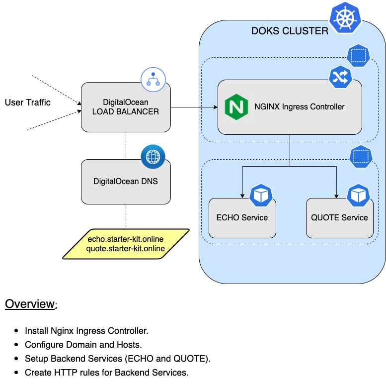
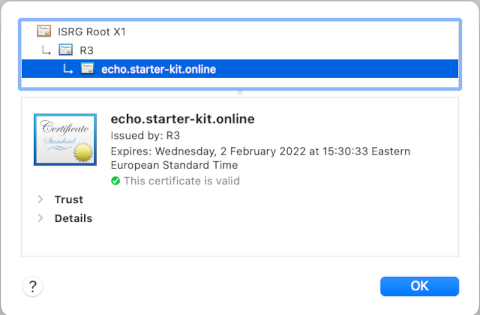

# How to Configure Ingress using Nginx

## Introduction

In this tutorial, you will learn how to use the Kubernetes-maintained [Nginx](https://kubernetes.github.io/ingress-nginx) Ingress Controller. Then, you're going to discover how to have `TLS` certificates automatically deployed and configured for your hosts (thus enabling `TLS` termination), and `route` traffic to your `backend` applications.

Why use Kubernetes-maintained `Nginx` ?

- Open source (driven by the Kubernetes community).
- Lot of support from the Kubernetes community.
- Flexible way of routing traffic to your services inside the cluster.
- `TLS` certificates support and auto renewal via [Cert-Manager](https://cert-manager.io).

As with every Ingress Controller, `Nginx` allows you to define ingress objects. Each ingress object contains a set of rules that define how to route external traffic (HTTP requests) to your backend services. For example, you can have multiple hosts defined under a single domain, and then let `Nginx` take care of routing traffic to the correct host.

`Ingress Controller` sits at the `edge` of your `VPC`, and acts as the `entry point` for your `network`. It knows how to handle `HTTP` requests only, thus it operates at `layer 7` of the `OSI` model. When `Nginx` is deployed to your `DOKS` cluster, a `load balancer` is created as well, through which it receives the outside traffic. Then, you will have a `domain` set up with `A` type records (hosts), which in turn point to your load balancer `external IP`. So, data flow goes like this: `User Request -> Host.DOMAIN -> Load Balancer -> Ingress Controller (NGINX) -> Backend Applications (Services)`.

After finishing this tutorial, you will be able to:

- Create and manage `Nginx` Helm deployments.
- Create and configure basic `HTTP` rules for `Nginx`, to `route` requests to your `backend` applications.
- Automatically configure `TLS` certificates for your `hosts`, thus having `TLS` termination.

### Starter Kit Nginx Setup Overview



## Table of contents

- [Introduction](#introduction)
- [Prerequisites](#prerequisites)
- [Step 1 - Installing the Nginx Ingress Controller](#step-1---installing-the-nginx-ingress-controller)
- [Step 2 - Configuring DNS for Nginx Ingress Controller](#step-2---configuring-dns-for-nginx-ingress-controller)
- [Step 3 - Creating the Nginx Backend Services](#step-3---creating-the-nginx-backend-services)
- [Step 4 - Configuring Nginx Ingress Rules for Backend Services](#step-4---configuring-nginx-ingress-rules-for-backend-services)
- [Step 5 - Configuring Production Ready TLS Certificates for Nginx](#step-5---configuring-production-ready-tls-certificates-for-nginx)
- [Step 6 - Enabling Proxy Protocol](#step-6---enabling-proxy-protocol)
- [How To Guides](#how-to-guides)
  - [Setting up Ingress to use Wildcard Certificates](guides/wildcard_certificates.md)
  - [Ingress Controller LoadBalancer Migration](guides/ingress_loadbalancer_migration.md)
  - [Performance Considerations for Nginx](guides/nginx_performance_considerations.md)
- [Conclusion](#conclusion)

## Prerequisites

To complete this tutorial, you will need:

1. A [Git](https://git-scm.com/downloads) client, to clone the `Starter Kit` repository.
2. [Helm](https://www.helm.sh), for managing `Nginx` releases and upgrades.
3. [Doctl](https://github.com/digitalocean/doctl/releases), for `DigitalOcean` API interaction.
4. [Kubectl](https://kubernetes.io/docs/tasks/tools), for `Kubernetes` interaction.
5. [Curl](https://curl.se/download.html), for testing the examples (backend applications).

Please make sure that `doctl` and `kubectl` context is configured to point to your `Kubernetes` cluster - refer to [Step 2 - Authenticating to DigitalOcean API](../01-setup-DOKS/README.md#step-2---authenticating-to-digitalocean-api) and [Step 3 - Creating the DOKS Cluster](../01-setup-DOKS/README.md#step-3---creating-the-doks-cluster) from the `DOKS` setup tutorial.

In the next step, you will learn how to deploy the `Nginx Ingress Controller`, using the `Helm` package manager for `Kubernetes`.

## Step 1 - Installing the Nginx Ingress Controller

In this step, you will deploy the `Nginx Ingress Controller` to your `DOKS` cluster, via `Helm`.

Steps to follow:

1. First, clone the `Starter Kit` repository and change directory to your local copy.

    ```shell
    git clone https://github.com/digitalocean/Kubernetes-Starter-Kit-Developers.git

    cd Kubernetes-Starter-Kit-Developers
    ```

2. Next, add the `Helm` repo, and list the available `charts`:

    ```shell
    helm repo add ingress-nginx https://kubernetes.github.io/ingress-nginx

    helm repo update ingress-nginx

    helm search repo ingress-nginx
    ```

    The output looks similar to the following:

    ```text
    NAME                            CHART VERSION   APP VERSION     DESCRIPTION
    ingress-nginx/ingress-nginx     4.1.3           1.2.1           Ingress controller for Kubernetes using NGINX
    ```

    **Note:**

    The chart of interest is `ingress-nginx/ingress-nginx`, which will install Kubernetes-maintained `Nginx` on the cluster. Please visit the [kubernetes-nginx](https://github.com/kubernetes/ingress-nginx/tree/main/charts/ingress-nginx) page, for more details about this chart.
3. Then, open and inspect the `03-setup-ingress-controller/assets/manifests/nginx-values-v4.1.3.yaml` file provided in the `Starter Kit` repository, using an editor of your choice (preferably with `YAML` lint support). For example, you can use [VS Code](https://code.visualstudio.com):

    ```shell
    code 03-setup-ingress-controller/assets/manifests/nginx-values-v4.1.3.yaml
    ```

    **Note:**

    There are times when you want to re-use the existing `load balancer`. This is for preserving your `DNS` settings and other `load balancer` configurations. If so, make sure to modify the `nginx-values-v4.1.3.yaml` file, and add the annotation for your existing load balancer. Please refer to the `DigitalOcean` Kubernetes guide - [How To Migrate Load Balancers](https://docs.digitalocean.com/products/kubernetes/how-to/migrate-load-balancers) for more details.
4. Finally, install the `Nginx Ingress Controller` using `Helm` (a dedicated `ingress-nginx` namespace will be created as well):

    ```shell
    NGINX_CHART_VERSION="4.1.3"

    helm install ingress-nginx ingress-nginx/ingress-nginx --version "$NGINX_CHART_VERSION" \
      --namespace ingress-nginx \
      --create-namespace \
      -f "03-setup-ingress-controller/assets/manifests/nginx-values-v${NGINX_CHART_VERSION}.yaml"
    ```

    **Note:**

    A `specific` version for the ingress-nginx `Helm` chart is used. In this case `4.1.3` was picked, which maps to the `1.2.1` release of `Nginx` (see the output from `Step 2.`). It’s good practice in general, to lock on a specific version. This helps to have predictable results, and allows versioning control via `Git`.

**Observations and results:**

You can verify `Nginx` deployment status via:

```shell
helm ls -n ingress-nginx
```

The output looks similar to (notice that the `STATUS` column value is `deployed`):

```text
NAME            NAMESPACE       REVISION   UPDATED                                 STATUS     CHART                   APP VERSION
ingress-nginx   ingress-nginx   1          2021-11-02 10:12:44.799499 +0200 EET    deployed   ingress-nginx-4.1.3     1.2.1
```

Next check Kubernetes resources created for the `ingress-nginx` namespace (notice the `deployment` and `replicaset` resources which should be healthy, as well as the `LoadBalancer` resource having an `external IP` assigned):

```shell
kubectl get all -n ingress-nginx
```

The output looks similar to:

```text
NAME                                            READY   STATUS    RESTARTS   AGE
pod/ingress-nginx-controller-5c8d66c76d-m4gh2   1/1     Running   0          56m

NAME                                         TYPE           CLUSTER-IP     EXTERNAL-IP       PORT(S)                      AGE
service/ingress-nginx-controller             LoadBalancer   10.245.27.99   143.244.204.126   80:32462/TCP,443:31385/TCP   56m
service/ingress-nginx-controller-admission   ClusterIP      10.245.44.60   <none>            443/TCP                      56m

NAME                                       READY   UP-TO-DATE   AVAILABLE   AGE
deployment.apps/ingress-nginx-controller   1/1     1            1           56m

NAME                                                  DESIRED   CURRENT   READY   AGE
replicaset.apps/ingress-nginx-controller-5c8d66c76d   1         1         1       56m
```

Finally, list all load balancer resources from your `DigitalOcean` account, and print the `IP`, `ID`, `Name` and `Status`:

```shell
doctl compute load-balancer list --format IP,ID,Name,Status
```

The output looks similar to (should contain the new `load balancer` resource created for `Nginx Ingress Controller` in a healthy state):

```text
IP                 ID                                      Name                                Status
143.244.204.126    0471a318-a98d-49e3-aaa1-ccd855831447    acdc25c5cfd404fd68cd103be95af8ae    active
```

In the next step, you will prepare `DNS` for your `Nginx Ingress Controller` setup.

## Step 2 - Configuring DNS for Nginx Ingress Controller

In this step, you will configure `DNS` within your `DigitalOcean` account, using a `domain` that you own. Then, you will create the domain `A` records for each host: `echo` and `quote`. Please bear in mind that `DigitalOcean` is not a domain name registrar. You need to buy a domain name first from [Google](https://domains.google), [GoDaddy](https://uk.godaddy.com), etc.

First, please issue the below command to create a new `domain` (`starter-kit.online`, in this example):

```shell
doctl compute domain create starter-kit.online
```

The output looks similar to the following:

```text
Domain                TTL
starter-kit.online    0
```

**Note:**

**YOU NEED TO ENSURE THAT YOUR DOMAIN REGISTRAR IS CONFIGURED TO POINT TO DIGITALOCEAN NAME SERVERS**. More information on how to do that is available [here](https://www.digitalocean.com/community/tutorials/how-to-point-to-digitalocean-nameservers-from-common-domain-registrars).

Next, you will add required `A` records for the `hosts` you created earlier. First, you need to identify the load balancer `external IP` created by the `nginx` deployment:

```shell
kubectl get svc -n ingress-nginx
```

The output looks similar to (notice the `EXTERNAL-IP` column value for the `ingress-nginx-controller` service):

```text
NAME                                 TYPE           CLUSTER-IP     EXTERNAL-IP       PORT(S)                      AGE
ingress-nginx-controller             LoadBalancer   10.245.27.99   143.244.204.126   80:32462/TCP,443:31385/TCP   96m
ingress-nginx-controller-admission   ClusterIP      10.245.44.60   <none>            443/TCP                      96m
```

Then, add the records (please replace the `<>` placeholders accordingly). You can change the `TTL` value as per your requirement:

```shell
doctl compute domain records create starter-kit.online --record-type "A" --record-name "echo" --record-data "<YOUR_LB_IP_ADDRESS>" --record-ttl "30"

doctl compute domain records create starter-kit.online --record-type "A" --record-name "quote" --record-data "<YOUR_LB_IP_ADDRESS>" --record-ttl "30"
```

**Hint:**

If you have only `one load balancer` in your account, then please use the following snippet:

```shell
LOAD_BALANCER_IP=$(doctl compute load-balancer list --format IP --no-header)

doctl compute domain records create starter-kit.online --record-type "A" --record-name "echo" --record-data "$LOAD_BALANCER_IP" --record-ttl "30"

doctl compute domain records create starter-kit.online --record-type "A" --record-name "quote" --record-data "$LOAD_BALANCER_IP" --record-ttl "30"
```

**Observation and results:**

List the available records for the `starter-kit.online` domain:

```shell
doctl compute domain records list starter-kit.online
```

The output looks similar to the following:

```text
ID           Type    Name     Data                    Priority    Port    TTL     Weight
164171755    SOA     @        1800                    0           0       1800    0
164171756    NS      @        ns1.digitalocean.com    0           0       1800    0
164171757    NS      @        ns2.digitalocean.com    0           0       1800    0
164171758    NS      @        ns3.digitalocean.com    0           0       1800    0
164171801    A       echo     143.244.204.126         0           0       3600    0
164171809    A       quote    143.244.204.126         0           0       3600    0
```

At this point the network traffic will reach the `Nginx` enabled cluster, but you need to configure the `backend services paths` for each of the hosts. All `DNS` records have one thing in common: `TTL` or time to live. It determines how long a `record` can remain cached before it expires. Loading data from a local cache is faster, but visitors won’t see `DNS` changes until their local cache expires and gets updated after a new `DNS` lookup. As a result, higher `TTL` values give visitors faster performance, and lower `TTL` values ensure that `DNS` changes are picked up quickly. All `DNS` records require a minimum `TTL` value of `30 seconds`.

Please visit the [How to Create, Edit and Delete DNS Records](https://docs.digitalocean.com/products/networking/dns/how-to/manage-records) page for more information.

In the next step, you will create two simple `backend` services, to help you test the `Nginx` ingress setup.

## Step 3 - Creating the Nginx Backend Services

In this step, you will deploy two example `backend` services (applications), named `echo` and `quote` to test the `Nginx` ingress setup.

You can have multiple `TLS` enabled `hosts` on the same cluster. On the other hand, you can have multiple `deployments` and `services` as well. So for each `backend` application, a corresponding Kubernetes `Deployment` and `Service` has to be created.

First, you define a new `namespace` for the `quote` and `echo` backend applications. This is good practice in general, because you don't want to pollute the `Nginx` namespace (or any other), with application specific stuff.

Steps to follow:

1. First, change directory (if not already) where the `Starter Kit` repository was cloned:

    ```shell
    cd Kubernetes-Starter-Kit-Developers
    ```

2. Next, create the `backend` namespace:

    ```shell
    kubectl create ns backend
    ```

3. Then, create the [echo](assets/manifests/nginx/echo_deployment.yaml) and [quote](assets/manifests/nginx/quote_deployment.yaml) deployments:

    ```shell
    kubectl apply -f 03-setup-ingress-controller/assets/manifests/nginx/echo_deployment.yaml

    kubectl apply -f 03-setup-ingress-controller/assets/manifests/nginx/quote_deployment.yaml
    ```

4. Finally, create the corresponding `services`:

    ```shell
    kubectl apply -f 03-setup-ingress-controller/assets/manifests/nginx/echo_service.yaml

    kubectl apply -f 03-setup-ingress-controller/assets/manifests/nginx/quote_service.yaml
    ```

**Observation and results:**

Inspect the `deployments` and `services` you just created:

```shell
kubectl get deployments -n backend
```

The output looks similar to the following (notice the `echo` and `quote` deployments):

```text
NAME    READY   UP-TO-DATE   AVAILABLE   AGE
echo    1/1     1            1           2m22s
quote   1/1     1            1           2m23s
```

```shell
kubectl get svc -n backend
```

The output looks similar to the following (notice the `echo` and `quote` services):

```text
NAME    TYPE        CLUSTER-IP       EXTERNAL-IP   PORT(S)   AGE
echo    ClusterIP   10.245.115.112   <none>        80/TCP    3m3s
quote   ClusterIP   10.245.226.141   <none>        80/TCP    3m3s
```

In the next step, you will create the `nginx ingress rules` to route external traffic to `quote` and `echo` backend services.

## Step 4 - Configuring Nginx Ingress Rules for Backend Services

To `expose` backend applications (services) to the outside world, you need to tell your `Ingress Controller` what `host` each `service` maps to. `Nginx` follows a simple pattern in which you define a set of `rules`. Each `rule` associates a `host` to a backend `service` via a corresponding path `prefix`.

Typical ingress resource for `Nginx` looks like below (example given for the `echo` service):

```yaml
apiVersion: networking.k8s.io/v1
kind: Ingress
metadata:
  name: ingress-echo
  namespace: backend
spec:
  rules:
    - host: echo.starter-kit.online
      http:
        paths:
          - path: /
            pathType: Prefix
            backend:
              service:
                name: echo
                port:
                  number: 8080
  ingressClassName: nginx
```

Explanations for the above configuration:

- `spec.rules`: A list of host rules used to configure the Ingress. If unspecified, or no rule matches, all traffic is sent to the default backend.
- `spec.rules.host`: Host is the fully qualified domain name of a network host (e.g.: `echo.starter-kit.online`).
- `spec.rules.http`: List of http selectors pointing to backends.
- `spec.rules.http.paths`: A collection of paths that map requests to backends. In the above example the `/` path prefix is matched with the `echo` backend `service`, running on port `8080`.

The above ingress resource tells `Nginx` to `route` each `HTTP request` that is using the `/` prefix for the `echo.starter-kit.online` host, to the `echo` backend `service` running on port `8080`. In other words, every time you make a call to `http://echo.starter-kit.online/` the request and reply will be served by the `echo` backend `service` running on port `8080`.

You can have multiple ingress controllers per cluster if desired, hence there's an important configuration element present which defines the ingress class name:

```yaml
ingressClassName: nginx
```

The above `ingressClassName` field is required in order to differentiate between `multiple` ingress controllers present in your `cluster`. For more information please read [What is ingressClassName field](https://kubernetes.github.io/ingress-nginx/#what-is-ingressclassname-field) from the Kubernetes-maintained `Nginx` documentation.

**Hint:**

You can always access the built-in documentation page for a `Kubernetes` object field via `kubectl` like below (notice that you need to specify the fully qualified path for the `ingressClassName` field):

```shell
kubectl explain ingress.spec.ingressClassName
```

The output looks similar to:

```text
KIND:     Ingress
VERSION:  networking.k8s.io/v1

FIELD:    ingressClassName <string>

DESCRIPTION:
  IngressClassName is the name of the IngressClass cluster resource. The
  associated IngressClass defines which controller will implement the
  resource. This replaces the deprecated `kubernetes.io/ingress.class`
  annotation. For backwards compatibility, when that annotation is set, it
  must be given precedence over this field. The controller may emit a warning
  if the field and annotation have different values. Implementations of this
  API should ignore Ingresses without a class specified. An IngressClass
  resource may be marked as default, which can be used to set a default value
  for this field. For more information, refer to the IngressClass
  documentation.
```

You can define `multiple rules` for different `hosts` and `paths` in a single `ingress` resource. To keep things organized (and for better visibility), `Starter Kit` tutorial provides two ingress manifests for each host: [echo](assets/manifests/nginx/echo_host.yaml) and [quote](assets/manifests/nginx/quote_host.yaml).

First, `open` and `inspect` each `backend service` ingress manifest using a text editor of your choice (preferably with `YAML` lint support). For example you can use [VS Code](https://code.visualstudio.com):

```shell
code 03-setup-ingress-controller/assets/manifests/nginx/echo_host.yaml

code 03-setup-ingress-controller/assets/manifests/nginx/quote_host.yaml
```

Next, go ahead and apply each ingress resource using `kubectl`:

```shell
kubectl apply -f 03-setup-ingress-controller/assets/manifests/nginx/echo_host.yaml

kubectl apply -f 03-setup-ingress-controller/assets/manifests/nginx/quote_host.yaml
```

Verify `ingress` resources `status`:

```shell
kubectl get ingress -n backend
```

The output looks similar to (notice the `ADDRESS` column pointing to the `load balancer` resource `external IP`):

```text
NAME            CLASS   HOSTS                      ADDRESS           PORTS   AGE
ingress-echo    nginx   echo.starter-kit.online    143.244.204.126   80      22h
ingress-quote   nginx   quote.starter-kit.online   143.244.204.126   80      22h
```

Finally, test the `Nginx` setup using `curl` (or your favorite web browser) for each backend service.

First, the `echo` service:

```shell
curl -Li http://echo.starter-kit.online/
```

The output looks similar to:

```text
HTTP/1.1 200 OK
Date: Thu, 04 Nov 2021 15:50:38 GMT
Content-Type: text/plain
Content-Length: 347
Connection: keep-alive

Request served by echo-5d8d65c665-569zf

HTTP/1.1 GET /

Host: echo.starter-kit.online
X-Real-Ip: 10.114.0.4
X-Forwarded-Port: 80
User-Agent: curl/7.77.0
X-Forwarded-Host: echo.starter-kit.online
X-Forwarded-Proto: http
X-Forwarded-Scheme: http
X-Scheme: http
Accept: */*
X-Request-Id: f45e2c0b8efed70b4692e1d76001286d
X-Forwarded-For: 10.114.0.4
```

Then, `quote` service:

```shell
curl -Li http://quote.starter-kit.online/
```

The output looks similar to:

```text
HTTP/1.1 200 OK
Date: Thu, 04 Nov 2021 15:48:20 GMT
Content-Type: application/json
Content-Length: 151
Connection: keep-alive

{
  "server": "ellipsoidal-elderberry-7kwkpxz5",
  "quote": "A late night does not make any sense.",
  "time": "2021-11-04T15:48:20.198059817Z"
}
```

If the output looks like above, then you configured `Nginx` ingress successfully.

In the next step, you will enable `Nginx` to use proper `TLS` termination. By default it comes with `self signed` certificates, for testing purpose only.

## Step 5 - Configuring Production Ready TLS Certificates for Nginx

In the default setup, `Nginx` comes with `self signed` TLS certificates. For live environments you will want to enable `Nginx` to use `production` ready `TLS` certificates. The recommended way is via [Cert-Manager](https://cert-manager.io). In the next steps, you will learn how to quickly install `cert-manager` via `Helm`, and then configure it to issue `Let's Encrypt` certificates. Certificates `renewal` happen `automatically` via `cert-manager`.

First, change directory (if not already) where you cloned the `Starter Kit` repository:

```shell
cd Kubernetes-Starter-Kit-Developers
```

Next, please add the `Jetstack` Helm repository:

```shell
helm repo add jetstack https://charts.jetstack.io
```

Next, update the `jetstack` chart repository:

```shell
helm repo update jetstack
```

Then, open and inspect the `03-setup-ingress-controller/assets/manifests/cert-manager-values-v1.8.0.yaml` file provided in the `Starter Kit` repository, using an editor of your choice (preferably with `YAML` lint support). For example, you can use [VS Code](https://code.visualstudio.com):

```shell
code 03-setup-ingress-controller/assets/manifests/cert-manager-values-v1.8.0.yaml
```

Finally, you can install the `jetstack/cert-manager` chart using Helm:

```shell
CERT_MANAGER_HELM_CHART_VERSION="1.8.0"

helm install cert-manager jetstack/cert-manager --version "$CERT_MANAGER_HELM_CHART_VERSION" \
  --namespace cert-manager \
  --create-namespace \
  -f 03-setup-ingress-controller/assets/manifests/cert-manager-values-v${CERT_MANAGER_HELM_CHART_VERSION}.yaml
```

Check Helm release status:

```shell
helm ls -n cert-manager
```

The output looks similar to (notice the `STATUS` column which has the `deployed` value):

```text
NAME            NAMESPACE       REVISION        UPDATED                                 STATUS          CHART                   APP VERSION
cert-manager    cert-manager    1               2021-10-20 12:13:05.124264 +0300 EEST   deployed        cert-manager-v1.8.0     v1.8.0
```

Inspect `Kubernetes` resources created by the `cert-manager` Helm release:

```shell
kubectl get all -n cert-manager
```

The output looks similar to (notice the `cert-manager` pod and `webhook` service, which should be `UP` and `RUNNING`):

```text
NAME                                           READY   STATUS    RESTARTS   AGE
pod/cert-manager-5ffd4f6c89-ckc9n              1/1     Running   0          10m
pod/cert-manager-cainjector-748dc889c5-l4dbv   1/1     Running   0          10m
pod/cert-manager-webhook-5b679f47d6-4xptd      1/1     Running   0          10m

NAME                           TYPE        CLUSTER-IP       EXTERNAL-IP   PORT(S)   AGE
service/cert-manager-webhook   ClusterIP   10.245.227.199   <none>        443/TCP   10m

NAME                                      READY   UP-TO-DATE   AVAILABLE   AGE
deployment.apps/cert-manager              1/1     1            1           10m
deployment.apps/cert-manager-cainjector   1/1     1            1           10m
deployment.apps/cert-manager-webhook      1/1     1            1           10m

NAME                                                 DESIRED   CURRENT   READY   AGE
replicaset.apps/cert-manager-5ffd4f6c89              1         1         1       10m
replicaset.apps/cert-manager-cainjector-748dc889c5   1         1         1       10m
replicaset.apps/cert-manager-webhook-5b679f47d6      1         1         1       10m
```

Inspect the available `CRDs`:

```shell
kubectl get crd -l app.kubernetes.io/name=cert-manager
```

The output looks similar to:

```text
NAME                                  CREATED AT
certificaterequests.cert-manager.io   2022-01-07T14:17:55Z
certificates.cert-manager.io          2022-01-07T14:17:55Z
challenges.acme.cert-manager.io       2022-01-07T14:17:55Z
clusterissuers.cert-manager.io        2022-01-07T14:17:55Z
issuers.cert-manager.io               2022-01-07T14:17:55Z
orders.acme.cert-manager.io           2022-01-07T14:17:55Z
```

Next, you will configure a certificate `Issuer` resource for `cert-manager`, which is responsible with fetching the `TLS` certificate for `Nginx` to use. The certificate issuer is using the `HTTP-01` challenge provider to accomplish the task.

Typical `Issuer` manifest looks like below (explanations for each relevant field is provided inline):

```yaml
---
apiVersion: cert-manager.io/v1
kind: Issuer
metadata:
  name: letsencrypt-nginx
  namespace: backend
spec:
  # ACME issuer configuration
  # `email` - the email address to be associated with the ACME account (make sure it's a valid one)
  # `server` - the URL used to access the ACME server’s directory endpoint
  # `privateKeySecretRef` - Kubernetes Secret to store the automatically generated ACME account private key
  acme:
    email: <YOUR_VALID_EMAIL_ADDRESS_HERE>
    server: https://acme-v02.api.letsencrypt.org/directory
    privateKeySecretRef:
      name: letsencrypt-nginx-private-key
    solvers:
      # Use the HTTP-01 challenge provider
      - http01:
          ingress:
            class: nginx
```

You can create the above `Issuer` resource using the template provided in the `Starter Kit` repository (make sure you change directory where the `Starter Kit` repository was cloned on your local machine first):

```shell
kubectl apply -f 03-setup-ingress-controller/assets/manifests/nginx/cert-manager-issuer.yaml
```

Check that the `Issuer` resource was created and that `no error` is reported:

```shell
kubectl get issuer -n backend
```

The output looks similar to:

```text
NAME                READY   AGE
letsencrypt-nginx   True    16m
```

Next, you need to configure each `Nginx` ingress resource to use `TLS`. Typical manifest looks like below:

```yaml
apiVersion: networking.k8s.io/v1
kind: Ingress
metadata:
  name: ingress-echo
  namespace: backend
  annotations:
    cert-manager.io/issuer: letsencrypt-nginx
spec:
  tls:
  - hosts:
    - echo.starter-kit.online
    secretName: letsencrypt-nginx
  rules:
    - host: echo.starter-kit.online
...
```

Explanation for the above configuration:

- `cert-manager.io/issuer`: Annotation that takes advantage of cert-manager [ingress-shim](https://cert-manager.io/docs/usage/ingress) to create the certificate resource on your behalf. Notice that it points to the `letsencrypt-nginx` Issuer resource created earlier.
- `spec.tls.hosts`: List of hosts included in the TLS certificate.
- `spec.tls.secretName`: Name of the secret used to terminate TLS traffic on port 443.

Now, please open `echo_host.yaml` and `quote_host.yaml` using a text editor of your choice (preferably with `YAML` lint support). Then, uncomment `annotations` and `spec.tls`, as explained above. For example, you can use [VS Code](https://code.visualstudio.com):

```shell
code 03-setup-ingress-controller/assets/manifests/nginx/echo_host.yaml

code 03-setup-ingress-controller/assets/manifests/nginx/quote_host.yaml
```

Save the `echo_host.yaml` and `quote_host.yaml` files, and apply changes using `kubectl`:

```shell
kubectl apply -f 03-setup-ingress-controller/assets/manifests/nginx/echo_host.yaml

kubectl apply -f 03-setup-ingress-controller/assets/manifests/nginx/quote_host.yaml
```

After a few moments, inspect `ingress` object `state`:

```shell
kubectl get ingress -n backend
```

The output looks similar to (notice that the `echo.starter-kit.online` and `quote.starter-kit.online` hosts now have proper `TLS` termination, denoted by the `443` port number presence in the `PORTS` column):

```text
ingress-echo    nginx   echo.starter-kit.online    157.230.66.23   80, 443   11m
ingress-quote   nginx   quote.starter-kit.online   157.230.66.23   80, 443   11m
```

Check that the certificate resource was created as well:

```shell
kubectl get certificates -n backend
```

The output looks similar to (notice the `READY` column status which should be `True`):

```text
letsencrypt-nginx-echo    True    letsencrypt-nginx-echo    3m50s
letsencrypt-nginx-quote   True    letsencrypt-nginx-quote   38s
```

Finally, test the `echo` and `quote` services via `curl` (notice that you receive a `redirect` to use `HTTPS` instead):

```shell
curl -Li http://echo.starter-kit.online/
```

The output looks similar to:

```text
HTTP/1.1 308 Permanent Redirect
Date: Thu, 04 Nov 2021 16:00:09 GMT
Content-Type: text/html
Content-Length: 164
Connection: keep-alive
Location: https://echo.starter-kit.online

HTTP/2 200 
date: Thu, 04 Nov 2021 16:00:10 GMT
content-type: text/plain
content-length: 351
strict-transport-security: max-age=15724800; includeSubDomains

Request served by echo-5d8d65c665-569zf

HTTP/1.1 GET /

Host: echo.starter-kit.online
X-Forwarded-Port: 443
X-Request-Id: c5b0593a12dcda6c10698edfbd349e3b
X-Real-Ip: 10.114.0.4
X-Forwarded-For: 10.114.0.4
X-Forwarded-Host: echo.starter-kit.online
X-Forwarded-Proto: https
X-Forwarded-Scheme: https
X-Scheme: https
User-Agent: curl/7.77.0
Accept: */*
```

```shell
curl -Li http://quote.starter-kit.online/
```

The output looks similar to:

```text
HTTP/1.1 308 Permanent Redirect
Date: Tue, 07 Jun 2022 06:10:26 GMT
Content-Type: text/html
Content-Length: 164
Connection: keep-alive
Location: https://quote.starter-kit.online

HTTP/2 200 
date: Tue, 07 Jun 2022 06:10:27 GMT
content-type: application/json
content-length: 159
strict-transport-security: max-age=15724800; includeSubDomains

{
    "server": "lumbering-mulberry-30bd7l5q",
    "quote": "A principal idea is omnipresent, much like candy.",
    "time": "2022-06-07T06:10:27.046014854Z"
}
```

You can also test the service using a web browser of your choice. Notice that you're redirected to use `HTTPS` instead, and that the `certificate` is a valid one, issued by [Let's Encrypt](https://letsencrypt.org):



For more information about `cert-manager` ingress support and features, please visit the official [ingress-shim](https://cert-manager.io/docs/usage/ingress/) documentation page.

In the next step, you will learn how to use the `DigitalOcean Proxy Protocol` with `Nginx` Ingress Controller.

## Step 6 - Enabling Proxy Protocol

A `L4` load balancer replaces the original `client IP` with its `own IP` address. This is a problem, as you will lose the `client IP` visibility in the application, so you need to enable `proxy protocol`. Proxy protocol enables a `L4 Load Balancer` to communicate the `original` client `IP`. For this to work, you need to configure both `DigitalOcean Load Balancer` and `Nginx`.

After deploying the [Backend Services](#step-3---creating-the-nginx-backend-services), you need to configure the nginx Kubernetes `Service` to use the `proxy protocol` and `tls-passthrough`. This annotations are made available by the `DigitalOcean Cloud Controller`:

- `service.beta.kubernetes.io/do-loadbalancer-enable-proxy-protocol`
- `service.beta.kubernetes.io/do-loadbalancer-tls-passthrough`

First, you need to edit the `Helm` values file provided in the `Starter Kit` repository using an editor of your choice (preferably with `YAML` lint support). For example, you can use [VS Code](https://visualstudio.microsoft.com):

```shell
code 03-setup-ingress-controller/assets/manifests/nginx-values-v4.1.3.yaml
```

Then, uncomment the `annotations` settings from the `service` section, like in the below example:

```yaml
service:
  type: LoadBalancer
  annotations:
    # Enable proxy protocol
    service.beta.kubernetes.io/do-loadbalancer-enable-proxy-protocol: "true"
    # Specify whether the DigitalOcean Load Balancer should pass encrypted data to backend droplets
    service.beta.kubernetes.io/do-loadbalancer-tls-passthrough: "true"
```

**Note:**

You must **NOT** create a load balancer with `Proxy` support by using the `DigitalOcean` web console, as any setting done outside `DOKS` is automatically `overridden` by DOKS `reconciliation`.

Then, uncomment the `config` section as seen below to allow Nginx to receive client connection information:

```yaml
config:
  use-proxy-protocol: "true"
```

Then, save the values file and apply changes using `Helm`:

```shell
NGINX_CHART_VERSION="4.1.3"

helm upgrade ingress-nginx ingress-nginx/ingress-nginx --version "$NGINX_CHART_VERSION" \
  --namespace ingress-nginx \
  -f "03-setup-ingress-controller/assets/manifests/nginx-values-v${NGINX_CHART_VERSION}.yaml"
```

Finally, test the `echo` service via `curl` (notice that your Public IP will be present in `X-Forwarded-For` and `X-Real-Ip` headers):

```shell
curl -Li https://echo.starter-kit.online/
```

```shell
HTTP/2 200
date: Thu, 23 Dec 2021 10:26:02 GMT
content-type: text/plain
content-length: 356
strict-transport-security: max-age=15724800; includeSubDomains

Request served by echo-5d8d65c665-fpbwx

HTTP/1.1 GET /echo/

Host: echo.starter-kit.online
X-Real-Ip: 79.119.116.72
X-Forwarded-For: 79.119.116.72
X-Forwarded-Host: echo.starter-kit.online
X-Forwarded-Proto: https
User-Agent: curl/7.77.0
X-Request-Id: b167a24f6ac241442642c3abf24d7517
X-Forwarded-Port: 443
X-Forwarded-Scheme: https
X-Scheme: https
Accept: */*
```

For different `DigitalOcean` load balancer configurations, please refer to the examples from the official [DigitalOcean Cloud Controller Manager](https://github.com/digitalocean/digitalocean-cloud-controller-manager/tree/master/docs/controllers/services/examples) documentation.

## How To Guides

- [Setting up Ingress to use Wildcard Certificates](guides/wildcard_certificates.md)
- [Ingress Controller LoadBalancer Migration](guides/ingress_loadbalancer_migration.md)
- [Performance Considerations for Nginx](guides/nginx_performance_considerations.md)

## Conclusion

In this tutorial you learned how to set up an `Ingress Controller` for your `DOKS` cluster using `Nginx`. Then, you discovered how `cert-manager` simplifies `TLS` certificates management for your applications (thus enabling `TLS` termination).

Next, `observability` plays a key role in every `production ready` system. In [Section 4 - Set up Observability](../04-setup-observability/README.md), you will learn how to enable monitoring for your `DOKS` cluster using `Prometheus`.

Go to [Section 4 - Set up Observability](../04-setup-observability/README.md).
