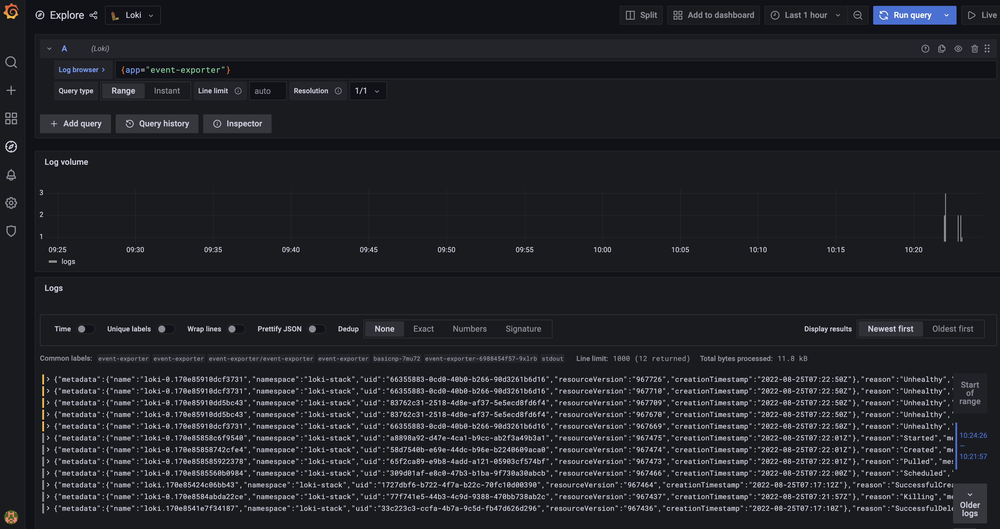
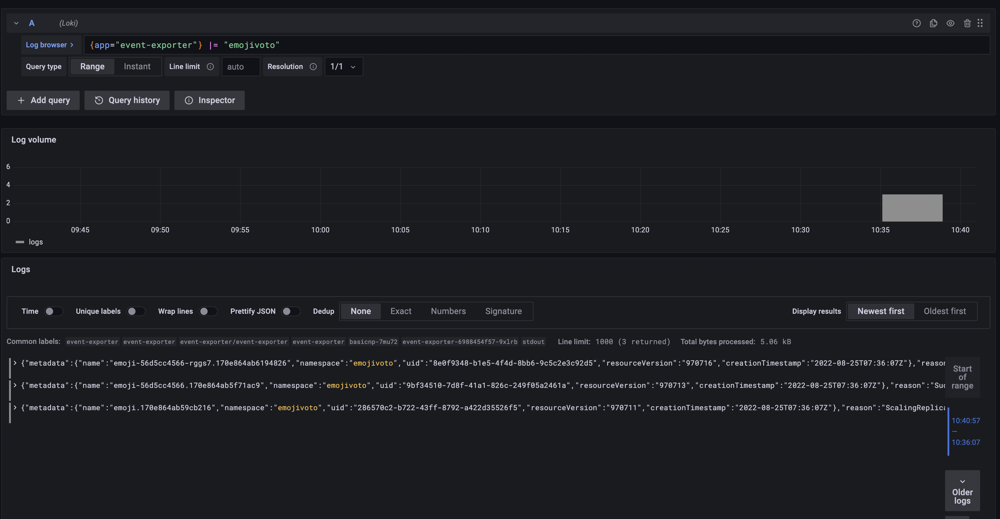
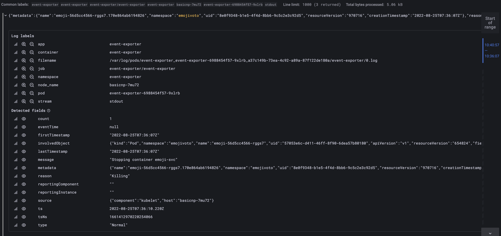

# How to setup Event Exporter for events retention

## Introduction

A Kubernetes event is an object that shows what’s happening inside a cluster, node, pod, or container. These objects are usually generated in response to changes that occur inside your K8s system. The Kubernetes API Server enables all core components to create these events. Generally, each event is accompanied by a log message as well.

An event in Kubernetes is automatically generated in response to changes with other resources—like nodes, pods, or containers.
State changes lie at the center of this. For example, phases across a pod’s lifecycle—like a transition from pending to running, or statuses like successful or failed may trigger a K8s event. The same goes for reallocations and scheduling.

Event objects are not regular log events, therefore the Kubernetes logs do not include them. Kubernetes has no builtin support to store or forward these events on the long term, and they are cleaned up after a short retention time defaulting to just 1 hour.

To overcome this a dedicated application inside the Kubernetes cluster can watch these events on the API Server and write them to the standard output, where you can collect them using [Loki](loki-stack.md).

In this tutorial you will learn how to configure the [Kubernetes Events Exporter](https://github.com/resmoio/kubernetes-event-exporter) and collect and perist those events using `Loki`. The event exporter allows exporting the often missed Kubernetes events to various outputs so that they can be used for observability or alerting purposes.

## Table of contents

- [Introduction](#introduction)
- [Prerequisites](#prerequisites)
- [Step 1 - Installing Event Exporter](#step-1---installing-loki)
- [Step 2 - Viewing Events in Grafana](#step-2---configure-grafana-with-loki)
- [Conclusion](#conclusion)

## Prerequisites

To complete this tutorial, you will need:

1. A [Git](https://git-scm.com/downloads) client, for cloning the `Starter Kit` repository.
2. [Helm](https://www.helm.sh), for installing the `Loki` stack chart.
3. [Kubectl](https://kubernetes.io/docs/tasks/tools), for `Kubernetes` interaction.
4. A text editor with `YAML` lint support, for example: [Visual Studio Code](https://code.visualstudio.com).
5. [Emojivoto Sample App](https://github.com/digitalocean/kubernetes-sample-apps/tree/master/emojivoto-example) deployed in the cluster. Please follow the steps in its repository README.
6. [Prometheus Stack](prometheus-stack.md) and [Loki](loki-stack.md) installed and configured.

## Step 1 - Installing Event Exporter

In this step, you will learn how to deploy `Event Exporter` to your `DOKS` cluster, using `kubectl`.

1. First, clone the `Starter Kit` repository, and then change directory to your local copy:

    ```shell
    git clone https://github.com/digitalocean/Kubernetes-Starter-Kit-Developers.git

    cd Kubernetes-Starter-Kit-Developers
    ```

2. Next, open and inspect the `04-setup-observability/assets/manifests/event-exporter/event-exporter-roles.yaml` file from the `Starter Kit` repository, and adjust according to your needs.
3. Next, create the `ServiceAccount`, `ClusterRole` and `ClusterRoleBinding` by applying the `04-setup-observability/assets/manifests/event-exporter/event-exporter-roles.yaml` values file:

    ```shell
    kubectl apply -f 04-setup-observability/assets/manifests/event-exporter/event-exporter-roles.yaml
    ```

    The output looks similar to the following:

    ```text
    namespace/event-exporter created
    serviceaccount/event-exporter created
    clusterrolebinding.rbac.authorization.k8s.io/event-exporter created
    ```

4. Next create the `event exporter` config by applying the `04-setup-observability/assets/manifests/event-exporter/event-exporter-config.yaml` values file. Configuration is done via a `ConfigMap`.  The tool watches all the events and user has to option to filter out some events, according to their properties. The events will be dumped to stdout where they will be picked up by `Loki` with no other additional configurationr required. Please see the [Event Exporter Repository](https://github.com/resmoio/kubernetes-event-exporter) for any additional configuration.

    ```shell
    kubectl apply -f 04-setup-observability/assets/manifests/event-exporter/event-exporter-config.yaml
    ```

    You can inspect the config map by exporting it to a local `yaml` file via:

    ```shell
    kubectl get cm event-exporter-cfg -n event-exporter -o yaml > event-exporter-config.yaml 
    ```

    Then, open the `event-exporter-config.yaml` file using a text editor of your choice (preferably with `YAML` support). For example you can use [VS Code](https://code.visualstudio.com):

    ```shell
    code event-exporter-config.yaml
    ```

5. Finally, create the `event exporter` deployment by applying the `04-setup-observability/assets/manifests/event-exporter/event-exporter-deployment.yaml`

    ```shell
    kubectl apply -f 04-setup-observability/assets/manifests/event-exporter/event-exporter-deployment.yaml
    ```

    Inspect all the `Kubernetes` resources created for `Event Exporter`:

    ```shell
    kubectl get all -n event-exporter
    ```

    The output looks similar to:

    ```text
     NAME                                  READY   STATUS    RESTARTS   AGE
    pod/event-exporter-6988454f57-9xlrb   1/1     Running   0          7s

    NAME                             READY   UP-TO-DATE   AVAILABLE   AGE
    deployment.apps/event-exporter   1/1     1            1           9s

    NAME                                        DESIRED   CURRENT   READY   AGE
    replicaset.apps/event-exporter-6988454f57   1         1         1       9s
    ```

## Step 2 - Viewing Events in Grafana

If the installation went well and no errors were reported you should start seeing event start to flow in Grafana.

1. Connect to `Grafana` (using default credentials: `admin/prom-operator`) by port forwarding to local machine:

    ```shell
    kubectl --namespace monitoring port-forward svc/kube-prom-stack-grafana 3000:80
    ```

2. Open a web browser on [localhost:3000](http://localhost:3000). Once in, you can go to `Explore` menu and select the `Loki` as a datasource.
3. In the `Log browser` input enter the following:

    ```json
    {app="event-exporter"}
    ```

    You should see events in the `Logs` section.
    

To simulate a realistic event, you can downscale the number of replicas for the `emojivoto` deployment and check out the events in `Grafana`:

1. From your terminal run the following command to bring the number of replicas for the `emoji` deployment to 0:

    ```shell
    kubectl scale --replicas=0 deployment/emoji -n emojivoto
    ```

2. From the `Log browser` input in Grafana proceed to enter the following query:

    ```json
    {app="event-exporter"} |= "emojivoto"
    ```
  
    Using this filter the results will only include the `emojivoto` namespace.
    You should see the filtered events in the `Logs` section.
    

3. Expand on a log to see its details. The log contains a lot of useful information such as the node the pod was deployed on, the message and the namespace to name a few. These fields can be further used to perform queries.


**Notes:**
Any of the fields in the `Detected fields` section of a log detail view can be used to query. For example you can perform a query using the pod name and view specific logs for a certain pod.

```json
{app="event-exporter"} |= "emoji-56d5cc4566-rggs7"
```

Due to the fact that storage and retention has been configured for [Loki](loki-stack.md) the events will be persisted and will not be wiped after 1 hour.

## Conclusion

In this tutorial, you learned how to install `Event Exporter` for event forwarding in your `DOKS` cluster. Then, you used `Grafana` together with the `Loki` data source to view those events.

Next go to [Alerts and Notification](alerts-and-notifications.md).
