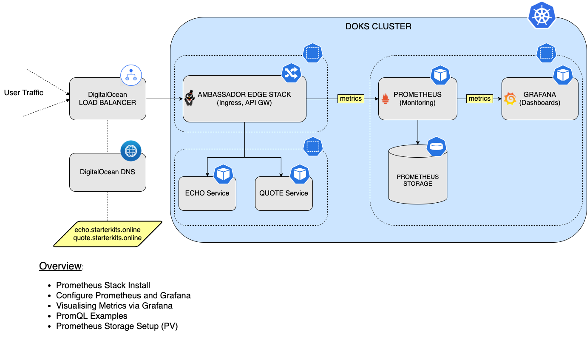

# How to Install the Prometheus Monitoring Stack

## Introduction

In this tutorial, you will learn how to install and configure the `Prometheus` stack, to monitor all pods from your `DOKS` cluster, as well as `Kubernetes` cluster state metrics. Then, you will connect `Prometheus` with `Grafana` to visualize all metrics, and perform queries using the `PromQL` language. Finally, you will configure `persistent` storage for your `Prometheus` instance, to persist all your `DOKS` cluster and application metrics data.

Why choose `Prometheus`?

`Prometheus` supports `multidimensional data collection` and `data queuing`. It's reliable and allows you to quickly diagnose problems. Since each server is independent, it can be leaned on when other infrastructure is damaged, without requiring additional infrastructure. It also integrates very well with `Kubernetes`, and that's a big plus as well.

`Prometheus` follows a `pull` model when it comes to metrics gathering, meaning that it expects a `/metrics` endpoint to be exposed by the service in question for scraping.

After finishing this tutorial, you will be able to:

- `Configure` monitoring for all pods running in your `DOKS` cluster
- `Visualize` metrics for your `applications` in real time, using `Grafana`
- Configure `ServiceMonitors` for your services (e.g. `Emojivoto`) via the `Prometheus Operator`
- Use `PromQL` to perform queries on metrics.
- Configure `persistent` storage for `Prometheus`, to safely store all your `DOKS` cluster and `application` metrics.
- Configure `persistent` storage for `Grafana`, to safely store all your `dashboards`.

### Starter Kit Prometheus Stack Setup Overview



## Table of contents

- [Introduction](#introduction)
- [Prerequisites](#prerequisites)
- [Step 1 - Installing the Prometheus Stack](#step-1---installing-the-prometheus-stack)
- [Step 2 - Configure Prometheus and Grafana](#step-2---configure-prometheus-and-grafana)
- [Step 3 - PromQL (Prometheus Query Language)](#step-3---promql-prometheus-query-language)
- [Step 4 - Visualizing Metrics Using Grafana](#step-4---visualizing-metrics-using-grafana)
- [Step 5 - Configuring Persistent Storage for Prometheus](#step-5---configuring-persistent-storage-for-prometheus)
- [Step 6 - Configuring Persistent Storage for Grafana](#step-6---configuring-persistent-storage-for-grafana)
- [Conclusion](#conclusion)

## Prerequisites

To complete this tutorial, you will need:

1. A [Git](https://git-scm.com/downloads) client, to clone the `Starter Kit` repository.
2. [Helm](https://www.helms.sh), for managing `Promtheus` stack releases and upgrades.
3. [Kubectl](https://kubernetes.io/docs/tasks/tools), for `Kubernetes` interaction.
4. [Curl](https://curl.se/download.html), for testing the examples (backend applications).
5. [Emojivoto Sample App](https://github.com/digitalocean/kubernetes-sample-apps/tree/master/emojivoto-example) deployed in the cluster. Please follow the steps in its repository README.

Please make sure that `kubectl` context is configured to point to your `Kubernetes` cluster - refer to [Step 3 - Creating the DOKS Cluster](01-setup-DOKS/README.md#step-3---creating-the-doks-cluster) from the `DOKS` setup tutorial.

## Step 1 - Installing the Prometheus Stack

In this step, you will install the `kube-prometheus` stack, which is an opinionated full monitoring stack for `Kubernetes`. It includes the `Prometheus Operator`, `kube-state-metrics`, pre-built manifests, `Node Exporters`, `Metrics API`, the `Alerts Manager` and `Grafana`.

You're going to use the `Helm` package manager, to accomplish this task. `Helm` chart is available [here](https://github.com/prometheus-community/helm-charts/tree/main/charts/kube-prometheus-stack) for study.

Steps to follow:

1. First, clone the `Starter Kit` repository and change directory to your local copy.
2. Next, add the `Helm` repository and list the available charts:

    ```shell
    helm repo add prometheus-community https://prometheus-community.github.io/helm-charts

    helm repo update prometheus-community

    helm search repo prometheus-community
    ```

    The output looks similar to the following:

    ```text
    NAME                                                    CHART VERSION   APP VERSION     DESCRIPTION
    prometheus-community/alertmanager                       0.18.1          v0.23.0         The Alertmanager handles alerts sent by client ...
    prometheus-community/kube-prometheus-stack              35.5.1          0.56.3          kube-prometheus-stack collects Kubernetes manif...
    ...
    ```

    **Note:**

    The chart of interest is `prometheus-community/kube-prometheus-stack`, which will install `Prometheus`, `Promtail`, `Alertmanager` and `Grafana` on the cluster. Please visit the [kube-prometheus-stack](https://github.com/prometheus-community/helm-charts/tree/main/charts/kube-prometheus-stack) page for more details about this chart.
3. Then, open and inspect the `04-setup-prometheus-stack/assets/manifests/prom-stack-values-v35.5.1.yaml` file provided in the `Starter Kit` repository, using an editor of your choice (preferably with `YAML` lint support). By default, `kubeSched` and `etcd` metrics are disabled - those components are managed by `DOKS` and are not accessible to `Prometheus`. Note that `storage` is set to `emptyDir`. It means the **storage will be gone** if `Prometheus` pods restart (you will fix this later on, in the [Configuring Persistent Storage for Prometheus](#configuring-persistent-storage-for-prometheus) section).
4. [OPTIONAL] If you followed - [Step 4 - Adding a dedicated node for observability](../01-setup-DOKS/README.md#step-4-optional---adding-a-dedicated-node-for-observability) from [Chapter 1 - 01-setup-DOKS](../01-setup-DOKS/README.md) you will need to edit the `04-setup-prometheus-stack/assets/manifests/prom-stack-values-v35.5.1.yaml` file provided in the `Starter Kit` repository, and uncomment the `affinity` sections for both `Grafana` and `Prometheus`.

    ```yaml
    prometheusSpec:
      affinity:
        nodeAffinity:
          preferredDuringSchedulingIgnoredDuringExecution:
          - weight: 1
            preference:
              matchExpressions:
              - key: preferred
                operator: In
                values:
                - observability
    ```

    ```yaml
    grafana:
      enabled: true
      adminPassword: prom-operator # Please change the default password in production !!!
      affinity:
        nodeAffinity:
          preferredDuringSchedulingIgnoredDuringExecution:
          - weight: 1
            preference:
              matchExpressions:
              - key: preferred
                operator: In
                values:
                - observability
    ```

    Explanations for the above configuration:

    - `preferredDuringSchedulingIgnoredDuringExecution` - the scheduler tries to find a node that meets the rule. If a matching node is not available, the scheduler still schedules the Pod.
    - `preference.matchExpressions` - selector used to match a specific node based on a criteria. Above example tells the scheduler to place workloads (e.g. Pods) on nodes labeled using key - `preferred` and value - `observability`.

5. Finally, install the `kube-prometheus-stack`, using `Helm`:

    ```shell
    HELM_CHART_VERSION="35.5.1"

    helm install kube-prom-stack prometheus-community/kube-prometheus-stack --version "${HELM_CHART_VERSION}" \
      --namespace monitoring \
      --create-namespace \
      -f "04-setup-prometheus-stack/assets/manifests/prom-stack-values-v${HELM_CHART_VERSION}.yaml"
    ```

    **Note:**

    A `specific` version for the `Helm` chart is used. In this case `35.5.1` was picked, which maps to the `0.56.3` version of the application (see output from `Step 2.`). It’s good practice in general, to lock on a specific version. This helps to have predictable results, and allows versioning control via `Git`.

Now, check the `Prometheus` stack `Helm` release status:

```shell
helm ls -n monitoring
```

The output looks similar to (notice the `STATUS` column value - it should say `deployed`):

```text
NAME            NAMESPACE       REVISION        UPDATED                                 STATUS          CHART                           APP VERSION
kube-prom-stack monitoring      1               2022-06-07 09:52:53.795003 +0300 EEST   deployed        kube-prometheus-stack-35.5.1    0.56.3  
```

See what `Kubernetes` resources are available for `Prometheus`:

```shell
kubectl get all -n monitoring
```

You should have the following resources deployed: `prometheus-node-exporter`, `kube-prome-operator`, `kube-prome-alertmanager`, `kube-prom-stack-grafana` and `kube-state-metrics`. The output looks similar to:

```text
NAME                                                         READY   STATUS    RESTARTS   AGE
pod/alertmanager-kube-prom-stack-kube-prome-alertmanager-0   2/2     Running   0          3m3s
pod/kube-prom-stack-grafana-8457cd64c4-ct5wn                 2/2     Running   0          3m5s
pod/kube-prom-stack-kube-prome-operator-6f8b64b6f-7hkn7      1/1     Running   0          3m5s
pod/kube-prom-stack-kube-state-metrics-5f46fffbc8-mdgfs      1/1     Running   0          3m5s
pod/kube-prom-stack-prometheus-node-exporter-gcb8s           1/1     Running   0          3m5s
pod/kube-prom-stack-prometheus-node-exporter-kc5wz           1/1     Running   0          3m5s
pod/kube-prom-stack-prometheus-node-exporter-qn92d           1/1     Running   0          3m5s
pod/prometheus-kube-prom-stack-kube-prome-prometheus-0       2/2     Running   0          3m3s

NAME                                               TYPE        CLUSTER-IP       EXTERNAL-IP   PORT(S)                      AGE
service/alertmanager-operated                      ClusterIP   None             <none>        9093/TCP,9094/TCP,9094/UDP   3m3s
service/kube-prom-stack-grafana                    ClusterIP   10.245.147.83    <none>        80/TCP                       3m5s
service/kube-prom-stack-kube-prome-alertmanager    ClusterIP   10.245.187.117   <none>        9093/TCP                     3m5s
service/kube-prom-stack-kube-prome-operator        ClusterIP   10.245.79.95     <none>        443/TCP                      3m5s
service/kube-prom-stack-kube-prome-prometheus      ClusterIP   10.245.86.189    <none>        9090/TCP                     3m5s
service/kube-prom-stack-kube-state-metrics         ClusterIP   10.245.119.83    <none>        8080/TCP                     3m5s
service/kube-prom-stack-prometheus-node-exporter   ClusterIP   10.245.47.175    <none>        9100/TCP                     3m5s
service/prometheus-operated                        ClusterIP   None             <none>        9090/TCP                     3m3s

NAME                                                      DESIRED   CURRENT   READY   UP-TO-DATE   AVAILABLE   NODE SELECTOR   AGE
daemonset.apps/kube-prom-stack-prometheus-node-exporter   3         3         3       3            3           <none>          3m5s

NAME                                                  READY   UP-TO-DATE   AVAILABLE   AGE
deployment.apps/kube-prom-stack-grafana               1/1     1            1           3m5s
deployment.apps/kube-prom-stack-kube-prome-operator   1/1     1            1           3m5s
deployment.apps/kube-prom-stack-kube-state-metrics    1/1     1            1           3m5s

NAME                                                            DESIRED   CURRENT   READY   AGE
replicaset.apps/kube-prom-stack-grafana-8457cd64c4              1         1         1       3m5s
replicaset.apps/kube-prom-stack-kube-prome-operator-6f8b64b6f   1         1         1       3m5s
replicaset.apps/kube-prom-stack-kube-state-metrics-5f46fffbc8   1         1         1       3m5s

NAME                                                                    READY   AGE
statefulset.apps/alertmanager-kube-prom-stack-kube-prome-alertmanager   1/1     3m3s
statefulset.apps/prometheus-kube-prom-stack-kube-prome-prometheus       1/1     3m3s
```

Then, you can connect to `Grafana` (using default credentials: `admin/prom-operator` - see [prom-stack-values-v35.5.1](assets/manifests/prom-stack-values-v35.5.1.yaml#L58) file), by port forwarding to local machine:

```shell
kubectl --namespace monitoring port-forward svc/kube-prom-stack-grafana 3000:80
```

**Important Note:**

You should **NOT** expose `Grafana` to `public` network (eg. create an ingress mapping or `LB` service) with `default login/password`.

`Grafana` installation comes with a number of dashboards. Open a web browser on [localhost:3000](http://localhost:3000). Once in, you can go to `Dashboards -> Browse`, and choose different dashboards.

In the next part, you will discover how to set up `Prometheus` to discover targets for monitoring. As an example, the `Emojivoto` sample application will be used. You'll learn what a `ServiceMonitor` is, as well.

## Step 2 - Configure Prometheus and Grafana

You already deployed `Prometheus` and `Grafana` into the cluster. In this step, you will learn how to use a `ServiceMonitor`. A `ServiceMonitor` is one of the preferred ways to tell `Prometheus` how to discover a new target for monitoring.

The `Emojivoto Deployment` created in `Step 5` of the [Prerequisites](#prerequisites) section provides the `/metrics` endpoint by default on port `8801` via a `Kubernetes` service.

Next, you will discover the `Emojivoto` services responsible with exposing metrics data for `Prometheus` to consume. The services in question are called `emoji-svc` and `voting-svc` (note that it's using the `emojivoto` namespace):

```shell
kubectl get svc -n emojivoto
```

The output looks similar to the following:

```text
NAME         TYPE        CLUSTER-IP       EXTERNAL-IP   PORT(S)             AGE
emoji-svc    ClusterIP   10.245.135.93    <none>        8080/TCP,8801/TCP   22h
voting-svc   ClusterIP   10.245.164.222   <none>        8080/TCP,8801/TCP   22h
web-svc      ClusterIP   10.245.61.229    <none>        80/TCP              22h
```

Next, please perform a `port-forward`, to inspect the metrics:

```shell
kubectl port-forward svc/emoji-svc 8801:8801 -n emojivoto
```

The exposed `metrics` can be `visualized` by navigating with a web browser to [localhost](http://localhost:8801/metrics), or via curl:

```shell
curl -s http://localhost:8801/metrics
```

The output looks similar to the following:

```text
# TYPE go_gc_duration_seconds summary
go_gc_duration_seconds{quantile="0"} 5.317e-05
go_gc_duration_seconds{quantile="0.25"} 0.000105305
go_gc_duration_seconds{quantile="0.5"} 0.000138168
go_gc_duration_seconds{quantile="0.75"} 0.000225651
go_gc_duration_seconds{quantile="1"} 0.016986437
go_gc_duration_seconds_sum 0.607979843
go_gc_duration_seconds_count 2097
```

**Note:**
To inspect the metrics for the `voting-svc` service, stop the `emoji-svc` port-forward and perform the same steps for the second service.

Next, connect `Prometheus` to the `Emojivoto` metrics service. There are several ways of doing this:

- [<static_config>](https://prometheus.io/docs/prometheus/latest/configuration/configuration/#static_config) - allows specifying a list of targets and a common label set for them.
- [<kubernetes_sd_config>](https://prometheus.io/docs/prometheus/latest/configuration/configuration/#kubernetes_sd_config) - allows retrieving scrape targets from `Kubernetes' REST API` and always staying synchronized with the cluster state.
- [Prometheus Operator](https://github.com/prometheus-operator/prometheus-operator) - simplifies `Prometheus` monitoring inside a `Kubernetes` cluster via `CRDs`.

As you can see, there are many ways to tell `Prometheus` to scrape an endpoint, so which one should you pick? The preferred way when targeting a `Kubernetes` cluster, is to use the `Prometheus Operator` which comes bundled with the `Prometheus` monitoring stack.

Next, you will make use of the `ServiceMonitor` CRD exposed by the `Prometheus Operator`, to define a new target for monitoring.

Steps required to add all `Emojivoto` services for `Prometheus` monitoring:

1. First, change directory (if not already) where the `Starter Kit` Git repository was cloned:

    ```shell
    cd Kubernetes-Starter-Kit-Developers
    ```

2. Next, open the `04-setup-prometheus-stack/assets/manifests/prom-stack-values-v35.5.1.yaml` file provided in the `Starter Kit` repository, using a text editor of your choice (preferably with `YAML` lint support). Please remove the comments surrounding the `additionalServiceMonitors` section. The output looks similar to:

    ```yaml
    additionalServiceMonitors:
      - name: "emojivoto-monitor"
        selector:
          matchExpressions:
            - key: app
              operator: In
              values:
                - emoji-svc
                - voting-svc
        namespaceSelector:
          matchNames: 
            - emojivoto
        endpoints:
          - port: "prom"
    ```

    Explanations for the above configuration:

    - `selector -> matchExpressions` - tells `ServiceMonitor` which service to monitor. It will target all services with the label key `app` and the values `emoji-svc` and `voting-svc`. The labels can be fetched by running: `kubectl get svc --show-labels -n emojivoto`
    - `namespaceSelector` - here, you want to match the namespace where `Emojivoto` was deployed.
    - `endpoints -> port` - references the port of the service to monitor.

3. Finally, apply changes using `Helm`:

    ```shell
    HELM_CHART_VERSION="35.5.1"

    helm upgrade kube-prom-stack prometheus-community/kube-prometheus-stack --version "${HELM_CHART_VERSION}" \
      --namespace monitoring \
      -f "04-setup-prometheus-stack/assets/manifests/prom-stack-values-v${HELM_CHART_VERSION}.yaml"
    ```

Next, please check if the `Emojivoto` target is added to `Prometheus` for scraping. Create a port forward for `Prometheus` on port `9090`:

```shell
kubectl port-forward svc/kube-prom-stack-kube-prome-prometheus 9090:9090 -n monitoring
```

Open a web browser on [localhost:9090](http://localhost:9090). Then, navigate to `Status -> Targets` page, and inspect the results (notice the `serviceMonitor/monitoring/emojivoto-monitor/0` path):


**Note:**
There are **2 entries** under the discovered targets because the `Emojivoto` deployment consists of 2 `services` exposing the metrics endpoint.

In the next step, you'll discover `PromQL` along with some simple examples, to get you started, and discover the language.

## Step 3 - PromQL (Prometheus Query Language)

In this step, you will learn the basics of `Prometheus Query Language` (PromQL). `PromQL` helps you perform queries on various `metrics` coming from all `Pods` and `applications` from your `DOKS` cluster.

What is `PromQL`?

It's a `DSL` or `Domain Specific Language` that is specifically built for `Prometheus` and allows you to query for metrics. Because it’s a `DSL` built upon `Go`, you’ll find that `PromQL` has a lot in common with the language. But it’s also a `NFL` or `Nested Functional Language`, where data appears as nested expressions within larger expressions. The outermost, or overall, expression defines the final value, while nested expressions represent values for arguments and operands. For more in depth explanations, please visit the official [PromQL](https://prometheus.io/docs/prometheus/latest/querying) page.

Next, you're going to inspect one of the `Emojivoto` metrics, namely the `emojivoto_votes_total`, which represents the total number of `votes`. It's a counter value that increases with each request against the `Emojivoto` votes endpoint.

Steps to follow:

1. First, create a port forward for `Prometheus` on port `9090`:

    ```shell
    kubectl port-forward svc/kube-prom-stack-kube-prome-prometheus 9090:9090 -n monitoring
    ```

2. Next, open the [expression browser](http://localhost:9090/graph).
3. In the query input field paste `emojivoto_votes_total`, and hit `Enter`. The output looks similar to:

    ```text
    emojivoto_votes_total{container="voting-svc", emoji=":100:", endpoint="prom", instance="10.244.25.31:8801", job="voting-svc", namespace="emojivoto", pod="voting-74ff7f8b55-jl6qs", service="voting-svc"} 20
    emojivoto_votes_total{container="voting-svc", emoji=":bacon:", endpoint="prom", instance="10.244.25.31:8801", job="voting-svc", namespace="emojivoto", pod="voting-74ff7f8b55-jl6qs", service="voting-svc"} 17
    emojivoto_votes_total{container="voting-svc", emoji=":balloon:", endpoint="prom", instance="10.244.25.31:8801", job="voting-svc", namespace="emojivoto", pod="voting-74ff7f8b55-jl6qs", service="voting-svc"} 21
    emojivoto_votes_total{container="voting-svc", emoji=":basketball_man:", endpoint="prom", instance="10.244.25.31:8801", job="voting-svc", namespace="emojivoto", pod="voting-74ff7f8b55-jl6qs", service="voting-svc"} 10
    emojivoto_votes_total{container="voting-svc", emoji=":beach_umbrella:", endpoint="prom", instance="10.244.25.31:8801", job="voting-svc", namespace="emojivoto", pod="voting-74ff7f8b55-jl6qs", service="voting-svc"} 10
    emojivoto_votes_total{container="voting-svc", emoji=":beer:", endpoint="prom", instance="10.244.25.31:8801", job="voting-svc", namespace="emojivoto", pod="voting-74ff7f8b55-jl6qs", service="voting-svc"} 11
    ```

4. Navigate to the `Emojivoto` application and from the homepage click on the `100` emoji to vote for it.
5. Navigate to the query results page from `Step 3` and click on the `Execute` button. You should see the counter for the `100` emoji increase by one. The ouput looks similar to:

    ```text
    emojivoto_votes_total{container="voting-svc", emoji=":100:", endpoint="prom", instance="10.244.25.31:8801", job="voting-svc", namespace="emojivoto", pod="voting-74ff7f8b55-jl6qs", service="voting-svc"} 21
    emojivoto_votes_total{container="voting-svc", emoji=":bacon:", endpoint="prom", instance="10.244.25.31:8801", job="voting-svc", namespace="emojivoto", pod="voting-74ff7f8b55-jl6qs", service="voting-svc"} 17
    emojivoto_votes_total{container="voting-svc", emoji=":balloon:", endpoint="prom", instance="10.244.25.31:8801", job="voting-svc", namespace="emojivoto", pod="voting-74ff7f8b55-jl6qs", service="voting-svc"} 21
    emojivoto_votes_total{container="voting-svc", emoji=":basketball_man:", endpoint="prom", instance="10.244.25.31:8801", job="voting-svc", namespace="emojivoto", pod="voting-74ff7f8b55-jl6qs", service="voting-svc"} 10
    emojivoto_votes_total{container="voting-svc", emoji=":beach_umbrella:", endpoint="prom", instance="10.244.25.31:8801", job="voting-svc", namespace="emojivoto", pod="voting-74ff7f8b55-jl6qs", service="voting-svc"} 10
    emojivoto_votes_total{container="voting-svc", emoji=":beer:", endpoint="prom", instance="10.244.25.31:8801", job="voting-svc", namespace="emojivoto", pod="voting-74ff7f8b55-jl6qs", service="voting-svc"} 11
    ```

6. `PromQL` groups similar data in what's called a `vector`. As seen above, each `vector` has a set of `attributes` which differentiates it from one another. What you can do then, is to group results based on an attribute of interest. For example, if you care only about requests that come from the `voting-svc` service, then please type the following in the query field:

    ```json
    emojivoto_votes_total{service="voting-svc"}
    ```

    The output looks similar to (note that it selects only the results that match your criteria):

    ```json
    emojivoto_votes_total{container="voting-svc", emoji=":100:", endpoint="prom", instance="10.244.6.91:8801", job="voting-svc", namespace="emojivoto", pod="voting-6548959dd7-hssh2", service="voting-svc"} 492
    emojivoto_votes_total{container="voting-svc", emoji=":bacon:", endpoint="prom", instance="10.244.6.91:8801", job="voting-svc", namespace="emojivoto", pod="voting-6548959dd7-hssh2", service="voting-svc"} 532
    emojivoto_votes_total{container="voting-svc", emoji=":balloon:", endpoint="prom", instance="10.244.6.91:8801", job="voting-svc", namespace="emojivoto", pod="voting-6548959dd7-hssh2", service="voting-svc"} 521
    ```

 **Note:**

  The above result shows the total requests for each `Pod` from the `Emojivoto` deployment which emits metrics (which consists of `2`).

This is just a very simple introduction to what `PromQL` is and what it's capable of. But it can do much more than that, like: `counting` metrics, computing the `rate` over a predefined `interval`, etc. Please visit the official [PromQL](https://prometheus.io/docs/prometheus/latest/querying/basics/) page, for more features of the language.

In the next step, you will learn ho to use `Grafana` to `visualize` metrics for the `Emojivoto` sample application.

## Step 4 - Visualizing Metrics Using Grafana

Although `Prometheus` has some support for `visualizing` data built in, a better way of doing it is via `Grafana` which is an open-source platform for `monitoring` and `observability`, that lets you `visualize` and `explore` the `state` of your `systems`.

On the official page is described as being able to:

> Query, visualize, alert on, and understand your data no matter where it’s stored.

Why use `Grafana`?

Because it's the leading open source monitoring and analytics platform available nowadays for visualizing data coming from a vast number of data sources, including `Prometheus` as well. It offers some advanced features for organizing the graphs and it supports real time testing for queries. Not to mention that you can customize the views and make some beautiful panels which can be rendered on big screens so you never miss a single data point.

No extra steps are needed for installation, because [Step 1 - Installing the Prometheus Stack](#step-1---installing-the-prometheus-stack) installed `Grafana` for you. All you have to do is a port forward like below, and get immediate access to the dashboards (default credentials: `admin/prom-monitor`):

```shell
kubectl --namespace monitoring port-forward svc/kube-prom-stack-grafana 3000:80
```

In order to see all the `Emojivoto` metrics, you're going to use one of the default installed dashboards from `Grafana`.

Accessing the `Kubernetes/Compute Resources/Namespace(Pods)` dashboard for `Grafana`:

1. Navigate to the [Grafana Dashboards](http://localhost:3000/dashboards) section.
2. Next, search for the `General/Kubernetes/Compute Resources/Namespace(Pods)` dashboard and access it.
3. Finally, select the `Prometheus` data source and add the `emojivoto` namespace.

The picture down below shows the available options:


You can play around and add more panels in `Grafana`, for visualizing other data sources, as well as `group` them together based on `scope`. Also, you can explore the available dashboards for `Kubernetes` from the Grafana [kube-mixin](https://github.com/kubernetes-monitoring/kubernetes-mixin) project.

In the next step, you will configure `persistent` storage for `Prometheus` using `DigitalOcean` block storage, to persist your `DOKS` and `application metrics` across server `restarts` or `cluster failures`.

## Step 5 - Configuring Persistent Storage for Prometheus

In this step, you will learn how to enable `persistent storage` for `Prometheus`, so that metrics data is persisted across `server restarts`, or in case of `cluster failures`. You will define a `5 Gi Persistent Volume Claim` (PVC), using the `DigitalOcean Block Storage`. Later on, a quick and easy guide is provided, on how to `plan` the `size` of your `PVC`, to suit your monitoring `storage` needs. To learn more about `PVCs`, please consult the [Persistent Volumes](https://kubernetes.io/docs/concepts/storage/persistent-volumes) page from the official `Kubernetes` documentation.

Steps to follow:

1. First, check what storage class is available - you need one, in order to proceed:

    ```shell
    kubectl get storageclass
    ```

    The output should look similar to (notice that `DigitalOcean Block Storage` is available for you to use):

    ```text
    NAME                         PROVISIONER                 RECLAIMPOLICY   VOLUMEBINDINGMODE   ALLOWVOLUMEEXPANSION   AGE
    do-block-storage (default)   dobs.csi.digitalocean.com   Delete          Immediate           true                   4d2h
    ```

2. Next, change directory (if not already) where the `Starter Kit` Git repository was cloned:

    ```shell
    cd Kubernetes-Starter-Kit-Developers
    ```

3. Then, open the `04-setup-prometheus-stack/assets/manifests/prom-stack-values-v35.5.1.yaml` file provided in the `Starter Kit` repository, using a text editor of your choice (preferably with `YAML` lint support). Search for the `storageSpec` line, and uncomment the required section for `Prometheus`. The `storageSpec` definition should look like:

    ```yaml
    prometheusSpec:
      storageSpec:
        volumeClaimTemplate:
          spec:
            storageClassName: do-block-storage
            accessModes: ["ReadWriteOnce"]
            resources:
              requests:
                storage: 5Gi
    ```

    Explanations for the above configuration:

    - `volumeClaimTemplate` - defines a new `PVC`.
    - `storageClassName` - defines the storage class (should use the same value as from the `kubectl get storageclass` command output).
    - `resources` - sets the storage requests value - in this case, a total capacity of `5 Gi` is requested for the new volume.

4. Finally, apply settings using `Helm`:

    ```shell
    HELM_CHART_VERSION="35.5.1"

    helm upgrade kube-prom-stack prometheus-community/kube-prometheus-stack --version "${HELM_CHART_VERSION}" \
      --namespace monitoring \
      -f "04-setup-prometheus-stack/assets/manifests/prom-stack-values-v${HELM_CHART_VERSION}.yaml"
    ```

After completing the above steps, check the `PVC` status:

```shell
kubectl get pvc -n monitoring
```

The output looks similar to (`STATUS` column should display `Bound`):

```text
NAME                      STATUS   VOLUME                                     CAPACITY   ACCESS         MODES              AGE
kube-prome-prometheus-0   Bound    pvc-768d85ff-17e7-4043-9aea-4929df6a35f4   5Gi        RWO            do-block-storage   4d2h
```

A new `Volume` should appear in the [Volumes](https://cloud.digitalocean.com/volumes) web page, from your `DigitalOcean` account panel:


## Step 6 - Configuring Persistent Storage for Grafana

In this step, you will learn how to enable `persistent` storage for `Grafana`, so that the graphs are persisted across server restarts, or in case of cluster failures. You will define a `5 Gi Persistent Volume Claim` (PVC), using the DigitalOcean Block Storage. The next steps are the same as [Step 5 - Configuring Persistent Storage for Prometheus](#step-5---configuring-persistent-storage-for-prometheus).

First, open the `04-setup-prometheus-stack/assets/manifests/prom-stack-values-v35.5.1.yaml` file provided in the `Starter Kit` repository, using a text editor of your choice (preferably with `YAML` lint support). The `persistence`  storage section for `grafana` should look like:

```yaml
grafana:
  ...
  persistence:
    enabled: true
    storageClassName: do-block-storage
    accessModes: ["ReadWriteOnce"]
    size: 5Gi
```

Next, apply settings using `Helm`:

  ```shell
  HELM_CHART_VERSION="35.5.1"

  helm upgrade kube-prom-stack prometheus-community/kube-prometheus-stack --version "${HELM_CHART_VERSION}" \
    --namespace monitoring \
    -f "04-setup-prometheus-stack/assets/manifests/prom-stack-values-v${HELM_CHART_VERSION}.yaml"
  ```

After completing the above steps, check the `PVC` status:

```shell
kubectl get pvc -n monitoring
```

The output looks similar to (`STATUS` column should display `Bound`):

```text
NAME                      STATUS   VOLUME                                     CAPACITY   ACCESS         MODES              AGE
kube-prom-stack-grafana   Bound    pvc-768d85ff-17e7-4043-9aea-4929df6a35f4   5Gi        RWO            do-block-storage   4d2h
```

A new `Volume` should appear in the [Volumes](https://cloud.digitalocean.com/volumes) web page, from your `DigitalOcean` account panel:


### Best Practices for PV Sizing

In order to compute the size needed for the volume based on your needs, please follow the official documentation advices and formula:

> `Prometheus` stores an average of only `1-2 bytes` per sample. Thus, to `plan the capacity` of a `Prometheus` server, you can use the rough formula:
>
> `needed_disk_space = retention_time_seconds * ingested_samples_per_second * bytes_per_sample`
>
> To lower the rate of ingested samples, you can either `reduce` the `number of time series` you scrape (fewer targets or fewer series per target), or you can `increase` the `scrape interval`. However, `reducing` the number of series is likely more effective, due to `compression` of samples within a series.

Based on our findings, a `5GB` volume is enough for basic needs, like in the case of small development environments (as well as to complete the `Starter Kit` tutorial). If `5GB` is not enough over time (depending on your use case), you need to adjust based on the volume of metrics ingested, and retention time needed, using the above mentioned formula.

Please follow the [Operational Aspects](https://prometheus.io/docs/prometheus/latest/storage/#operational-aspects) section, for more details on the subject.

## Conclusion

In this tutorial, you learned how to `install` and `configure` the `Prometheus` stack, then used `Grafana` to install new dashboards and visualize `DOKS` cluster application `metrics`. You also learned how to perform metric `queries` using `PromQL`. Finally, you configured and enabled `persistent storage` for `Prometheus` to use, to store your `cluster metrics`.

Next, you will learn about application `logs` collection and `aggregation` via `Loki`, to help you `troubleshoot` running `Kubernetes` cluster `applications` in case something goes wrong.

Go to [Section 5 - Logs Aggregation via Loki Stack](../05-setup-loki-stack/README.md).
