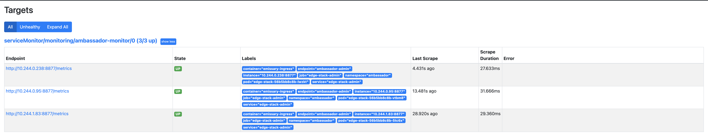
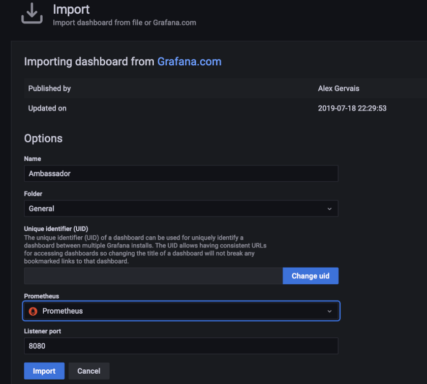
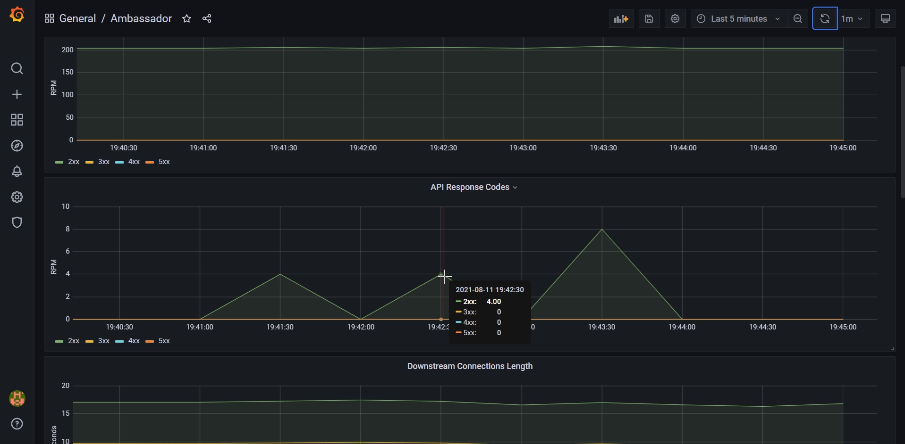

# How to Install the Prometheus Monitoring Stack

## Introduction

In this tutorial, you will learn how to install and configure the `Prometheus` stack, to monitor all pods from your `DOKS` cluster, as well as `Kubernetes` cluster state metrics. Then, you will connect `Prometheus` with `Grafana` to visualize all metrics, and perform queries using the `PromQL` language. Finally, you will configure `persistent` storage for your `Prometheus` instance, to persist all your `DOKS` cluster and application metrics data.

Why choose `Prometheus` ?

`Prometheus` supports `multidimensional data collection` and `data queuing`. It's reliable and allows you to quickly diagnose problems. Since each server is independent, it can be leaned on when other infrastructure is damaged, without requiring additional infrastructure. It also integrates very well with `Kubernetes`, and that's a big plus as well.

`Prometheus` follows a `pull` model when it comes to metrics gathering, meaning that it expects a `/metrics` endpoint to be exposed by the service in question for scraping.

After finishing this tutorial, you will be able to:

- `Configure` monitoring for all pods running in your `DOKS` cluster
- `Visualize` metrics for your `applications` in real time, using `Grafana`
- Configure `ServiceMonitors` via the `Prometheus Operator`, for your services (e.g. `Ambassador Edge Stack`)
- Use `PromQL` to perform queries on metrics.
- Configure `persistent` storage for `Prometheus`, to safely store all your `DOKS` cluster and `application` metrics.

### Starter Kit Prometheus Stack Setup Overview


## Table of contents

- [Introduction](#introduction)
- [Prerequisites](#prerequisites)
- [Step 1 - Installing the Prometheus Stack](#step-1---installing-the-prometheus-stack)
- [Step 2 - Configure Prometheus and Grafana](#step-2---configure-prometheus-and-grafana)
- [Step 3 - PromQL (Prometheus Query Language)](#step-3---promql-prometheus-query-language)
- [Step 4 - Visualizing Metrics Using Grafana](#step-4---visualizing-metrics-using-grafana)
- [Step 5 - Configuring Persistent Storage for Prometheus](#step-5---configuring-persistent-storage-for-prometheus)
- [Conclusion](#conclusion)

## Prerequisites

To complete this tutorial, you will need:

1. A [Git](https://git-scm.com/downloads) client, to clone the `Starter Kit` repository.
2. [Helm](https://www.helms.sh), for managing `Promtheus` stack releases and upgrades.
3. [Kubectl](https://kubernetes.io/docs/tasks/tools), for `Kubernetes` interaction.
4. [Curl](https://curl.se/download.html), for testing the examples (backend applications).

Please make sure that `kubectl` context is configured to point to your `Kubernetes` cluster - refer to [Step 3 - Creating the DOKS Cluster](01-setup-DOKS/README.md#step-3---creating-the-doks-cluster) from the `DOKS` setup tutorial.

## Step 1 - Installing the Prometheus Stack

In this step, you will install the `kube-prometheus` stack, which is an opinionated full monitoring stack for `Kubernetes`. It includes the `Prometheus Operator`, `kube-state-metrics`, pre-built manifests, `Node Exporters`, `Metrics API`, the `Alerts Manager` and `Grafana`.

You're going to use the `Helm` package manager, to accomplish this task. `Helm` chart is available [here](https://github.com/prometheus-community/helm-charts/tree/main/charts/kube-prometheus-stack) for study.

Steps to follow:

1. First, clone the `Starter Kit` repository and change directory to your local copy.
2. Next, add the `Helm` repository and list the available charts:

    ```shell
    helm repo add prometheus-community https://prometheus-community.github.io/helm-charts

    helm search repo prometheus-community
    ```

    The output looks similar to the following:

    ```text
    NAME                                                    CHART VERSION   APP VERSION     DESCRIPTION                                       
    prometheus-community/alertmanager                       0.12.2          v0.22.1         The Alertmanager handles alerts sent by client ...
    prometheus-community/kube-prometheus-stack              17.1.3          0.49.0          kube-prometheus-stack collects Kubernetes manif...
    ...
    ```

    **Note:**

    The chart of interest is `prometheus-community/kube-prometheus-stack`, which will install `Prometheus`, `Promtail`, `Alertmanager` and `Grafana` on the cluster. Please visit the [kube-prometheus-stack](https://github.com/prometheus-community/helm-charts/tree/main/charts/kube-prometheus-stack) page for more details about this chart.
3. Then, open and inspect the `04-setup-prometheus-stack/assets/manifests/prom-stack-values-v17.1.3.yaml` file provided in the `Starter Kit` repository, using an editor of your choice (preferably with `YAML` lint support). By default, `kubeSched` and `etcd` metrics are disabled - those components are managed by `DOKS` and are not accessible to `Prometheus`. Note that `storage` is set to `emptyDir`. It means the **storage will be gone** if `Prometheus` pods restart (you will fix this later on, in the [Configuring Persistent Storage for Prometheus](#configuring-persistent-storage-for-prometheus) section).
4. Finally, install the `kube-prometheus-stack`, using `Helm`:

    ```shell
    HELM_CHART_VERSION="17.1.3"

    helm install kube-prom-stack prometheus-community/kube-prometheus-stack --version "${HELM_CHART_VERSION}" \
      --namespace monitoring \
      --create-namespace \
      -f "04-setup-prometheus-stack/assets/manifests/prom-stack-values-v${HELM_CHART_VERSION}.yaml"
    ```

    **Note:**

    A `specific` version for the `Helm` chart is used. In this case `17.1.3` was picked, which maps to the `0.49.0` version of the application (see output from `Step 2.`). It’s good practice in general, to lock on a specific version. This helps to have predictable results, and allows versioning control via `Git`.

Now, check the `Prometheus` stack `Helm` release status:

```shell
helm ls -n monitoring
```

The output looks similar to (notice the `STATUS` column value - it should say `deployed`):

```text
NAME            NAMESPACE       REVISION        UPDATED                                 STATUS          CHART                           APP VERSION
kube-prom-stack monitoring      1               2021-09-25 14:04:10.477183 +0300 EEST   deployed        kube-prometheus-stack-17.1.3    0.49.0
```

See what `Kubernetes` resources are available for `Prometheus`:

```shell
kubectl get all -n monitoring
```

You should have the following resources deployed: `prometheus-node-exporter`, `kube-prome-operator`, `kube-prome-alertmanager`, `kube-prom-stack-grafana` and `kube-state-metrics`. The output looks similar to:

```text
NAME                                                         READY   STATUS    RESTARTS   AGE
pod/alertmanager-kube-prom-stack-kube-prome-alertmanager-0   2/2     Running   0          3m3s
pod/kube-prom-stack-grafana-8457cd64c4-ct5wn                 2/2     Running   0          3m5s
pod/kube-prom-stack-kube-prome-operator-6f8b64b6f-7hkn7      1/1     Running   0          3m5s
pod/kube-prom-stack-kube-state-metrics-5f46fffbc8-mdgfs      1/1     Running   0          3m5s
pod/kube-prom-stack-prometheus-node-exporter-gcb8s           1/1     Running   0          3m5s
pod/kube-prom-stack-prometheus-node-exporter-kc5wz           1/1     Running   0          3m5s
pod/kube-prom-stack-prometheus-node-exporter-qn92d           1/1     Running   0          3m5s
pod/prometheus-kube-prom-stack-kube-prome-prometheus-0       2/2     Running   0          3m3s

NAME                                               TYPE        CLUSTER-IP       EXTERNAL-IP   PORT(S)                      AGE
service/alertmanager-operated                      ClusterIP   None             <none>        9093/TCP,9094/TCP,9094/UDP   3m3s
service/kube-prom-stack-grafana                    ClusterIP   10.245.147.83    <none>        80/TCP                       3m5s
service/kube-prom-stack-kube-prome-alertmanager    ClusterIP   10.245.187.117   <none>        9093/TCP                     3m5s
service/kube-prom-stack-kube-prome-operator        ClusterIP   10.245.79.95     <none>        443/TCP                      3m5s
service/kube-prom-stack-kube-prome-prometheus      ClusterIP   10.245.86.189    <none>        9090/TCP                     3m5s
service/kube-prom-stack-kube-state-metrics         ClusterIP   10.245.119.83    <none>        8080/TCP                     3m5s
service/kube-prom-stack-prometheus-node-exporter   ClusterIP   10.245.47.175    <none>        9100/TCP                     3m5s
service/prometheus-operated                        ClusterIP   None             <none>        9090/TCP                     3m3s

NAME                                                      DESIRED   CURRENT   READY   UP-TO-DATE   AVAILABLE   NODE SELECTOR   AGE
daemonset.apps/kube-prom-stack-prometheus-node-exporter   3         3         3       3            3           <none>          3m5s

NAME                                                  READY   UP-TO-DATE   AVAILABLE   AGE
deployment.apps/kube-prom-stack-grafana               1/1     1            1           3m5s
deployment.apps/kube-prom-stack-kube-prome-operator   1/1     1            1           3m5s
deployment.apps/kube-prom-stack-kube-state-metrics    1/1     1            1           3m5s

NAME                                                            DESIRED   CURRENT   READY   AGE
replicaset.apps/kube-prom-stack-grafana-8457cd64c4              1         1         1       3m5s
replicaset.apps/kube-prom-stack-kube-prome-operator-6f8b64b6f   1         1         1       3m5s
replicaset.apps/kube-prom-stack-kube-state-metrics-5f46fffbc8   1         1         1       3m5s

NAME                                                                    READY   AGE
statefulset.apps/alertmanager-kube-prom-stack-kube-prome-alertmanager   1/1     3m3s
statefulset.apps/prometheus-kube-prom-stack-kube-prome-prometheus       1/1     3m3s
```

Then, you can connect to `Grafana` (using default credentials: `admin/prom-operator` - see [prom-stack-values-v17.1.3](assets/manifests/prom-stack-values-v17.1.3.yaml#L58) file), by port forwarding to local machine:

```shell
kubectl --namespace monitoring port-forward svc/kube-prom-stack-grafana 3000:80
```

**Important Note:**

You should **NOT** expose `Grafana` to `public` network (eg. create an ingress mapping or `LB` service) with `default login/password`.

`Grafana` installation comes with a number of dashboards. Open a web browser on [localhost:3000](http://localhost:3000). Once in, you can go to `Dashboards -> Manage`, and choose different dashboards.

In the next part, you will discover how to set up `Prometheus` to discover targets for monitoring. As an example, the `Ambassador Edge Stack` will be used. You'll learn what a `ServiceMonitor` is, as well.

## Step 2 - Configure Prometheus and Grafana

You already deployed `Prometheus` and `Grafana` into the cluster. In this step, you will learn how to use a `ServiceMonitor`. A `ServiceMonitor` is one of the preferred ways to tell `Prometheus` how to discover a new target for monitoring.

The [Ambassador Edge Stack Deployment](../03-setup-ingress-ambassador/README.md#ambassador-edge-stack-deployment) created earlier in the tutorial, provides the `/metrics` endpoint by default on port `8877` via a `Kubernetes` service.

Next, you will discover the `Ambassador` service responsible with exposing metrics data for `Prometheus` to consume. The service in question is called `ambassador-admin` (note that it's using the `ambassador` namespace):

```shell
kubectl get svc -n ambassador
```

The output looks similar to the following:

```text
NAME               TYPE           CLUSTER-IP     EXTERNAL-IP      PORT(S)                      AGE
ambassador         LoadBalancer   10.245.39.13   68.183.252.190   80:31499/TCP,443:30759/TCP   3d3h
ambassador-admin   ClusterIP      10.245.68.14   <none>           8877/TCP,8005/TCP            3d3h
ambassador-redis   ClusterIP      10.245.9.81    <none>           6379/TCP                     3d3h
```

Next, please perform a `port-forward`, to inspect the metrics:

```shell
kubectl port-forward svc/ambassador-admin 8877:8877 -n ambassador
```

The exposed `metrics` can be `visualized` using the web browser on [localhost](http://localhost:8877/metrics), or using `curl`:

```shell
curl -s http://localhost:8877/metrics
```

The output looks similar to the following:

```text
# TYPE envoy_cluster_assignment_stale counter
envoy_cluster_assignment_stale{envoy_cluster_name="cluster_127_0_0_1_8500_ambassador"} 0
envoy_cluster_assignment_stale{envoy_cluster_name="cluster_127_0_0_1_8877_ambassador"} 0
envoy_cluster_assignment_stale{envoy_cluster_name="cluster_echo_backend_ambassador"} 0
envoy_cluster_assignment_stale{envoy_cluster_name="cluster_extauth_127_0_0_1_8500_ambassador"} 0
envoy_cluster_assignment_stale{envoy_cluster_name="cluster_quote_backend_ambassador"} 0
envoy_cluster_assignment_stale{envoy_cluster_name="cluster_quote_default_default"} 0
envoy_cluster_assignment_stale{envoy_cluster_name="xds_cluster"} 0
```

Next, connect `Prometheus` to the `Ambassador` metrics service. There are several ways of doing this:

- [<static_config>](https://prometheus.io/docs/prometheus/latest/configuration/configuration/#static_config) - allows specifying a list of targets and a common label set for them.
- [<kubernetes_sd_config>](https://prometheus.io/docs/prometheus/latest/configuration/configuration/#kubernetes_sd_config) - allows retrieving scrape targets from `Kubernetes' REST API` and always staying synchronized with the cluster state.
- [Prometheus Operator](https://github.com/prometheus-operator/prometheus-operator) - simplifies `Prometheus` monitoring inside a `Kubernetes` cluster via `CRDs`.

As you can see, there are many ways to tell `Prometheus` to scrape an endpoint, so which one should you pick? The preferred way when targeting a `Kubernetes` cluster, is to use the `Prometheus Operator` which comes bundled with the `Prometheus` monitoring stack.

Next, you will make use of the `ServiceMonitor` CRD exposed by the `Prometheus Operator`, to define a new target for monitoring.

Steps required to add the `Ambassador` service, for `Prometheus` to monitor:

1. First, change directory (if not already) where the `Starter Kit` Git repository was cloned:

    ```shell
    cd Kubernetes-Starter-Kit-Developers
    ```

2. Next, open the `04-setup-prometheus-stack/assets/manifests/prom-stack-values-v17.1.3.yaml` file provided in the `Starter Kit` repository, using a text editor of your choice (preferably with `YAML` lint support). Please remove the comments surrounding the `additionalServiceMonitors` section. The output looks similar to:

    ```yaml
    additionalServiceMonitors:
      - name: "ambassador-monitor"
        selector:
          matchLabels:
            service: "ambassador-admin"
        namespaceSelector:
          matchNames:
            - ambassador
        endpoints:
        - port: "ambassador-admin"
          path: /metrics
          scheme: http
    ```

    Explanations for the above configuration:

    - `selector -> matchLabels` - tells `ServiceMonitor` what service to monitor.
    - `namespaceSelector` - here, you want to match the namespace where `Ambassador Edge Stack` was deployed.
    - `endpoints -> port` - references the port of the service to monitor.

3. Finally, apply changes using `Helm`:

    ```shell
    HELM_CHART_VERSION="17.1.3"

    helm upgrade kube-prom-stack prometheus-community/kube-prometheus-stack --version "${HELM_CHART_VERSION}" \
      --namespace monitoring \
      -f "04-setup-prometheus-stack/assets/manifests/prom-stack-values-v${HELM_CHART_VERSION}.yaml"
    ```

Next, please check if the `Ambassador` target is added to `Prometheus` for scraping. Create a port forward for `Prometheus` on port `9090`:

```shell
kubectl port-forward svc/kube-prom-stack-kube-prome-prometheus 9090:9090 -n monitoring
```

Then, navigate to `Status -> Targets` page, and inspect the results (notice the `serviceMonitor/monitoring/ambassador-monitor/0` path):



**Note:**

There are **2 entries** under the discovered target because the `AES` deployment consists of 2 `Pods`. Verify it via:

```shell
kubectl get deployments -n ambassador
```

The output looks similar to the following (notice the `ambassador` line):

```text
NAME               READY   UP-TO-DATE   AVAILABLE   AGE
ambassador         2/2     2            2           4d17h
ambassador-agent   1/1     1            1           4d17h
ambassador-redis   1/1     1            1           4d17h
```

In the next step, you'll discover `PromQL` along with some simple examples, to get you started, and discover the language.

## Step 3 - PromQL (Prometheus Query Language)

In this step, you will learn the basics of `Prometheus Query Language` (PromQL). `PromQL` helps you perform queries on various `metrics` coming from all `Pods` and `applications` from your `DOKS` cluster.

What is `PromQL` ?

It's a `DSL` or `Domain Specific Language` that is specifically built for `Prometheus` and allows you to query for metrics. Because it’s a `DSL` built upon `Go`, you’ll find that `PromQL` has a lot in common with the language. But it’s also a `NFL` or `Nested Functional Language`, where data appears as nested expressions within larger expressions. The outermost, or overall, expression defines the final value, while nested expressions represent values for arguments and operands. For more in depth explanations, please visit the official [PromQL](https://prometheus.io/docs/prometheus/latest/querying) page.

Next, you're going to inspect one of the `Ambassador Edge` metrics, namely the `ambassador_edge_stack_promhttp_metric_handler_requests_total`, which represents the total of `HTTP` requests `Prometheus` performed for the `AES` metrics endpoint.

Steps to follow:

1. First, create a port forward for `Prometheus` on port `9090`:

    ```shell
    kubectl port-forward svc/kube-prom-stack-kube-prome-prometheus 9090:9090 -n monitoring
    ```

2. Next, open the [expression browser](http://localhost:9090/graph).
3. In the query input field paste `ambassador_edge_stack_promhttp_metric_handler_requests_total`, and hit `Enter`. The output looks similar to:

    ```text
    ambassador_edge_stack_promhttp_metric_handler_requests_total{code="200", container="ambassador", endpoint="ambassador-admin", instance="10.244.0.196:8877", job="ambassador-admin", namespace="ambassador", pod="ambassador-bcb5b8d67-k6q4v", service="ambassador-admin"} 21829
    ambassador_edge_stack_promhttp_metric_handler_requests_total{code="200", container="ambassador", endpoint="ambassador-admin", instance="10.244.0.228:8877", job="ambassador-admin", namespace="ambassador", pod="ambassador-bcb5b8d67-8v9nn", service="ambassador-admin"} 21829
    ambassador_edge_stack_promhttp_metric_handler_requests_total{code="200", container="ambassador", endpoint="ambassador-admin", instance="10.244.0.32:8877", job="ambassador-admin", namespace="ambassador", pod="ambassador-bcb5b8d67-rlqwm", service="ambassador-admin"}  21832
    ambassador_edge_stack_promhttp_metric_handler_requests_total{code="500", container="ambassador", endpoint="ambassador-admin", instance="10.244.0.196:8877", job="ambassador-admin", namespace="ambassador", pod="ambassador-bcb5b8d67-k6q4v", service="ambassador-admin"} 0
    ambassador_edge_stack_promhttp_metric_handler_requests_total{code="500", container="ambassador", endpoint="ambassador-admin", instance="10.244.0.228:8877", job="ambassador-admin", namespace="ambassador", pod="ambassador-bcb5b8d67-8v9nn", service="ambassador-admin"} 0
    ambassador_edge_stack_promhttp_metric_handler_requests_total{code="500", container="ambassador", endpoint="ambassador-admin", instance="10.244.0.32:8877", job="ambassador-admin", namespace="ambassador", pod="ambassador-bcb5b8d67-rlqwm", service="ambassador-admin"}  0
    ambassador_edge_stack_promhttp_metric_handler_requests_total{code="503", container="ambassador", endpoint="ambassador-admin", instance="10.244.0.196:8877", job="ambassador-admin", namespace="ambassador", pod="ambassador-bcb5b8d67-k6q4v", service="ambassador-admin"} 0
    ambassador_edge_stack_promhttp_metric_handler_requests_total{code="503", container="ambassador", endpoint="ambassador-admin", instance="10.244.0.228:8877", job="ambassador-admin", namespace="ambassador", pod="ambassador-bcb5b8d67-8v9nn", service="ambassador-admin"} 0
    ambassador_edge_stack_promhttp_metric_handler_requests_total{code="503", container="ambassador", endpoint="ambassador-admin", instance="10.244.0.32:8877", job="ambassador-admin", namespace="ambassador", pod="ambassador-bcb5b8d67-rlqwm", service="ambassador-admin"}  0
    ```

4. `PromQL` groups similar data in what's called a `vector`. As seen above, each `vector` has a set of `attributes` which differentiates it from one another. What you can do then, is to group results based on an attribute of interest. For example, if you care only about `HTTP` requests that ended with a `200` response code, then please type the following in the query field:

    ```json
    ambassador_edge_stack_promhttp_metric_handler_requests_total{code="200"}
    ```

    The output looks similar to (note that it selects only the results that match your criteria):

    ```json
    ambassador_edge_stack_promhttp_metric_handler_requests_total{code="200", container="ambassador", endpoint="ambassador-admin", instance="10.244.0.196:8877", job="ambassador-admin", namespace="ambassador", pod="ambassador-bcb5b8d67-k6q4v", service="ambassador-admin"} 21843
    ambassador_edge_stack_promhttp_metric_handler_requests_total{code="200", container="ambassador", endpoint="ambassador-admin", instance="10.244.0.228:8877", job="ambassador-admin", namespace="ambassador", pod="ambassador-bcb5b8d67-8v9nn", service="ambassador-admin"} 21843
    ambassador_edge_stack_promhttp_metric_handler_requests_total{code="200", container="ambassador", endpoint="ambassador-admin", instance="10.244.0.32:8877", job="ambassador-admin", namespace="ambassador", pod="ambassador-bcb5b8d67-rlqwm", service="ambassador-admin"}  21845
    ```

 **Note:**

  The above result shows the total requests for each `Pod` from the `AES` deployment (which consists of `3`, as seen in the `kubectl get deployments -n ambassador` command output). Each `Pod` is exposing the same `/metrics` endpoint, and the `Kubernetes` service makes sure that the requests are distributed to each `Pod`. Numbers at the end of each line represent the total `HTTP` requests, so you can see that is roughly the same: `21843`, `21843`, `21845`. This demonstrates the `Round Robin` method being used by the service.

This is just a very simple introduction to what `PromQL` is and what it's capable of. But it can do much more than that, like: `counting` metrics, computing the `rate` over a predefined `interval`, etc. Please visit the official [PromQL](https://prometheus.io/docs/prometheus/latest/querying/basics/) page, for more features of the language.

In the next step, you will learn ho to use `Grafana` to `visualize` metrics for one of the `Starter Kit` components - the `Ambassador Edge Stack`.

## Step 4 - Visualizing Metrics Using Grafana

Although `Prometheus` has some support for `visualizing` data built in, a better way of doing it is via `Grafana` which is an open-source platform for `monitoring` and `observability`, that lets you `visualize` and `explore` the `state` of your `systems`.

On the official page is described as being able to:

> Query, visualize, alert on, and understand your data no matter where it’s stored.

Why use `Grafana`?

Because it's the leading open source monitoring and analytics platform available nowadays for visualizing data coming from a vast number of data sources, including `Prometheus` as well. It offers some advanced features for organizing the graphs and it supports real time testing for queries. Not to mention that you can customize the views and make some beautiful panels which can be rendered on big screens so you never miss a single data point.

No extra steps are needed for installation, because [Step 1 - Installing the Prometheus Stack](#step-1---installing-the-prometheus-stack) installed `Grafana` for you. All you have to do is a port forward like below, and get immediate access to the dashboards (default credentials: `admin/prom-monitor`):

```shell
kubectl --namespace monitoring port-forward svc/kube-prom-stack-grafana 3000:80
```

In order to see all the `Ambassador Edge Stack` metrics, you're going to add this well-designed [dashboard](https://grafana.com/grafana/dashboards/4698) from the `Grafana` community.

Creating the `Ambassador` dashboard for `Grafana`:

1. First, navigate to the [dashboard import](http://localhost:3000/dashboard/import) section (or hover the mouse on the `+` sign from the left pane, then click `Import`).
2. Next, paste this ID: `4698` in the `Import via grafana.com` field. Then, click `Load`.
3. Finally, select a data source - `Prometheus`, then hit the `Import` button.

The picture down below shows the available options:



Explanations for the above `Dashboard` import window:

- `Name` - the dashboard name (defaults to `Ambassador`).
- `Folder` - the folder name where to store this dashboard (defaults to `General`).
- `Prometheus` - the `Prometheus` instance to use (you have only one in this example).
- `Listener port` - the `Envoy` listener port (defaults to `8080`).

After clicking `Import`, it will create the following dashboard, as seen below:



In the next step, you're going to monitor the number of `API` calls for the `quote` backend service created using the [Ambassador Edge Stack Backend Services](../03-setup-ingress-ambassador/README.md##step-5---creating-the-ambassador-edge-stack-backend-services) step, from the Ambassador Edge Stack `Starter Kit` tutorial.

The graph of interest is: `API Response Codes`.

If you call the service `2` times, you will see `4` responses being plotted. This is normal behavior, because the `API Gateway` (from the `Ambassador Edge Stack`) is hit first, and then the real service. Same thing happens when a reply is being sent back, so we have a total of: `2 + 2 = 4` responses being plotted in the `API Response Codes` graph.

`CLI` command used for testing the above scenario:

```shell
curl -Lk https://quote.starterkits.online/quote/
```

The output looks similar to the following:

```json
{
    "server": "buoyant-pear-girnlk37",
    "quote": "A small mercy is nothing at all?",
    "time": "2021-08-11T18:18:56.654108372Z"
}
```

You can play around and add more panels in `Grafana`, for visualizing other data sources, as well as `group` them together based on `scope`. Also, you can explore the available dashboards for `Kubernetes` from the Grafana [kube-mixin](https://github.com/kubernetes-monitoring/kubernetes-mixin) project.

In the next step, you will configure `persistent` storage for `Prometheus` using `DigitalOcean` block storage, to persist your `DOKS` and `application metrics` across server `restarts` or `cluster failures`.

## Step 5 - Configuring Persistent Storage for Prometheus

In this step, you will learn how to enable `persistent storage` for `Prometheus`, so that metrics data is persisted across `server restarts`, or in case of `cluster failures`. You will define a `5 Gi Persistent Volume Claim` (PVC), using the `DigitalOcean Block Storage`. Later on, a quick and easy guide is provided, on how to `plan` the `size` of your `PVC`, to suit your monitoring `storage` needs. To learn more about `PVCs`, please consult the [Persistent Volumes](https://kubernetes.io/docs/concepts/storage/persistent-volumes) page from the official `Kubernetes` documentation.

Steps to follow:

1. First, check what storage class is available - you need one, in order to proceed:

    ```shell
    kubectl get storageclass
    ```

    The output should look similar to (notice that `DigitalOcean Block Storage` is available for you to use):

    ```text
    NAME                         PROVISIONER                 RECLAIMPOLICY   VOLUMEBINDINGMODE   ALLOWVOLUMEEXPANSION   AGE
    do-block-storage (default)   dobs.csi.digitalocean.com   Delete          Immediate           true                   4d2h
    ```

2. Next, change directory (if not already) where the `Starter Kit` Git repository was cloned:

    ```shell
    cd Kubernetes-Starter-Kit-Developers
    ```

3. Then, open the `04-setup-prometheus-stack/assets/manifests/prom-stack-values-v17.1.3.yaml` file provided in the `Starter Kit` repository, using a text editor of your choice (preferably with `YAML` lint support). Search for the `storageSpec` line, and uncomment the required section for `Prometheus`. The `storageSpec` definition should look like:

    ```yaml
    prometheusSpec:
      storageSpec:
        volumeClaimTemplate:
          spec:
            storageClassName: do-block-storage
            accessModes: ["ReadWriteOnce"]
            resources:
              requests:
                storage: 5Gi
    ```

    Explanations for the above configuration:

    - `volumeClaimTemplate` - defines a new `PVC`.
    - `storageClassName` - defines the storage class (should use the same value as from the `kubectl get storageclass` command output).
    - `resources` - sets the storage requests value - in this case, a total capacity of `5 Gi` is requested for the new volume.

4. Finally, apply settings using `Helm`:

    ```shell
    HELM_CHART_VERSION="17.1.3"

    helm upgrade kube-prom-stack prometheus-community/kube-prometheus-stack --version "${HELM_CHART_VERSION}" \
      --namespace monitoring \
      -f "04-setup-prometheus-stack/assets/manifests/prom-stack-values-v${HELM_CHART_VERSION}.yaml"
    ```

After completing the above steps, check the `PVC` status:

```shell
kubectl get pvc -n monitoring
```

The output looks similar to (`STATUS` column should display `Bound`:

```text
NAME                      STATUS   VOLUME                                     CAPACITY   ACCESS         MODES              AGE
kube-prome-prometheus-0   Bound    pvc-768d85ff-17e7-4043-9aea-4929df6a35f4   5Gi        RWO            do-block-storage   4d2h
```

A new `Volume` should appear in the [Volumes](https://cloud.digitalocean.com/volumes) web page, from your `DigitalOcean` account panel:


### Best Practices for PV Sizing

In order to compute the size needed for the volume based on your needs, please follow the official documentation advices and formula:

> `Prometheus` stores an average of only `1-2 bytes` per sample. Thus, to `plan the capacity` of a `Prometheus` server, you can use the rough formula:
>
> `needed_disk_space = retention_time_seconds * ingested_samples_per_second * bytes_per_sample`
>
> To lower the rate of ingested samples, you can either `reduce` the `number of time series` you scrape (fewer targets or fewer series per target), or you can `increase` the `scrape interval`. However, `reducing` the number of series is likely more effective, due to `compression` of samples within a series.

Based on our findings, a `5GB` volume is enough for basic needs, like in the case of small development environments (as well as to complete the `Starter Kit` tutorial). If `5GB` is not enough over time (depending on your use case), you need to adjust based on the volume of metrics ingested, and retention time needed, using the above mentioned formula.

Please follow the [Operational Aspects](https://prometheus.io/docs/prometheus/latest/storage/#operational-aspects) section, for more details on the subject.

## Conclusion

In this tutorial, you learned how to `install` and `configure` the `Prometheus` stack, then used `Grafana` to install new dashboards and visualize `DOKS` cluster application `metrics`. You also learned how to perform metric `queries` using `PromQL`. Finally, you configured and enabled `persistent storage` for `Prometheus` to use, to store your `cluster metrics`.

Next, you will learn about application `logs` collection and `aggregation` via `Loki`, to help you `troubleshoot` running `Kubernetes` cluster `applications` in case something goes wrong.

Go to [Section 5 - Logs Aggregation via Loki Stack](../05-setup-loki-stack/README.md).
