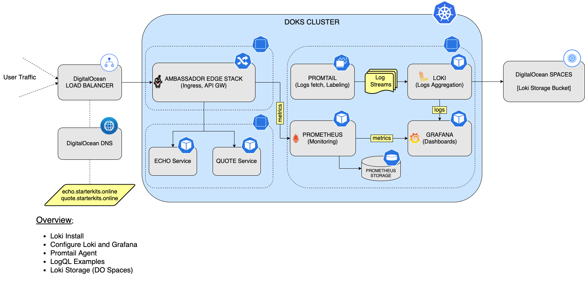
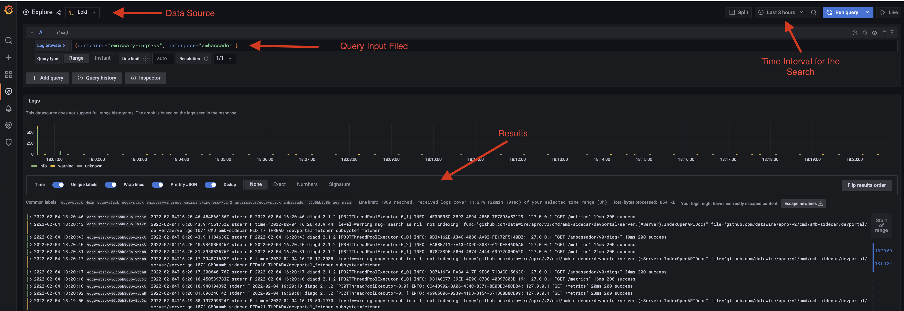
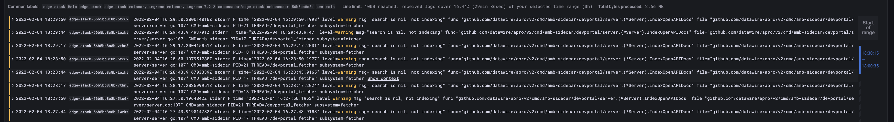
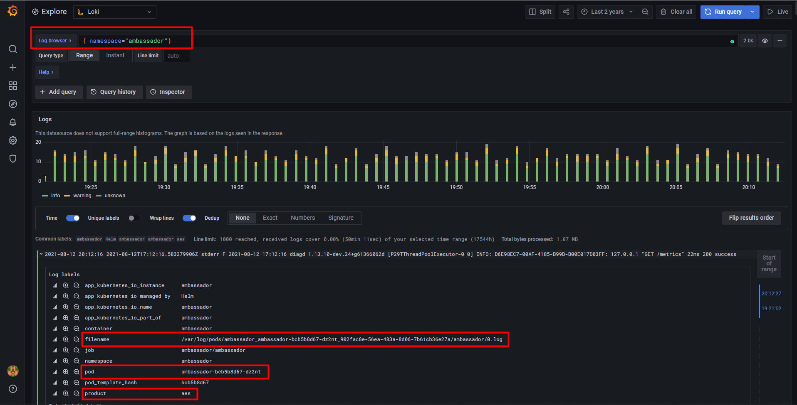
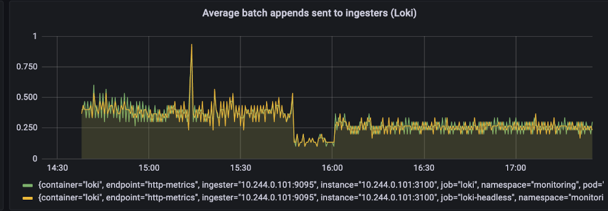

# How to setup Loki Stack for Logs Aggregation

## Introduction

In this tutorial you will learn about [Loki](https://github.com/grafana/helm-charts/tree/main/charts/loki-stack), which is a log `aggregation` system inspired by `Prometheus`.

`Loki` uses `Promtail` to fetch logs from all `Pods` running in your cluster. Then, logs are `aggregated` and `compressed`, and sent to the configured `storage`. Next, you can connect `Loki` data source to `Grafana` and view the logs.

Main reasons for using Loki:

- `Horizontally scalable`.
- `High availabilty`.
- `Multi-tenant` mode available.
- `Stores` and `indexes` data in a very `efficient` way.
- `Cost` effective.
- `Easy` to operate.
- `LogQL` DSL (offers the same functionality as `PromQL` from `Prometheus`, which is a plus if you're already familiar with it).

In the steps to follow, you will learn to:

- Install and configure `Loki` for your `DOKS` cluster.
- Configure `Grafana` with `Loki` data source to query logs, using `LogQL`.
- Configure `Loki` to use `persistent` storage for logs, via `DO Spaces`.

After finishing all the steps, you will have a production ready `Loki` setup, that will help you troubleshoot any issues you might have with running applications. Just log in to `Grafana`, and make use of `LogQL` syntax to search, filter, and perform all kind of queries on application logs, to fetch useful information.

### Starter Kit Loki Setup Overview



## Table of contents

- [Introduction](#introduction)
- [Prerequisites](#prerequisites)
- [Step 1 - Installing LOKI](#step-1---installing-loki)
- [Step 2 - Configure Grafana with Loki](#step-2---configure-grafana-with-loki)
- [Step 3 - Using LogQL](#step-3---using-logql)
- [Step 4 - Understanding Promtail](#step-4---understanding-promtail)
  - [Logs Discovery and Parsing](#logs-discovery-and-parsing)
  - [Dropping Logs per Namespace](#dropping-logs-per-namespace)
- [Step 5 - Setting Persistent Storage for Loki](#step-5---setting-persistent-storage-for-loki)
- [Step 6 - Setting Loki Storage Retention](#step-6---setting-loki-storage-retention)
- [Conclusion](#conclusion)

## Prerequisites

To complete this tutorial, you will need:

1. A [DO Spaces](https://cloud.digitalocean.com/spaces) bucket for `Loki` storage. Please follow the official `DigitalOcean` tutorial to [create one](https://docs.digitalocean.com/products/spaces/how-to/create/). Make sure that it is set to `restrict file listing` for security reasons.
2. Access keys for [DO Spaces](https://cloud.digitalocean.com/spaces) (S3-compatible object storage). Please follow the official `DigitalOcean` tutorial, to learn how to [manage access keys](https://docs.digitalocean.com/products/spaces/how-to/manage-access/). Keep the `access` and `secret` keys somewhere safe for later use.
3. A [Git](https://git-scm.com/downloads) client, for cloning the `Starter Kit` repository.
4. [Helm](https://www.helm.sh), for installing the `Loki` stack chart.
5. [Kubectl](https://kubernetes.io/docs/tasks/tools), for `Kubernetes` interaction.
6. A text editor with `YAML` lint support, for example: [Visual Studio Code](https://code.visualstudio.com).

## Step 1 - Installing LOKI

In this step, you will learn how to deploy `Loki` to your `DOKS` cluster, using `Helm`.

First, clone the `Starter Kit` repository, and then change directory to your local copy:

```shell
git clone https://github.com/digitalocean/Kubernetes-Starter-Kit-Developers.git

cd Kubernetes-Starter-Kit-Developers
```

Next, add the `Grafana` Helm repository and list the available charts:

```shell
helm repo add grafana https://grafana.github.io/helm-charts

helm repo update grafana

helm search repo grafana
```

The output looks similar to the following:

```text
NAME                                            CHART VERSION   APP VERSION     DESCRIPTION
grafana/grafana                                 6.20.5          8.3.4           The leading tool for querying and visualizing t...
grafana/enterprise-metrics                      1.7.2           v1.6.1         Grafana Enterprise Metrics
grafana/fluent-bit                              2.3.0           v2.1.0          Uses fluent-bit Loki go plugin for gathering lo...
grafana/loki-stack                              2.5.1           v2.1.0          Loki: like Prometheus, but for logs.
...
```

**Notes:**

- The chart of interest is `grafana/loki-stack`, which will install standalone `Loki` on the cluster. Please visit the [loki-stack](https://github.com/grafana/helm-charts/tree/main/charts/loki-stack) page for more details about this chart.
- It's good practice in general, to use a specific version for the `Helm` chart. This way, you can `version` it using `Git`, and target if for a specific `release`. In this tutorial, the Helm chart version `2.5.1` is picked for `loki-stack`, which maps to application version `2.1.0`.

For your convenience, there's a ready to use sample values file provided in the `Starter Kit` Git repository (`loki-stack-values-v2.5.1.yaml`). Please use your favorite text editor (preferably with `YAML` lint support), for inspection. You can use [VS Code](https://code.visualstudio.com), for example:

```shell
code 05-setup-loki-stack/assets/manifests/loki-stack-values-v2.5.1.yaml
```

**Note:**

The above values file, enables `Loki` and `Promtail` for you, so no other input is required. `Prometheus` and `Grafana` installation is disabled, because [Section 4 - Set up Prometheus Stack](../04-setup-prometheus-stack/README.md) took care of it already. `Fluent Bit` is not used, so it is disabled by default as well.

Next, install the stack using `Helm`. The following command installs version `2.5.1` of `grafana/loki-stack` in your cluster, using the `Starter Kit` repository `values` file (also creates the `monitoring` namespace, if it doesn't exist):

```shell
HELM_CHART_VERSION="2.5.1"

helm install loki grafana/loki-stack --version "${HELM_CHART_VERSION}" \
  --namespace=monitoring \
  --create-namespace \
  -f "05-setup-loki-stack/assets/manifests/loki-stack-values-v${HELM_CHART_VERSION}.yaml"
```

Finally, check `Helm` release status:

```shell
helm ls -n monitoring
```

The output looks similar to (`STATUS` column should display 'deployed'):

```text
NAME    NAMESPACE       REVISION        UPDATED                                 STATUS          CHART                   APP VERSION
loki    monitoring      1               2021-09-23 15:02:56.993218 +0300 EEST   deployed        loki-stack-2.5.1        v2.1.0
```

Next, inspect all the `Kubernetes` resources created for `Loki`:

```shell
kubectl get all -n monitoring
```

You should have resources deployed for `Loki` itself (`loki-0`) and Promtail (`loki-promtail`). The output looks similar to:

```text
NAME                      READY   STATUS    RESTARTS   AGE
pod/loki-0                1/1     Running   0          44m
pod/loki-promtail-8dskn   1/1     Running   0          44m
pod/loki-promtail-mgb25   1/1     Running   0          44m
pod/loki-promtail-s7cp6   1/1     Running   0          44m

NAME                    TYPE        CLUSTER-IP       EXTERNAL-IP   PORT(S)    AGE
service/loki            ClusterIP   10.245.195.248   <none>        3100/TCP   44m
service/loki-headless   ClusterIP   None             <none>        3100/TCP   44m

NAME                           DESIRED   CURRENT   READY   UP-TO-DATE   AVAILABLE   NODE SELECTOR   AGE
daemonset.apps/loki-promtail   3         3         3       3            3           <none>          44m

NAME                    READY   AGE
statefulset.apps/loki   1/1     44m
```

In the next step, you will configure `Grafana` to use the `Loki` datasource, and view application logs.

## Step 2 - Configure Grafana with Loki

In this step, you will add the `Loki` data source to `Grafana`. First, you need to expose the `Grafana` web interface on your local machine (default credentials: `admin/prom-operator`):

```shell
kubectl --namespace monitoring port-forward svc/kube-prom-stack-grafana 3000:80
```

**Note:**
You should **NOT** expose `Grafana` to `public` network (eg. create an ingress mapping or `LB` service) with `default` login/password.

Next, open a web browser on [localhost:3000](http://localhost:3000), and follow below steps:

1. Click the `Settings` gear from the left panel.
2. Select `Data sources`.
3. Click the `Add data source` blue button.
4. Select `Loki` from the list and add `Loki` url `http://loki:3100`.
5. Save and test.

If everything goes well, a green label message will appear, saying `Data source connected and labels found.`

Now, you can access logs from the `Explore` tab of `Grafana`. Make sure to select `Loki` as the data source. Use `Help` button for log search cheat sheet.

In the next step, you'll be introduced to `LogQL`, which is the `PromQL` brother, but for logs. Some basic features of `LogQL` will be presented as well.

## Step 3 - Using LogQL

In this step, you will learn how to use `LogQL` for querying application logs, and make use of the available `features` to ease your work.

`Loki` comes with its very own language for querying logs, called `LogQL`. `LogQL` can be considered a `distributed grep` with `labels` for filtering.

A basic `LogQL` query consists of two parts: the `log stream selector` and a `filter` expression. Due to Loki’s design, all `LogQL` queries are required to contain a `log stream selector`.

The `log stream selector` will reduce the number of log streams to a manageable volume. Depending on how many labels you use to filter down the log streams, it will affect the relative performance of the query’s execution. The filter expression is then used to do a distributed grep over the retrieved log streams.

Next, a practical example is presented, for querying the `Ambassador Edge Stack` logs.

First, you need to expose the `Grafana` web console on your local machine (default credentials: `admin/prom-operator`):

```shell
kubectl --namespace monitoring port-forward svc/kube-prom-stack-grafana 3000:80
```

Next, point your web browser to [localhost:3000](http://localhost:3000), and navigate to the `Explore` tab from the left panel. Select `Loki` from the data source menu, and run this query:

  ```json
  {container="emissary-ingress", namespace="ambassador"}
  ```

  The output looks similar to the following:

  

Perform another query, but this time filter the results to include only the `warning` message:

  ```json
  {container="emissary-ingress", namespace="ambassador"} |= "warning"
  ```

  The output looks similar to (notice how the `warning` word is being highlighted in the query results panel):

  

As you can see in the above examples, each query is composed of:

- A `log stream` selector `{container="emissary-ingress", namespace="ambassador"}`, which targets the `ambassador container` from the `ambassador namespace`.
- A `filter` - e.g.: `|= "warning"`, which shows only the lines containing the `warning` word.

More complex queries can be created using `aggregation` operators. For more details on the topic, and other advanced features, please visit the official [LogQL](https://grafana.com/docs/loki/latest/logql) page.

Another feature of `Loki` worth mentioning is [Labels](https://grafana.com/docs/loki/latest/getting-started/labels). `Labels` allows you to organize streams. In other words, `labels` add `metadata` to a log stream, so that the system can distinguish it later. Essentially, they are `key-value` pairs that can be anything you want, as long as they have a meaning for the data being tagged.

`Loki` indexes data based on labels, allowing more efficient storage. Below picture highlights this feature, in the `Log labels` panel:



In the next step, you will discover `Promtail`, which is the agent responsible with logs `fetching`, and `transforming` the data (`labeling`, `adding` new `fields`, `dropping`, etc).

## Step 4 - Understanding Promtail

In this step, you will learn what `Promtail` is, as well as how it works. It is deployed as a `DaemonSet`, and it's an `important` part of your `Loki` stack installation, responsible with fetching all `Pods` logs running in your `Kubernetes` cluster.

What `Promtail` is essentially doing, is to:

- `Discover` targets that `emit` logs.
- `Attach labels` to `log streams`.
- `Push log streams` to the `Loki` instance.

### Logs Discovery and Parsing

Before `Promtail` can ship any data from log files to `Loki`, it needs to find out information about its environment. Specifically, this means discovering applications emitting log lines to files that need to be monitored.

`Promtail` borrows the same service discovery mechanism from `Prometheus`, although it currently only supports `Static` and `Kubernetes` service discovery. This limitation is due to the fact that `Promtail` is deployed as a daemon to every local machine and, as such, does not discover label from other machines. `Kubernetes` service discovery fetches required labels from the `Kubernetes API` server while `Static` usually covers all other use cases.

As with every `monitoring agent`, you need to have a way for it to be up all the time. The `Loki` stack `Helm` deployment already makes this possible via a `DaemonSet`, as seen below:

```shell
kubectl get ds -n monitoring
```

The output looks similar to the following (notice the `loki-promtail` line):

```text
NAME                                       DESIRED   CURRENT   READY   UP-TO-DATE   AVAILABLE   NODE SELECTOR   AGE
kube-prom-stack-prometheus-node-exporter   2         2         2       2            2           <none>          7d4h
loki-promtail                              2         2         2       2            2           <none>          5h6m
```

This is great, but how does Promtail discover `Kubernetes` pods and assigns labels ?

The `scrape_configs` section from the `Promtail` main `configuration` will show you the details. You can use `kubectl` for inspection (notice that the application `configuration` is stored using a `Kubernetes ConfigMap`):

```shell
kubectl get cm loki-promtail -n monitoring -o yaml > loki-promtail-config.yaml
```

Next, please open the `loki-promtail-config.yaml` file using a text editor of your choice (preferably with `YAML` support). For example you can use [VS Code](https://code.visualstudio.com):

```shell
code loki-promtail-config.yaml
```

Then, look for the `scrape_configs` section. The output should be similar to:

```yaml
...
scrape_configs:
  - job_name: kubernetes-pods-name
    pipeline_stages:
      - docker: {}
    kubernetes_sd_configs:
    - role: pod
    relabel_configs:
    - action: replace
      source_labels:
      - __meta_kubernetes_namespace
      target_label: namespace
...
```

`Promtail` knows how to scrape for logs by using `scrape_configs`. Each scrape configuration tells `Promtail` how to `discover logs` and `extract labels`. Next, each scrape configuration contains one or more entries (called `jobs`) which are executed for each discovered target. Then, each `job` may contain a `pipeline` comprised of multiple `stages`. The main purpose of each `stage` is to `transform` your application logs, but it can also `drop` (filter) unwanted logs data, if needed. `Jobs` can contain `relabel_configs` stanzas as well, used to `transform labels`.

Explanations for the above configuration:

- `job_name`: Defines a new `job`, and its associated name.
- `pipeline_stages`: Can be used to `add` or `update` labels, `correct` the timestamp, or `re-write` log lines entirely. It uses `stages` to accomplish the previously mentioned tasks. The configuration snippet presented above, is using a [docker](https://grafana.com/docs/loki/latest/clients/promtail/stages/docker) stage, which can extract data based on the standard `Docker` format. You can refer to the official documentation to read more about [Stages](https://grafana.com/docs/loki/latest/clients/promtail/stages) and [Pipelines](https://grafana.com/docs/loki/latest/clients/promtail/pipelines).
- `kubernetes_sd_config`: Tells `Promtail` how to `discover logs` coming from `Pods` via `Kubernetes service discovery`.
- `relabel_configs`: Defines a `list` of operations to `transform` the `labels` from `discovery` into another form. The configuration snippet presented above, is renaming the `__meta_kubernetes_namespace` source label provided by the Kubernetes service discovery mechanism, to a more human friendly form - `namespace`.

### Dropping Logs per Namespace

In most of the cases you may not want to fetch logs from all namespaces (and pods, implicitly). This is very useful to avoid `high traffic` inside your `Kubernetes` cluster caused by `Promtail`, as well as to `reduce` the amount of `data ingested` by `Loki`. What `Promtail` allows you to do in this case, is to `drop` logs from `unwanted namespaces` and keep the rest. Another advantage of this approach, is that the volume of data that needs to be `indexed` by Loki is `reduced`, meaning `less` storage used and number of `objects`, if using a `DO Spaces bucket` for example.

`Promtail` allows you to filter logs on a namespace basis, via the `drop` stage. You can use `Helm` to configure `Promtail` for `namespace filtering`.

First, open the `05-setup-loki-stack/assets/manifests/loki-stack-values-v2.5.1.yaml` file provided in the `Starter Kit` repository, using a text editor of your choice (preferably with `YAML` lint support). For example you can use [VS Code](https://code.visualstudio.com) (please make sure to `change directory` where the `Starter Kit` repository was cloned first):

```shell
code 05-setup-loki-stack/assets/manifests/loki-stack-values-v2.5.1.yaml
```

Next, please remove the comments surrounding the `pipelineStages` section. In the following example, you will configure `Promtail` to drop all logs coming from all `namespaces` prefixed with `kube-`, meaning: `kube-node-lease`, `kube-public`, `kube-system`. The output looks similar to:

```yaml
promtail:
  enabled: true
  #
  # Enable Promtail service monitoring
  # serviceMonitor:
  #   enabled: true
  #
  # User defined pipeline stages
  pipelineStages:
    - docker: {}
    - drop:
        source: namespace
        expression: "kube-.*"
```

Explanations for the above configuration:

- `pipelineStages`: Tells `Helm` to insert user defined pipeline stages in each job that it creates. By default, the `Loki` stack `Helm` chart is configuring `Promtail` to fetch `all` the logs coming from every `namespace` and `pod` (you can inspect the [ConfigMap](https://github.com/grafana/helm-charts/blob/promtail-2.1.0/charts/promtail/templates/configmap.yaml) template for details).
- `docker`: Tells `Promtail` to use a [Docker](https://grafana.com/docs/loki/latest/clients/promtail/stages/docker) stage. Helps with `Docker` logs `formatting`.
- `drop`: Tells `Promtail` to use a [Drop](https://grafana.com/docs/loki/latest/clients/promtail/stages/drop) stage. Then, you make use of the `source` field, to drop logs based on a `namespace`. Finally, `expression` is the regex selector for the `source` field.

Finally, save the values file and apply changes using `Helm` upgrade:

```shell
HELM_CHART_VERSION="2.5.1"

helm upgrade loki grafana/loki-stack --version "${HELM_CHART_VERSION}" \
  --namespace=monitoring \
  -f "05-setup-loki-stack/assets/manifests/loki-stack-values-v${HELM_CHART_VERSION}.yaml"
```

If the upgrade succeeded and no errors were reported, you can check via `LogQL` if logs are still pushed to `Loki` from the `kube-system` namespace after a while. Please wait a minute or so, and then run below queries. Make sure to `adjust` the `time window` in `Grafana` as well to match the last minute(s) interval (you will want to fetch the most recent data only).

Next (if not already), please create a port forward for the `Grafana` web console on your local machine (default credentials: `admin/prom-operator`):

```shell
kubectl --namespace monitoring port-forward svc/kube-prom-stack-grafana 3000:80
```

Then, point your web browser to [localhost:3000](http://localhost:3000), and navigate to the `Explore` tab from the left panel. Select `Loki` from the data source menu, and run below queries:

```json
{namespace="kube-system"}
```

```json
{namespace="kube-public"}
```

```json
{namespace="kube-node-leases"}
```

The output window **should not return any data** for any of the above queries.

**Hints:**

- You can have as many drop stages as you want by using different regex expressions, or combine them together under a single stage if desired, via the regex `OR` operator (`|`).
- You can also leverage the power of `ServiceMonitors` and enable Promtail `metrics` collection, as learned in [Step 2 - Configure Prometheus and Grafana](../04-setup-prometheus-stack/README.md#step-2---configure-prometheus-and-grafana) from the `Prometheus` tutorial:
  - First, make sure to enable both the [Loki ServiceMonitor](../04-setup-prometheus-stack/assets/manifests/prom-stack-values-v30.0.1.yaml#L63) and [Promtail ServiceMonitor](../04-setup-prometheus-stack/assets/manifests/prom-stack-values-v30.0.1.yaml#L75) from `Prometheus Stack`, followed by a `Helm upgrade`.
  - Next, enable [Promtail Service](assets/manifests/loki-stack-values-v2.5.1.yaml#L33) from `Loki Stack`, followed by a `Helm upgrade`.
  - Then, you can install the [Loki&Promtail](https://grafana.com/grafana/dashboards/10880) Grafana dashboard provided by the community, and inspect the `volume` of data `ingested` by `Loki`. After a while, you can get a visual feedback of what it means to filter unnecessary application logs, as seen in the picture below (`before` fitlering - on the `left` side, and `after` - on the `right` side):

    

For more features and in depth explanations, please visit the [Promtail](https://grafana.com/docs/loki/latest/clients/promtail) official documentation page.

In the next step, you will learn how to set up `persistent` storage for `Loki`, using `DO Spaces`. By default, `Helm` deploys `Loki` with `ephemeral` storage, meaning all your indexed `log data` will be `lost` if it restarts, or if the `DOKS` cluster is recreated.

## Step 5 - Setting Persistent Storage for Loki

In this step, you will learn how to enable `persistent` storage for `Loki`. You're going to use the `DO Spaces` bucket created in the [Prerequisites](#prerequisites) section of the tutorial.

By default, `Helm` deploys `Loki` with `ephemeral` storage, via the [emptyDir](https://kubernetes.io/docs/concepts/storage/volumes/#emptydir) volume. To `preserve` indexed log data across Pod restarts, `Loki` can be set up to use `DO Spaces` instead.

Why use `DO Spaces`? Because it `scales` very well and it's `cheaper` than `PVs`, which rely on `Block Storage`. On the other hand, you don't have to worry anymore about running out of `disk space`, as it happens when relying on the `PV` implementation. More than that, you don't have to worry about `PV` sizing and doing the extra math.
In terms of performance, `S3` is not that good compared to `Block Storage`, but it doesn't matter very much in this case because `Loki` does a good job in general.

Next, you're going to tell `Helm` how to configure Loki persistent storage, via `DO Spaces`, as well as setting the correct `schema`.

First, change directory where the `Starter Kit` repository was cloned:

```shell
cd Kubernetes-Starter-Kit-Developers
```

Next, open the `loki-stack-values-v2.5.1.yaml` file provided in the `Starter Kit` repository, using a text editor of your choice (preferably with `YAML` lint support). You can use [VS Code](https://code.visualstudio.com), for example:

```shell
code 05-setup-loki-stack/assets/manifests/loki-stack-values-v2.5.1.yaml
```

Then, please remove the comments surrounding the `schema_config` and `storage_config` keys. The final `Loki` storage setup configuration looks similar to (please replace the `<>` placeholders accordingly):

```yaml
loki:
  enabled: true
  config:
    schema_config:
      configs:
        - from: "2020-10-24"
          store: boltdb-shipper
          object_store: aws
          schema: v11
          index:
            prefix: index_
            period: 24h
    storage_config:
      boltdb_shipper:
        active_index_directory: /data/loki/boltdb-shipper-active
        cache_location: /data/loki/boltdb-shipper-cache
        cache_ttl: 24h
        shared_store: aws
      aws:
        bucketnames: <YOUR_DO_SPACES_BUCKET_NAME_HERE>
        endpoint: <YOUR_DO_SPACES_BUCKET_ENDPOINT_HERE>  # in the following format: <region>.digitaloceanspaces.com
        region: <YOUR_DO_SPACES_BUCKET_REGION_HERE>      # short region name (e.g.: fra1)
        access_key_id: <YOUR_DO_SPACES_ACCESS_KEY_HERE>
        secret_access_key: <YOURDO_SPACES_SECRET_KEY_HERE>
        s3forcepathstyle: true
```

Explanation for the above configuration:

- `schema_config` - defines a storage `type` and a schema `version` to facilitate migrations (schemas can `differ` between `Loki` installations, so `consistency` is they key here). In this case, `BoltDB Shipper` is specified as the storage implementation and a `v11` schema version. The `24h` period for the index is the default and preferred value, so please don't change it. Please visit [Schema Configs](https://grafana.com/docs/loki/latest/storage/#schema-configs) for more details.
- `storage_config` - tells `Loki` about `storage configuration` details, like setting `BoltDB Shipper` parameters. It also informs `Loki` about the `aws` compatible `S3` storage parameters (`bucket` name, `credentials`, `region`, etc).

Apply settings, using `Helm`:

  ```shell
  HELM_CHART_VERSION="2.5.1"

  helm upgrade loki grafana/loki-stack --version "${HELM_CHART_VERSION}" \
    --namespace=monitoring \
    -f "05-setup-loki-stack/assets/manifests/loki-stack-values-v${HELM_CHART_VERSION}.yaml"
  ```

Now, check if the main `Loki` application pod is up and running (it may take up to `1 minute` or so to start, so please be patient):

  ```shell
  kubectl get pods -n monitoring -l app=loki
  ```

The output looks similar to:

  ```text
  NAME     READY   STATUS    RESTARTS   AGE
  loki-0   1/1     Running   0          13m
  ```

**Hints:**

- The main application `Pod` is called `loki-0`. You can check the configuration file, using the following command (please note that it contains `sensitive` information):

  ```shell
  kubectl exec -it loki-0 -n monitoring -- /bin/cat /etc/loki/loki.yaml
  ```

- You can also check the logs while waiting. It's also good practice in general to check the application logs, and see if something goes bad or not.

  ```shell
  kubectl logs -n monitoring -l app=loki
  ```

If everything goes well, you should see the `DO Spaces` bucket containing the `index` and `chunks` folders (the `chunks` folder is called `fake`, which is a strange name - this is by design, when not running in `multi-tenant` mode).


For more advanced options, and fine tuning the `storage` for `Loki`, please visit the [Loki Storage](https://grafana.com/docs/loki/latest/operations/storage/) official documentation page.

Next, you will learn how to set storage retention policies for `Loki`.

## Step 6 - Setting Loki Storage Retention

In this step, you will learn how to set `DO Spaces` retention policies. Because you configured `DO Spaces` as the default storage backend for `Loki`, the same rules apply, as for every `S3` compatible storage type.

`Retention` is a very important aspect when configuring storage backends in general, because `storage is finite`. While `S3` storage is not expensive, and is somewhat `infinte` (it makes you think like that), it is good practice to have a retention policy set.

Although `S3` is very scalable, and you don't have to worry about `disk space` issues, it's `OK` to have a `retention policy` in place. This way, really old data can be deleted if not needed.

`S3` compatible storage has its own set of policies and rules for retention. In the `S3` terminology, it is called `object lifecycle`. You can learn more about the DO Spaces [bucket lifecycle](https://docs.digitalocean.com/reference/api/spaces-api/#configure-a-buckets-lifecycle-rules) options, on the official documentation page.

**Hint:**

`S3CMD` is a really good utility to have in order to inspect how many objects are present, as well as the size of the `DO Spaces` bucket used for `Loki` retention. `S3CMD` also helps you to see if the retention policies set so far are working or not. Please follow the `DigitalOcean` guide for installing and setting up [s3cmd](https://docs.digitalocean.com/products/spaces/resources/s3cmd).

Setting the lifecycle for `Loki` storage bucket is achieved via the `s3cmd` utility.

Next, you're going to use the `loki_do_spaces_lifecycle.xml` configuration file provided in the `Starter Kit` Git repository, to configure retention for `Loki` bucket. The policy file contents look similar to:

```xml
<LifecycleConfiguration xmlns="http://s3.amazonaws.com/doc/2006-03-01/">
  <Rule>
    <ID>Expire old fake data</ID>
    <Prefix>fake/</Prefix>
    <Status>Enabled</Status>
    <Expiration>
      <Days>10</Days>
    </Expiration>
  </Rule>

  <Rule>
    <ID>Expire old index data</ID>
    <Prefix>index/</Prefix>
    <Status>Enabled</Status>
    <Expiration>
      <Days>10</Days>
    </Expiration>
  </Rule>
</LifecycleConfiguration>
```

The above `lifecycle` configuration, will automatically `delete` after `10 days`, all the objects from the `fake/` and `index/` paths in the `Loki` storage bucket. A `10 days` lifespan is chosen in this example, because it's usually enough for development purposes. For `production` or other critical systems, a period of `30 days` and even more is recommended.

How to configure the `Loki` bucket lifecycle, using `s3cmd`:

1. First, change directory where the `Starter Kit` repository was cloned.

    ```shell
    cd Kubernetes-Starter-Kit-Developers
    ```

2. Next, open and inspect the `05-setup-loki-stack/assets/manifests/loki_do_spaces_lifecycle.xml` file from the `Starter Kit` repository, using a text editor of your choice (preferably with `XML` lint support), and adjust according to your needs.
3. Then, set the `lifecycle` policy (please replace the `<>` placeholders accordingly):

    ```shell
    s3cmd setlifecycle 05-setup-loki-stack/assets/manifests/loki_do_spaces_lifecycle.xml s3://<LOKI_STORAGE_BUCKET_NAME>
    ```

4. Finally, check that the `policy` was set (please replace the `<>` placeholders accordingly):

    ```shell
    s3cmd getlifecycle s3://<LOKI_STORAGE_BUCKET_NAME>
    ```

After finishing the above steps, you can `inspect` the bucket `size`, and `number` of objects via the `du` subcommand of `s3cmd` (the name is borrowed from the `Linux Disk Usage` utility). Please replace the `<>` placeholders accordingly:

```shell
s3cmd du -H s3://<LOKI_DO_SPACES_BUCKET_NAME>
```

The output looks similar to the following (notice that it prints the bucket size - `19M`, and number of objects present - `2799`):

```text
19M    2799 objects s3://loki-storage-test/
```

Next, the `DO Spaces` backend implementation will clean the objects for you `automatically`, based on the expiration date. You can always go back and edit the policy if needed later on, by uploading a new one.

## Conclusion

In this tutorial, you learned how to install `Loki` for logs monitoring in your `DOKS` cluster. Then, you configured `Grafana` to use `Loki` as a data source. You also learned about `LogQL` for querying logs, and how to setup `persistent storage` and retention for `Loki`.

For more details about `Loki` and other available features, please visit the [Loki](https://grafana.com/docs/loki/latest) official documentation page.

In the next section, you will learn how to perform backup and restore of your cluster and applications, using `Velero`.

Go to [Section 6 - Set up Backup and Restore](../06-setup-backup-restore/README.md).
