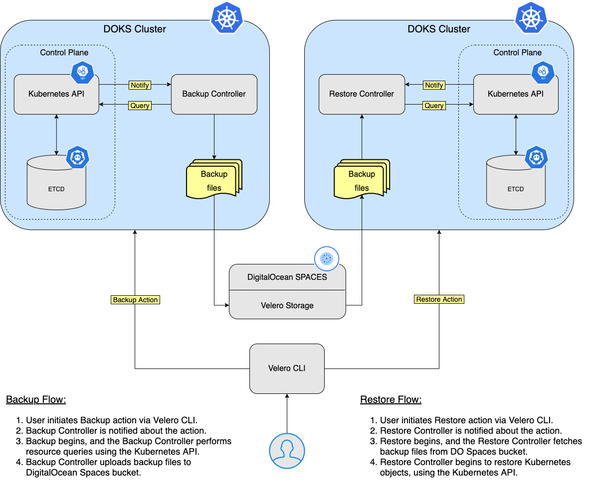
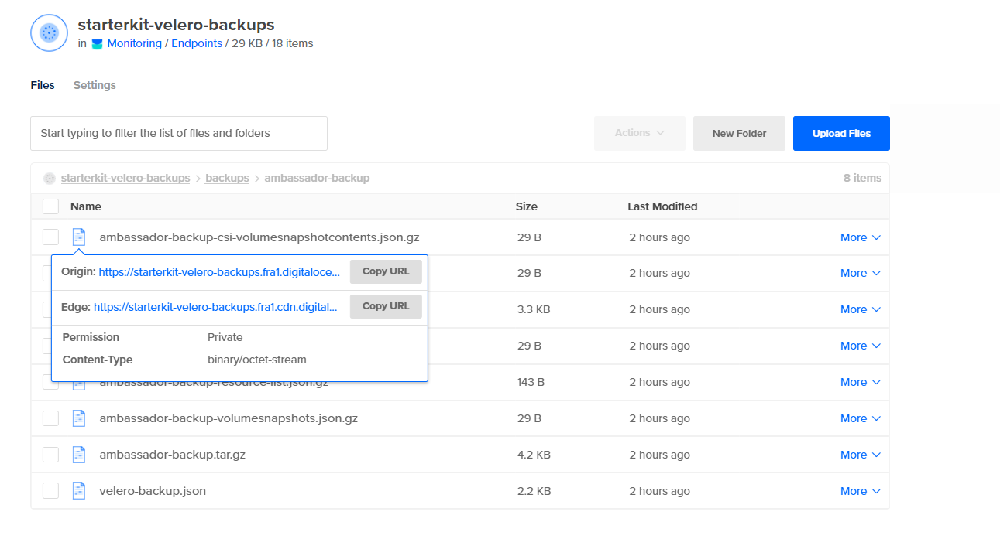

# How to Perform Backup and Restore Using Velero

## Introduction

In this tutorial, you will learn how to `deploy Velero` to your `Kubernetes` cluster, create `backups`, and `recover` from a backup if something goes wrong.

You can back up your `entire` cluster, or optionally choose a `namespace` or `label` selector to back up.

`Backups` can be run `one off` or `scheduled`. It’s a good idea to have `scheduled` backups so you are certain you have a `recent` backup to easily fall back to. You can also create [backup hooks](https://velero.io/docs/v1.6/backup-hooks/), if you want to execute actions `before` or `after` a backup is made.

Why choose `Velero` ?

`Velero` gives you tools to `back up` and `restore` your `Kubernetes cluster resources` and `persistent volumes`. You can run `Velero` with a `cloud provider` or `on-premises`.

Advantages of using `Velero`:

- Take `backups` of your cluster and `restore` in case of loss.
- `Migrate` cluster resources to other clusters.
- `Replicate` your `production` cluster to `development` and `testing` clusters.

After finishing this tutorial, you will be able to:

- `Backup` and `restore` your `applications`, or your entire `DOKS` cluster.
- Create `scheduled` backups for your applications.
- Configure `DO Spaces` storage for `Velero` to use.

## Table of contents

- [Introduction](#introduction)
- [Prerequisites](#prerequisites)
- [Step 1 - How Velero Works](#step-1---how-velero-works)
- [Step 2 - Installing Velero](#step-2---installing-velero)
- [Step 3 - Namespace Backup and Restore Example](#step-3---namespace-backup-and-restore-example)
  - [Creating the Ambassador Namespace Backup](#creating-the-ambassador-namespace-backup)
  - [Deleting the Ambassador Namespace and Resources](#deleting-the-ambassador-namespace-and-resources)
  - [Restoring the Ambassador Namespace Backup](#restoring-the-ambassador-namespace-backup)
  - [Checking the Ambassador Namespace Restore Status](#checking-the-ambassador-namespace-restore-status)
- [Step 4 - Backup and Restore Whole Cluster Example](#step-4---backup-and-restore-whole-cluster-example)
  - [Creating the DOKS Cluster Backup](#creating-the-doks-cluster-backup)
  - [Deleting the DOKS Cluster](#deleting-the-doks-cluster)
  - [Checking DOKS Cluster State](#checking-doks-cluster-state)
- [Step 5 - Scheduled Backup and Restore](#step-5---scheduled-backup-and-restore)
  - [Verifying the Scheduled Backup state](#verifying-the-scheduled-backup-state)
  - [Restoring the Scheduled Backup](#restoring-the-scheduled-backup)
- [Step 6 - Deleting Backups](#step-6---deleting-backups)
  - [Manually Deleting a Backup](#manually-deleting-a-backup)
  - [Automatic Backup Deletion via TTL](#automatic-backup-deletion-via-ttl)
- [Conclusion](#conclusion)

## Prerequisites

To complete this tutorial, you need the following:

1. A DO spaces [bucket](https://docs.digitalocean.com/products/spaces/how-to/create/) bucket and `access` keys. Save the `access` and `secret` keys in a safe place for later use.
2. A DigitalOcean [API token](https://docs.digitalocean.com/reference/api/create-personal-access-token/) for `Velero` to use.
3. A [Git](https://git-scm.com/downloads) client, to clone the `Starter Kit` repository.
4. [Helm](https://www.helms.sh), for managing `Velero` releases and upgrades.
5. [Doctl](https://github.com/digitalocean/doctl/releases), for `DigitalOcean` API interaction.
6. [Kubectl](https://kubernetes.io/docs/tasks/tools), for `Kubernetes` interaction.
7. [Velero](https://velero.io/docs/v1.6/basic-install/#install-the-cli) client, to manage `Velero` backups.

## Step 1 - How Velero Works

`Velero` consists of two parts:

- A `server` that runs on your cluster
- A `command-line` client that runs locally

Each `Velero` operation – `on-demand backup`, `scheduled backup`, `restore` – is a `custom resource`, defined with a `Kubernetes Custom Resource Definition` (CRD) and stored in `etcd`. `Velero` also includes `controllers` that process the custom resources to perform backups, restores, and all related operations.

### Backup and Restore workflow

Whenever you execute a `backup command`, the `Velero CLI` makes a call to the `Kubernetes API` server to create a `Backup` object. The `Backup Controller` then validates the backup object i.e. whether it is `cluster` backup, `namespace` backup, etc. and then it makes a call to the `API` server to query the data to be backed up. Finally it starts the backup process once it collects the data to be backed up. `Backup Controller` then makes a call to `DigitalOcean Spaces` to store the backup file. The backup file is stored as a `tarball` file (`.tar.gz`).

Similarly whenever you execute a `restore command`, the `Velero CLI` makes a call to `Kubernetes API` server to restore from a backup object. Based on the restore command executed, Velero `Restore Controller` makes a call to `DigitalOcean Spaces` and initiates restore from the particular backup object.

Below is a diagram that shows the `Backup/Restore` workflow:



`Velero` is `ideal` for the `disaster` recovery use case, as well as for snapshotting your application state, prior to performing system operations on your cluster, like upgrades. For more details on this topic, please visit the [How Velero Works](https://velero.io/docs/v1.6/how-velero-works/) official page.

In the next step, you will learn how to install `Velero`, using `Helm`.

## Step 2 - Installing Velero

In this step, you will deploy `Velero` and all the required components, so that it will be able to perform backups for your `Kubernetes` cluster resources (`PV's` as well). The backup data will be stored in the DO `Spaces` bucket created earlier in the [Prerequisites](#prerequisites) section.

Steps to follow:

1. First, clone the `Starter Kit` Git repository and change directory to your local copy:

    ```shell
    git clone https://github.com/digitalocean/Kubernetes-Starter-Kit-Developers.git

    cd Kubernetes-Starter-Kit-Developers
    ```

2. Next, add the `Helm` repository and list the available charts:

    ```shell
    helm repo add vmware-tanzu https://vmware-tanzu.github.io/helm-charts

    helm search repo vmware-tanzu
    ```

    The output looks similar to the following:

    ```text
    NAME                    CHART VERSION   APP VERSION     DESCRIPTION            
    vmware-tanzu/velero     2.23.6          1.6.3           A Helm chart for velero
    ```

    **Note:**

    The chart of interest is `vmware-tanzu/velero`, which will install `Velero` on the cluster. Please visit the [velero-chart](https://github.com/vmware-tanzu/helm-charts/tree/main/charts/velero) page for more details about this chart.
3. Then, open and inspect the `06-setup-velero/assets/manifests/velero-values.yaml` file provided in the `Starter kit` repository, using an editor of your choice (preferably with `YAML` lint support). You can use [VS Code](https://code.visualstudio.com), for example:

    ```shell
    code 06-setup-velero/assets/manifests/velero-values.yaml
    ```

4. Next, please replace the `<>` placeholders accordingly for your DO Spaces `Velero` bucket (like: name, region and secrets). Make sure that you provide your DigitalOcean `API` token as well (`DIGITALOCEAN_TOKEN` key).
5. Finally, install `Velero` using `Helm`:

    ```shell
    HELM_CHART_VERSION="2.23.6"

    helm install velero vmware-tanzu/velero --version "${HELM_CHART_VERSION}" \
      --namespace velero \
      --create-namespace \
      -f 06-setup-velero/assets/manifests/velero-values-v${HELM_CHART_VERSION}.yaml
    ```

    **Note:**

    A `specific` version for the `Helm` chart is used. In this case `2.23.6` is picked, which maps to the `1.6.3` version of the application (see the output from `Step 2.`). It’s good practice in general, to lock on a specific version. This helps to have predictable results, and allows versioning control via `Git`.

Now, please check your `Velero` deployment:

 ```shell
 helm ls -n velero
 ```

The output looks similar to the following (`STATUS` column should display `deployed`):

 ```text
 NAME    NAMESPACE       REVISION        UPDATED                                 STATUS          CHART           APP VERSION
 velero  velero          1               2021-08-25 13:16:24.383446 +0300 EEST   deployed        velero-2.23.6   1.6.3 
 ```

Next, verify that `Velero` is up and running:

```shell
kubectl get deployment velero -n velero
```

The output looks similar to the following (all pods must be in `Ready` state):

```text
NAME     READY   UP-TO-DATE   AVAILABLE   AGE
velero   1/1     1            1           67s
```

**Notes:**

- If you’re interested in looking further, you can view Velero’s server-side components:

```shell
kubectl -n velero get all
```

- Explore `Velero` CLI help pages, to see what `comands` and `sub-commands` are available. You can get help for each, by using the `--help` flag:

    List all the available commands for `Velero`:

    ```shell
    velero --help
    ```

    List `backup` command options for `Velero`:

    ```shell
    velero backup --help
    ```

`Velero` uses a number of `CRD`'s (Custom Resource Definitions) to represent its own resources like `backups`, `backup schedules`, etc. You'll discover each in the next steps of the tutorial, along with some basic examples.

## Step 3 - Namespace Backup and Restore Example

In this step, you will learn how to `backup` an entire `namespace` of your `DOKS` cluster, and `restore` it afterwards making sure that all the resources are re-created. The namespace in question is `ambassador`.

Next, you will perform the following tasks:

- `Creating` the `ambassador` namespace `backup`, using `Velero` CLI.
- `Deleting` the `ambassador` namespace.
- `Restoring` the `ambassador` namespace, using `Velero` CLI.
- `Checking` the `ambassador` namespace `restore` status, using `Velero` CLI.

### Creating the Ambassador Namespace Backup

First, initiate the backup:

```shell
velero backup create ambassador-backup --include-namespaces ambassador
```

Next, check that the backup was created:

```shell
velero backup get
```

The output looks similar to:

```text
NAME                                       STATUS      ERRORS   WARNINGS   CREATED                          EXPIRES   STORAGE LOCATION   SELECTOR
ambassador-backup                          Completed   0        0          2021-08-25 19:33:03 +0300 EEST   29d       default            <none>
```

Then, after a few moments, you can inspect it:

```shell
velero backup describe ambassador-backup --details
```

The output looks similar to:

```text
Name:         ambassador-backup
Namespace:    velero
Labels:       velero.io/storage-location=default
Annotations:  velero.io/source-cluster-k8s-gitversion=v1.21.2
              velero.io/source-cluster-k8s-major-version=1
              velero.io/source-cluster-k8s-minor-version=21

Phase:  Completed

Errors:    0
Warnings:  0

Namespaces:
  Included:  ambassador
  Excluded:  <none>
  ...
```

**Hints:**

- Look for the `Phase` line. It should say `Completed`.
- Check that no `Errors` are reported as well.
- A new Kubernetes `Backup` object is created:

  ```text
  ~ kubectl get backup/ambassador-backup -n velero -o yaml

  apiVersion: velero.io/v1
  kind: Backup
  metadata:
  annotations:
    velero.io/source-cluster-k8s-gitversion: v1.21.2
    velero.io/source-cluster-k8s-major-version: "1"
    velero.io/source-cluster-k8s-minor-version: "21"
  ...
  ```

Finally, take a look at the `DO Spaces` bucket - there's a new folder named `backups`, which contains the assets created for your `ambassador-backup`:



### Deleting the Ambassador Namespace and Resources

First, simulate a disaster, by intentionally deleting the `ambassador` namespace:

```shell
kubectl delete namespace ambassador
```

Next, check that the namespace was deleted (namespaces listing should not print `ambassador`):

```shell
kubectl get namespaces
```

Finally, verify that the `echo` and `quote` backend services `endpoint` is `DOWN` (please refer to [Creating the Ambassador Edge Stack Backend Services](../03-setup-ingress-ambassador/README.md#step-5---creating-the-ambassador-edge-stack-backend-services), regarding the `backend applications` used in the `Starter Kit` tutorial). You can use `curl` to test (or you can use your web browser):

```shell
curl -Li http://quote.starterkits.online/quote/

curl -Li http://quote.starterkits.online/echo/
```

### Restoring the Ambassador Namespace Backup

First, restore the `ambassador-backup`:

```shell
velero restore create --from-backup ambassador-backup
```

**Important note:**

When you delete the `ambassador` namespace, the load balancer resource associated with the ambassador service will be deleted as well. So, when you restore the `ambassador` service, the `LB` will be recreated by `DigitalOcean`. The issue is that you will get a `NEW IP` address for your `LB`, so you will need to `adjust` the `A records` for getting `traffic` into your domains hosted on the cluster.

### Checking the Ambassador Namespace Restore Status

First, check the `Phase` line from the `ambassador-backup` restore command output. It should say `Completed` (also, please take a note of the `Warnings` section - it tells if something went bad or not):

```shell
velero restore describe ambassador-backup
```

Next, verify that all the resources were restored for the `ambassador` namespace (look for the `ambassador` pods, `services` and `deployments`):

```shell
kubectl get all --namespace ambassador
```

The output looks similar to:

```text
NAME                                    READY   STATUS    RESTARTS   AGE
pod/ambassador-5bdc64f9f6-9qnz6         1/1     Running   0          18h
pod/ambassador-5bdc64f9f6-twgxb         1/1     Running   0          18h
pod/ambassador-agent-bcdd8ccc8-8pcwg    1/1     Running   0          18h
pod/ambassador-redis-64b7c668b9-jzxb5   1/1     Running   0          18h

NAME                       TYPE           CLUSTER-IP       EXTERNAL-IP      PORT(S)                      AGE
service/ambassador         LoadBalancer   10.245.74.214    159.89.215.200   80:32091/TCP,443:31423/TCP   18h
service/ambassador-admin   ClusterIP      10.245.204.189   <none>           8877/TCP,8005/TCP            18h
service/ambassador-redis   ClusterIP      10.245.180.25    <none>           6379/TCP                     18h

NAME                               READY   UP-TO-DATE   AVAILABLE   AGE
deployment.apps/ambassador         2/2     2            2           18h
deployment.apps/ambassador-agent   1/1     1            1           18h
deployment.apps/ambassador-redis   1/1     1            1           18h

NAME                                          DESIRED   CURRENT   READY   AGE
replicaset.apps/ambassador-5bdc64f9f6         2         2         2       18h
replicaset.apps/ambassador-agent-bcdd8ccc8    1         1         1       18h
replicaset.apps/ambassador-redis-64b7c668b9   1         1         1       18h
```

Finally, after reconfiguring your `LoadBalancer` and DigitalOcean `domain` settings, please verify that the `echo` and `quote` backend services `endpoint` is `UP` (please refer to [Creating the Ambassador Edge Stack Backend Services](../03-setup-ingress-ambassador/README.md#step-5---creating-the-ambassador-edge-stack-backend-services), regarding the `backend applications` used in the `Starter Kit` tutorial). For example, you can use `curl` to test each endpoint:

```shell
curl -Li http://quote.starterkits.online/quote/

curl -Li http://quote.starterkits.online/echo/
```

In the next step, you will simulate a disaster by intentionally deleting your `DOKS` cluster (the `Starter Kit` DOKS cluster).

## Step 4 - Backup and Restore Whole Cluster Example

In this step, you will simulate a `disaster recovery` scenario. The whole `DOKS` cluster will be deleted, and then restored from a previous backup.

Next, you will perform the following tasks:

- `Creating` the `DOKS` cluster `backup`, using `Velero` CLI.
- `Deleting` the `DOKS` cluster, using `doctl`.
- `Restoring` the `DOKS` cluster, using `Velero` CLI.
- `Checking` the `DOKS` cluster state.

### Creating the DOKS Cluster Backup

First, create a backup for the whole `DOKS` cluster:

```shell
velero backup create all-cluster-backup
```

Next, check that the backup was created and it's not reporting any errors. The following command lists all the available backups:

```shell
velero backup get
```

The output looks similar to:

```text
NAME                                       STATUS      ERRORS   WARNINGS   CREATED                          EXPIRES   STORAGE LOCATION   SELECTOR
all-cluster-backup                         Completed   0        0          2021-08-25 19:43:03 +0300 EEST   29d       default            <none>
```

Finally, inspect the backup state and logs (check that no errors are reported):

```shell
velero backup describe all-cluster-backup

velero backup logs all-cluster-backup
```

### Deleting the DOKS Cluster

First, delete the whole `DOKS` cluster (make sure to replace the `<>` placeholders accordingly):

```shell
doctl kubernetes cluster delete <DOKS_CLUSTER_NAME>
```

Next, re-create the cluster, as described in [Section 1 - Set up DigitalOcean Kubernetes](../01-setup-DOKS/README.md). Please make sure the new `DOKS` cluster node count is `equal or greater` with to the original one - this is important!

Then, install Velero `CLI` and `Server`, as described in the [Prerequisites](#prerequisites) section, and [Step 2 - Installing Velero](step-2---installing-velero) respectively. Please make sure to use the `same Helm Chart version` - this is important!

Finally, `restore` everything, by using the below command:

```shell
velero restore create --from-backup all-cluster-backup
```

### Checking DOKS Cluster State

First, check the `Phase` line from the `all-cluster-backup` restore describe command output. It should say `Completed` (also, please take a note of the `Warnings` section - it tells if something went bad or not):

```shell
velero restore describe all-cluster-backup
```

Next, an important aspect to keep in mind is that whenever you destroy a `DOKS` cluster, the associated `Load Balancer` is destroyed as well. It means that each time the `DOKS` cluster is re-created, the `Load Balancer` is re-created as well with a different `IP` address. You have to make sure that `DNS` records will be `updated` as well, to reflect the change.

Now, verify all cluster `Kubernetes` resources (you should have everything in place):

```shell
kubectl get all --all-namespaces
```

Finally, the `backend applications` should respond to `HTTP` requests as well (please refer to [Creating the Ambassador Edge Stack Backend Services](../03-setup-ingress-ambassador/README.md#step-5---creating-the-ambassador-edge-stack-backend-services), regarding the `backend applications` used in the `Starter Kit` tutorial):

```shell
curl -Li http://quote.starterkits.online/quote/

curl -Li http://quote.starterkits.online/echo/
```

In the next step, you will learn how to perform scheduled backup and restore for your `DOKS` cluster applications.

## Step 5 - Scheduled Backup and Restore

Taking backups automatically based on a schedule, is a really useful feature to have. It allows you to `rewind back time`, and restore the system to a previous working state if something goes wrong.

Creating a scheduled backup is a very straightforward process. An example is provided below for a `1 minute` interval (the `kube-system` namespace was picked).

First, create the schedule:

```shell
velero schedule create kube-system-minute-backup --schedule="@every 1m" --include-namespaces kube-system
```

**Hint:**

Linux cronjob format is supported also:

```text
schedule="*/1 * * * *"
```

Next, verify that the schedule was created:

```shell
velero schedule get
```

The output looks similar to:

```text
NAME                        STATUS    CREATED                          SCHEDULE    BACKUP TTL   LAST BACKUP   SELECTOR
kube-system-minute-backup   Enabled   2021-08-26 12:37:44 +0300 EEST   @every 1m   720h0m0s     32s ago       <none>
```

Then, inspect all the backups, after one minute or so:

```shell
velero backup get
```

The output looks similar to:

```text
NAME                                       STATUS      ERRORS   WARNINGS   CREATED                          EXPIRES   STORAGE LOCATION   SELECTOR
kube-system-minute-backup-20210826093916   Completed   0        0          2021-08-26 12:39:20 +0300 EEST   29d       default            <none>
kube-system-minute-backup-20210826093744   Completed   0        0          2021-08-26 12:37:44 +0300 EEST   29d       default            <none>
```

### Verifying the Scheduled Backup state

First, check the `Phase` line from one of the backups (please replace the `<>` placeholders accordingly) - it should say `Completed`:

```shell
velero backup describe kube-system-minute-backup-<timestamp>
```

Finally, take a note of possible `Erros` and `Warnings` from the above command output as well - it tells if something went bad or not.

### Restoring the Scheduled Backup

To restore one of the `minute` backups, please follow the same steps as you learned in the previous steps of this tutorial. This is a good way to exercise and test your experience accumulated so far.

In the next step, you will learn how to manually or automatically delete specific backups you created over time.

## Step 6 - Deleting Backups

When you decide that some older backups are not needed anymore, you can free up some resources both on the `Kubernetes` cluster, as well as on the Velero `DO Spaces` bucket.

In this step, you will learn how to use one of the following methods to delete `Velero` backups:

1. `Manually` (or by hand), using `Velero` CLI.
2. `Automatically`, by setting backups `TTL` (Time To Live), via `Velero` CLI.

### Manually Deleting a Backup

First, pick a one minute backup for example, and issue the following command (please replace the `<>` placeholders accordingly):

```shell
velero backup delete kube-system-minute-backup-<timestamp>
```

Now, check that it's gone from the `velero backup get` command output. It should be deleted from the `DO Spaces` bucket as well.

Next, you will learn how to delete `multiple` backups at once, by using a `selector`. The `velero backup delete` subcommand provides a flag called `--selector`. It allows you to delete `multiple` backups at once based on `Kubernetes Labels`. The same rules apply as for [Kubernetes Label Selectors](https://kubernetes.io/docs/concepts/overview/working-with-objects/labels/#label-selectors).

First, list the available backups:

```shell
velero backup get
```

The output looks similar to:

```text
NAME                                       STATUS      ERRORS   WARNINGS   CREATED                          EXPIRES   STORAGE LOCATION   SELECTOR
ambassador-backup                          Completed   0        0          2021-08-25 19:33:03 +0300 EEST   23d       default            <none>
backend-minute-backup-20210826094116       Completed   0        0          2021-08-26 12:41:16 +0300 EEST   24d       default            <none>
backend-minute-backup-20210826094016       Completed   0        0          2021-08-26 12:40:16 +0300 EEST   24d       default            <none>
backend-minute-backup-20210826093916       Completed   0        0          2021-08-26 12:39:16 +0300 EEST   24d       default            <none>
backend-minute-backup-20210826093816       Completed   0        0          2021-08-26 12:38:16 +0300 EEST   24d       default            <none>
backend-minute-backup-20210826093716       Completed   0        0          2021-08-26 12:37:16 +0300 EEST   24d       default            <none>
backend-minute-backup-20210826093616       Completed   0        0          2021-08-26 12:36:16 +0300 EEST   24d       default            <none>
backend-minute-backup-20210826093509       Completed   0        0          2021-08-26 12:35:09 +0300 EEST   24d       default            <none>
```

Next, say that you want to delete all the `backend-minute-backup-*` assets. Pick a backup from the list, and inspect the `Labels`:

```shell
velero describe backup backend-minute-backup-20210826094116
```

The output looks similar to (notice the `velero.io/schedule-name` label value):

```text
Name:         backend-minute-backup-20210826094116
Namespace:    velero
Labels:       velero.io/schedule-name=backend-minute-backup
              velero.io/storage-location=default
Annotations:  velero.io/source-cluster-k8s-gitversion=v1.21.2
              velero.io/source-cluster-k8s-major-version=1
              velero.io/source-cluster-k8s-minor-version=21

Phase:  Completed

Errors:    0
Warnings:  0

Namespaces:
Included:  backend
Excluded:  <none>
...
```

Next, you can delete `all` the backups that `match` the `backend-minute-backup` value of the `velero.io/schedule-name` label:

```shell
velero backup delete --selector velero.io/schedule-name=backend-minute-backup
```

Finally, check that all the `backend-minute-backup-*` assets disappeared from the `velero backup get` command output, as well as from the `DO Spaces` bucket.

### Automatic Backup Deletion via TTL

When you create a backup, you can specify a `TTL` (Time To Live), by using the `--ttl` flag. If `Velero` sees that an existing backup resource is expired, it removes:

- The `Backup` resource
- The backup `file` from cloud object `storage`
- All `PersistentVolume` snapshots
- All associated `Restores`

The `TTL` flag allows the user to specify the backup retention period with the value specified in hours, minutes and seconds in the form `--ttl 24h0m0s`. If not specified, a default `TTL` value of `30 days` will be applied.

Next, you will create a short lived backup for the `ambassador` namespace, with a `TTL` value set to `3 minutes`.

First, create the `ambassador` backup, using a `TTL` value of `3 minutes`:

```shell
velero backup create ambassador-backup-3min-ttl --ttl 0h3m0s --include-namespaces ambassador
```

Next, inspect the `ambassador` backup:

```shell
velero backup describe ambassador-backup-3min-ttl
```

The output looks similar to (notice the `Namespaces -> Included` section - it should display `ambassador`, and `TTL` field is set to `3ms0`):

```text
Name:         ambassador-backup-3min-ttl
Namespace:    velero
Labels:       velero.io/storage-location=default
Annotations:  velero.io/source-cluster-k8s-gitversion=v1.21.2
              velero.io/source-cluster-k8s-major-version=1
              velero.io/source-cluster-k8s-minor-version=21

Phase:  Completed

Errors:    0
Warnings:  0

Namespaces:
Included:  ambassador
Excluded:  <none>

Resources:
Included:        *
Excluded:        <none>
Cluster-scoped:  auto

Label selector:  <none>

Storage Location:  default

Velero-Native Snapshot PVs:  auto

TTL:  3m0s
...
```

A new folder should be created in the `DO Spaces` Velero bucket as well, named `ambassador-backup-3min-ttl`.

Finally, after three minutes or so, the backup and associated resources should be automatically deleted. You can verify that the backup object was destroyed, using: `velero backup describe ambassador-backup-3min-ttl`. It should fail with an error, stating that the backup doesn't exist anymore. The corresponding `ambassador-backup-3min-ttl` folder from the `DO Spaces` Velero bucket, should be gone as well.

Going further, you can explore all the available `velero backup delete` options, via:

```shell
velero backup delete --help
```

## Conclusion

In this tutorial, you learned how to perform `one time`, as well as `scheduled` backups, and to restore everything back. Having `scheduled` backups in place, is very important as it allows you to revert to a previous snapshot in time, if something goes wrong along the way. You walked through a disaster recovery scenario, as well.

You can learn more about `Velero`, by following below topics:

- [Backup Command Reference](https://velero.io/docs/v1.6/backup-reference)
- [Restore Command Reference](https://velero.io/docs/v1.6/restore-reference/)
- [Backup Hooks](https://velero.io/docs/v1.6/backup-hooks/)
- [Cluster Migration](https://velero.io/docs/v1.6/migration-case/)
- [Velero Troubleshooting](https://velero.io/docs/v1.6/troubleshooting)

Next, you will learn how to set up `Alerts` and `Notifications` using `AlertManager`, to give you real time notifications (e.g. `Slack`), if something bad happens in your `DOKS` cluster.

Go to [Section 7 - Alerts and Notifications](../07-alerting-and-notification/README.md).
