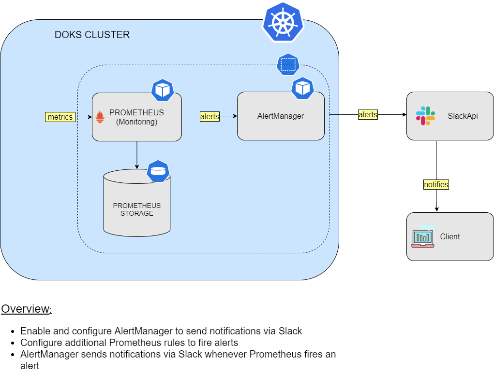

## Alerting and Notification

### Table of contents

- [Alerting and Notification Overview](#Alerting-and-Notification-Overview)
- [List of Included Alerts](#List-of-Included-Alerts)
- [Creating a new Alert](#Creating-a-new-Alert)
- [Notification By Slack](#Notification-By-Slack)

### Overview

Alerts and Notifications are a critical part of your day 2 workflow. When things go wrong (eg. any service is down, or a pod is crashing etc.), you expect to see the appropriate alerts, and notifications to handle these situations. The Starter Kit includes a set of default alerts as part of the `kube-prom-stack` installation.

Alertmanager is part of the `kube-prom-stack` and it allows you to receive alerts from various clients (sources), like `Prometheus` for example. Rules are created on the `Prometheus` side, which in turn can fire alerts. Then, it’s the responsibility of `AlertManager` to intercept those alerts, group them (aggregation), apply other transformations and finally route to the configured receivers. Notification messages can be further formatted to include additional details if desired. You can use Slack, Gmail, etc to send real time notifications.

In this section, you will learn how to inspect the existing alerts, create new ones, and then configure `AlertManager` to send notifications via `Slack`.

### List of Included Alerts

Kube-prom-stack has over a hundred rules already activated.
To access the prometheus console, first do a port-forward to your local machine.

```shell
kubectl --namespace monitoring port-forward svc/kube-prom-stack-kube-prome-prometheus 9091:9090

```

The following is a sample set of alerts from that list.

- *TargetDown:* One or more targets are unreachable or down.
- *Watchdog :* An alert that should always be firing to certify that `Alertmanager` is working properly.
- *KubePodCrashLooping:* when Pod is crash-looping, Pod is restarting some times / 10 minutes. Also `AlertManager` creates an alert.
- *KubePodNotReady:* An alert that Pod has been in a non-ready state for longer than 15 minutes.
- *KubeDeploymentReplicasMismatch:* when a deployment has not matched the expected number of replicas, AlertManager is creating this alert.
- *KubeStatefulSetReplicasMismatch:* when StatefulSet has not matched the expected number of replicas for longer than 15 minutes, AlertManager creates an alert.
- *KubeJobCompletion:* when a job is taking more than 12 hours to complete, Job did not complete in time
- *KubeJobFailed:* when a job failed to complete. Removing a failed job after investigation should clear this alert.
- *CPUThrottlingHigh:* when you reach CPU Limits, CPUthrottling is firing this rule to urge you.
- *KubeControllerManagerDown:* kube-controller-manager is a kind of job that helps kube-controller-manager run or not when it has disappeared from Prometheus target discovery. this rule will detect this unwanted situation.
- *KubeSchedulerDown:* kube-scheduler is an important part of kubernetes. This job is searching for a kube-scheduler that is running when it is absent. This rule helps us to understand it’s health.

### Creating New Alert

To create a new alert, we can add the alert definition under ‘additionalPrometheusRules’ section in values.yaml file, and re-apply using helm.
Here is a sample example of an alert that will trigger if Ambassador namespace does not have an expected number of instances.

```shell
additionalPrometheusRules: 
 - name: my-rule-file
   groups:
   - name: AllInstances
     rules:
     - alert: InstanceDown
       expr: sum(kube_pod_owner{namespace="ambassador"}) by (namespace) < 5
       for: 1m
       labels:
         severity: 'critical'
 annotations:
         title: 'Instance {{ $labels.instance }} down'
         description: 'ambassador pod(s) is down for more than 1 minute.'
```

 To learn more about Alert Runbooks included in kube-prom-stack, [you can visit this documentation and learn message and severity information.](https://github.com/kubernetes-monitoring/kubernetes-mixin/blob/master/runbook.md#alert-name-cputhrottlinghigh)

### Notification By Slack

Often we need to be notified immediately about any critical issue in our cluster. That is where `AlertManager` comes into the picture. `Alertmanager` helps in aggregating the `alerts`, and sending notifications as shown in the diagram below.



### Prerequisites

You must have a slack channel (slack api url, channel name) with webhook enabled. To do this, refer to [Sending messages using Incoming Webhooks](https://api.slack.com/messaging/webhooks). Note that you need required privilege to be able to make changes to your slack configuration.

### Configuring alertmanager to send notification to Slack

In your prom-stack-values.yaml file, modify the `config` part to include `slack_api_url`, `routes`, and `slack_config`.

```shell
alertmanager:  
  config:
    global:
      resolve_timeout: 5m
      slack_api_url: "https://hooks.slack.com/services/TXXXX/BXXXX/<token>"
    route:
      group_by: ['job']
      group_wait: 30s
      group_interval: 5m
      repeat_interval: 1h
      routes:
      - match:
          alertname: InstanceDown
        receiver: 'slack'
        continue: true
    Receivers:
    - name: 'null'
    - name: 'slack'
      slack_configs:
      - channel: '#promalerts'
        send_resolved: false
        title: '[{{ .Status | toUpper }}{{ if eq .Status "firing" }}:{{ .Alerts.Firing | len }}{{ end }}] Monitoring Event Notification'
        text: "this is a test from blueprint team from Digital Ocean"
```

- *slack_api_url:* When you decide to send a notification by using slack you have to create a channel that gives you a token inside of the url. We prefer here `Incoming WebHooks` for hooking. it is the easiest way to send a notification. Please visit to create a channel and get your own token from Slack. Slack messaging
- *routes:* in this part, you will have some `receivers` and tell `routes` for the `matching receiver` here.
- *slack_configs:* this segment includes more than 4 parts but here, `channel`, `title`, `text` are important parts for telling `Slack router` which channel and which title-text message will have. This part is totally related to how to use `notifications` in `prom-stack-values.yaml`. [Please visit the Prometheus-Notifications page for more details about this chart](https://prometheus.io/docs/alerting/latest/notification_examples/).

Now re-apply the new `prom-stack-values.yaml` using helm upgrade.Apply below upgrading command:

```shell
helm upgrade kube-prom-stack prometheus-community/kube-prometheus-stack --version 17.1.3 --namespace monitoring --create-namespace -f prom-stack-values.yaml

```

At this point, you should see the slack `notifications` for firing alerts.

Go to [Section 14 - Starter Kit Resource Usage](../14-starter-kit-resource-usage/README.md).
