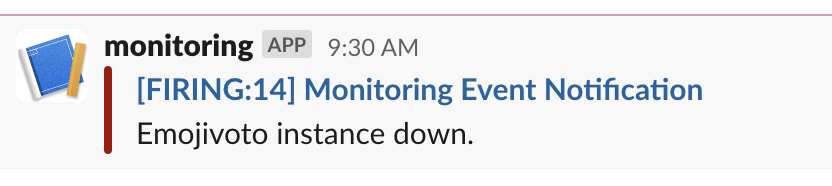

# Alerting and Notification

## Table of contents

- [Prerequisites](#prerequisites)
- [Alerting and Notification Overview](#alerting-and-notification-overview)
- [List of Included Alerts](#list-of-included-alerts)
- [Creating a New Alert](#creating-a-new-alert)
- [Configuring Alertmanager to Send Notification to Slack](#configuring-alertmanager-to-send-notification-to-slack)

## Prerequisites

To complete this tutorial, you will need:

1. The prometheus monitoring stack added to the cluster from [Chapter 4 - 04-setup-prometheus-stack](../04-setup-prometheus-stack/README.md).
2. [Emojivoto Sample App](https://github.com/digitalocean/kubernetes-sample-apps/tree/master/emojivoto-example) deployed in the cluster. Please follow the steps in its repository README. You will be creating alerts for this application.
3. Administrative rights over a `Slack` workspace. Later on you will be creating an application with an incoming `webhook` which will be used to send notifications from `Alertmanager`.

## Alerting and Notification Overview

Often times you need to be notified immediately about any critical issue in our cluster. That is where `Alertmanager` comes into the picture. `Alertmanager` helps in aggregating the `alerts`, and sending `notifications` as shown in the diagram below.


Alertmanager, usually deployed alongside Prometheus, forms the alerting layer of the `kube-prom-stack`, handling alerts generated by Prometheus and deduplicating, grouping, and routing them to integrations like email, Slack or PagerDury.
Alerts and Notifications are a critical part of your workflow. When things go wrong (e.g. any service is down, or a pod is crashing etc.), you expect to see the appropriate alerts, and notifications to handle these situations. The Starter Kit includes a set of default alerts as part of the `kube-prom-stack` installation.

Alertmanager is part of the `kube-prom-stack` installed in your cluster in [Chapter 4 - 04-setup-prometheus-stack](../04-setup-prometheus-stack/README.md). For this tutorial you will be using the same manifest file used in `Chapter 4`. `AlertManager` allows you to receive alerts from various clients (sources), like `Prometheus` for example. Rules are created on the `Prometheus` side, which in turn can fire alerts. Then, it’s the responsibility of `AlertManager` to intercept those alerts, group them (aggregation), apply other transformations and finally route to the configured receivers. Notification messages can be further formatted to include additional details if desired. You can use Slack, Gmail, etc to send real time notifications.

In this section, you will learn how to inspect the existing alerts, create new ones, and then configure `AlertManager` to send notifications via `Slack`.

## List of Included Alerts

Kube-prom-stack has over a hundred rules already activated.
To access the prometheus console, first do a port-forward to your local machine.

```shell
kubectl --namespace monitoring port-forward svc/kube-prom-stack-kube-prome-prometheus 9091:9090
```

Open a web browser on [localhost:9091](http://localhost:9091) and access the `Alerts` menu item. The following is a sample set of alerts from that list.

- *TargetDown:* One or more targets are unreachable or down.
- *Watchdog :* An alert that should always be firing to certify that `Alertmanager` is working properly.
- *KubePodCrashLooping:* when Pod is crash-looping, Pod is restarting some times / 10 minutes. Also `AlertManager` creates an alert.
- *KubePodNotReady:* An alert that Pod has been in a non-ready state for longer than 15 minutes.
- *KubeDeploymentReplicasMismatch:* when a deployment has not matched the expected number of replicas, AlertManager is creating this alert.
- *KubeStatefulSetReplicasMismatch:* when StatefulSet has not matched the expected number of replicas for longer than 15 minutes, AlertManager creates an alert.
- *KubeJobCompletion:* when a job is taking more than 12 hours to complete, Job did not complete in time
- *KubeJobFailed:* when a job failed to complete. Removing a failed job after investigation should clear this alert.
- *CPUThrottlingHigh:* when you reach CPU Limits, CPUthrottling is firing this rule to urge you.
- *KubeControllerManagerDown:* kube-controller-manager is a kind of job that helps kube-controller-manager run or not when it has disappeared from Prometheus target discovery. this rule will detect this unwanted situation.
- *KubeSchedulerDown:* kube-scheduler is an important part of kubernetes. This job is searching for a kube-scheduler that is running when it is absent. This rule helps us to understand it’s health.

## Creating a New Alert

To create a new alert, you need to add the alert definition under `additionalPrometheusRules` section in the manifest file.
You will be creating a sample alert that will trigger if the `Emojitovo` namespace does not have an expected number of instances. The expected number of pods for the `Emojivoto` application is 4.
First, open the `04-setup-prometheus-stack/assets/manifests/prom-stack-values.yaml` file provided in the `Starter Kit` repository, using a text editor of your choice (preferably with `YAML` lint support). Uncomment the `additionalPrometheusRules` block.

```yaml
additionalPrometheusRulesMap:
  rule-name:
   groups:
   - name: emojivoto-instance-down
     rules:
      - alert: EmojivotoInstanceDown
        expr: sum(kube_pod_owner{namespace="emojivoto"}) by (namespace) < 4
        for: 1m
        labels:
          severity: 'critical'
  annotations:
          title: 'Instance {{ $labels.instance }} down'
          description: 'Emojivoto pod(s) is down for more than 1 minute.'
```

Finally, apply settings using `Helm`:

  ```shell
  HELM_CHART_VERSION="35.5.1"

  helm upgrade kube-prom-stack prometheus-community/kube-prometheus-stack --version "${HELM_CHART_VERSION}" \
    --namespace monitoring \
    -f "04-setup-prometheus-stack/assets/manifests/prom-stack-values-v${HELM_CHART_VERSION}.yaml"
  ```

## Configuring Alertmanager to Send Notification to Slack

To complete this section you need to have administrative rights over a workspace. This will enable you to create the incoming webhook you will need in the next steps. You will also need to create a channel where you would like to receive notifications from `AlertManager`. This is not required but it is a good practice to have separate channels for alerts and notifications.

Steps to follow:

1. Open a web browser and navigate to `https://api.slack.com/apps` and click on the `Create New App` button.
2. From the `Create an app` modal click on the `From scratch` option, add the `app name` and the `workspace` you want to add the app to.
3. From the `Basic Information` page click on the `Incoming Webhooks` option, turn it on and click on the `Add New Webhook to Workspace` button at the bottom.
4. On the next page, from the `Search for a channel...` drop-down select the channel you want to send monitoring related notifications to and click on the `Allow` button.
5. Take note of the `Webhook URL` value displayed on the page. You will be using it in the next section.

Next, you will add the necessary config to `AlertManager` to enable `Slack` notifications. Open the `04-setup-prometheus-stack/assets/manifests/prom-stack-values.yaml` file provided in the `Starter Kit` repository, using a text editor of your choice (preferably with `YAML` lint support). Uncomment the `config` block. Make sure to update the `slack_api_url` and `channel` values.

```yaml
alertmanager:
  enabled: true
  config:
    global:
      resolve_timeout: 5m
      slack_api_url: "<YOUR_SLACK_APP_INCOMING_WEBHOOK_URL_HERE>"
    route:
      receiver: "slack-notifications"
      repeat_interval: 12h
      routes:
        - match:
            alertname: EmojivotoInstanceDown
          receiver: "slack-notifications"
          continue: true
    receivers:
      - name: "slack-notifications"
        slack_configs:
          - channel: "#channel-name"
            send_resolved: false
            title: '[{{ .Status | toUpper }}{{ if eq .Status "firing" }}:{{ .Alerts.Firing | len }}{{ end }}] Monitoring Event Notification'
            text: "Emojivoto instance down."
```

Explanations for the above configuration:

- `slack_api_url` - url of the `webhook` created in step 4.
- `routes.match.alertname` - name of the `AlertManager` alert.
- `slack_configs` - configuration related to the channel to send the notification to, the title and the message it should include.

Finally, upgrade the `kube-prometheus-stack`, using `Helm`:

  ```shell
  HELM_CHART_VERSION="35.5.1"

  helm upgrade kube-prom-stack prometheus-community/kube-prometheus-stack --version "${HELM_CHART_VERSION}" \
    --namespace monitoring \
    -f "04-setup-prometheus-stack/assets/manifests/prom-stack-values-v${HELM_CHART_VERSION}.yaml"
  ```

At this point, you should see the slack `notifications` for firing alerts when the expected number of pods for `Emojivoto` is less than 4.
Next, you will be testing the firing of the `Alert` and the sending of the `Slack` notification by downscaling the number of replicas for a `deployment` in the `emojivoto` namespace.

Steps to follow:

1. From your terminal run the following command to bring the number of replicas for the `emoji` deployment to 0:

    ```shell
    kubectl scale --replicas=0 deployment/emoji -n emojivoto
    ```

2. Open a web browser on [localhost:9091](http://localhost:9091) and access the `Alerts` menu item. Search for the `EmojivotoInstanceDown` alert created earlier. The status of the alert should be `Firing` after about one minute of scaling down the deployment.
3. A message notification will be sent to `Slack` to the channel you configured earlier if everything went well. The notification should look like:



**Note:**
Clicking on the notification name in `Slack` will open a web browser to an unreachable web page with the internal Kubernetes DNS of the `Alertmanager` pod. This is expected. For more information you can check out this [article](https://kubernetes.io/docs/concepts/services-networking/dns-pod-service/).

Go to [Section 08 - Encrypt Kubernetes Secrets Using Sealed Secrets](../08-kubernetes-sealed-secrets/README.md).
