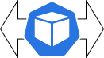

# How to Automatically Scale Application Workloads

## Overview

When starting with `Kubernetes`, you definitely learned about the basic unit it can handle - a `Pod`. A Pod by itself doesn't offer any interesting features, rather than the most basic task of running your application inside containers (e.g. `Docker`). If we want to take it further, it also offers a shared network space for your applications to communicate over (via `localhost`). Then, shared storage space is provided as well, via volumes. Think of a Pod as a single instance of a virtual machine that has everything required by your application to work properly.

Going back to practice and real world scenarios, you surely discovered that just a single Pod is not quite useful by itself. It does provide some abstractions to help you run your applications but still, there's a missing piece to make your applications more resilient to system failures.

`Kubernetes` is back to rescue and provides a rich set of objects (or resources) to work with, rather than just a basic `Pod`. It offers you more advanced features and possibilities, like: `ReplicaSets`, `Deployments`, `StatefulSets`. All these offer extra features over the basic Pod object, but the most important one is running multiple instances (Pods) of your application (thus offering high availability).

This is nice and gives you confidence that your application is up and running no matter what. But soon you will discover that the aforementioned features that Kubernetes has to offer are somehow rigid in their nature. Take for example the most used one which is the `Deployment` resource. You deploy your application, and start by setting a replica value in the Deployment spec of 2, or even 4. How do you computed those values? Why choose 2 ? Why 4 and not 6 or even 8 just to make sure?

See, there's a level of uncertainty and the aforementioned values are picked based on some observations related to how your application responds to load over time. So, by just studying and choosing some empirical values, soon you will be overwhelmed and maybe not so happy to just iterate over and over again, and manually adjusting the number of replicas each time your application starts to misbehave. But it's not only that. What if the load decreases ? In this case, precious resources (CPU, RAM) are being wasted because the application doesn't need the same amount anymore (not to forget about costs).

`Kubernetes` has once again a solution for the previous limitation. Meet the `HorizontalPodAutoscaler`, or `HPA` for short. Rather than specifying a fixed `replica value` for your `Deployment`, you rely on a dedicated controller (the one sitting behind HPAs) to do the job for you, and scale your deployments automatically up or down, based on the load. In other words, applications are scaled on demand.

In the next chapters, you will be guided on how to use the HPA feature of Kubernetes, as well as VPA (`VerticalPodAutoscaler`). The first one recommended to start with is the `HorizontalPodAutoscaler`:

| HorizontalPodAutoscaler | VerticalPodAutoscaler |
|:-----------------------------------------------------:|:-----------------------------------------------------:|
|  |  |
