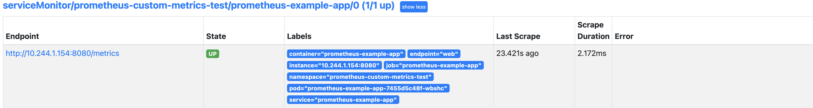
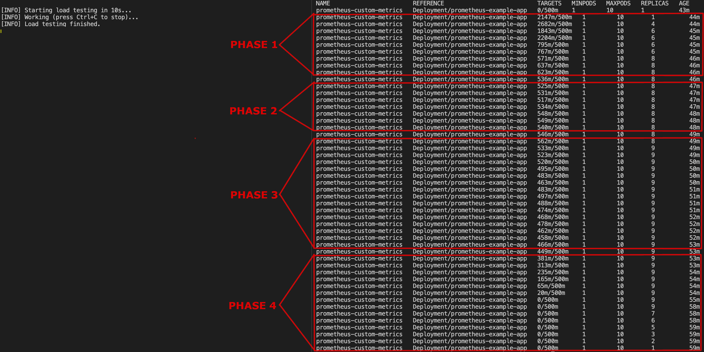

# Scaling Applications using the HorizontalPodAutoscaler

## Introduction

In a real world scenario you want to have resiliency for your applications. On the other hand, you want to be more efficient on resources and cut down costs as well. You need something that can scale your application on demand.

Most of the time you created Kubernetes `Deployments` for your applications using a fixed `ReplicaSet` number. But, in production environments which are variably put under load by external requests, it is not always that simple. It is inefficient to change the replica set value every time your web application is under load and starts to misbehave. Main reason(s) can be: your application receives more requests each afternoon (a specific period of the day), or when holidays are coming and many users visit your shopping site. Then, when the crowded period is over, you must go back and scale down your web deployments to avoid waste of resources, and reduce infrastructure costs.

This is where [Horizontal Pod Autoscaling](https://kubernetes.io/docs/tasks/run-application/horizontal-pod-autoscale) kicks in, and provides a solution for more efficient resource usage, as well as reducing costs. It is a closed loop system that automatically grows or shrinks resources (application Pods), based on current needs. You create a `HorizontalPodAutoscaler` (or `HPA`) resource for each application deployment that needs autoscaling, and let it take care of the rest for you automatically.

Horizontal pod scaling deals with adjusting replicas for application Pods, whereas vertical pod scaling deals with resource requests and limits for containers within Pods.

### How Horizontal Pod Autoscaling Works

At a high level, `HPA` does the following:

1. Keeps an eye on resource requests metrics coming from your application workloads (Pods), by querying the metrics server.
2. Compares the target threshold value that you set in the HPA definition with the average resource utilization observed for your application workloads (CPU and memory).
3. If the target threshold is reached, then HPA will scale up your application deployment to meet higher demands. Otherwise, if below the threshold, it will scale down the deployment. To see what logic HPA uses to scale your application deployment, please visit the [algorithm details](https://kubernetes.io/docs/tasks/run-application/horizontal-pod-autoscale/#algorithm-details) page from the official documentation.

Under the hood, a `HorizontalPodAutoscaler` is just another CRD (`Custom Resource Definition`) which drives a Kubernetes control loop implemented via a dedicated controller within the `Control Plane` of your cluster. Basically, you create a `HorizontalPodAutoscaler` YAML manifest targeting your application `Deployment`, and then use `kubectl` to apply the HPA resource in your cluster. **Please bear in mind that you cannot target objects that cannot be scaled, such as a `DaemonSet` for example.**

In order to do its magic, HPA needs a metrics server available in your cluster to scrape required metrics, such as CPU and memory utilization. One popular option is the [Kubernetes Metrics Server](https://github.com/kubernetes-sigs/metrics-server). **Please bear in mind that the `Kubernetes Metrics Server` was created to provide CPU and memory utilization metrics only.**

Metrics server acts as an extension for the `Kubernetes API` server, thus offering more features. In a nutshell, the `Kubernetes Metrics Server` works by collecting `resource metrics` from `Kubelets` and exposing them via the `Kubernetes API Server` to be consumed by `Horizontal Pod Autoscaler`. Metrics API can also be accessed by `kubectl top`, making it easier to debug autoscaling pipelines.

Please make sure to read and understand metrics server main purpose, by visiting the [use cases](https://github.com/kubernetes-sigs/metrics-server#use-cases) section from the main documentation (this is important).

For custom metrics (anything else than CPU or memory), you can use [Prometheus](https://prometheus.io) via a special adapter, named [prometheus-adapter](https://github.com/kubernetes-sigs/prometheus-adapter). It means, you can scale applications using other metrics (such as the number of HTTP requests), rather than CPU and/or memory utilization.

This tutorial will show you how to:

- Deploy `Kubernetes Metrics Server` to your `DOKS` cluster.
- Understand main concepts, and how to create `HPAs` for your applications.
- Test each HPA setup, using two scenarios: constant and variable application load.
- Configure and use the `Prometheus Adapter` to scale applications using custom metrics.

For more in depth explanations, please visit the official documentation page for the [Horizontal Pod Autoscaler](https://kubernetes.io/docs/tasks/run-application/horizontal-pod-autoscale).

### Metrics Server and HPA Overview Diagram

Below diagram shows a high level overview of how HPA works in conjunction with metrics-server:


## Table of Contents

- [Introduction](#introduction)
  - [How Horizontal Pod Autoscaling Works](#how-horizontal-pod-autoscaling-works)
  - [Metrics Server and HPA Overview Diagram](#metrics-server-and-hpa-overview-diagram)
- [Prerequisites](#prerequisites)
- [Step 1 - Installing Kubernetes Metrics Server](#step-1---installing-kubernetes-metrics-server)
- [Step 2 - Getting to Know HPAs](#step-2---getting-to-know-hpas)
- [Step 3 - Scaling Applications Automatically via Metrics Server](#step-3---scaling-applications-automatically-via-metrics-server)
  - [Scenario 1 - Constant Load Test](#scenario-1---constant-load-test)
  - [Scenario 2 - External Load Test](#scenario-2---external-load-test)
- [Step 4 - Scaling Applications Automatically via Prometheus Adapter](#step-4---scaling-applications-automatically-via-prometheus-adapter)
  - [Installing Prometheus Adapter](#installing-prometheus-adapter)
  - [Creating a Sample Application to Test Prometheus Adapter](#creating-a-sample-application-to-test-prometheus-adapter)
  - [Creating a ServiceMonitor for the Application under Test](#creating-a-servicemonitor-for-the-application-under-test)
  - [Defining Discovery Rules for Prometheus Adapter](#defining-discovery-rules-for-prometheus-adapter)
  - [Creating and Testing HPAs using Custom Metrics](#creating-and-testing-hpas-using-custom-metrics)
- [Conclusion](#conclusion)

## Prerequisites

To complete this tutorial, you will need:

1. A [Git](https://git-scm.com/downloads) client, to clone the `Starter Kit` repository.
2. [Helm](https://www.helm.sh), for managing `Kubernetes Metrics Server` releases and upgrades.
3. [Kubectl](https://kubernetes.io/docs/tasks/tools), for `Kubernetes` interaction. Kubectl must be configured and ready to use. Please, follow these [instructions](https://www.digitalocean.com/docs/kubernetes/how-to/connect-to-cluster/) to connect to your cluster with `kubectl`.

In the next step, you will learn how to deploy the `Kubernetes Metrics Server`, using the `Helm` package manager.

## Step 1 - Installing Kubernetes Metrics Server

Kubernetes metrics server can be installed in two ways:

1. Via a single `kubectl` command, in high availability mode: `kubectl apply -f https://github.com/kubernetes-sigs/metrics-server/releases/latest/download/high-availability.yaml`
2. Via `Helm`, by deploying [metrics-server](https://artifacthub.io/packages/helm/metrics-server/metrics-server) chart to your cluster.

This tutorial (and all tutorials from the Starter Kit) is using the `Helm` installation method, because it's more flexible and you can fine tune the release parameters later on, if needed. High availability is a must, and can be set easily via the `replica` field from the `metrics-server` Helm chart.

Please bear in mind that the metrics server deployment requires some special permissions. For more information about all prerequisites, please read the official [requirements](https://github.com/kubernetes-sigs/metrics-server#requirements) page.

Steps to deploy metrics server via Helm:

1. First, clone the `Starter Kit` repository and change directory to your local copy.

    ```shell
    git clone https://github.com/digitalocean/Kubernetes-Starter-Kit-Developers.git

    cd Kubernetes-Starter-Kit-Developers
    ```

2. Next, add the metrics-server `Helm` repo, and list the available `charts`:

    ```shell
    helm repo add metrics-server https://kubernetes-sigs.github.io/metrics-server

    helm repo update metrics-server

    helm search repo metrics-server
    ```

    The output looks similar to the following:

    ```text
    NAME                            CHART VERSION   APP VERSION     DESCRIPTION                                       
    metrics-server/metrics-server   3.8.2           0.6.1           Metrics Server is a scalable, efficient source ...
    ```

    **Note:**

    The chart of interest is `metrics-server/metrics-server`, which will install Kubernetes metrics server on the cluster. Please visit the [metrics-server](https://github.com/kubernetes-sigs/metrics-server/tree/master/charts/metrics-server) chart page, for more details.
3. Then, open and inspect the metrics-server Helm values file provided in the `Starter Kit` repository, using an editor of your choice (preferably with `YAML` lint support). For example, you can use [VS Code](https://code.visualstudio.com):

    ```shell
    code 09-scaling-application-workloads/assets/manifests/metrics-server-values-v3.8.2.yaml
    ```

4. Finally, install the `Kubernetes Metrics Server` using `Helm` (a dedicated `metrics-server` namespace will be created as well):

    ```shell
    HELM_CHART_VERSION="3.8.2"

    helm install metrics-server metrics-server/metrics-server --version "$HELM_CHART_VERSION" \
      --namespace metrics-server \
      --create-namespace \
      -f "09-scaling-application-workloads/assets/manifests/metrics-server-values-v${HELM_CHART_VERSION}.yaml"
    ```

    **Note:**

    A `specific` version for the metrics-server `Helm` chart is used. In this case `3.8.2` was picked, which maps to the `0.6.1` release of the metrics-server application (see the output from `Step 2.`). It’s good practice in general, to lock on a specific version. This helps to have predictable results, and allows versioning control via `Git`.

**Observations and results:**

You can verify `metrics-server` deployment status via:

```shell
helm ls -n metrics-server
```

The output looks similar to (notice that the `STATUS` column value is `deployed`):

```text
NAME            NAMESPACE       REVISION        UPDATED                                 STATUS          CHART                   APP VERSION
metrics-server  metrics-server  1               2022-02-24 14:58:23.785875 +0200 EET    deployed        metrics-server-3.8.2    0.6.1
```

Next, check all Kubernetes resources status from the `metrics-server` namespace:

```shell
kubectl get all -n metrics-server
```

The output looks similar to (notice the `deployment` and `replicaset` resources, which should be `healthy` and counting as `2`):

```text
NAME                                  READY   STATUS    RESTARTS   AGE
pod/metrics-server-694d47d564-9sp5h   1/1     Running   0          8m54s
pod/metrics-server-694d47d564-cc4m2   1/1     Running   0          8m54s

NAME                     TYPE        CLUSTER-IP     EXTERNAL-IP   PORT(S)   AGE
service/metrics-server   ClusterIP   10.245.92.63   <none>        443/TCP   8m54s

NAME                             READY   UP-TO-DATE   AVAILABLE   AGE
deployment.apps/metrics-server   2/2     2            2           8m55s

NAME                                        DESIRED   CURRENT   READY   AGE
replicaset.apps/metrics-server-694d47d564   2         2         2       8m55s
```

Finally, check if the `kubectl top` command works (similar to Linux `top` command - prints current resource usage, such as CPU and memory). Below command displays current resource usage for all `Pods` in the `kube-system` namespace:

```shell
kubectl top pods -n kube-system
```

The output looks similar to (CPU usage is expressed in `millicores`, and memory usage in `Mebibytes`):

```text
NAME                               CPU(cores)   MEMORY(bytes)   
cilium-operator-5db58f5b89-7kptj   2m           35Mi            
cilium-r2n9t                       4m           150Mi           
cilium-xlqkp                       9m           180Mi           
coredns-85d9ccbb46-7xnkg           1m           21Mi            
coredns-85d9ccbb46-gxg6d           1m           20Mi            
csi-do-node-p6lq4                  1m           19Mi            
csi-do-node-rxd6m                  1m           21Mi            
do-node-agent-2z2bc                0m           15Mi            
do-node-agent-ppds8                0m           21Mi            
kube-proxy-l9ddv                   1m           25Mi            
kube-proxy-t6c29                   1m           30Mi            
```

If the output looks like above, then you configured metrics server correctly. In the next step, you will learn how to configure and test your first `HorizontalPodAutoscaling` resource.

## Step 2 - Getting to Know HPAs

So far, each time you created a new Kubernetes deployment for your application, the `ReplicaSet` field was configured to a fixed value. This may suffice for simple cases, or development environments. In this step you will learn how to define a HPA CRD, and then focus on the first practical example.

In a HPA based setup, the `HorizontalPodAutoscaler` takes control over the application deployment replica set field value. Typical `HorizontalPodAutoscaler` CRD looks like below:

```yaml
apiVersion: autoscaling/v2beta2
kind: HorizontalPodAutoscaler
metadata:
  name: my-app-hpa
spec:
  scaleTargetRef:
    apiVersion: apps/v1
    kind: Deployment
    name: my-app-deployment
  minReplicas: 1
  maxReplicas: 3
  metrics:
    - type: Resource
      resource:
        name: cpu
        target:
          type: Utilization
          averageUtilization: 50
```

Explanations for the above configuration:

- `spec.scaleTargetRef`: Reference to scaled resource.
- `spec.minReplicas`: The lower limit for the number of replicas to which the autoscaler can scale down.
- `spec.maxReplicas`: The upper limit for the number of pods that can be set by the autoscaler.
- `spec.metrics.type`: Type of metric to use to calculate the desired replica count. Above example is using `Resource` type, which tells the HPA to scale the deployment based on average `CPU` (or memory) utilization (`averageUtilization` is set to a threshold value of `50`).

Next, you have two options to create a HPA for your application deployment:

1. Use the `kubectl autoscale` command on an existing deployment.
2. Create a HPA YAML manifest, and then use `kubectl` to apply changes to your cluster.

First option is for performing a quick test (or spin), and you don't want to mess with YAML stuff yet. Please go ahead and try the first example, provided in the Starter Kit:

1. First, please clone the Starter Kit repository (if not already), and change directory to your local copy:

    ```shell
    git clone https://github.com/digitalocean/Kubernetes-Starter-Kit-Developers.git

    cd Kubernetes-Starter-Kit-Developers
    ```

2. Then, create the [myapp-test](assets/manifests/hpa/metrics-server/myapp-test.yaml) deployment (main purpose is to create some CPU load, by printing a message indefinitely):

    ```shell
    kubectl apply -f 09-scaling-application-workloads/assets/manifests/hpa/metrics-server/myapp-test.yaml
    ```

3. Finally, create a `HorizontalPodAutoscaler` targeting the `myapp-test` deployment:

    ```shell
    kubectl autoscale deployment myapp-test --cpu-percent=50 --min=1 --max=3
    ```

Above action translates to: please create a HPA resource for me, that automatically scales my `myapp-test` deployment to a maximum of 3 replicas (and no less than 1 replica), whenever average CPU utilization hits 50%. You can check if the HPA resource was created by running:

```shell
kubectl get hpa
```

The output looks similar to (the `TARGETS` column shows a value of `50%` which is the average CPU utilization that the HPA needs to maintain, whereas `240%` is the current usage):

```text
NAME         REFERENCE                  TARGETS    MINPODS   MAXPODS   REPLICAS   AGE
myapp-test   Deployment/myapp-test      240%/50%   1         3         3          52s
```

**Note:**

The `TARGETS` column value will display `<unknown>/50%` for a while (around 15 seconds). This is normal, and it has to do with HPA fetching the specific metric, and computing the average value over time. By default, HPA checks metrics every 15 seconds.

You can also observe the events a HPA generates under the hood, via:

```shell
kubectl describe hpa myapp-test
```

The output looks similar to (notice in the `Events` list how the HPA is increasing the `replica count` automatically):

```text
Name:                                                  myapp-test
Namespace:                                             default
Labels:                                                <none>
Annotations:                                           <none>
CreationTimestamp:                                     Mon, 28 Feb 2022 10:10:50 +0200
Reference:                                             Deployment/myapp-test
Metrics:                                               ( current / target )
  resource cpu on pods  (as a percentage of request):  240% (48m) / 50%
Min replicas:                                          1
Max replicas:                                          3
Deployment pods:                                       3 current / 3 desired
...
Events:
  Type    Reason             Age   From                       Message
  ----    ------             ----  ----                       -------
  Normal  SuccessfulRescale  17s   horizontal-pod-autoscaler  New size: 2; reason: cpu resource utilization (percentage of request) above target
  Normal  SuccessfulRescale  37s   horizontal-pod-autoscaler  New size: 3; reason: cpu resource utilization (percentage of request) above target
```

In a real world scenario, you will want to use a dedicated YAML manifest to define each HPA. This way, you can track the changes by having the manifest committed in a Git repository, as well as come back to it later and perform changes.

Before moving to the next step, please delete the `myapp-test` deployment and corresponding HPA resource created earlier:

```shell
kubectl delete hpa myapp-test

kubectl delete deployment myapp-test
```

Next, you're going to discover and test HPAs by looking at two different scenarios:

1. Application creates constant load by running some CPU intensive tasks.
2. External load is simulated via many successive HTTP calls for the application under test.

## Step 3 - Scaling Applications Automatically via Metrics Server

Following HPA experiments are based on two scenarios:

1. An application deployment that creates constant load by performing some CPU intensive computations.
2. A shell script simulates external load by performing fast successive HTTP calls for a web application.

### Scenario 1 - Constant Load Test

In this scenario, you will create a sample application implemented using Python, which performs some CPU intensive computations. The Python code is shown below:

```python
import math

while True:
  x = 0.0001
  for i in range(1000000):
    x = x + math.sqrt(x)
    print(x)
  print("OK!")
```

The above code can be deployed via the [constant-load-deployment-test](assets/manifests/hpa/metrics-server/constant-load-deployment-test.yaml) manifest from the `Starter Kit` repository. The deployment will fetch a docker image hosting the required python runtime, and then attach a `ConfigMap` to the application `Pod` hosting the sample Python script shown earlier.

First, please clone the [Starter Kit](https://github.com/digitalocean/Kubernetes-Starter-Kit-Developers) repository, and change directory to your local copy:

```shell
git clone https://github.com/digitalocean/Kubernetes-Starter-Kit-Developers.git

cd Kubernetes-Starter-Kit-Developers
```

Then, create the sample deployment for the first scenario via `kubectl` (a `separate namespace` is being created as well, for better observation):

```shell
kubectl create ns hpa-constant-load

kubectl apply -f 09-scaling-application-workloads/assets/manifests/hpa/metrics-server/constant-load-deployment-test.yaml -n hpa-constant-load
```

**Note:**

The sample [deployment](assets/manifests/hpa/metrics-server/constant-load-deployment-test.yaml#L37) provided in this repository configures resource request limits for the sample application Pods. This is important because HPA logic relies on having resource requests limits set for your Pods, and it won't work otherwise. In general, it is advised to set resource requests limits for all your application Pods, to avoid things running out of control in your cluster.

Verify that the deployment was created successfully, and that it's up and running:

```shell
kubectl get deployments -n hpa-constant-load
```

The output looks similar to (notice that only one application Pod running):

```text
NAME                            READY   UP-TO-DATE   AVAILABLE   AGE
constant-load-deployment-test   1/1     1            1           8s
```

Next, create the [constant-load-hpa-test](assets/manifests/hpa/metrics-server/constant-load-hpa-test.yaml) resource in your cluster, via `kubectl`:

```shell
kubectl apply -f 09-scaling-application-workloads/assets/manifests/hpa/metrics-server/constant-load-hpa-test.yaml -n hpa-constant-load
```

The above command will create a `HPA` resource, targeting the sample deployment created earlier. You can check the `constant-load-test` HPA state via:

```shell
kubectl get hpa constant-load-test -n hpa-constant-load
```

The output looks similar to (notice the `REFERENCE` column targeting `constant-load-deployment-test`, as well as `TARGETS` column showing `current CPU resource requests` versus `threshold` value):

```text
NAME                 REFERENCE                                  TARGETS    MINPODS   MAXPODS   REPLICAS   AGE
constant-load-test   Deployment/constant-load-deployment-test   255%/50%   1         3         3          49s
```

You can also notice in the above output that the `REPLICAS` column value `increased` from `1` to `3` for the sample application deployment, as stated in the HPA CRD spec. The process took a short time to complete because the application used in this examples creates load in no time. Going further, you can also inspect the HPA events and see the actions taken, via: `kubectl describe hpa -n hpa-constant-load`.

### Scenario 2 - External Load Test

A more interesting and realistic scenario to test and study is where external load is created for the application under test. For this experiment you're going to use a different namespace and set of manifests, to observe the final behavior in complete isolation from the previous scenario.

The application under test is the [quote of the moment](https://github.com/datawire/quote) sample server. On each HTTP request it sends a different `quote` as a response. You create load on the service by sending HTTP requests very fast (each 1ms roughly). There's a [helper script](assets/scripts/quote_service_load_test.sh) provided in the Starter Kit repository, which helps you achieve the results.

First, please create the [quote](assets/manifests/hpa/metrics-server/quote_deployment.yaml) deployment and service using `kubectl` (also a dedicated `hpa-external-load` namespace is created beforehand). Please make sure to change directory to `Kubernetes-Starter-Kit-Developers` first:

```shell
kubectl create ns hpa-external-load

kubectl apply -f 09-scaling-application-workloads/assets/manifests/hpa/metrics-server/quote_deployment.yaml -n hpa-external-load
```

Now, verify if the `quote` application deployment and services are healthy:

```shell
kubectl get all -n hpa-external-load
```

The output looks similar to:

```text
NAME                             READY   STATUS    RESTARTS   AGE
pod/quote-dffd65947-s56c9        1/1     Running   0          3m5s

NAME            TYPE        CLUSTER-IP       EXTERNAL-IP   PORT(S)   AGE
service/quote   ClusterIP   10.245.170.194   <none>        80/TCP    3m5s

NAME                        READY   UP-TO-DATE   AVAILABLE   AGE
deployment.apps/quote       1/1     1            1           3m5s

NAME                                   DESIRED   CURRENT   READY   AGE
replicaset.apps/quote-6c8f564ff        1         1         1       3m5s
```

Next, create the `HPA` for the `quote` deployment using `kubectl`:

```shell
kubectl apply -f 09-scaling-application-workloads/assets/manifests/hpa/metrics-server/quote-deployment-hpa-test.yaml -n hpa-external-load
```

Now, check if the HPA resource is in place and alive:

```shell
kubectl get hpa external-load-test -n hpa-external-load
```

The output looks similar to:

```text
NAME                 REFERENCE          TARGETS   MINPODS   MAXPODS   REPLICAS   AGE
external-load-test   Deployment/quote   1%/20%    1         3         1          108s
```

Please note that in this case there's a different threshold value set for the CPU utilization resource metric, as well as a different scale down behavior. The `external-load-test` HPA CRD looks like below:

```yaml
apiVersion: autoscaling/v2beta2
kind: HorizontalPodAutoscaler
metadata:
  name: external-load-test
spec:
  scaleTargetRef:
    apiVersion: apps/v1
    kind: Deployment
    name: quote
  behavior:
    scaleDown:
      stabilizationWindowSeconds: 60
  minReplicas: 1
  maxReplicas: 3
  metrics:
    - type: Resource
      resource:
        name: cpu
        target:
          type: Utilization
          averageUtilization: 20
```

The above configuration alters the `scaleDown.stabilizationWindowSeconds` behavior, and sets it to a lower value of `60 seconds`. This is not really needed in practice, but in this case you may want to speed up things to see more quickly how the autoscaler performs the scale down action. By default, the `HorizontalPodAutoscaler` has a cool down period of `5 minutes` (or `300 seconds`). This is sufficient in most of the cases, and should avoid fluctuations when replicas are being scaled.

In the final step, you will run the helper script provided in this repository to create external load for the target application (meaning the `quote server`). The script performs successive HTTP calls in a really short period of time, thus trying to simulate external load coming from the users (should suffice for demonstration purposes).

Please make sure to split the terminal in two separate windows, in order to observe better the results (you can use [tmux](https://github.com/tmux/tmux/wiki), for example). Then, in the first window please invoke the quote service load test shell script (you can cancel execution anytime by pressing `Ctrl+C`):

```shell
./09-scaling-application-workloads/assets/scripts/quote_service_load_test.sh
```

Next, in the second window, run a kubectl `watch` (via the `-w` flag) on the `HPA` resource:

```shell
kubectl get hpa -n hpa-external-load -w
```

Below animation will show you the experiment results:


You can observe how the autoscaler kicks in when load increases (as long as the load generator script runs), and alters the `quote` server deployment replica set to a higher value. As soon as the load generator script is stopped, there's a cool down period, and after 1 minute or so the replica set is lowered to the initial value of 1.

Next, you will learn how to scale applications on custom metrics coming from Prometheus. As an example, you can scale deployments based on the number of HTTP requests an application receives, rather than CPU and/or memory utilization.

## Step 4 - Scaling Applications Automatically via Prometheus Adapter

So far you learned how to horizontally scale applications based on CPU metrics (memory metrics can be used as well, but not covered in this tutorial). This is what metrics server was meant for and that's it. But, you can also automatically scale applications on custom metrics. Thus, you can leverage Prometheus for the job, and let the HPA take decisions based on Prometheus metrics. Such an example is the number of HTTP requests hitting a web application, thus have the HPA scale your deployment based on the incoming traffic.

To accomplish this task, you need to install a special piece of software called the [prometheus-adapter](https://github.com/kubernetes-sigs/prometheus-adapter). Main purpose of the `prometheus-adapter` is to act as a bridge (or translator) between Prometheus and the Kubernetes API server.

When to choose `metrics-server` over `prometheus-adapter` or vice versa?

Well, `metrics-server` is fast, low on resources, and provides only the basic set of metrics (CPU and memory) for HPAs to work, thus making it a good candidate when you don't want to use a full blown monitoring system. On the other hand, when you need more granular control over HPAs and scale on other metrics not covered by the metrics server, then `Prometheus` in combination with the `prometheus-adapter` is a better choice.

Following steps assume that you have [Prometheus Operator](https://github.com/prometheus-operator/prometheus-operator) deployed in your cluster. Basic knowledge of `ServiceMonitors` is required as well. If not, please follow the [Prometheus Monitoring Stack](../04-setup-prometheus-stack/README.md) chapter from the `Starter Kit` repository. You also need a `ServiceMonitor` to scrape metrics from the application under test, and send them to the Kubernetes API server via the `prometheus-adapter`. Then, the horizontal pod autoscaler can fetch custom metrics from the Kubernetes API Server, and scale your applications appropriately.

The basic steps required for applications autoscaling using `custom metrics` served by `Prometheus` are as follows:

1. First, you need the `prometheus-adapter` installed in your cluster.
2. Next, you define `ServiceMonitors` for `Prometheus` to scrape `custom metrics` from your applications.
3. Then, you define `discovery rules` for `prometheus-adapter` to expose your application `custom metrics` in the `Kubernetes API`.
4. Finally, you create the `HPA` targeting your application deployment, and configure it to scale on custom metric(s).

### Installing Prometheus Adapter

Prometheus adapter can be installed the usual way, via Helm. Please follow below steps:

1. First, clone the `Starter Kit` repository, and change directory to your local copy:

    ```shell
    git clone https://github.com/digitalocean/Kubernetes-Starter-Kit-Developers.git

    cd Kubernetes-Starter-Kit-Developers
    ```

2. Next, add the `prometheus-community` Helm repo, and list the available charts:

    ```shell
    helm repo add prometheus-community https://prometheus-community.github.io/helm-charts

    helm repo update prometheus-community

    helm search repo prometheus-community
    ```

    The output looks similar to the following:

    ```text
    NAME                                                    CHART VERSION   APP VERSION     DESCRIPTION                                       
    prometheus-community/alertmanager                       0.18.0          v0.23.0         The Alertmanager handles alerts sent by client ...
    prometheus-community/kube-prometheus-stack              35.5.1          0.56.3          kube-prometheus-stack collects Kubernetes manif...
    prometheus-community/kube-state-metrics                 4.9.2           2.5.1           Install kube-state-metrics to generate and expo...
    prometheus-community/prometheus                         15.10.1         2.34.0          Prometheus is a monitoring system and time seri...
    prometheus-community/prometheus-adapter                 3.3.1           v0.9.1          A Helm chart for k8s prometheus adapter
    ...
    ```

    **Note:**

    The chart of interest is `prometheus-community/prometheus-adapter`, which will install `prometheus-adapter` on the cluster. Please visit the [prometheus-adapter](https://github.com/prometheus-community/helm-charts/tree/main/charts/prometheus-adapter) chart page, for more details.
3. Then, open and inspect the `prometheus-adapter` Helm [values file](assets/manifests/prometheus-adapter-values-v3.3.1.yaml) provided in the `Starter Kit` repository, using an editor of your choice (preferably with `YAML` lint support). For example, you can use [VS Code](https://code.visualstudio.com):

    ```shell
    code 09-scaling-application-workloads/assets/manifests/prometheus-adapter-values-v3.3.1.yaml
    ```

4. Make sure to adjust the prometheus endpoint setting based on your setup (explanations are provided in the Helm [values](assets/manifests/prometheus-adapter-values-v3.3.1.yaml#L6) file).
5. Finally, save the values file and install `prometheus-adapter` using `Helm` (a dedicated `prometheus-adapter` namespace is being provisioned as well):

    ```shell
    HELM_CHART_VERSION="3.3.1"

    helm install prometheus-adapter prometheus-community/prometheus-adapter \
      --version "$HELM_CHART_VERSION" \
      --namespace prometheus-adapter \
      --create-namespace \
      -f "09-scaling-application-workloads/assets/manifests/prometheus-adapter-values-v${HELM_CHART_VERSION}.yaml"
    ```

    **Note:**

    A `specific` version for the prometheus-adapter `Helm` chart is used. In this case `3.3.1` was picked, which maps to the `0.9.1` release of the prometheus-adapter application (see the output from `Step 2.`). It’s good practice in general, to lock on a specific version. This helps to have predictable results, and allows versioning control via `Git`.

**Observations and results:**

You can verify `prometheus-adapter` deployment status via:

```shell
helm ls -n prometheus-adapter
```

The output looks similar to (notice the `STATUS` column value set to `deployed`):

```text
NAME                 NAMESPACE            REVISION   UPDATED                STATUS     CHART                      APP VERSION
prometheus-adapter   prometheus-adapter   1          2022-03-01 12:06:22    deployed   prometheus-adapter-3.3.1   v0.9.1
```

Next, check the Kubernetes resources status from the `prometheus-adapter` namespace:

```shell
kubectl get all -n prometheus-adapter
```

The output looks similar to (notice the `deployment` and `replicaset` resources, which should be `healthy` and counting as `2`):

```text
NAME                                      READY   STATUS    RESTARTS   AGE
pod/prometheus-adapter-7f475b958b-fd9sm   1/1     Running   0          2m54s
pod/prometheus-adapter-7f475b958b-plzbw   1/1     Running   0          2m54s

NAME                         TYPE        CLUSTER-IP      EXTERNAL-IP   PORT(S)   AGE
service/prometheus-adapter   ClusterIP   10.245.150.99   <none>        443/TCP   2m55s

NAME                                 READY   UP-TO-DATE   AVAILABLE   AGE
deployment.apps/prometheus-adapter   2/2     2            2           2m55s

NAME                                            DESIRED   CURRENT   READY   AGE
replicaset.apps/prometheus-adapter-7f475b958b   2         2         2       2m55s
```

After a few moments, you can query the `custom.metrics.k8s.io` API and redirect the output to a file:

```shell
kubectl get --raw /apis/custom.metrics.k8s.io/v1beta1 > custom_metrics_k8s_io.json
```

Looking at the `custom_metrics_k8s_io.json` file contents, you can observe some of the custom metrics exposed by the Kubernetes API server:

```json
{
 "kind": "APIResourceList",
 "apiVersion": "v1",
 "groupVersion": "custom.metrics.k8s.io/v1beta1",
 "resources": [
     {
         "name": "jobs.batch/prometheus_sd_kubernetes_events",
         "singularName": "",
         "namespaced": true,
         "kind": "MetricValueList",
         "verbs": [
             "get"
         ]
     },
     {
         "name": "services/kube_statefulset_labels",
         "singularName": "",
         "namespaced": true,
         "kind": "MetricValueList",
         "verbs": [
             "get"
         ]
     },
...
```

If the output is similar to above, then you installed and configured the `prometheus-adapter` correctly. Next, you will learn how to set up a sample application deployment providing a custom metrics endpoint. Then, you will configure a Prometheus `ServiceMonitor` to scrape the metrics endpoint.

### Creating a Sample Application to Test Prometheus Adapter

In this step, you will deploy the [prometheus-example](https://github.com/brancz/prometheus-example-app) application which exposes the following custom metrics:

- `http_requests_total` - total number of incoming HTTP requests.
- `http_request_duration_seconds` - duration of all HTTP requests.
- `http_request_duration_seconds_count`- total count of all incoming HTTP requests.
- `http_request_duration_seconds_sum` - total duration in seconds of all incoming HTTP requests.
- `http_request_duration_seconds_bucket` - a histogram representation of the duration of the incoming HTTP requests.

After the `prometheus-example` application is deployed, you can test the custom metrics HPA setup. Then, you can fire multiple HTTP requests against the `prometheus-example` service and see how autoscaling works based on the `http_requests_total` metric.

First, change directory where `Starter Kit` was cloned on your local machine:

```shell
cd Kubernetes-Starter-Kit-Developers
```

Then, please deploy the `prometheus-example` application using the YAML manifest from the `Starter Kit` repository. The provided manifest will create the `prometheus-example` deployment resource, as well as the associated Kubernetes service. A separate namespace named `prometheus-custom-metrics-test` is created as well, to test the whole setup:

```shell
kubectl create ns prometheus-custom-metrics-test

kubectl apply -f 09-scaling-application-workloads/assets/manifests/hpa/prometheus-adapter/prometheus-example-deployment.yaml -n prometheus-custom-metrics-test
```

Next, verify the resources created in the `prometheus-custom-metrics-test` namespace:

```shell
kubectl get all -n prometheus-custom-metrics-test
```

The output looks similar to (notice the `prometheus-example-app` Pod which must be up and running, as well as the associated service):

```text
NAME                                          READY   STATUS    RESTARTS   AGE
pod/prometheus-example-app-7455d5c48f-wbshc   1/1     Running   0          9s

NAME                             TYPE        CLUSTER-IP       EXTERNAL-IP   PORT(S)   AGE
service/prometheus-example-app   ClusterIP   10.245.103.235   <none>        80/TCP    10s

NAME                                     READY   UP-TO-DATE   AVAILABLE   AGE
deployment.apps/prometheus-example-app   1/1     1            1           10s

NAME                                                DESIRED   CURRENT   READY   AGE
replicaset.apps/prometheus-example-app-7455d5c48f   1         1         1       10s
```

### Creating a ServiceMonitor for the Application under Test

Before creating the `ServiceMonitor` resource, you have to check the `serviceMonitorSelector` configuration of your Prometheus instance. Please follow the steps below:

1. First, check what prometheus instance(s) is available in your cluster (the `monitoring` namespace is used by the `Starter Kit`, so please adjust according to your setup):

    ```shell
    kubectl get prometheus -n monitoring
    ```

    The output looks similar to:

    ```text
    NAME                                    VERSION   REPLICAS   AGE
    kube-prom-stack-kube-prome-prometheus   v2.35.0   1          7h4m
    ```

2. Now, pick the prometheus instance discovered in the previous step (if you have multiple instances, just pick the correct one based on your setup), and fetch the `serviceMonitorSelector.matchLabels` field value:

    ```shell
    kubectl get prometheus kube-prom-stack-kube-prome-prometheus -n monitoring -o jsonpath='{.spec.serviceMonitorSelector.matchLabels}'
    ```

    The output looks similar to (notice that there's one label named `release`):

    ```json
    {"release":"kube-prom-stack"}
    ```

By default, each Prometheus instance is configured to discover only service monitors that match a specific label. So, in order for the `prometheus-example-app` ServiceMonitor to be discovered by Prometheus, you need to label it using `release: kube-prom-stack`.

Change directory where `Starter Kit` was cloned on your local machine:

```shell
cd Kubernetes-Starter-Kit-Developers
```

Now open the `prometheus-example-service-monitor` manifest provided in the `Starter Kit` repository, using an editor of your choice (preferably with `YAML` lint support). For example, you can use [VS Code](https://code.visualstudio.com):

```shell
code 09-scaling-application-workloads/assets/manifests/hpa/prometheus-adapter/prometheus-example-service-monitor.yaml
```

In the `metadata.labels` section, make sure to add the label discovered earlier (`release: kube-prom-stack`). The `ServiceMonitor` manifest looks similar to:

```yaml
kind: ServiceMonitor
apiVersion: monitoring.coreos.com/v1
metadata:
  name: prometheus-example-app
  labels:
    app: prometheus-example-app
    release: kube-prom-stack
spec:
  selector:
    matchLabels:
      app.kubernetes.io/name: prometheus-example-app
  namespaceSelector:
    matchNames:
      - prometheus-custom-metrics-test
  endpoints:
    - port: web
```

Finally, create the required `ServiceMonitor` for Prometheus to scrape the `/metrics` endpoint of the `prometheus-example-app`:

```shell
kubectl apply -f 09-scaling-application-workloads/assets/manifests/hpa/prometheus-adapter/prometheus-example-service-monitor.yaml -n prometheus-custom-metrics-test
```

After completing above steps, you should see a new target being present in the `Targets` panel from the Prometheus dashboard. First, you need to `port-forward` the main Prometheus service to access the dashboard (below sample command is using the `Starter Kit` naming conventions, so please adjust based on your current setup):

```shell
kubectl port-forward svc/kube-prom-stack-kube-prome-prometheus 9090:9090 -n monitoring
```

Open a web browser on [localhost:9090](http://localhost:9090). Once in, you can go to `Status -> Targets`, and see that the target has been added.

The output looks similar to (notice the `prometheus-example-app` present in the discovered targets list):



### Defining Discovery Rules for Prometheus Adapter

Although `Prometheus` is able to `scrape` and see your application `custom metrics`, the `prometheus-adapter` is not going to expose them in the custom metrics API of Kubernetes. You need to define a set of discovery rules to help prometheus-adapter expose your application custom metrics.

Quoting from the [official documentation](https://github.com/kubernetes-sigs/prometheus-adapter/blob/master/docs/config.md):

>The adapter determines which metrics to expose, and how to expose them, through a set of "discovery" rules. Each rule is executed independently (so make sure that your rules are mutually exclusive), and specifies each of the steps the adapter needs to take to expose a metric in the API.
>
>Each rule can be broken down into roughly four parts:
>
>- Discovery, which specifies how the adapter should find all Prometheus metrics for this rule.
>- Association, which specifies how the adapter should determine which Kubernetes resources a particular metric is associated with.
>- Naming, which specifies how the adapter should expose the metric in the custom metrics API.
>- Querying, which specifies how a request for a particular metric on one or more Kubernetes objects should be turned into a query to Prometheus.

Typical discovery rule definition looks similar to:

```yaml
rules:
  custom:
    - seriesQuery: 'http_requests_total{pod!=""}'
      resources:
        template: "<<.Resource>>"
      name:
        matches: "^(.*)_total"
        as: "${1}_per_second"
      metricsQuery: "sum(rate(<<.Series>>{<<.LabelMatchers>>}[2m])) by (<<.GroupBy>>)"
```

You can break the above configuration into pieces, to understand it better:

- `seriesQuery`: Represents the metric you're interested in, as exposed by the application `/metrics` endpoint (vectorial representation). This is the `Discovery` part of the rule definition, and tells `prometheus-adapter` to select the `http_requests_total` metric for all your application `Pods` that are not null (`pod!=""`).
- `resources.template`: This is a [Prometheus template](https://prometheus.io/docs/prometheus/latest/configuration/template_reference), and represents the resource that exposes the metrics (e.g. `Pod`). This is the `Association` part of the rule definition.
- `name`: Defines a name for the rule. Basically you're telling `prometheus-adapter` to rename `http_requests_total` to `http_requests_per_second`. In the end you're interested in the number of http requests per second, and not just a simple counter. This is the `Naming` part of the rule definition.
- `metricsQuery`: Represents a parameterized Prometheus query. It should look familiar because it's just [PromQL](https://prometheus.io/docs/prometheus/latest/querying/basics). Here, we compute the http requests rate on average, over a predefined period of time (e.g. 2 minutes). This is the `Querying` part of the rule definition.

Now that you know how to set up `discovery rules` for `prometheus-adapter`, it's time to put all knowledge into practice. Please follow below steps to instruct `prometheus-adapter` to use your custom rule(s):

1. First, change directory where `Starter Kit` was cloned on your local machine:

    ```shell
    cd Kubernetes-Starter-Kit-Developers
    ```

2. Next, please open the `prometheus-adapter` Helm [values file](assets/manifests/prometheus-adapter-values-v3.3.1.yaml) provided in the `Starter Kit` repository, using an editor of your choice (preferably with `YAML` lint support). For example, you can use [VS Code](https://code.visualstudio.com):

    ```shell
    code 09-scaling-application-workloads/assets/manifests/prometheus-adapter-values-v3.3.1.yaml
    ```

3. Look for the `rules` section, and uncomment everything. It should look like below:

    ```yaml
    rules:
      custom:
        - seriesQuery: 'http_requests_total{pod!=""}'
          resources:
            template: "<<.Resource>>"
          name:
            matches: "^(.*)_total"
            as: "${1}_per_second"
          metricsQuery: "sum(rate(<<.Series>>{<<.LabelMatchers>>}[2m])) by (<<.GroupBy>>)"
    ```

4. Save the values file, and apply changes via a `Helm` upgrade:

    ```shell
    HELM_CHART_VERSION="3.3.1"

    helm upgrade prometheus-adapter prometheus-community/prometheus-adapter \
      --version "$HELM_CHART_VERSION" \
      --namespace prometheus-adapter \
      -f "09-scaling-application-workloads/assets/manifests/prometheus-adapter-values-v${HELM_CHART_VERSION}.yaml"
    ```

**Note:**

Please note that with no incoming requests, only the `version` metric is reported. To generate some HTTP requests you need to:

  ```shell
  kubectl port-forward svc/prometheus-example-app 8080:8080 -n prometheus-custom-metrics-test
  ```

Open a web browser on [localhost:8080](http://localhost:8080) and refresh the application's homepage a few times.

If everything went well, you can query the custom metrics API, and observe the new metric (you can install [jq](https://stedolan.github.io/jq), and have the results printed nicely):

```shell
kubectl get --raw="/apis/custom.metrics.k8s.io/v1beta1/namespaces/prometheus-custom-metrics-test/pods/*/http_requests_per_second" | jq .
```

The output looks similar to:

```json
{
  "kind": "MetricValueList",
  "apiVersion": "custom.metrics.k8s.io/v1beta1",
  "metadata": {
    "selfLink": "/apis/custom.metrics.k8s.io/v1beta1/namespaces/prometheus-custom-metrics-test/pods/%2A/http_requests_per_second"
  },
  "items": [
    {
      "describedObject": {
        "kind": "Pod",
        "namespace": "prometheus-custom-metrics-test",
        "name": "prometheus-example-app-7455d5c48f-wbshc",
        "apiVersion": "/v1"
      },
      "metricName": "http_requests_per_second",
      "timestamp": "2022-03-02T13:33:32Z",
      "value": "0",
      "selector": null
    }
  ]
}
```

Looking at the above output, you can notice the custom `http_requests_per_second` metric with a value of `0`. This is normal, because you haven't generated any load for the application yet.

Now, you can move to the final step, and create a HPA for the `prometheus-example-app` deployment used in this tutorial. Then, you will create load on the application, using the [custom_metrics_service_load_test](assets/scripts/custom_metrics_service_load_test.sh) script provided in the `Starter Kit` repository.

### Creating and Testing HPAs using Custom Metrics

Defining a HPA for automatically scaling applications on custom metrics is similar to the metrics server examples. The only difference is the metrics field, which in this case is using custom metrics to help HPA take decisions (e.g. `http_requests_per_second`).

Typical HPA definition based on custom metrics looks like below (explanations for the important fields can be found inline):

```yaml
kind: HorizontalPodAutoscaler
apiVersion: autoscaling/v2beta2
metadata:
  name: prometheus-example-app
spec:
  scaleTargetRef:
    apiVersion: apps/v1
    kind: Deployment
    name: prometheus-example-app
  minReplicas: 1
  maxReplicas: 5
  metrics:
    # use a "Pods" metric, which takes the average of the
    # given metric across all pods controlled by the autoscaling target
    - type: Pods
      pods:
        metricName: http_requests_per_second
        # target 500 milli-requests per second,
        # which is 1 request every two seconds
        targetAverageValue: 500m
```

First, change directory where `Starter Kit` was cloned on your local machine:

```shell
cd Kubernetes-Starter-Kit-Developers
```

Next, create the [prometheus-custom-metrics-hpa](assets/manifests/hpa/prometheus-adapter/prometheus-custom-metrics-hpa.yaml) resource in your cluster, via `kubectl`:

```shell
kubectl apply -f 09-scaling-application-workloads/assets/manifests/hpa/prometheus-adapter/prometheus-custom-metrics-hpa.yaml -n prometheus-custom-metrics-test
```

The above command will create a `HPA` resource, targeting the sample deployment created earlier. You can check the `HPA state` via:

```shell
kubectl get hpa -n prometheus-custom-metrics-test
```

The output looks similar to (notice the `REFERENCE` column targeting the `prometheus-example-app` deployment, as well as the `TARGETS` column showing `current http_requests_per_second` versus `threshold` value):

```text
NAME                        REFERENCE                           TARGETS   MINPODS   MAXPODS   REPLICAS   AGE
prometheus-custom-metrics   Deployment/prometheus-example-app   0/500m    1         5         1          19s
```

In the final step, you will run the helper script provided in this repository to create load on the target (meaning the `prometheus-example-app`). The script performs successive HTTP calls in a short period of time, thus simulating external load coming from the users (should suffice for demonstration purposes).

Please make sure to split the terminal in two separate windows, in order to observe better the results (you can use [tmux](https://github.com/tmux/tmux/wiki), for example). Then, in the first window please invoke the [custom_metrics_service_load_test](assets/scripts/custom_metrics_service_load_test.sh) shell script (you can cancel execution anytime by pressing `Ctrl+C`):

```shell
./09-scaling-application-workloads/assets/scripts/custom_metrics_service_load_test.sh
```

Next, in the second window set a kubectl watch (via the `-w` flag) for the `HPA` resource:

```shell
kubectl get hpa -n prometheus-custom-metrics-test -w
```

Below screenshot will show you the experiment results:



You can observe how the autoscaler kicks in when load increases (as long as the load generator script runs), and alters the `prometheus-example-app` deployment replica set to a higher value. As soon as the load generator script is stopped, there's a cool down period, and after about 5 minutes or so, the replica set is lowered to the initial value of 1.

The following phases are highlighted:

- `Phase 1`: This is the ramp up phase. Notice how HAP alters the `replica set`, and it's almost gradually increased from a value of `1` to a value of `8`. Initial load is around `2140` milli-requests per second, then decreases to a more manageable value of `620` milli-requests per second, as more application Pods are being added.
- `Phase 2`: This is where things are getting more stable. Current load has minor fluctuations between `520-540` milli-requests per second.
- `Phase 3`: In this phase, you can notice a bump of more than 10% of the threshold value. Current load increased momentarily to a value of `562` milli-requests per second. We're out of the `hysteresis window`, so the HPA will add more replicas (`9`) to compensate and stabilize the system. This has almost an immediate effect, and load starts to decrease under the threshold value, around `480` milli-requests per second.
- `Phase 4`: Here, the load generator script is stopped. You can observe that the load seen by the application is decreasing pretty fast. In about `5 minutes` or so (default cool down value), the `replica set` is adjusted back to the minimum value of `1`.

What happens in between ? The word `hysteresis` was mentioned at some point. If the average number of http requests can be stabilized to a value closer to the threshold (assuming a maximum deviation allowed of +- 10% for example), then the HPA won't increase the replica set anymore (even though the upper limit was not reached). This is called `hysteresis`, and it's part of the HPA logic to `avoid fluctuations` for the `replica set`. As a matter of fact, maintaining hysteresis is important in every system where stability is required, thus avoiding oscillations.

## Conclusion

In this tutorial you learned how to scale on `resource requests metrics` using `metrics-server`, as well as on `custom metrics` (via `prometheus-adapter` and `Prometheus`). Although setting up `prometheus-adapter` and scaling applications using custom metrics seems a little bit more involved, it offers more flexibility, thus rewarding the effort.

You also simulated some real world scenarios. Then, you observed how `HPAs` do their magic and try to stabilize your application (by scaling it automatically), and compensate for the increased load (or heavy traffic).

You can learn more about `HPAs` using below resources:

- [Kubernetes HPA guide](https://kubernetes.io/docs/tasks/run-application/horizontal-pod-autoscale/)
- [Kubecost blog on HPAs](https://www.kubecost.com/kubernetes-autoscaling/kubernetes-hpa/)
- [Official prometheus adapter walkthrough](https://github.com/kubernetes-sigs/prometheus-adapter/blob/master/docs/walkthrough.md)

Go to [Section 14 - Starter Kit Resource Usage](../14-starter-kit-resource-usage/README.md).
