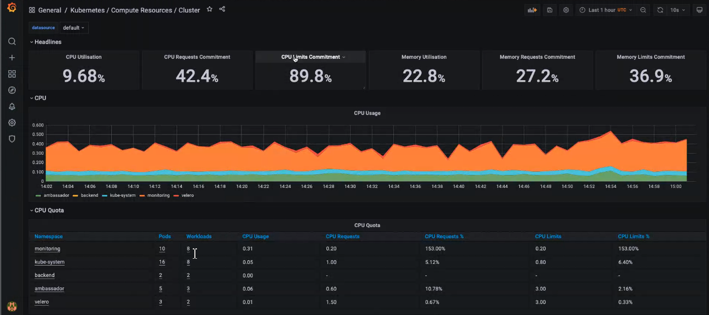

## Estimate Resource Usage for Startup Kit

In this part, you’ll focus on some introductory `CPU` monitoring by using `Grafana` which has some custom dashboards for this purposes. When you click `Manage`, you will see the `Kubernetes/Compute Resources/Cluster` section available with `kubernetes-mixin` tag. 

The value for each metric, like: `CPU Utilisation`, `CPU Requests Commitment`, `CPU Limits Commitment`, `Memory Utilisation`, `Memory Requests Commitment` and `Memory Limits Commitment` is included in the header. Besides this, if you scroll down, you can see more tables, such as: `Cpu Usage`, `Memory Usage`,`Network Usage`, `Request by Namespace` and `Bandwidth`.

There are even more dashboards available to study, so please navigate to `Dashboards -> Manage` and pick `Kubernetes/Compute Resources/Cluster` for example. It shows `CPU/Memory` usage for each `namespace` (`velero`, `ambassador`, `prometheus/loki/grafana`).

To `automate everything` that was covered in the `Starter Kit`, please refer to [Section 15 - Automate everything using Terraform and Flux ](../15-automate-with-terraform-flux/README.md).
