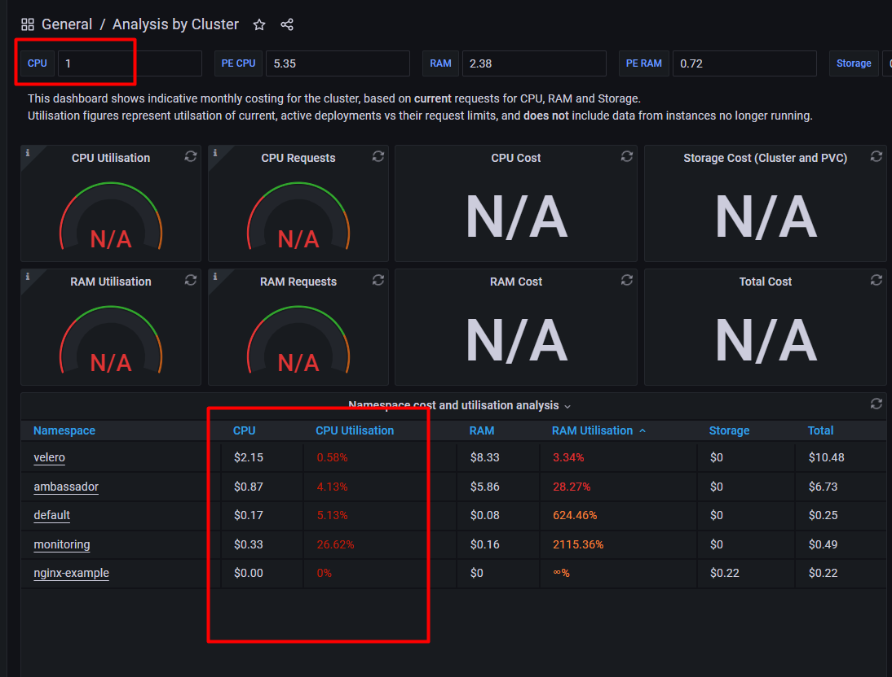

## Cost analysis for your DOKS cluster<a name="COST"></a>

In this part, we’ll focus on introductory CPU monitoring by using simple method, Grafana has some custom dashboards for these purposes.  the size of `Overall CPU Utilisation`,`RAM Utilisation`, `Network IO`, `Disk IO`, `Pod cost` and `utilisation analysis`.These are all key elements that affect the performance of your infrastructure. In grafana, you can use  `6876` or `6873` or `6879` number of dashboard in 'http://localhost:3000/dashboard/import'. Look Below for Dashboard.



Also, You can make some tests to understand your cluster.So that, By changing replica numbers inside of the  `deployment.yml` which belogs to ambassador such as `replicas: 1` ---> `replicas: 3`. and then reconfigure it by using thse command `kubectl apply -f deployment.yml` in terminal. Please use below configuration to observe changes.
```
kubectl describe nodes | grep 'Name:\|  cpu\|  memory'
```
As we already have the Grafana installed, we can review the dashboards (go to dashboards -> manage) to look at the cpu/memory utilized by each of the namespaces (velero, ambassador, prometheus/loki/grafana). 
Refer to these dashboards.For our starter kit, we're using  `cpu`, and `memory`. 

For a ballpark sizing, say you're using a node pool for 2 nodes, 4cpu/8gb each. This is about $96/month for the cluster. You will have 6cpu/8gb RAM remaining for use after DOKS installation. If you install the starter kit, then you will have 4cpu/6gb RAM remaining for your applications.


This is the last section for manual setup of startup kit.
