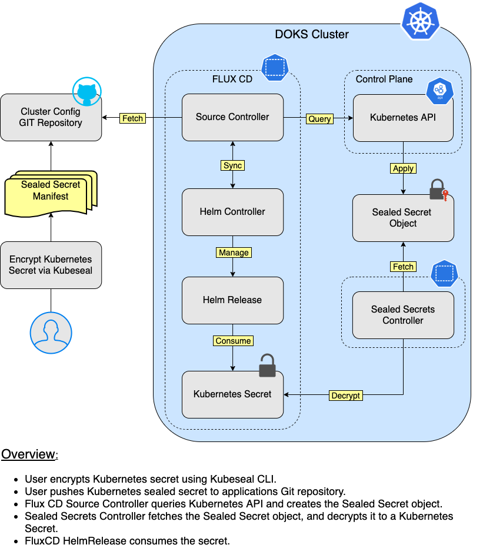
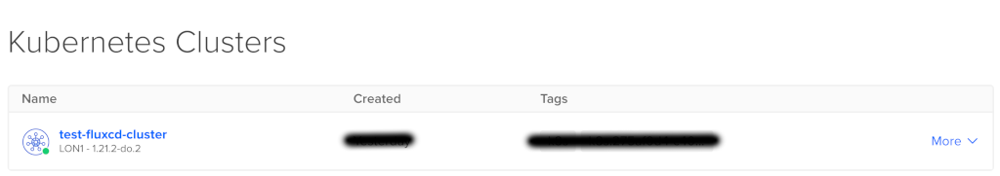
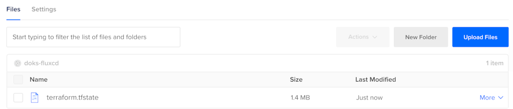

# Automate Everything using Terraform and Flux CD

## Introduction

[Terraform](https://www.terraform.io) helps you create and automate the running infrastructure, like your `Kubernetes` cluster. Then, [Flux CD](https://fluxcd.io) helps you `synchronize` the `state` of your infrastructure using `Git` as the source of truth, and follow `GitOps` principles.

In this tutorial, you will learn to:

- Use `Terraform` modules, to automate all the steps required to provision your infrastructure.
- Create `Flux CD` resources, to keep your `Kubernetes` cluster applications state synchronized with a `Git` repository (use `GitOps` principles).

After finishing all the steps from this tutorial, you should have a fully functional `DOKS` cluster with `Flux CD` deployed, that will:

- Handle cluster reconciliation, via the [Source Controller](https://fluxcd.io/docs/components/source/).
- Handle `Helm` releases, via the [Helm Controller](https://fluxcd.io/docs/components/helm).

### DOKS and Flux CD Automation Overview


## Table of Contents

- [Introduction](#introduction)
- [Prerequisites](#prerequisites)
- [Understanding Flux CD Concepts for Automated Helm Releases](#understanding-flux-cd-concepts-for-automated-helm-releases)
  - [Using HelmRepository CRD to Define Helm Repositories](#using-helmrepository-crd-to-define-helm-repositories)
  - [Using HelmRelease CRD to Install Helm Charts](#using-helmrelease-crd-to-install-helm-charts)
  - [Using HelmRelease CRD to Override Helm Values](#using-helmrelease-crd-to-override-helm-values)
  - [Using Sealed Secrets Controller to Encrypt Kubernetes Secrets](#using-sealed-secrets-controller-to-encrypt-kubernetes-secrets)
- [Step 1 - Initializing the Terraform Backend](#step-1---initializing-the-terraform-backend)
- [Step 2 - Bootstrapping DOKS and Flux CD](#step-2---bootstrapping-doks-and-flux-cd)
- [Step 3 - Inspecting DOKS Cluster and Flux CD State](#step-3---inspecting-doks-cluster-and-flux-cd-state)
  - [DOKS Cluster](#doks-cluster)
  - [Flux CD](#flux-cd)
- [Step 4 - Cloning the Flux CD Git Repository and Preparing the Layout](#step-4---cloning-the-flux-cd-git-repository-and-preparing-the-layout)
- [Step 5 - Creating the Sealed Secrets Helm Release](#step-5---creating-the-sealed-secrets-helm-release)
  - [Exporting the Sealed Secrets Controller Public Key](#exporting-the-sealed-secrets-controller-public-key)
- [Step 6 - Creating the Ambassador Helm Release](#step-6---creating-the-ambassador-helm-release)
- [Step 7 - Creating the Prometheus Stack Helm Release](#step-7---creating-the-prometheus-stack-helm-release)
- [Step 8 - Creating the Loki Stack Helm Release](#step-8---creating-the-loki-stack-helm-release)
- [Step 9 - Creating the Velero Helm Release](#step-9---creating-the-velero-helm-release)
- [Conclusion](#conclusion)

## Prerequisites

To complete this tutorial, you will need:

1. A [GitHub](https://github.com) repository and `branch`, for `Flux CD` to store your cluster and sample application `manifests`.

   **Important note:**

   **The GitHub `repository` (and `branch`) must be created beforehand - the DigitalOcean Terraform module used in this tutorial doesn't provision one for you automatically.**
2. A GitHub [personal access token](https://github.com/settings/tokens) that has the `repo` permissions set. The `Terraform` module used in this tutorial, needs it in order to create the `SSH` deploy key, as well as to commit the `Flux CD` manifests in your `Git` repository.
3. A `DigitalOcean` access token, for creating/managing the `DOKS` cluster. Please follow the official `DigitalOcean` tutorial on how to [create a personal access token](https://docs.digitalocean.com/reference/api/create-personal-access-token). Copy the `token` value and save it somewhere safe.
4. A dedicated `DO Spaces` bucket for the following:
   - `Terraform` state file (e.g.: `terraform`).
   - `Loki` data storage (e.g.: `loki-storage`).
   - `Velero` backups storage (e.g.: `velero-backups-storage`).
  
    Please follow the official `DigitalOcean` tutorial on how to [create](https://docs.digitalocean.com/products/spaces/how-to/create) each. Make sure that it is set to `restrict file listing` for security reasons.
5. Access keys, for [DigitalOcean Spaces](https://cloud.digitalocean.com/spaces) (S3-compatible object storage). Please follow the official `DigitalOcean` tutorial on how to [manage access keys](https://docs.digitalocean.com/products/spaces/how-to/manage-access/). Copy the `key` and `secret` value, and save each in a local `environment` variable for later use (make sure to replace the `<>` placeholders accordingly):

    ```shell
    export DO_SPACES_ACCESS_KEY="<YOUR_DO_SPACES_ACCESS_KEY>"
    export DO_SPACES_SECRET_KEY="<YOUR_DO_SPACES_SECRET_KEY>"
    ```

6. A [Git](https://git-scm.com/downloads) client, for cloning the `Starter Kit` repository.
7. HashiCorp [Terraform](https://www.terraform.io/downloads.html) CLI, for provisioning the infrastructure.
8. [Doctl](https://github.com/digitalocean/doctl/releases) CLI, for `DigitalOcean` API interaction.
9. [Kubectl](https://kubernetes.io/docs/tasks/tools) CLI, for `Kubernetes` interaction.
10. [Flux](https://fluxcd.io/docs/installation) CLI, for `Flux CD` interaction.
11. [Kubeseal](https://github.com/bitnami-labs/sealed-secrets/releases/tag/v0.16.0), for encrypting secrets and `Sealed Secrets Controller` interaction.

## Understanding Flux CD Concepts for Automated Helm Releases

The way `Flux CD` knows how to handle `Helm` releases is via a dedicated custom resource definition, the [HelmRelease](https://fluxcd.io/docs/components/helm/helmreleases). Next, each `HelmRelease` makes use of a [HelmRepository](https://fluxcd.io/docs/components/source/helmrepositories) CRD, to fetch the required chart to install.

You have some familiarity now with `Helm` installations performed via the command line interface (each section of the `Starter Kit` makes use of it). `Flux CD` is achieving the same thing via the [Helm Controller](https://fluxcd.io/docs/components/helm). You define `manifests` that make use of specific CRDs (`HelmRepository`, `HelmRelease`), which in turn tell `Flux CD` how to perform the same steps as you did when using the `Helm CLI`.

### Using HelmRepository CRD to Define Helm Repositories

The `HelmRepository` CRD is used by `Flux CD` to handle Helm `repositories`, and to `fetch` the available `charts` (the `CLI` equivalent of `helm repo add <name> <url>` and `helm repo update`).

Typical structure of a `HelmRepository` manifest, looks like below:

```yaml
apiVersion: source.toolkit.fluxcd.io/v1beta1
kind: HelmRepository
metadata:
  name: ambassador
  namespace: flux-system
spec:
  interval: 10m0s
  url: https://www.getambassador.io
```

Explanations for the above configuration:

- `<kind>`: Tells Flux CD what type of `CRD` the manifest is using (`HelmRepository`, in this example).
- `<metadata.name>`: Name of the `HelmRepository` CRD (`ambassador`, in this example).
- `<metadata.namespace>`: Namespace to use for the `HelmRepository` resource (`flux-system`, in this example).
- `<spec.interval>`: Time interval to use for synchronizing with the remote Helm repository (to fetch new chart releases metadata - CLI equivalent of: `helm repo update`).
- `<spec.url>`: Helm charts repository URL.

### Using HelmRelease CRD to Install Helm Charts

The `HelmRelease` CRD is used by `Flux CD` to handle Helm `releases` in your `DOKS` cluster (the `CLI` equivalent of `helm install <name> <chart> -f <values.yaml>`). It can also take care of `upgrades`, as well as how to `recover` in case of a failure, like: how many `retries` to perform for a failed `install` operation, `rollbacks`, etc.

Each `HelmRelease` makes use of a `source` type, so that it knows where to pull the `Helm` chart from:

- [HelmRepository](https://fluxcd.io/docs/components/source/helmrepositories), for use with `Helm` chart repositories.
- [GitRepository](https://fluxcd.io/docs/components/source/gitrepositories), for use with `Git` repositories.
- [S3 Bucket](https://fluxcd.io/docs/components/source/buckets), for use with `S3` compatible buckets.

Typical structure of a `HelmRelease` manifest, looks like below:

```yaml
apiVersion: helm.toolkit.fluxcd.io/v2beta1
kind: HelmRelease
metadata:
  name: ambassador-stack
  namespace: flux-system
spec:
  chart:
    spec:
      chart: ambassador
      sourceRef:
        kind: HelmRepository
        name: ambassador
      version: 6.7.13
  install:
    createNamespace: true
  interval: 1m0s
  targetNamespace: ambassador
```

Explanations for the above configuration:

- `<kind>`: Tells Flux CD what type of `CRD` the manifest is using (`HelmRelease`, in this example).
- `<metadata.name>`: Name of the `HelmRelease` CRD (`ambassador-stack`, in this example).
- `<metadata.namespace>`: Namespace to use for the `HelmRelease` resource (`flux-system`, in this example).
- `<chart.spec.chart>`: Specifies the `chart name` to fetch and install from the `HelmRepository` (`ambassador`, in this example).
- `<chart.spec.sourceRef.kind>`: Tells Flux CD to use a `HelmRepository` resource for fetching Helm charts (this is a good example that illustrates CRDs dependency).
- `<chart.spec.sourceRef.name>`: HelmRepository CRD name to reference.
- `<chart.spec.version>`: version of the Helm chart to install.
- `<spec.install.createNamespace>`: Tells Flux CD if a namespace needs to be created before installing the chart (Helm CLI equivalent of: `helm install --create-namespace`).
- `<spec.interval>`: Time interval at which to reconcile the Helm release.
- `<spec.targetNamespace>`: Namespace to place the Helm release (Helm CLI equivalent of: `helm install --namespace <name>`).

### Using HelmRelease CRD to Override Helm Values

Each Flux CD `HelmRelease` can override `values` via a values file - the equivalent of `helm install <name> <chart> -f values.yaml`, or by setting each value individually - the equivalent of `helm instal <name> <chart> --set <key> <value>`.

`Flux CD` lets you override `Helm` values via two spec types:

- `<spec.values>`: Allows you to override values `inline` as seen in a standard `values.yaml` file). This is the equivalent of: `helm install -f <values_file>`.
- `<spec.valuesFrom>`: Allows you to override values `individually`, by using each key `fully qualified path` from the values file (e.g.: `aws.access_key_id`). This is the equivalent of `helm install --set <key> <value>`.

Typical usage of `spec.values`:

```yaml
...
spec:
  values:
    loki:
      enabled: true
      config:
        schema_config:
          configs:
            - from: "2020-10-24"
              store: boltdb-shipper
              object_store: aws
              schema: v11
              index:
                prefix: index_
                period: 24h
...
```

Explanations for the above configuration:

`<spec.values>`: This key holds the `original` Helm `values` file content, just as when using the `CLI` variant: `helm install -f <values.yaml>`.

When using `HelmReleases`, the `<spec.values>` field `copies` the values file content `exactly` as seen in the `YAML` file. It means that `sensitive` data, like `DO Spaces` credentials or `DO API` token will be exposed, and that is not a good thing. What `Flux CD` allows you to do in this case, is to `override` values from `Kubernetes Secrets`.

Typical usage of `spec.valuesFrom` in combination with a `Kubernetes Secret` (the below example expects that the `do-credentials` Kubernetes secret to be created beforehand):

```yaml
spec:
  valuesFrom:
    - kind: Secret
      name: do-credentials
      valuesKey: spaces_access_key
      targetPath: aws.access_key_id
```

Explanations for the above configuration:

- `<spec.valuesFrom.kind>`: Kind of the values referent (Kubernetes `Secret`, in this example - can be a `ConfigMap` as well).
- `<spec.valuesFrom.name>`: Name of the values referent (e.g. Kubernetes `Secret`), in the `same namespace` as the `HelmRelease`.
- `<spec.valuesFrom.valuesKey>`: The data key where a specific value can be found (defaults to `values.yaml` when omitted).
- `<spec.valuesFrom.targetPath>`: The `YAML` dot notation `path` at which the value should be merged. When set, the `valuesKey` is expected to be a single flat value (defaults to `None` when omitted, which results in the `values` getting `merged` at the `root`).

You can have a combination of `spec.values` for storing non-sensitive data, and `spec.valuesFrom` that reference Kubernetes secrets for sensitive data. In the end, each Flux CD `HelmRelease` will `merge` all the values together, so you can benefit from both worlds. In fact, this is how `Helm` works, so the same principles apply.

In a `GitOps` flow, `Kubernetes Secrets` cannot be `stored` directly using `Git`, so you're going to use `Sealed Secrets` to encrypt sensitive data.

### Using Sealed Secrets Controller to Encrypt Kubernetes Secrets

`Sealed Secrets` allows you to `encrypt` generic `Kubernetes` secrets and `store` them `safely` in `Git` (even in `public` repositories). Then, `Flux CD` will create a corresponding `Sealed Secret Object` in your cluster when `syncing` the `Git` repository. `Sealed Secrets Controller` notices the sealed objects, and decrypts each to a classic Kubernetes secret. Applications can consume the secrets as usual.

**Flux CD Sealed Secrets GitOps Flow:**



For more details, please refer to [Section 08 - Encrypt Kubernetes Secrets Using Sealed Secrets](../08-kubernetes-sealed-secrets/README.md).

Next, you will learn how to provision the `DOKS` cluster and `Flux CD`, using `Terraform`.

## Step 1 - Initializing the Terraform Backend

In this step, you're going to initialize the `Terraform` backend. A `DO Spaces` bucket for storing the `Terraform` state file is highly recommended because you do not have to worry about exposing `sensitive` data, as long as the space is `private` of course. Another advantage is that the `state` of your `infrastructure` is backed up, so you can re-use it when the `workspace` is lost. Having a `shared` space for team members is desired as well, in order to perform `collaborative` work via `Terraform`.

First, clone the `Starter Kit` Git repository on your local machine, and navigate to the `terraform` directory:

```shell
git clone https://github.com/digitalocean/Kubernetes-Starter-Kit-Developers.git

cd Kubernetes-Starter-Kit-Developers/15-automate-with-terraform-flux/assets/terraform
```

Next, rename the `backend.tf.sample` file provided in the `Starter Kit` repository to `backend.tf`:

```shell
cp backend.tf.sample backend.tf
```

Then, open `backend.tf` using a text editor of your choice (preferably with `Terraform` lint support), and replace the `<>` placeholders accordingly (explanations for each can be found inside). For example, you can use [VS Code](https://code.visualstudio.com):

```shell
code backend.tf
```

Finally, initialize the `Terraform` backend. You're going to use the `DO Spaces` access and secret key, created at `Step 5.` from [Prerequisites](#prerequisites):

```shell
terraform init  --backend-config="access_key=$DO_SPACES_ACCESS_KEY" --backend-config="secret_key=$DO_SPACES_SECRET_KEY"
```

The output looks similar to (check for the `Successfully configured the backend "s3"!` message):

```text
Initializing the backend...

Successfully configured the backend "s3"! Terraform will automatically
use this backend unless the backend configuration changes.

Initializing provider plugins...
- Finding hashicorp/kubernetes versions matching "2.3.2"...
- Finding gavinbunney/kubectl versions matching "1.11.2"...
...
```

In the next step, you will create the `DOKS` cluster and provision `Flux CD`, using `Terraform`.

## Step 2 - Bootstrapping DOKS and Flux CD

In this step, you're going to use a custom `Terraform` module provided by DigitalOcean - [DOKS-FluxCD](https://github.com/digitalocean/container-blueprints/tree/main/create-doks-with-terraform-flux), to provision your `Kubernetes` cluster and deploy `Flux CD`.

First, change directory to `15-automate-with-terraform-flux/assets/terraform`, from where you cloned the `Starter Kit` Git repository:

```shell
cd Kubernetes-Starter-Kit-Developers/15-automate-with-terraform-flux/assets/terraform
```

Next, rename the `main.tf.sample` file provided in the `Starter Kit` repository to `main.tf`:

```shell
cp main.tf.sample main.tf
```

Then, open `main.tf` using an editor of your choice (preferably with `Terraform` lint support), and replace the `<>` placeholders accordingly (explanations for each can be found inside). For example, you can use [VS Code](https://code.visualstudio.com):

```shell
code main.tf
```

Next, run `Terraform` and inspect infrastructure changes:

```shell
terraform plan -out starter_kit_flux_cluster.out
```

Finally, if everything looks good, apply changes using `Terraform`:

```shell
terraform apply "starter_kit_flux_cluster.out"
```

After running above steps, you should have a fully functional `Kubernetes` cluster and `Flux CD` deployed. In the next step, you're going to inspect the state of your `DOKS` cluster, as well as `Flux CD`.

## Step 3 - Inspecting DOKS Cluster and Flux CD State

First, please navigate to [DOKS](https://cloud.digitalocean.com/kubernetes) panel from your `DigitalOcean` account, to visualize `Kubernetes` cluster state:



Next, check that the `Terraform` state file is saved in your [DO Spaces](https://cloud.digitalocean.com/spaces) bucket. Bucket listing looks similar to:



Finally, the Flux CD `manifests` for your `DOKS` cluster should be present in your `Git` repository as well:


### DOKS Cluster

First, you have to set the `kubectl` context to point to your `DOKS` cluster. List the available `Kubernetes` clusters first:

```shell
doctl k8s cluster list
```

Point `kubectl` to your cluster (make sure to replace the `<>` placeholders accordingly):

```shell
doctl k8s cluster kubeconfig save <your_doks_cluster_name>
```

Please check that the context was set, and that it's pointing to your `Kubernetes` cluster:

```shell
kubectl config get-contexts
```

List cluster nodes, and make sure that they're in a healthy state (`STATUS` column says `Ready`):

```shell
kubectl get nodes
```

The output looks similar to:

```text
NAME                             STATUS   ROLES    AGE    VERSION
test-fluxcd-cluster-pool-8z9df   Ready    <none>   3d2h   v1.21.3
test-fluxcd-cluster-pool-8z9dq   Ready    <none>   3d2h   v1.21.3
test-fluxcd-cluster-pool-8z9dy   Ready    <none>   3d2h   v1.21.3
```

### Flux CD

`Flux` provides a `CLI` binary, which you can use for provisioning `Flux CD` itself, as well as for main system interaction. You can also use it to export `manifests` and create Flux CD `resources` for your `DOKS` cluster.

First, you can perform some `sanity checks` via:

```shell
flux check
```

The output looks similar to the following:

```text
► checking prerequisites
✔ kubectl 1.21.3 >=1.18.0-0
✔ Kubernetes 1.21.2 >=1.16.0-0
► checking controllers
✗ helm-controller: deployment ready
► ghcr.io/fluxcd/helm-controller:v0.11.1
✔ kustomize-controller: deployment ready
► ghcr.io/fluxcd/kustomize-controller:v0.13.1
✔ notification-controller: deployment ready
► ghcr.io/fluxcd/notification-controller:v0.15.0
✔ source-controller: deployment ready
► ghcr.io/fluxcd/source-controller:v0.15.3
✔ all checks passed
```

Then, inspect all `Flux CD` resources via:

```shell
flux get all
```

The output looks similar to the following (long commit hashes were abbreviated in the output, for simplicity). Notice the `gitrepository/flux-system` component fetching the latest revision from your main branch, as well as the `kustomization/flux-system` component:

```text
NAME                      READY MESSAGE                        REVISION      SUSPENDED 
gitrepository/flux-system True  Fetched revision: main/1d69... main/1d69...  False     

NAME                      READY MESSAGE                        REVISION      SUSPENDED 
kustomization/flux-system True  Applied revision: main/1d69... main/1d69c... False  
```

In case you need to perform some troubleshooting, and see what `Flux CD` is doing, you can access the logs via:

```shell
flux logs
```

The output looks similar to the following:

```text
...
2021-07-20T12:31:36.696Z info GitRepository/flux-system.flux-system - Reconciliation finished in 1.193290329s, next run in 1m0s 
2021-07-20T12:32:37.873Z info GitRepository/flux-system.flux-system - Reconciliation finished in 1.176637507s, next run in 1m0s 
...
```

Finally, check that `Flux CD` points to your `Git` repository:

```shell
kubectl get gitrepositories.source.toolkit.fluxcd.io -n flux-system
```

The output looks similar to (notice the `URL` column value - should point to your `Git` repository, and the `READY` state set to `True`):

```text
NAME         URL                                                       READY  STATUS                          AGE
flux-system  ssh://git@github.com/test-starterkit/starterkit_fra1.git  True   Fetched revision: main/1d69...  21h
```

In the next step, you will prepare the `Git` repository layout for use in this tutorial. Although `Flux CD` doesn't care about the directory structure of your `Git` repository (it performs a recursive search for manifests), it's best practice to keep things organized, and follow naming conventions as much as possible, to avoid frustration in the future.

## Step 4 - Cloning the Flux CD Git Repository and Preparing the Layout

In this step, you will learn how to `organize` your `Git` repository used by `Flux CD` to sync your `DOKS` cluster `state`. For simplicity, this tutorial is based on a `monorepo` structure, and is using a `single environment` to hold all your manifests.

Please make sure that the following steps are performed in order, before anything else:

1. First, clone your Flux CD `Git` repository. This is the main repository used for your `DOKS` cluster reconciliation (please replace the `<>` placeholders accordingly):

   ```shell
   git clone https://github.com/<YOUR_GITHUB_USER>/<YOUR_GITHUB_REPOSITORY_NAME>.git
   ```

    Explanations for the above command:

    - `<YOUR_GITHUB_USER>` - your GitHub `username` as defined in `main.tf` file (`<github_user>` variable).
    - `<YOUR_GITHUB_REPOSITORY_NAME>` - your Flux CD `GitHub repository` used for your `DOKS` cluster `reconciliation` as defined in `main.tf` file (`<git_repository_name>` variable).

2. Next, change directory where your Flux CD `Git` repository was cloned.
3. Then, checkout the correct branch as defined in `main.tf` file for `Flux CD` to use (`<git_repository_branch>` variable).
4. Now, create the `directory structure` to store Flux CD `HelmRepository`, `HelmRelease` and `SealedSecret` manifests for each component of the `Starter Kit`. Please replace `<YOUR_GIT_REPOSITORY_SYNC_PATH>` with your `Flux CD` cluster sync directory path, as defined by the `<git_repository_sync_path>` variable from `main.tf` file:

    ```shell
    FLUXCD_HELM_MANIFESTS_PATH="<YOUR_GIT_REPOSITORY_SYNC_PATH>/helm"

    mkdir -p "${FLUXCD_HELM_MANIFESTS_PATH}/repositories" 
    
    mkdir -p "${FLUXCD_HELM_MANIFESTS_PATH}/releases" 
    
    mkdir -p "${FLUXCD_HELM_MANIFESTS_PATH}/secrets"
    ```

5. Finally, add the `.gitignore` file to `avoid` committing `unencrypted` Helm value files in your repository, that may contain sensitive data. Using your favorite `text editor`, paste the following (below example is using the `Starter Kit` naming convention):

    ```text
    # Ignore all YAML files containing the `-values-` string.
    *-values-*.yaml

    # Do not ignore sealed YAML files.
    !*-sealed.yaml
    ```

After finishing all the steps from this tutorial, you should have a `Git` repository structure similar to:

```text
├── README.md
├── clusters
│   └── dev
│       ├── flux-system
│       │   ├── gotk-components.yaml
│       │   ├── gotk-sync.yaml
│       │   └── kustomization.yaml
│       └── helm
│           ├── releases
│           │   ├── ambassador-stack-v6.7.13.yaml
│           │   ├── loki-stack-v2.4.1.yaml
│           │   ├── prometheus-stack-v17.1.3.yaml
│           │   ├── sealed-secrets-v1.16.1.yaml
│           │   └── velero-v2.23.6.yaml
│           ├── repositories
│           │   ├── ambassador.yaml
│           │   ├── grafana.yaml
│           │   ├── prometheus-community.yaml
│           │   ├── sealed-secrets.yaml
│           │   └── vmware-tanzu.yaml
│           └── secrets
│               ├── do-api-credentials-sealed.yaml
│               ├── do-spaces-credentials-sealed.yaml
│               └── prometheus-stack-credentials-sealed.yaml
└── pub-sealed-secrets-dev-cluster.pem
```

Next, you're going to provision the required `Flux CD` manifests for each component of the `Starter Kit`. Then, you will inspect and commit each manifest to your `Git` repository used by `Flux CD` to reconcile your `DOKS` cluster. For sensitive data, a `Kubernetes Secrets` will be created and `encrypted` using `Sealed Secrets`, and then stored in your `Git` repository as well.

First example will make use of the `Flux CLI` for you to accommodate and get familiarized with creating manifests via the `CLI`. Then, you will use the already prepared `manifests` provided in the `Starter Kit` repository, to speed up the steps from this tutorial.

You're going to start with the `Sealed Secrets` Helm release first, because it's a prerequisite for the rest of the `Starter Kit` components.

## Step 5 - Creating the Sealed Secrets Helm Release

In this step, you will learn how to create manifests using the `Flux CLI`, to define the `Sealed Secrets` Helm release. Then, `Flux` will trigger the `Sealed Secrets Controller` installation in your `DOKS` cluster.

Please use the following steps, to create required manifests for the `Sealed Secrets` Helm release:

1. First, change directory where your `Flux CD` Git repository was cloned. Also, please check that the required directory structure for this tutorial is created, and that the `FLUXCD_HELM_MANIFESTS_PATH` environment variable is set (please refer to [Step 4 - Cloning the Flux CD Git Repository and Preparing the Layout](#step-4---cloning-the-flux-cd-git-repository-and-preparing-the-layout), for details).
2. Then, create the `Sealed Secrets` HelmRepository manifest for `Flux`:

    ```shell
    flux create source helm sealed-secrets \
      --url="https://bitnami-labs.github.io/sealed-secrets" \
      --interval="10m" \
      --export > "${FLUXCD_HELM_MANIFESTS_PATH}/repositories/sealed-secrets.yaml"
    ```

    Explanations for the above command:

    - `--url`: Helm repository address.
    - `--interval`: Source sync interval (default `1m0s`).
    - `--export`: Export in `YAML` format to stdout.

    The output looks similar to (you can notice that it has a similar structure as explained in [Using HelmRepository CRD to Define Helm Repositories](#using-helmrepository-crd-to-define-helm-repositories)):

    ```yaml
    ---
    apiVersion: source.toolkit.fluxcd.io/v1beta1
    kind: HelmRepository
    metadata:
      name: sealed-secrets
      namespace: flux-system
    spec:
      interval: 10m0s
      url: https://bitnami-labs.github.io/sealed-secrets
    ```

3. Next, fetch the `Starter Kit` values file for `Sealed Secrets`. Please make sure to inspect the values file first, and replace the `<>` placeholders where needed:

    ```shell
    SEALED_SECRETS_CHART_VERSION="1.16.1"

    curl "https://raw.githubusercontent.com/digitalocean/Kubernetes-Starter-Kit-Developers/main/08-kubernetes-sealed-secrets/assets/manifests/sealed-secrets-values-v${SEALED_SECRETS_CHART_VERSION}.yaml" > "sealed-secrets-values-v${SEALED_SECRETS_CHART_VERSION}.yaml"
    ```

4. Now, create the `Sealed Secrets` HelmRelease manifest for `Flux CD`. `Kubeseal` CLI expects by default to find the controller in the `kube-system` namespace and to be named `sealed-secrets-controller`, hence we override the release name via the `--release-name` and `--target-namespace` flags. This is not mandatory, but `kube-system` is usually accessible only to power users (administrators):

    ```shell
    SEALED_SECRETS_CHART_VERSION="1.16.1"

    flux create helmrelease "sealed-secrets-controller" \
      --release-name="sealed-secrets-controller" \
      --source="HelmRepository/sealed-secrets" \
      --chart="sealed-secrets" \
      --chart-version "$SEALED_SECRETS_CHART_VERSION" \
      --values="sealed-secrets-values-v${SEALED_SECRETS_CHART_VERSION}.yaml" \
      --target-namespace="flux-system" \
      --crds=CreateReplace \
      --export > "${FLUXCD_HELM_MANIFESTS_PATH}/releases/sealed-secrets-v${SEALED_SECRETS_CHART_VERSION}.yaml"
    ```

    Explanations for the above command:

    - `--release-name`: What name to use for the Helm release (defaults to `<target-namespace>-<HelmRelease-name>` otherwise).
    - `--source`: Source that contains the chart in the format `<kind>/<name>.<namespace>`, where kind must be one of: (`HelmRepository`, `GitRepository`, `Bucket`).
    - `--chart`: Helm chart name.
    - `--chart-version`: Helm chart version.
    - `--values`: Local path to values file.
    - `--target-namespace`: Namespace to install this release.
    - `--crds`: Upgrade CRDs policy, available options are: (`Skip`, `Create`, `CreateReplace`).
    - `--export`: Export in `YAML` format to stdout.

    The output looks similar to (you can observe that it has a similar structure as explained in [Using HelmRelease CRD to Install Helm Charts](#using-helmrelease-crd-to-install-helm-charts)):

    ```yaml
    ---
    apiVersion: helm.toolkit.fluxcd.io/v2beta1
    kind: HelmRelease
    metadata:
      name: sealed-secrets-controller
      namespace: flux-system
    spec:
      chart:
        spec:
          chart: sealed-secrets
          sourceRef:
            kind: HelmRepository
            name: sealed-secrets
          version: 1.16.1
      interval: 1m0s
      releaseName: sealed-secrets-controller
      targetNamespace: flux-system
      install:
        crds: Create
      upgrade:
        crds: CreateReplace
      values:
        ingress:
          enabled: false
    ```

5. Finally, `commit` your `Git` changes and `push` to `remote`:

    ```shell
    SEALED_SECRETS_CHART_VERSION="1.16.1"

    git add "${FLUXCD_HELM_MANIFESTS_PATH}/repositories/sealed-secrets.yaml"

    git add "${FLUXCD_HELM_MANIFESTS_PATH}/releases/sealed-secrets-v${SEALED_SECRETS_CHART_VERSION}.yaml"

    git commit -am "Adding Sealed Secrets manifests for Flux CD"

    git push origin
    ```

After completing the above steps, `Flux CD` will start your `DOKS` cluster `reconciliation` (in about `one minute` or so, if using the `default` interval). If you don't want to wait, you can always `force` reconciliation via:

```shell
flux reconcile source git flux-system
```

After a few moments, please inspect the Flux CD `Sealed Secrets` Helm release:

```shell
flux get helmrelease sealed-secrets-controller
```
  
The output looks similar to:

```text
NAME                        READY   MESSAGE                                 REVISION        SUSPENDED 
sealed-secrets-controller   True    Release reconciliation succeeded        1.16.1          False 
```

Look for the `READY` column value - it should say `True`. Reconciliation status is displayed in the `MESSAGE` column, along with the `REVISION` number, which represents the `Helm` chart `version`. Please bear in mind that some releases take longer to complete (like `Prometheus` stack, for example), so please be patient.

**Hints:**

- The `MESSAGE` column will display `Reconciliation in progress`, as long as the `HelmController` is performing the specific Helm chart installation. If something goes wrong, you'll get another message stating the reason, so please make sure to check Helm release state.
- You can use the `--watch` flag for example: `flux get helmrelease <name> --wait`, to wait until the command finishes. Please bear in mind that in this mode, `Flux` will block your terminal prompt until the default timeout of `5 minutes` occurs (can be overridden via the `--timeout` flag).
- In case something goes wrong, you can search the `Flux` logs, and filter `HelmRelease` messages only:

    ```shell
    flux logs --kind=HelmRelease
    ```

### Exporting the Sealed Secrets Controller Public Key

To be able to `encrypt` secrets, you need the `public key` that was generated by the `Sealed Secrets Controller` when it was deployed by `Flux CD` in your `DOKS` cluster.

First, change directory where you cloned your `Flux CD` Git repository, and do the following (please replace the `<>` placeholders accordingly):

```shell
kubeseal --controller-namespace=flux-system --fetch-cert > pub-sealed-secrets-<YOUR_DOKS_CLUSTER_NAME_HERE>.pem
```

**Note:**

If for some reason the `kubeseal` certificate fetch command hangs, you can use the following steps to work around this issue:

- First, open another terminal window, and `expose` the `Sealed Secrets Controller` service on your `localhost` (you can use `CTRL - C` to terminate, after fetching the public key):

  ```shell
  kubectl port-forward service/sealed-secrets-controller 8080:8080 -n flux-system &
  ```

- Then, you can go back to your working terminal and fetch the public key (please replace the `<>` placeholders accordingly):

  ```shell
  curl --retry 5 --retry-connrefused localhost:8080/v1/cert.pem > pub-sealed-secrets-<YOUR_DOKS_CLUSTER_NAME_HERE>.pem
  ```

Finally, `commit` the public key to your `Git` repository for later use (it's `safe` to do this, because the `public key` is useless without the `private key` which is stored in your `DOKS` cluster only). Please run bellow commands, and make sure to replace the `<>` placeholders accordingly:

```shell
git add pub-sealed-secrets-<YOUR_DOKS_CLUSTER_NAME_HERE>.pem

git commit -m "Adding Sealed Secrets public key for cluster <YOUR_DOKS_CLUSTER_NAME_HERE>"

git push origin
```

**Important note:**

**In this tutorial the `flux-system` namespace is used to hold `Kubernetes Secrets`, so please make sure that it is `restricted` to regular users/ applications via `RBAC`.**

Next, you're going to perform similar steps to define `Helm` releases for the remaining components of the `Starter Kit`.

## Step 6 - Creating the Ambassador Helm Release

In this step, you will use pre-made manifests to create the `Ambassador` Helm release for `Flux CD`. Then, `Flux` will trigger the `Ambassador Edge Stack` installation in your `DOKS` cluster.

Steps to follow:

1. First, change directory where your `Flux CD` Git repository was cloned. Also, please check that the required directory structure for this tutorial is created, and that the `FLUXCD_HELM_MANIFESTS_PATH` environment variable is set (please refer to [Step 4 - Cloning the Flux CD Git Repository and Preparing the Layout](#step-4---cloning-the-flux-cd-git-repository-and-preparing-the-layout), for details).
2. Then, fetch the Ambassador `HelmRepository` manifest provided by the `Starter Kit` Git repository:

    ```shell
    curl "https://raw.githubusercontent.com/digitalocean/Kubernetes-Starter-Kit-Developers/main/15-automate-with-terraform-flux/assets/manifests/fluxcd/helm/repositories/ambassador.yaml" > "${FLUXCD_HELM_MANIFESTS_PATH}/repositories/ambassador.yaml"
    ```

3. Now, fetch the Ambassador `HelmRelease` manifest provided by the `Starter Kit` Git repository:

    ```shell
    AMBASSADOR_CHART_VERSION="6.7.13"

    curl "https://raw.githubusercontent.com/digitalocean/Kubernetes-Starter-Kit-Developers/main/15-automate-with-terraform-flux/assets/manifests/fluxcd/helm/releases/ambassador-stack-v${AMBASSADOR_CHART_VERSION}.yaml" > "${FLUXCD_HELM_MANIFESTS_PATH}/releases/ambassador-stack-v${AMBASSADOR_CHART_VERSION}.yaml"
    ```

4. Next, inspect the downloaded Ambassador `HelmRelease` manifest using an editor of your choice (preferably with `YAML` lint support), and adjust to your needs. For example, you can use [VS Code](https://code.visualstudio.com) (please make sure to replace the `<>` placeholders accordingly, if present):

    ```shell
    AMBASSADOR_CHART_VERSION="6.7.13"

    code "${FLUXCD_HELM_MANIFESTS_PATH}/releases/ambassador-stack-v${AMBASSADOR_CHART_VERSION}.yaml"
    ```

    **Note:**

    You can see how the Ambassador `HelmRelease` manifest configures remediation actions (please visit [Configuring Failure Remediation](https://fluxcd.io/docs/components/helm/helmreleases/#configuring-failure-remediation), for more details about `Helm` install/upgrade failure remediation options available in `Flux CD`):

      ```yaml
      ...
      install:
        createNamespace: true
        remediation:
          retries: 3
      upgrade:
        remediation:
          retries: 3
      ...
      ```

5. Finally, `commit` your `Git` changes and `push` to `remote`:

    ```shell
    AMBASSADOR_CHART_VERSION="6.7.13"

    git add "${FLUXCD_HELM_MANIFESTS_PATH}/repositories/ambassador.yaml"

    git add "${FLUXCD_HELM_MANIFESTS_PATH}/releases/ambassador-stack-v${AMBASSADOR_CHART_VERSION}.yaml"

    git commit -am "Adding Ambassador manifests for Flux CD"

    git push origin
    ```

After completing the above steps, `Flux CD` will start your `DOKS` cluster `reconciliation` (in about `one minute` or so, if using the `default` interval). If you don't want to wait, you can always `force` reconciliation via:

```shell
flux reconcile source git flux-system
```

After a few moments, please inspect the Ambassador `HelmRelease`:

```shell
flux get helmrelease ambassador-stack
```
  
The output looks similar to:

```text
NAME                    READY   MESSAGE                                 REVISION        SUSPENDED 
ambassador-stack        True    Release reconciliation succeeded        6.7.13          False 
```

Look for the `READY` column value - it should say `True`. Reconciliation status is displayed in the `MESSAGE` column, along with the `REVISION` number, which represents the `Helm` chart `version`. Please bear in mind that some releases take longer to complete (like `Prometheus` stack, for example), so please be patient.

**Hints:**

- The `MESSAGE` column will display `Reconciliation in progress`, as long as the `HelmController` is performing the specific Helm chart installation. If something goes wrong, you'll get another message stating the reason, so please make sure to check Helm release state.
- You can use the `--watch` flag for example: `flux get helmrelease <name> --wait`, to wait until the command finishes. Please bear in mind that in this mode, `Flux` will block your terminal prompt until the default timeout of `5 minutes` occurs (can be overridden via the `--timeout` flag).
- In case something goes wrong, you can search the `Flux` logs, and filter `HelmRelease` messages only:

    ```shell
    flux logs --kind=HelmRelease
    ```

Please refer to the [03-setup-ingress-controller](../03-setup-ingress-controller/ambassador.md) tutorial, for more details about checking `Ambassador Edge Stack` deployment status and functionality.

Next, you're going to create `Flux CD` manifests for the `Prometheus` stack.

## Step 7 - Creating the Prometheus Stack Helm Release

In this step, you will use pre-made manifests to create the `Prometheus` Helm release for `Flux CD`. Then, `Flux` will trigger the `Prometheus` installation in your `DOKS` cluster. The `Prometheus` stack deploys `Grafana` as well, so you need to set the `administrator` credentials for accessing the `dashboards`. You will learn how to use `kubeseal` CLI with `Sealed Secrets Controller` to encrypt `sensitive` data stored in `Kubernetes Secrets`. Then, you will see how the Flux CD `HelmRelease` manifest is used to `reference` Grafana `credentials` stored in the `Kubernetes Secret`.

Steps to follow:

1. First, change directory where your `Flux CD` Git repository was cloned. Also, please check that the required directory structure for this tutorial is created, and that the `FLUXCD_HELM_MANIFESTS_PATH` environment variable is set (please refer to [Step 4 - Cloning the Flux CD Git Repository and Preparing the Layout](#step-4---cloning-the-flux-cd-git-repository-and-preparing-the-layout), for details).
2. Then, fetch the `Prometheus` HelmRepository manifest provided by the `Starter Kit` Git repository:

    ```shell
    curl "https://raw.githubusercontent.com/digitalocean/Kubernetes-Starter-Kit-Developers/main/15-automate-with-terraform-flux/assets/manifests/fluxcd/helm/repositories/prometheus-community.yaml" > "${FLUXCD_HELM_MANIFESTS_PATH}/repositories/prometheus-community.yaml"
    ```

3. Next, `create` and `encrypt` the `Kubernetes Secret` holding your `Grafana` dashboard `admin password`. Make sure that you have the `Sealed Secrets` public key exported as mentioned in [Exporting the Sealed Secrets Controller Public Key](#exporting-the-sealed-secrets-controller-public-key) (please replace the `<>` placeholders accordingly):

    ```shell
    SEALED_SECRETS_PUB_KEY="<YOUR_SEALED_SECRETS_PUB_KEY_NAME_HERE>"
    GRAFANA_ADMIN_PASSWORD="<YOUR_GRAFANA_ADMIN_PASSWORD_HERE>"

    kubectl create secret generic "prometheus-stack-credentials" \
        --namespace flux-system \
        --from-literal=grafana_admin_password="${GRAFANA_ADMIN_PASSWORD}" \
        --dry-run=client -o yaml | kubeseal --cert="${SEALED_SECRETS_PUB_KEY}" \
        --format=yaml > "${FLUXCD_HELM_MANIFESTS_PATH}/secrets/prometheus-stack-credentials-sealed.yaml"
    ```

    Explanations for the above command:

    - `--namespace`: Namespace where the Kubernetes secret should be created.
    - `--from-literal`: Create a Kubernetes secret from a literal value containing the `grafana_admin_password`. The `prometheus-stack-credentials` secret and `grafana_admin_password` value is used by the [prometheus-stack-v17.1.3.yaml](assets/manifests/fluxcd/helm/releases/prometheus-stack-v17.1.3.yaml#L81) manifest (`spec.valuesFrom` key).
    - `--dry-run=client`: Exports the Kubernetes secret on your local machine using standard output (and afterwards, piped to `kubeseal` to encrypt the final result).
4. Now, fetch the `Prometheus` HelmRelease manifest provided by the `Starter Kit` Git repository:

    ```shell
    PROMETHEUS_CHART_VERSION="17.1.3"

    curl "https://raw.githubusercontent.com/digitalocean/Kubernetes-Starter-Kit-Developers/main/15-automate-with-terraform-flux/assets/manifests/fluxcd/helm/releases/prometheus-stack-v${PROMETHEUS_CHART_VERSION}.yaml" > "${FLUXCD_HELM_MANIFESTS_PATH}/releases/prometheus-stack-v${PROMETHEUS_CHART_VERSION}.yaml"
    ```

5. Then, inspect the downloaded Prometheus `HelmRelease` manifest using an editor of your choice (preferably with `YAML` lint support), and adjust to your needs. For example, you can use [VS Code](https://code.visualstudio.com) (please make sure to replace the `<>` placeholders accordingly, if present):

    ```shell
    PROMETHEUS_CHART_VERSION="17.1.3"

    code "${FLUXCD_HELM_MANIFESTS_PATH}/releases/prometheus-stack-v${PROMETHEUS_CHART_VERSION}.yaml"
    ```

    **Note:**
    You can see how the `prometheus-stack-credentials` secret is referenced inside the Prometheus `HelmRelease` manifest, by looking at below snippet:

    ```yaml
    valuesFrom:
      - kind: Secret
        name: prometheus-stack-credentials # Kubernetes secret holding Prometheus stack credentials
        valuesKey: grafana_admin_password  # Key from the `prometheus-stack-credentials` secret, holding the Grafana admin password
        targetPath: grafana.adminPassword  # Helm value to override
        optional: false  # Helm release will fail if value is not found
    ```

6. Finally, `commit` your `Git` changes and `push` to `remote`:

    ```shell
    PROMETHEUS_CHART_VERSION="17.1.3"

    git add "${FLUXCD_HELM_MANIFESTS_PATH}/repositories/prometheus-community.yaml"

    git add "${FLUXCD_HELM_MANIFESTS_PATH}/releases/prometheus-stack-v${PROMETHEUS_CHART_VERSION}.yaml"

    git add "${FLUXCD_HELM_MANIFESTS_PATH}/secrets/prometheus-stack-credentials-sealed.yaml"

    git commit -am "Adding Prometheus manifests for Flux CD"

    git push origin
    ```

After a few moments, please inspect the Prometheus `HelmRelease`:

```shell
flux get helmrelease kube-prometheus-stack
```
  
The output looks similar to:

```text
NAME                    READY   MESSAGE                                 REVISION        SUSPENDED 
kube-prometheus-stack   True    Release reconciliation succeeded        17.1.3          False
```

Look for the `READY` column value - it should say `True`. Reconciliation status is displayed in the `MESSAGE` column, along with the `REVISION` number, which represents the `Helm` chart `version`. Please bear in mind that some releases take longer to complete (like `Prometheus` stack, for example), so please be patient.

**Hints:**

- The `MESSAGE` column will display `Reconciliation in progress`, as long as the `HelmController` is performing the specific Helm chart installation. If something goes wrong, you'll get another message stating the reason, so please make sure to check Helm release state.
- You can use the `--watch` flag for example: `flux get helmrelease <name> --wait`, to wait until the command finishes. Please bear in mind that in this mode, `Flux` will block your terminal prompt until the default timeout of `5 minutes` occurs (can be overridden via the `--timeout` flag).
- In case something goes wrong, you can search the `Flux` logs, and filter `HelmRelease` messages only:

    ```shell
    flux logs --kind=HelmRelease
    ```

Now, check if the `prometheus-stack-credentials` Kubernetes secret was created as well (then, you can use `kubectl get secret prometheus-stack-credentials -n flux-system -o yaml` for secret contents inspection):

```shell
kubectl get secret prometheus-stack-credentials -n flux-system
```

Finally, perform a quick check of `Prometheus` stack main `services`, and `PVC`:

- Prometheus dashboard: `kubectl port-forward svc/kube-prom-stack-kube-prome-prometheus 9090:9090 -n monitoring`.
- Grafana dashboards: `kubectl --namespace monitoring port-forward svc/kube-prom-stack-grafana 3000:80`.
- Prometheus PVC: `kubectl get pvc -n monitoring`.

Please refer to the [04-setup-prometheus-stack](../04-setup-prometheus-stack/README.md) tutorial, for more details about checking `Loki` stack deployment status and functionality.

Next, you're going to create the manifests for `Loki` stack, and let `Flux CD` handle the `Helm` release automatically.

## Step 8 - Creating the Loki Stack Helm Release

In this step, you will use pre-made manifests to create the `Loki` Helm release for `Flux CD`. Then, `Flux` will trigger the `Loki` installation in your `DOKS` cluster. `Loki` needs a `DO Spaces bucket` for storing backups, hence you need to use `DO Spaces credentials`. You will learn how to use `kubeseal` CLI with `Sealed Secrets Controller` to encrypt `sensitive` data stored in `Kubernetes Secrets`. Then, you will see how the Flux CD `HelmRelease` manifest is used to `reference` DO Spaces `credentials` stored in the `Kubernetes Secret`.

Steps to follow:

1. First, change directory where your `Flux CD` Git repository was cloned. Also, please check that the required directory structure for this tutorial is created, and that the `FLUXCD_HELM_MANIFESTS_PATH` environment variable is set (please refer to [Step 4 - Cloning the Flux CD Git Repository and Preparing the Layout](#step-4---cloning-the-flux-cd-git-repository-and-preparing-the-layout), for details).
2. Then, fetch the `Loki` HelmRepository manifest provided by the `Starter Kit` Git repository:

    ```shell
    curl "https://raw.githubusercontent.com/digitalocean/Kubernetes-Starter-Kit-Developers/main/15-automate-with-terraform-flux/assets/manifests/fluxcd/helm/repositories/grafana.yaml" > "${FLUXCD_HELM_MANIFESTS_PATH}/repositories/grafana.yaml"
    ```

3. Next, `create` and `encrypt` the Kubernetes secret for your `DO Spaces` credentials. Make sure that you have the `Sealed Secrets` public key exported as mentioned in [Exporting the Sealed Secrets Controller Public Key](#exporting-the-sealed-secrets-controller-public-key) (please replace the `<>` placeholders accordingly):

   ```shell
   SEALED_SECRETS_PUB_KEY="<YOUR_SEALED_SECRETS_PUB_KEY_NAME_HERE>"
   DO_SPACES_ACCESS_KEY="<YOUR_DO_SPACES_ACCESS_KEY_HERE>"
   DO_SPACES_SECRET_KEY="<YOUR_DO_SPACES_SECRET_KEY_HERE>"

   kubectl create secret generic "do-spaces-credentials" \
      --namespace flux-system \
      --from-literal=access_key_id="${DO_SPACES_ACCESS_KEY}" \
      --from-literal=secret_access_key="${DO_SPACES_SECRET_KEY}" \
      --dry-run=client -o yaml | kubeseal --cert="${SEALED_SECRETS_PUB_KEY}" \
      --format=yaml > "${FLUXCD_HELM_MANIFESTS_PATH}/secrets/do-spaces-credentials-sealed.yaml"
   ```

   Explanations for the above command:

   - `--namespace`: Namespace where the Kubernetes secret should be created.
   - `--from-literal`: Create a Kubernetes secret from a literal value containing the DO Spaces `access_key_id` and `secret_access_key`. The `do-spaces-credentials` secret and `access_key_id/secret_access_key` value is used by the [loki-stack-v2.4.1.yaml](assets/manifests/fluxcd/helm/releases/loki-stack-v2.4.1.yaml#L51) manifest (`spec.valuesFrom` key).
   - `--dry-run=client`: Exports the Kubernetes secret on your local machine using standard output (and afterwards, piped to `kubeseal` to encrypt the final result).
4. Now, fetch the `Loki` stack HelmRelease manifest provided by the `Starter Kit` Git repository:

    ```shell
    LOKI_CHART_VERSION="2.4.1"

    curl "https://raw.githubusercontent.com/digitalocean/Kubernetes-Starter-Kit-Developers/main/15-automate-with-terraform-flux/assets/manifests/fluxcd/helm/releases/loki-stack-v${LOKI_CHART_VERSION}.yaml" > "${FLUXCD_HELM_MANIFESTS_PATH}/releases/loki-stack-v${LOKI_CHART_VERSION}.yaml"
    ```

5. Then, inspect the downloaded Loki `HelmRelease` manifest using an editor of your choice (preferably with `YAML` lint support), and adjust to your needs. For example, you can use [VS Code](https://code.visualstudio.com) (please make sure to replace the `<>` placeholders accordingly, if present):

    ```shell
    LOKI_CHART_VERSION="2.4.1"

    code "${FLUXCD_HELM_MANIFESTS_PATH}/releases/loki-stack-v${LOKI_CHART_VERSION}.yaml"
    ```

    **Note:**
    You can see how the `do-spaces-credentials` secret is referenced inside the Loki `HelmRelease` manifest, by looking at below snippet:

    ```yaml
    valuesFrom:
      - kind: Secret
        name: do-spaces-credentials  # Kubernetes secret holding DO Spaces credentials
        valuesKey: access_key_id     # Key from the `do-spaces-credentials` secret, holding the DO Spaces Access Key ID
        targetPath: loki.config.storage_config.aws.access_key_id  # Helm value to override
        optional: false  # Helm release will fail if value is not found
      - kind: Secret
        name: do-spaces-credentials
        valuesKey: secret_access_key  # Key from the `do-spaces-credentials` secret, holding the DO Spaces Secret Key
        targetPath: loki.config.storage_config.aws.secret_access_key
        optional: false
    ```

6. Finally, `commit` your `Git` changes and `push` to `remote`:

    ```shell
    LOKI_CHART_VERSION="2.4.1"

    git add "${FLUXCD_HELM_MANIFESTS_PATH}/repositories/grafana.yaml"

    git add "${FLUXCD_HELM_MANIFESTS_PATH}/releases/loki-stack-v${LOKI_CHART_VERSION}.yaml"

    git add "${FLUXCD_HELM_MANIFESTS_PATH}/secrets/do-spaces-credentials-sealed.yaml"

    git commit -am "Adding Loki stack manifests for Flux CD"

    git push origin
    ```

After a few moments, please inspect the Loki `HelmRelease`:

```shell
flux get helmrelease loki-stack
```
  
The output looks similar to:

```text
NAME         READY   MESSAGE                                 REVISION       SUSPENDED 
loki-stack   True    Release reconciliation succeeded        2.4.1          False
```

Look for the `READY` column value - it should say `True`. Reconciliation status is displayed in the `MESSAGE` column, along with the `REVISION` number, which represents the `Helm` chart `version`. Please bear in mind that some releases take longer to complete (like `Prometheus` stack, for example), so please be patient.

**Hints:**

- The `MESSAGE` column will display `Reconciliation in progress`, as long as the `HelmController` is performing the specific Helm chart installation. If something goes wrong, you'll get another message stating the reason, so please make sure to check Helm release state.
- You can use the `--watch` flag for example: `flux get helmrelease <name> --wait`, to wait until the command finishes. Please bear in mind that in this mode, `Flux` will block your terminal prompt until the default timeout of `5 minutes` occurs (can be overridden via the `--timeout` flag).
- In case something goes wrong, you can search the `Flux` logs, and filter `HelmRelease` messages only:

    ```shell
    flux logs --kind=HelmRelease
    ```

Finally, check if the `do-spaces-credentials` Kubernetes secret was created as well (then, you can use `kubectl get secret do-spaces-credentials -n flux-system -o yaml` for secret contents inspection):

```shell
kubectl get secret do-spaces-credentials -n flux-system
```

Please refer to the [05-setup-loki-stack](../05-setup-loki-stack/README.md) tutorial, for more details about checking `Loki Stack` deployment status and functionality.

Next, you're going to create the manifests and let `Flux CD` handle the `Velero` Helm release automatically.

## Step 9 - Creating the Velero Helm Release

In this step, you will use pre-made manifests to create the `Velero` Helm release for `Flux CD`. Then, `Flux` will trigger the `Velero` installation in your `DOKS` cluster. `Velero` needs a `DO Spaces bucket` for storing backups, hence you need to use `DO Spaces credentials`. You will learn how to use `kubeseal` CLI with `Sealed Secrets Controller` to encrypt `sensitive` data stored in `Kubernetes Secrets`. Then, you will see how the Flux CD `HelmRelease` manifest is used to `reference` DO API `credentials` stored in the `Kubernetes Secret`.

**Important note:**

Before following the steps, make sure that the `do-spaces-credentials` sealed secret was provisioned to your `DOKS` cluster as detailed in [Step 8 - Creating the Loki Stack Helm Release](#step-8---creating-the-loki-stack-helm-release).

Steps to follow:

1. First, change directory where your `Flux CD` Git repository was cloned. Also, please check that the required directory structure for this tutorial is created, and that the `FLUXCD_HELM_MANIFESTS_PATH` environment variable is set (please refer to [Step 4 - Cloning the Flux CD Git Repository and Preparing the Layout](#step-4---cloning-the-flux-cd-git-repository-and-preparing-the-layout), for details).
2. Then, fetch the `Velero` HelmRepository manifest provided by the `Starter Kit` Git repository:

    ```shell
    curl "https://raw.githubusercontent.com/digitalocean/Kubernetes-Starter-Kit-Developers/main/15-automate-with-terraform-flux/assets/manifests/fluxcd/helm/repositories/vmware-tanzu.yaml" > "${FLUXCD_HELM_MANIFESTS_PATH}/repositories/vmware-tanzu.yaml"
    ```

3. Next, `create` and `encrypt` the Kubernetes secret for Velero `HelmRelease` to consume (`DO API TOKEN`). Make sure that you have the `Sealed Secrets` public key exported as mentioned in [Exporting the Sealed Secrets Controller Public Key](#exporting-the-sealed-secrets-controller-public-key) (please replace the `<>` placeholders accordingly):

   ```shell
   SEALED_SECRETS_PUB_KEY="<YOUR_SEALED_SECRETS_PUB_KEY_NAME_HERE>"
   DO_API_TOKEN="<YOUR_DO_API_TOKEN_HERE>"

   kubectl create secret generic "do-api-credentials" \
      --namespace flux-system \
      --from-literal=do_api_token="${DO_API_TOKEN}" \
      --dry-run=client -o yaml | kubeseal --cert="${SEALED_SECRETS_PUB_KEY}" \
      --format=yaml > "${FLUXCD_HELM_MANIFESTS_PATH}/secrets/do-api-credentials-sealed.yaml"
   ```

   Explanations for the above command:

   - `--namespace`: Namespace where the Kubernetes secret should be created.
   - `--from-literal`: Create a Kubernetes secret from a literal value containing the DO API token. The `do-credentials` secret and `do_api_token` value is used by the [velero-v2.23.6.yaml](assets/manifests/fluxcd/helm/releases/velero-v2.23.6.yaml#L43) manifest (`spec.valuesFrom` key).
   - `--dry-run=client`: Exports the Kubernetes secret on your local machine using standard output (and afterwards, piped to `kubeseal` to encrypt the final result).
4. Now, fetch the `Loki` stack HelmRelease manifest provided by the `Starter Kit` Git repository:

    ```shell
    VELERO_CHART_VERSION="2.23.6"

    curl "https://raw.githubusercontent.com/digitalocean/Kubernetes-Starter-Kit-Developers/main/15-automate-with-terraform-flux/assets/manifests/fluxcd/helm/releases/velero-v${VELERO_CHART_VERSION}.yaml" > "${FLUXCD_HELM_MANIFESTS_PATH}/releases/velero-v${VELERO_CHART_VERSION}.yaml"
    ```

5. Then, inspect the downloaded Velero `HelmRelease` manifest using an editor of your choice (preferably with `YAML` lint support), and adjust to your needs. For example, you can use [VS Code](https://code.visualstudio.com) (please make sure to replace the `<>` placeholders accordingly, if present):

    ```shell
    VELERO_CHART_VERSION="2.23.6"

    code "${FLUXCD_HELM_MANIFESTS_PATH}/releases/velero-v${VELERO_CHART_VERSION}.yaml"
    ```

    **Notes:**
    - You can see how `do-api-credentials` and `do-spaces-credentials` secrets are referenced inside the Velero `HelmRelease` manifest, by looking at below snippet:

      ```yaml
      valuesFrom:
        - kind: Secret
          name: do-api-credentials  # Kubernetes secret holding DO API token
          valuesKey: do_api_token   # Key from the `do-api-credentials` secret, holding the DO API token
          targetPath: configuration.extraEnvVars.DIGITALOCEAN_TOKEN  # Helm value to override
          optional: false  # Helm release will fail if value is not found
        - kind: Secret
          name: do-spaces-credentials  # Kubernetes secret holding DO Spaces credentials
          valuesKey: access_key_id     # Key from the `do-spaces-credentials` secret, holding the DO Spaces Access Key ID
          targetPath: configuration.extraEnvVars.AWS_ACCESS_KEY_ID
          optional: false
        - kind: Secret
          name: do-spaces-credentials
          valuesKey: secret_access_key  # Key from the `do-spaces-credentials` secret, holding the DO Spaces Secret Key
          targetPath: configuration.extraEnvVars.AWS_SECRET_ACCESS_KEY
          optional: false
      ```

    - Please bear in mind that the above secret data is placed inside environment variables (`configuration.extraEnvVars`), so values will be visible in clear text if you describe the `Velero` deployment (on `production` environments you can restrict `velero namespace` access via `RBAC`, for example).

        ```shell
        kubectl describe deployment velero -n velero | grep AWS_ACCESS_KEY_ID
        ```

6. Finally, commit your changes and push to remote:

    ```shell
    VELERO_CHART_VERSION="2.23.6"

    git add "${FLUXCD_HELM_MANIFESTS_PATH}/repositories/vmware-tanzu.yaml"

    git add "${FLUXCD_HELM_MANIFESTS_PATH}/releases/velero-v${VELERO_CHART_VERSION}.yaml"

    git add "${FLUXCD_HELM_MANIFESTS_PATH}/secrets/do-api-credentials-sealed.yaml"

    git commit -am "Adding Velero manifests for Flux CD"

    git push origin
    ```

After a few moments, please inspect the Velero `HelmRelease`:

```shell
flux get helmrelease velero-stack
```

The output looks similar to:

```text
NAME                 READY  MESSAGE                             REVISION    SUSPENDED 
velero-stack         True   Release reconciliation succeeded    2.23.6      False
```

Look for the `READY` column value - it should say `True`. Reconciliation status is displayed in the `MESSAGE` column, along with the `REVISION` number, which represents the `Helm` chart `version`. Please bear in mind that some releases take longer to complete (like `Prometheus` stack, for example), so please be patient.

**Hints:**

- The `MESSAGE` column will display `Reconciliation in progress`, as long as the `HelmController` is performing the specific Helm chart installation. If something goes wrong, you'll get another message stating the reason, so please make sure to check Helm release state.
- You can use the `--watch` flag for example: `flux get helmrelease <name> --wait`, to wait until the command finishes. Please bear in mind that in this mode, `Flux` will block your terminal prompt until the default timeout of `5 minutes` occurs (can be overridden via the `--timeout` flag).
- In case something goes wrong, you can search the `Flux` logs, and filter `HelmRelease` messages only:

    ```shell
    flux logs --kind=HelmRelease
    ```

Finally, check if the `do-api-credentials` Kubernetes secret was created as well (then, you can use `kubectl get secret do-api-credentials -n flux-system -o yaml` for secret contents inspection):

```shell
kubectl get secret do-api-credentials -n flux-system
```

Please refer to the [06-setup-velero](../06-setup-velero/README.md) tutorial, for more details about checking `Velero` deployment status and functionality.

## Conclusion

In this tutorial, you learned the automation basics for a `GitOps` based setup. You learned about `Terraform` modules, and how to re-use configuration to provision the required infrastructure, targeting `DOKS` cluster and `Flux CD`.

Then, you configured `Flux CD` to perform `Helm` releases for you automatically by creating specific manifests, and deploy all the `Starter Kit` components in a `GitOps` fashion. Finally, you applied `security` best practices as well, by making use of `Sealed Secrets` to encrypt `sensitive` data for your `applications` to use (`Helm` releases).

Going further, `Flux CD` supports other interesting `Controllers` as well, which can be configured and enabled, like:

- [Notification Controller](https://fluxcd.io/docs/components/notification) - specialized in handling inbound and outbound events for `Slack`, etc.
- [Image Automation Controller](https://fluxcd.io/docs/components/image) - updates a `Git` repository when new container images are available.

You can visit the official [Flux CD Guides](https://fluxcd.io/docs/guides) page for more interesting stuff and ideas, like how to structure your `Git` repositories, as well as application `manifests` for `multi-cluster` and `multi-environment` setups.
