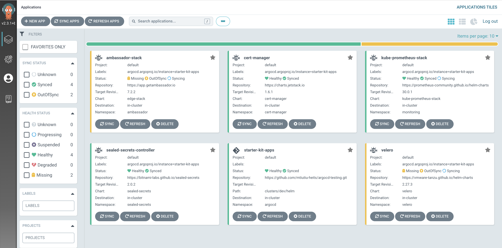
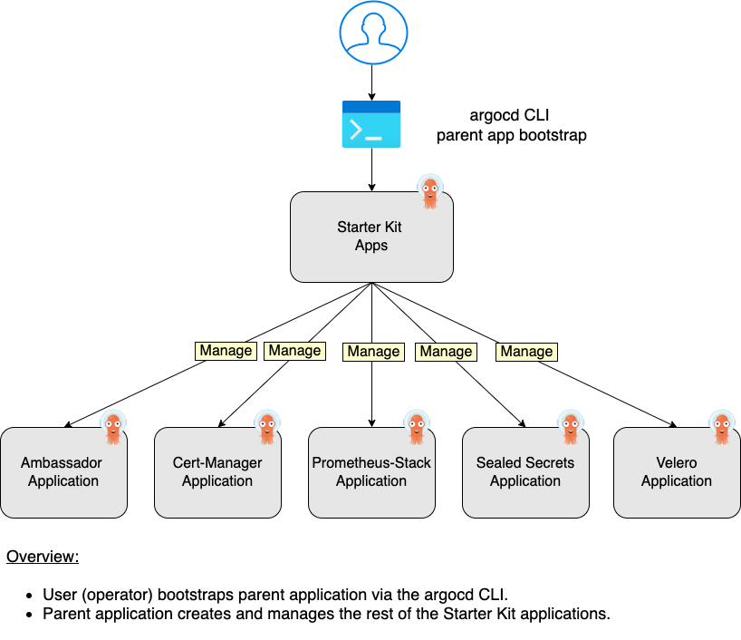
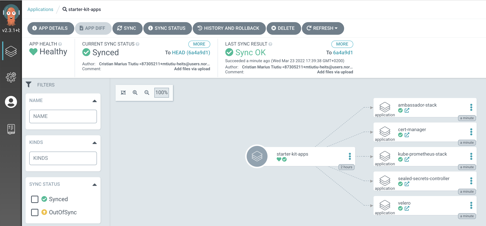
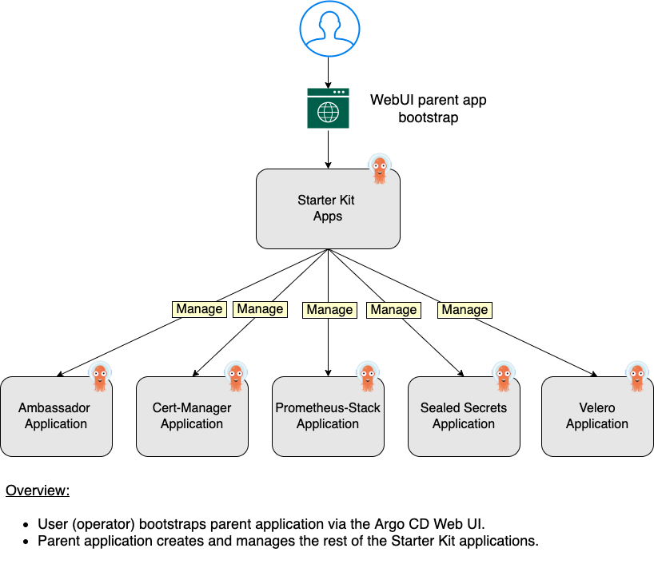
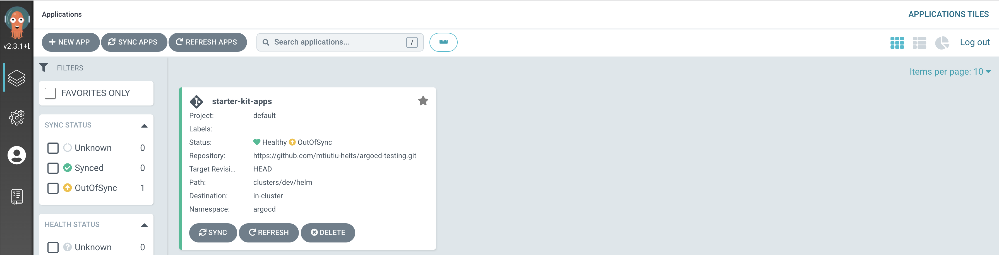
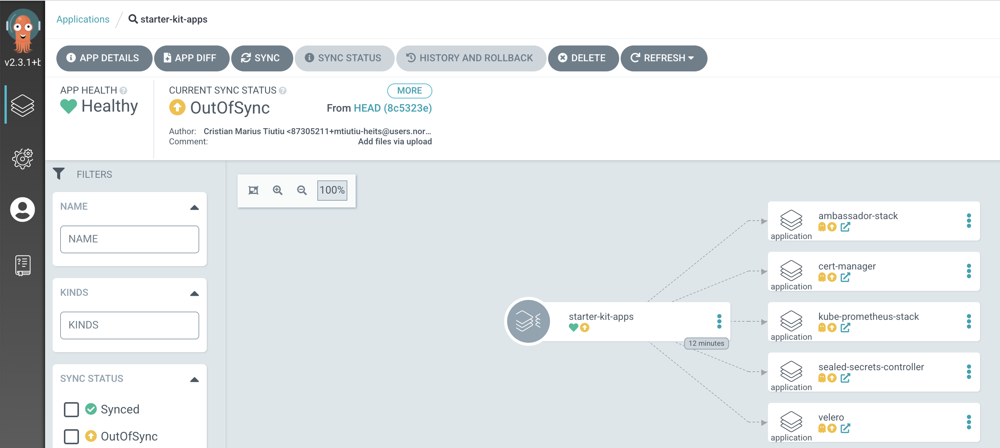
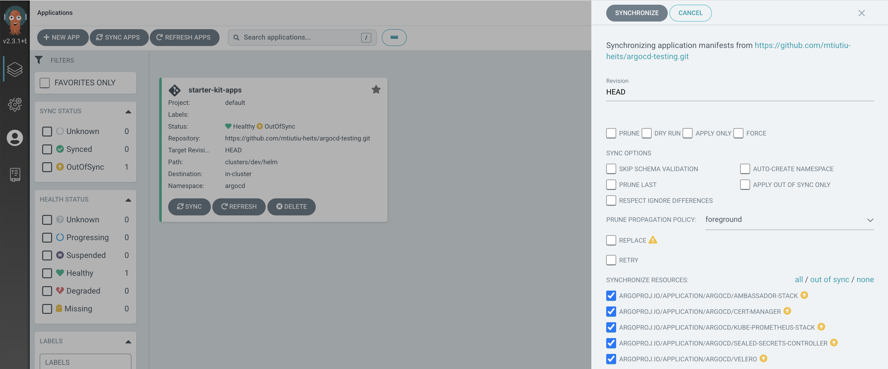
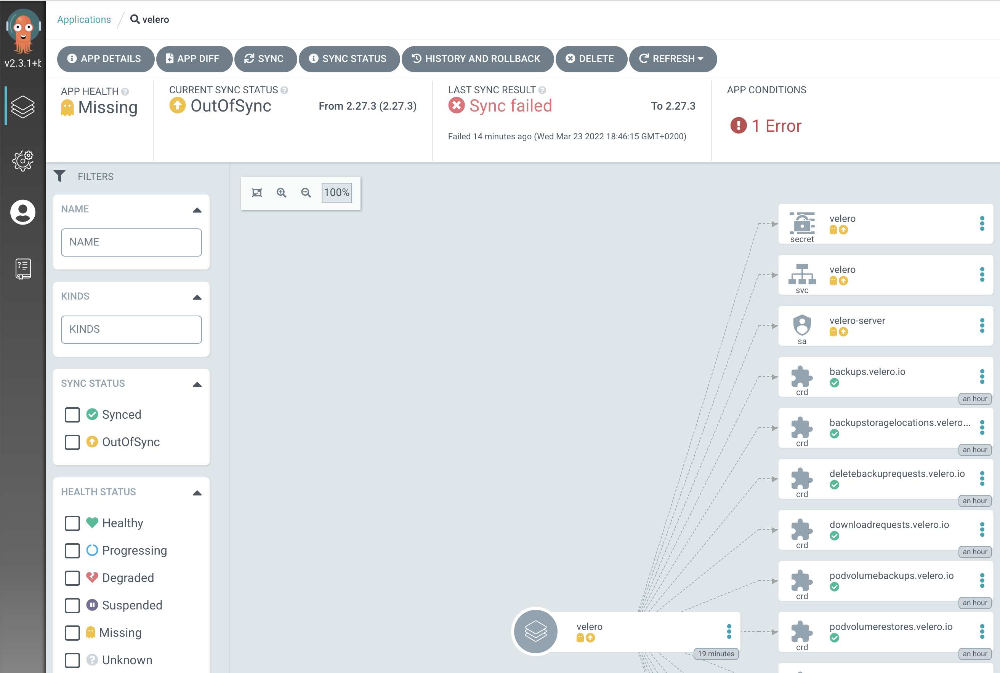
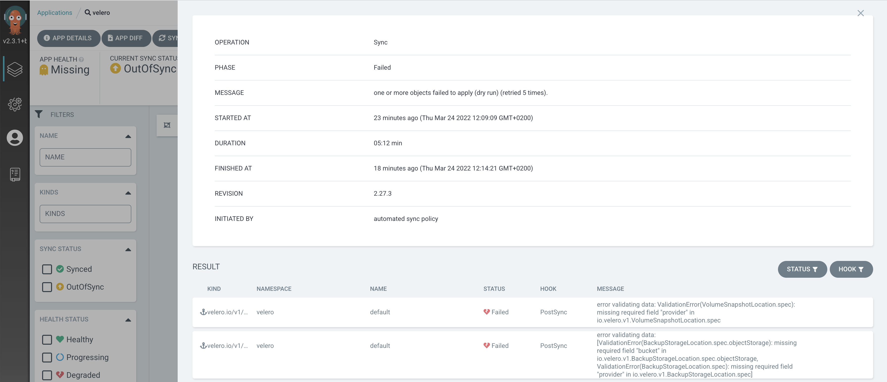

# Implementing GitOps using Argo CD

## Introduction

[Argo CD](https://argoproj.github.io/cd) is a popular open source implementation for doing GitOps continuous delivery on top of Kubernetes. Your applications, definitions, configurations, and environments should be declarative and version controlled. Also application deployment and lifecycle management should be automated, auditable, and easy to understand. All this can be done using Argo.

Argo CD adheres to the same GitOps patterns and principles, thus maintaining your cluster state using a declarative approach. Synchronization happens via a Git repository, where your Kubernetes manifests are being stored. Kubernetes manifests can be specified in several ways:

- [Kustomize](https://kustomize.io) applications.
- [Helm](https://helm.sh) charts.
- [Ksonnet](https://ksonnet.io) applications.
- [Jsonnet](https://jsonnet.org) files.
- Plain directory of YAML/json manifests.
- Any custom config management tool configured as a config management plugin.

As with every application that runs in a Kubernetes cluster, Argo CD is configured via custom resource definitions (CRDs) stored inside YAML manifests. The most important one is the [Application](https://argo-cd.readthedocs.io/en/stable/operator-manual/declarative-setup/#applications) CRD. In an Argo CD application, you define which Git repository should be used to synchronize which Kubernetes cluster. It can be the same Kubernetes cluster where Argo CD is deployed, or an external one.

Argo CD is implemented as a Kubernetes Controller which continuously monitors running applications and compares the current (or live) state against the desired target state (as specified in the Git repo). A deployed application whose live state deviates from the target state is considered `OutOfSync`. Argo CD reports and visualizes the differences, while providing facilities to automatically or manually sync the live state back to the desired target state.

Argo CD offers many features, most notable being:

- Support for multiple config management/templating tools, such as: `Kustomize`, `Helm`, `Ksonnet`, `Jsonnet`, `plain-YAML`.
- Ability to manage and deploy to multiple clusters.
- SSO Integration (`OIDC`, `OAuth2`, `LDAP`, `SAML 2.0`, `GitHub`, `GitLab`, `Microsoft`, `LinkedIn`).
- Multi-tenancy and RBAC policies for authorization.
- Health status analysis of application resources.
- Rollback/Roll-anywhere to any application configuration committed in Git repository.
- Automated configuration drift detection and visualization.
- Web UI which provides real-time view of application activity.
- CLI for automation and CI integration.
- Webhook integration (GitHub, BitBucket, GitLab).
- PreSync, Sync, PostSync hooks to support complex application rollouts (e.g. blue/green and canary upgrades).
- Prometheus metrics.

In this tutorial, you will learn to:

- Use `Helm` to provision `Argo CD` to your `DOKS` cluster.
- Keep your `Kubernetes` cluster applications state synchronized with a `Git` repository (use `GitOps` principles).
- Deploy and manage applications via Argo CD.

After finishing all the steps from this tutorial, you should have a `DOKS` cluster with `Argo CD` deployed, that will:

- Handle cluster reconciliation, via [Application](https://argo-cd.readthedocs.io/en/stable/operator-manual/declarative-setup/#applications) CRDs.
- Handle Helm releases, using [Helm sources](https://argo-cd.readthedocs.io/en/stable/user-guide/helm) defined inside application CRDs.

### DOKS and Argo CD for Helm Releases Overview

Below diagram shows how Argo CD manages Helm applications hosted using a Git repository:


## Table of Contents

- [Introduction](#introduction)
  - [DOKS and Argo CD Automation Overview](#doks-and-argo-cd-automation-overview)
- [Prerequisites](#prerequisites)
- [Understanding Argo CD Concepts for Application Deployment](#understanding-argo-cd-concepts-for-application-deployment)
- [Installing Argo CD](#installing-argo-cd)
  - [Kubectl Based Installation](#kubectl-based-installation)
  - [Helm Based Installation](#helm-based-installation)
- [Accessing and Exploring the Argo CD Web Interface](#accessing-and-exploring-the-argo-cd-web-interface)
- [Getting to Know the Argo CD CLI](#getting-to-know-the-argo-cd-cli)
- [Bootstrapping Argo CD Applications](#bootstrapping-argo-cd-applications)
  - [Preparing Git Repository Layout](#preparing-git-repository-layout)
  - [Using the App of Apps Pattern via the Argo CD CLI](#using-the-app-of-apps-pattern-via-the-argo-cd-cli)
  - [Using the App of Apps Pattern via the Argo CD Web Interface](#using-the-app-of-apps-pattern-via-the-argo-cd-web-interface)
- [Using Argo CD Application Sets](#using-argo-cd-application-sets)
- [Uninstalling Argo CD Applications](#uninstalling-argo-cd-applications)
- [Conclusion](#conclusion)

## Prerequisites

To complete this tutorial, you will need:

1. A working `DOKS` cluster that you have access to. Please follow the Starter Kit [DOKS Setup Guide](../01-setup-DOKS/README.md) to find out more.
2. A [GitHub](https://github.com) repository and branch, to store Argo CD and your applications manifests. **Must be created beforehand.**
3. A [Git](https://git-scm.com/downloads) client, for cloning the `Starter Kit` repository.
4. [Kubectl](https://kubernetes.io/docs/tasks/tools) CLI, for `Kubernetes` interaction. Follow these [instructions](https://www.digitalocean.com/docs/kubernetes/how-to/connect-to-cluster/) to connect to your cluster with `kubectl` and `doctl`.
5. [Argo CLI](https://argo-cd.readthedocs.io/en/stable/cli_installation), to interact with `Argo CD` using the command line interface.
6. [Kubeseal](https://github.com/bitnami-labs/sealed-secrets/releases/tag/v0.18.1), for encrypting secrets and [Sealed Secrets Controller](https://github.com/bitnami-labs/sealed-secrets) interaction.
7. [Helm](https://www.helm.sh), for managing `Argo CD` releases and upgrades (optional, but recommended in general for production systems).

## Understanding Argo CD Concepts for Application Deployment

Argo CD is using the [Application](https://argo-cd.readthedocs.io/en/stable/operator-manual/declarative-setup/#applications) core concept to manage applications deployment and lifecycle. Inside an Argo CD application manifest you define the Git repository hosting your application definitions, as well as the corresponding Kubernetes cluster to deploy applications. In other words, an Argo CD application defines the relationship between a source repository and a Kubernetes cluster. It's a very concise and scalable design, where you can associate multiple sources (Git repositories) and corresponding Kubernetes clusters.

A major benefit of using applications is that you don't need to deploy Argo to each cluster individually. You can use a dedicated cluster for Argo, and deploy applications to all clusters at once from a single place. This way, you avoid Argo CD downtime or loss, in case other environments have issues or get decommissioned.

On top of that, you can group similar applications into a [Project](https://argo-cd.readthedocs.io/en/stable/user-guide/projects). Projects permit logical grouping of applications and associated roles/permissions, when working with multiple teams. When not specified, each new application belongs to the `default` project. The `default` project is created automatically, and it doesn't have any restrictions. The default project can be modified, but not deleted.

`Starter Kit` is using the `default` project for a quick jump start using Argo CD. Then, you will learn how to create an `Application` for each `Starter Kit component`, and use `Helm charts` as the `application source`. Argo CD is not limited to [Helm](https://argo-cd.readthedocs.io/en/stable/user-guide/helm) sources only, and you can also leverage the power of [Kustomize](https://argo-cd.readthedocs.io/en/stable/user-guide/kustomize), [Ksonnet](https://argo-cd.readthedocs.io/en/stable/user-guide/ksonnet), [Jsonnet](https://argo-cd.readthedocs.io/en/stable/user-guide/jsonnet), etc. Please take a look at the [application sources](https://argo-cd.readthedocs.io/en/stable/user-guide/application_sources) page for more details.

Although you can use the graphical UI (web interface) of Argo CD to create applications, Starter Kit relies on the GitOps declarative way, via YAML manifests. Each YAML configuration acts as a recipe for each application, thus it can be stored in a Git repository. It means, you can always recreate your Argo CD setup if you re-create your environment, or move to another cluster. More important, you can perform audits and track each change via Git history. It's best practice to also have the Argo CD configuration files in a separate Git repository, than the one used for your application development. You can read the best [practices page](https://argo-cd.readthedocs.io/en/stable/user-guide/best_practices/) from the Argo CD official documentation website for more information on the topic.

**Important note:**

An important aspect to keep in mind is that by default Argo CD doesn't automatically synchronize your new applications. When an ArgoCD Application is first created, its state is `OutOfSync`. It means, Git repository state pointed by the ArgoCD Application doesn’t match Kubernetes cluster state. Creating a new ArgoCD Application doesn't trigger an automatic deployment on the target cluster.

To enable automatic synchronization and deletion of orphaned resources (pruning), you need to create a `syncPolicy`. You can also configure Argo CD to automatically revert manual changes made via `kubectl`. You can read more about [auto sync policies](https://argo-cd.readthedocs.io/en/stable/user-guide/auto_sync) on the official documentation website.

Typical `Application CRD` using a Git repository source, looks like below:

```yaml
apiVersion: argoproj.io/v1alpha1
kind: Application
metadata:
  name: my-apps
  namespace: argocd
spec:
  project: default
  source:
    repoURL: https://github.com/myrepo/my-apps.git
    targetRevision: HEAD
    path: apps
  destination:
    server: https://kubernetes.default.svc
    namespace: my-apps
  syncPolicy:
    automated:
      prune: true
      selfHeal: true
```

Explanations for the above configuration:

- `spec.project`: Tells Argo CD what project to use for the application (`default` in this example).
- `spec.source.repoURL`: Git repository URL used for synchronizing cluster state.
- `spec.source.targetRevision`: Git repository revision used for synchronization (can be a branch or tag name as well).
- `spec.source.path`: Git repository path where source files (YAML manifests) are stored.
- `spec.destination.server`: Target Kubernetes cluster address. Usually points to `https://kubernetes.default.svc`, if Argo CD is using the same cluster where it's deployed.
- `spec.destination.namespace`: Kubernetes namespace to use for your application.
- `spec.syncPolicy.automated`: Enables automated syncing of applications in your cluster with a Git repository.
- `spec.syncPolicy.automated.prune`: Prune specifies whether to delete resources from the cluster that are not found in the sources anymore as part of the automated sync.
- `spec.syncPolicy.automated.selfHeal`: Specifies whether to revert resources back to their desired state upon manual modification in the cluster (e.g. via `kubectl`).

You can also use Helm repositories as a source for installing applications in your cluster. Typical `Application CRD` using a Helm repository source, looks like below (similar to the Git repository example, except a Helm chart repository is used instead):

```yaml
apiVersion: argoproj.io/v1alpha1
kind: Application
metadata:
  name: sealed-secrets
  namespace: argocd
spec:
  project: default
  source:
    chart: sealed-secrets
    repoURL: https://bitnami-labs.github.io/sealed-secrets
    targetRevision: 2.4.0
    helm:
      releaseName: sealed-secrets
      values: |
        replicaCount: 2
  destination:
    server: "https://kubernetes.default.svc"
    namespace: kubeseal
```

Explanations for the above configuration:

- `spec.source.chart`: Helm chart to use as a source for the application.
- `spec.source.repoURL`: Helm chart repository URL.
- `spec.source.targetRevision`: Helm chart version to use for the application.
- `spec.source.helm.releaseName`: Helm release name to create in your Kubernetes cluster.
- `spec.source.helm.values`: Specifies Helm values to be passed to helm template, typically defined as a block.
- `spec.destination.server`: Target Kubernetes cluster address. Usually points to `https://kubernetes.default.svc`, if Argo CD is using the same cluster where it's deployed.
- `spec.destination.namespace`: Kubernetes namespace to use for your application.

Please go ahead and read more about Argo CD [core concepts](https://argo-cd.readthedocs.io/en/stable/core_concepts) on the official documentation website. Next, you're going to discover the available install options to deploy Argo CD in your Kubernetes cluster.

## Installing Argo CD

Argo CD can be installed either using `kubectl`, or `Helm`:

1. Using `kubectl` and an install manifest file. This method doesn't offer direct control for various install parameters. If you're not very familiar with Helm based installations, this is the most straightforward option to start with.
2. [Helm](https://github.com/argoproj/argo-helm/tree/master/charts/argo-cd) based installation. Offers more granular control for the Argo CD application deployment and lifecycle. Recommended for `HA` (High Availability) setups and if Argo CD is used in `production`.

Next, depending on the features you want available, you have two options:

- `Multi-Tenant` mode. This type of installation is typically used to service multiple application developer teams in the organization and maintained by a platform team. The end-users can access Argo CD via the `API server` using the `Web UI` or `argocd` CLI.
- `Core` only mode. This is a trimmed down install, without the graphical user interface, API server, SSO, etc, and installs the lightweight (non-HA) version of each component.

Starter Kit is using the `Multi-Tenant` and `High Availability` mode to install Argo CD in your DOKS cluster. This way, you will have a reliable setup and explore all the available features, including the user interface. Please visit the [install methods](https://argo-cd.readthedocs.io/en/stable/operator-manual/installation) documentation page, for more information on the topic.

### Kubectl Based Installation

This method requires `kubectl`, and it's a two steps process:

1. Create a `namespace`, to deploy Argo CD itself.
2. Run the HA installation manifest, via `kubectl`.

Please run below commands in order:

```shell
kubectl create namespace argocd
kubectl apply -n argocd -f https://raw.githubusercontent.com/argoproj/argo-cd/stable/manifests/ha/install.yaml
```

Now, please go ahead and check if the installation was successful. First, check if all Argo CD deployments are healthy:

```shell
kubectl get deployments -n argocd
```

The output looks similar to (check the `READY` column - all `Pods` must be running):

```text
NAME                               READY   UP-TO-DATE   AVAILABLE   AGE
argocd-applicationset-controller   1/1     1            1           51s
argocd-dex-server                  1/1     1            1           50s
argocd-notifications-controller    1/1     1            1           50s
argocd-redis-ha-haproxy            3/3     3            3           50s
argocd-repo-server                 2/2     2            2           49s
argocd-server                      2/2     2            2           49s
```

Argo CD server must have a `replicaset` minimum value of `2` for the `HA` mode. If for some reason some deployments are not healthy, please check Kubernetes events and logs for the affected component Pods.

### Helm Based Installation

This method requires [Helm](https://helm.sh) to be installed on your local machine. Starter Kit provides a ready to use Helm values file to start with. and installs Argo CD in HA mode (without autoscaling).

Please follow below steps to complete the Helm based installation:

1. First clone the Starter Kit directory (if not already), and change directory to your local copy:

    ```shell
    git clone https://github.com/digitalocean/Kubernetes-Starter-Kit-Developers.git

    cd Kubernetes-Starter-Kit-Developers
    ```

2. Next, add the Argo CD Helm repository:

    ```shell
    helm repo add argo https://argoproj.github.io/argo-helm

    helm repo update argo 
    ```

3. Now, search the `argo` Helm repository for available charts to install:

    ```shell
    helm search repo argo
    ```

    The output looks similar to:

    ```text
    NAME                            CHART VERSION   APP VERSION     DESCRIPTION                                       
    argo/argo                       1.0.0           v2.12.5         A Helm chart for Argo Workflows                   
    argo/argo-cd                    4.9.4           v2.4.0          A Helm chart for Argo CD, a declarative, GitOps...
    ...
    ```

4. Then, open and inspect the Argo CD Helm values file provided in the Starter Kit repository, using an editor of your choice (preferably with YAML lint support). For example, you can use [VS Code](https://code.visualstudio.com):

    ```shell
    code 15-continuous-delivery-using-gitops/assets/manifests/argocd/argocd-values-v4.9.4.yaml
    ```

5. Finally, deploy Argo CD to your DOKS cluster:

    ```shell
    HELM_CHART_VERSION="4.9.4"

    helm install argocd argo/argo-cd --version "${HELM_CHART_VERSION}" \
      --namespace argocd \
      --create-namespace \
      -f "15-continuous-delivery-using-gitops/assets/manifests/argocd/argocd-values-v${HELM_CHART_VERSION}.yaml"
    ```

**Note:**

A `specific` version for the `Helm` chart is used. In this case `4.9.4` is picked, which maps to the `2.4.0` version of the application. It’s good practice in general, to lock on a specific version. This helps to have predictable results, and allows versioning control via `Git`.

Now, check if the Helm release was successful:

```shell
helm ls -n argocd
```

The output looks similar to (`STATUS` column value should be set to `deployed`):

```text
NAME    NAMESPACE       REVISION        UPDATED                                 STATUS          CHART           APP VERSION
argocd  argocd          1               2022-03-23 11:22:48.486199 +0200 EET    deployed        argo-cd-4.9.4   v2.4.0
```

Finally, verify Argo CD application deployment status:

```shell
kubectl get deployments -n argocd
```

The output looks similar to (check the `READY` column - all `Pods` must be running):

```text
NAME                               READY   UP-TO-DATE   AVAILABLE   AGE
argocd-applicationset-controller   1/1     1            1           2m9s
argocd-dex-server                  1/1     1            1           2m9s
argocd-notifications-controller    1/1     1            1           2m9s
argocd-redis-ha-haproxy            3/3     3            3           2m9s
argocd-repo-server                 2/2     2            2           2m9s
argocd-server                      2/2     2            2           2m9s
```

Argo CD server must have a `replicaset` minimum value of `2` for the `HA` mode. If for some reason some deployments are not healthy, please check Kubernetes events and logs for the affected component Pods.

You can also find more information about the Argo CD Helm chart by accessing the community maintained [repository](https://github.com/argoproj/argo-helm/tree/master/charts/argo-cd).

Next, you're going to learn how to access and explore the main features of the graphical user interface provided by Argo CD.

## Accessing and Exploring the Argo CD Web Interface

One of the neat features that Argo CD has to offer is the web interface, used to perform various administrative tasks and view application deployments status. You can create applications using the graphical user interface, and interact with Argo CD in various ways. Another important feature, is the ability to inspect each application state and access Kubernetes events, as well as your application logs. On top of that, Argo CD provides a visual representation of all Kubernetes objects (replicasets, pods, etc) each application deployment is using.

The web interface can be accessed by port-forwarding the `argocd-server` Kubernetes service. Please run below command in a shell terminal:

```shell
kubectl port-forward svc/argocd-server -n argocd 8080:443
```

Now, open a web browser and navigate to [localhost:8080](http://localhost:8080) (please ignore the invalid TLS certificates for now). You will be greeted with the Argo CD log in page. The default administrator username is `admin`, and the password is generated randomly at installation time. You can fetch it by running below command:

```shell
kubectl -n argocd get secret argocd-initial-admin-secret -o jsonpath="{.data.password}" | base64 -d; echo
```

Next, you will be redirected to the applications dashboard page. From here you can view, create or manage applications via the UI (an YAML editor is also available), as well as perform sync or refresh operations:



If you click on any application tile, a visual representation of all involved objects is also shown:


In the next section, you can manage your application projects, repositories and clusters:


Finally, the user info section shows the available users and allows for administrator password update:


You can play around and explore each section and sub-section in detail to see all the available features. Next, you will learn how to use the CLI counterpart, named `argocd`.

## Getting to Know the Argo CD CLI

Argo CD allows same set of features to be used either via the web interface, or via the CLI. To use the `argocd` CLI, you need to open a separate shell window and just type `argocd` without any arguments. By default, it will display the available commands and options:

```text
argocd controls a Argo CD server

Usage:
  argocd [flags]
  argocd [command]

Available Commands:
  account     Manage account settings
  admin       Contains a set of commands useful for Argo CD administrators and requires direct Kubernetes access
  app         Manage applications
  cert        Manage repository certificates and SSH known hosts entries
  cluster     Manage cluster credentials
  completion  output shell completion code for the specified shell (bash or zsh)
  context     Switch between contexts
  gpg         Manage GPG keys used for signature verification
  help        Help about any command
...
```

For any command or sub-command, you can invoke the corresponding help page using the following pattern: `argocd <command/subcommand> --help`. For example, if you want to check what options are available for the `app` command:

```shell
argocd app --help
```

The output looks similar to:

```text
Manage applications

Usage:
  argocd app [flags]
  argocd app [command]

Examples:
  # List all the applications.
  argocd app list
  
  # Get the details of a application
  argocd app get my-app
...
```

Please go ahead and explore other commands/subcommands as well to see all the available options. Next, you will learn how to bootstrap your first Argo CD application, which will automatically deploy all Starter Kit components.

## Bootstrapping Argo CD Applications

On a fresh install, Argo CD doesn't know where to sync your applications from, or what Git repositories are available for sourcing application manifests. So, the first step is to perform a one time operation called bootstrapping. You can perform all the operations presented in this section by either using the [argocd](https://argo-cd.readthedocs.io/en/stable/cli_installation) CLI, or the graphical user interface.

There are multiple ways of bootstrapping your cluster (e.g. via scripts), but usually Argo CD users make use of the `app of apps` pattern. It means, you will start by creating a parent application using the argocd CLI (or the web interface), which in turn will reference and bootstrap the rest of applications in your Kubernetes cluster.

### Preparing Git Repository Layout

First you need to prepare your Git repository to use a consistent layout. In the following example, you will create a Git repository layout structure similar to:

```text
clusters
└── dev
    └── helm
        ├── cert-manager-v1.8.0.yaml
        ├── nginx-v4.1.3.yaml
        ├── prometheus-stack-v35.5.1.yaml
        ├── sealed-secrets-v2.4.0.yaml
        └── velero-v2.29.7.yaml
```

Please open a terminal, and follow below steps to create the layout for your Git repository:

1. First, clone your git repository used for testing Argo CD (make sure to replace the `<>` placeholders accordingly):

    ```shell
    git clone <YOUR_ARGOCD_GIT_REPOSITORY_ADDRESS>
    ```

2. Next, change directory to your local copy and create the directory structure (make sure to replace the `<>` placeholders accordingly):

    ```shell
    cd <YOUR_GIT_REPO_LOCAL_COPY_DIRECTORY>

    mkdir -p clusters/dev/helm
    ```

3. Copy application manifests provided for each component in the Starter Kit repository (you can also take a look and see how each [manifest](assets/manifests/argocd/applications/helm) is structured):

    ```shell
    CERT_MANAGER_CHART_VERSION="1.8.0"
    NGINX_CHART_VERSION="4.1.3"
    PROMETHEUS_CHART_VERSION="35.5.1"
    SEALED_SECRETS_CHART_VERSION="2.4.0"
    VELERO_CHART_VERSION="2.29.7"

    curl "https://raw.githubusercontent.com/digitalocean/Kubernetes-Starter-Kit-Developers/main/15-continuous-delivery-using-gitops/assets/manifests/argocd/applications/helm/cert-manager-v${CERT_MANAGER_CHART_VERSION}.yaml" > "clusters/dev/helm/cert-manager-v${CERT_MANAGER_CHART_VERSION}.yaml"

    curl "https://raw.githubusercontent.com/digitalocean/Kubernetes-Starter-Kit-Developers/main/15-continuous-delivery-using-gitops/assets/manifests/argocd/applications/helm/nginx-v${NGINX_CHART_VERSION}.yaml" > "clusters/dev/helm/nginx-v${NGINX_CHART_VERSION}.yaml"

    curl "https://raw.githubusercontent.com/digitalocean/Kubernetes-Starter-Kit-Developers/main/15-continuous-delivery-using-gitops/assets/manifests/argocd/applications/helm/prometheus-stack-v${PROMETHEUS_CHART_VERSION}.yaml" > "clusters/dev/helm/prometheus-stack-v${PROMETHEUS_CHART_VERSION}.yaml"

    curl "https://raw.githubusercontent.com/digitalocean/Kubernetes-Starter-Kit-Developers/main/15-continuous-delivery-using-gitops/assets/manifests/argocd/applications/helm/sealed-secrets-v${SEALED_SECRETS_CHART_VERSION}.yaml" > "clusters/dev/helm/sealed-secrets-v${SEALED_SECRETS_CHART_VERSION}.yaml"

    curl "https://raw.githubusercontent.com/digitalocean/Kubernetes-Starter-Kit-Developers/main/15-continuous-delivery-using-gitops/assets/manifests/argocd/applications/helm/velero-v${VELERO_CHART_VERSION}.yaml" > "clusters/dev/helm/velero-v${VELERO_CHART_VERSION}.yaml"
    ```

4. Finally, commit changes and push to origin.

Next, you will create the parent application deployment, and let Argo CD synchronize all Starter Kit applications automatically to your DOKS cluster.

### Using the App of Apps Pattern via the Argo CD CLI

In this section, you will learn how to use the argocd CLI to create and make use of the `app of apps` pattern to deploy all Starter Kit components in your DOKS cluster. Below picture illustrates the main concept:



First, you need to port-forward the Argo CD main server on your local machine in a separate terminal window:

```shell
kubectl port-forward svc/argocd-server -n argocd 8080:443
```

Next, Argo CD API server access is required for argocd CLI to work. Using another terminal window, you need to authenticate the argocd client with your Argo CD server instance:

```shell
ADMIN_USER="admin"
ADMIN_PASSWD="$(kubectl -n argocd get secret argocd-initial-admin-secret -o jsonpath="{.data.password}" | base64 -d)"

argocd login localhost:8080 --username $ADMIN_USER --password $ADMIN_PASSWD --insecure
```

The output looks similar to:

```text
'admin:login' logged in successfully
Context 'localhost:8080' updated
```

Then, please run below command to create the `starter-kit-apps` parent application (make sure to replace the `<>` placeholders accordingly):

```shell
argocd app create starter-kit-apps \
    --dest-namespace argocd \
    --dest-server https://kubernetes.default.svc \
    --repo https://github.com/<YOUR_GITHUB_USERNAME>/<YOUR_ARGOCD_GITHUB_REPO_NAME>.git \
    --path clusters/dev/helm
```

Above command will create a new `Argo CD application` named `starter-kit-apps` in the `argocd` namespace, configured to:

- Target the same Kubernetes cluster where Argo CD is deployed, because `--dest-server` is set to `https://kubernetes.default.svc`.
- Use the GitHub repository set by the `--repo` argument to synchronize your cluster.
- Scan and apply all application manifests found in the `clusters/dev/helm` directory (`--path` argument).

Next, you need to sync the `starter-kit-apps` application (remember that Argo CD doesn't sync anything by default, unless specified):

```shell
argocd app sync starter-kit-apps 
```

The output looks similar to:

```text
TIMESTAMP                  GROUP        KIND             NAMESPACE   NAME                       STATUS     HEALTH  ...
2022-03-23T17:39:38+02:00  argoproj.io  Application      argocd      sealed-secrets-controller  OutOfSync  Missing ...            
2022-03-23T17:39:38+02:00  argoproj.io  Application      argocd      velero                     OutOfSync  Missing ...             
2022-03-23T17:39:38+02:00  argoproj.io  Application      argocd      ingress-nginx              OutOfSync  Missing ...
...
GROUP        KIND         NAMESPACE  NAME                       STATUS  HEALTH  HOOK  MESSAGE
argoproj.io  Application  argocd     sealed-secrets-controller  Synced                application.argoproj.io/sealed-secrets-controller created
argoproj.io  Application  argocd     ingress-nginx              Synced                application.argoproj.io/ingress-nginx created
argoproj.io  Application  argocd     kube-prometheus-stack      Synced                application.argoproj.io/kube-prometheus-stack created
argoproj.io  Application  argocd     velero                     Synced                application.argoproj.io/velero created
argoproj.io  Application  argocd     cert-manager               Synced                application.argoproj.io/cert-manager created
```

After above command finishes, you should see a new application present in the main dashboard of your Argo CD server. Please open a web browser, and navigate to [localhost:8080](http://localhost:8080). Then select the `Applications` tab, and click on the `starter-kit-apps` tile (notice the `app of apps` pattern, by looking at the composition graph):



You can also inspect the new applications via the CLI:

```shell
argocd app list
```

The output looks similar to:

```text
NAME                       CLUSTER                         NAMESPACE       PROJECT  STATUS     HEALTH   SYNCPOLICY  ...
ingress-nginx              https://kubernetes.default.svc  ingress-nginx   default  OutOfSync  Missing  Auto-Prune  ...
cert-manager               https://kubernetes.default.svc  cert-manager    default  OutOfSync  Missing  Auto-Prune  ...
kube-prometheus-stack      https://kubernetes.default.svc  monitoring      default  OutOfSync  Missing  Auto-Prune  ...
sealed-secrets-controller  https://kubernetes.default.svc  sealed-secrets  default  OutOfSync  Missing  Auto-Prune  ...
starter-kit-apps           https://kubernetes.default.svc  argocd          default  Synced     Healthy  <none>      ...  
velero                     https://kubernetes.default.svc  velero          default  OutOfSync  Missing  Auto-Prune  ...
```

The `starter-kit-apps` parent application will appear as in-sync but the child apps will be out of sync. Next, you can either sync everything by using the web interface, or via the CLI:

```shell
argocd app sync -l argocd.argoproj.io/instance=starter-kit-apps
```

The sync operation may take a while to complete (even up to 5-10 minutes), depending on the complexity and number of Kubernetes objects of all applications being deployed.

After a while, please list all applications again:

```shell
argocd app list
```

The output looks similar to (notice that all applications are synced now):

```text
NAME                       CLUSTER                         NAMESPACE       PROJECT  STATUS    HEALTH   SYNCPOLICY  CONDITIONS ...
ingress-nginx              https://kubernetes.default.svc  ingress-nginx   default  Synced    Healthy  Auto-Prune  <none>     ...
cert-manager               https://kubernetes.default.svc  cert-manager    default  Synced    Healthy  Auto-Prune  <none>     ...
kube-prometheus-stack      https://kubernetes.default.svc  monitoring      default  Synced    Healthy  Auto-Prune  <none>     ...
sealed-secrets-controller  https://kubernetes.default.svc  sealed-secrets  default  Synced    Healthy  Auto-Prune  <none>     ...
starter-kit-apps           https://kubernetes.default.svc  argocd          default  Synced    Healthy  <none>      <none>     ...
velero                     https://kubernetes.default.svc  velero          default  OutOfSync Missing  Auto-Prune  SyncError  ...
```

**Important note:**

The Velero application deployment will fail, and left on purpose in the `SyncError` state as an exercise for the reader to get familiar and learn how to diagnose application problems in Argo CD. Please consult the **Hints** section below to see how to diagnose Argo CD applications issues.

Bootstrapping the parent application is a one-time operation. On subsequent Git changes for each application, Argo CD will detect the drift and apply required changes. Argo CD is using a `polling mechanism` by default, to detect changes in your Git repository. The default `refresh interval` is set to `3 minutes`. Instead of relying on a polling mechanism, you can also leverage the power of Git webhooks. Please visit the official documentation website to learn how to create and configure Argo CD to use Git [webhooks](https://argo-cd.readthedocs.io/en/stable/operator-manual/webhook).

**Hints:**

- If desired, you can configure the parent application to be synced automatically (and also enable self healing and automatic pruning), you can use the following command (don't forget to replace the `<>` placeholders accordingly):

    ```shell
    argocd app create starter-kit-apps \
      --dest-namespace argocd \
      --dest-server https://kubernetes.default.svc \
      --repo https://github.com/<YOUR_GITHUB_USERNAME>/<YOUR_ARGOCD_GITHUB_REPO_NAME>.git \
      --path clusters/dev/helm \
      --sync-policy automated \
      --auto-prune \
      --self-heal
    ```

- In case of any synchronization failures, you can always inspect the Kubernetes events for the application in question (via `argocd app get <application_name>`):

    ```shell
    argocd app get velero
    ```

    The output looks similar to:

    ```text
    Name:               velero
    Project:            default
    Server:             https://kubernetes.default.svc
    Namespace:          velero
    URL:                https://argocd.example.com/applications/velero
    Repo:               https://vmware-tanzu.github.io/helm-charts
    Target:             2.27.3
    Path:               
    SyncWindow:         Sync Allowed
    Sync Policy:        Automated (Prune)
    Sync Status:        OutOfSync from 2.27.3
    Health Status:      Missing

    CONDITION  MESSAGE                                                                                          LAST TRANSITION
    SyncError  Failed sync attempt to 2.27.3: one or more objects failed to apply (dry run) (retried 5 times).  2022-03-24 12:14:21 +0200 EET


    GROUP                      KIND                      NAMESPACE  NAME                               STATUS     HEALTH      HOOK      MESSAGE
    velero.io                  VolumeSnapshotLocation    velero     default                            Failed     SyncFailed  PostSync  error validating data: ValidationError(VolumeSnapshotLocation.spec): missing required field "provider" in io.velero.v1.VolumeSnapshotLocation.spec
    velero.io                  BackupStorageLocation     velero     default                            Failed     SyncFailed  PostSync  error validating data: [ValidationError(BackupStorageLocation.spec.objectStorage): missing required field "bucket" in io.velero.v1.BackupStorageLocation.spec.objectStorage, ValidationError(BackupStorageLocation.spec): missing required field "provider" in io.velero.v1.BackupStorageLocation.spec]
    ...
    ```

Next, you will learn how to use the `app of apps patern` and perform the same steps via the Argo CD graphical user interface.

### Using the App of Apps Pattern via the Argo CD Web Interface

In this section, you will learn how to use the Argo CD web interface to create and make use of the `app of apps` pattern to deploy all Starter Kit components in your DOKS cluster. Below picture illustrates the main concept:



As seen in the above diagram, bootstrapping a new application via the web interface is very similar to the CLI counterpart. The only difference is that you will navigate between different panels/windows, and use point and click operations. Behind the scenes, Argo CD will create the required application CRDs, and apply changes to your Kubernetes cluster.

First, please open a web browser and log in to the Argo CD web console. The default user name is `admin`, and default password is obtained via:

```shell
kubectl -n argocd get secret argocd-initial-admin-secret -o jsonpath="{.data.password}" | base64 -d; echo
```

Once logged in, you will be redirected to the applications dashboard page (on a fresh install, the dashboard is empty). Next, click on the `Create Application` button. A new panel pops up asking for application details:


Please fill in each field appropriately:

- `Application Name`: The new application name (e.g. `starter-kit-apps`).
- `Project`: The project name this application belongs to (when using Argo CD for the first time, you can use `default`).
- `Sync Policy` and `Sync Options`: Configures sync policy and options (e.g. `Manual`, `Automatic`, number of retries, interval between retries, etc).
- Source `Repository URL`: Your GitHub repository URL address - e.g. `https://github.com/<YOUR_GITHUB_USERNAME>/<YOUR_ARGOCD_GITHUB_REPO_NAME>.git`.
- Source `Path`: GitHub repository directory path where application manifests are stored (e.g. `clusters/dev/helm`).
- Destination `Cluster URL`: Target Kubernetes cluster to synchronize with your GitHub repository (e.g. `https://kubernetes.default.svc` for the local cluster where Argo CD is deployed).
- Destination `Namespace`: Target Kubernetes cluster namespace to use for Argo CD applications (`argocd`, usually).

After filling all application details, click on the Create button at the top. A new application tile shows up on the dashboard page:



If you click on the application tile, you can observe the `app of apps pattern`, by looking at the composition graph:



If you look at the above picture, you will notice that all applications are marked as `OutOfSync`. Next step is to trigger a sync operation on the parent application. Then, all child applications will be synced as well. Please go ahead and press the `Sync` button on the parent application tile. A new panel pops up on the right side (notice that all child apps are selected down below):



Leave on the default values, then press on the `Synchronize` button at the top and watch how Argo CD cascades the sync operation to all applications:


**Important note:**

The Velero application deployment will fail, and left on purpose in the `SyncError` state as an exercise for the reader to get familiar and learn how to diagnose application problems in Argo CD. Please consult the **Hints** section below to see how to diagnose Argo CD applications issues.

If everything goes well, all applications should have a green border and status should be `Healthy` and `Synced`. The bootstrapping process is a one-time operation. On subsequent Git changes for each application, Argo CD will detect the drift and apply required changes. Argo CD is using a `polling mechanism` by default, to detect changes in your Git repository. The default `refresh interval` is set to `3 minutes`. Instead of relying on a polling mechanism, you can also leverage the power of Git webhooks. Please visit the official documentation website to learn how to create and configure Argo CD to use Git [webhooks](https://argo-cd.readthedocs.io/en/stable/operator-manual/webhook).

**Hints:**

- If desired, you can configure the parent application to be synced automatically, by setting the `SYNC POLICY` field value to `Automatic`. To enable self healing and automatic pruning, tick the `PRUNE RESOURCES` and `SELF HEAL` checkboxes:

  

- In case of any synchronization failures, you can always inspect the Kubernetes events for the application in question. Using the web interface, you can navigate to the affected application tile:

  

  Then, click on the `Sync failed` message link flagged in red color, from the `LAST SYNC RESULT` section in the application page header. A new panel pops up, showing useful information about why the sync operation failed:

  

In the next section, you will learn how to manage multiple applications at once using a single CRD - the `ApplicationSet`.

## Using Argo CD Application Sets

[Application Sets](https://argo-cd.readthedocs.io/en/stable/user-guide/application-set) is another powerful feature offered by Argo CD. The [ApplicationSet Controller](https://github.com/argoproj/applicationset) is a sub project of Argo CD which adds application automation via templated definitions. This feature helps you avoid repetitions in your application manifests (make use of the DRY principle).

The ApplicationSet controller is installed alongside Argo CD (within the same namespace), and it automatically generates Argo CD Applications based on the contents of a new ApplicationSet Custom Resource (CR).

**Note:**

Starting with version `2.3.x` of Argo CD, you don't need to install the `ApplicationSet Controller` separately, because it's part of the Argo CD main installation. Starter Kit is using `version >= 2.3.1`, so you don't need to touch anything.

The main idea of an `ApplicationSet` is based on having a list of values acting as a `generator`, and a `template` which gets populated by the input list values. For each item from the list, a new application template is generated in sequence. Basically, you define one ApplicationSet CRD, and then let it generate for you as many ArgoCD Application CRDs you want, based on the input values. Thus, instead of creating and dealing with multiple `Application manifests`, you manage everything via a `single manifest` - the `ApplicationSet`.

This concept also simplifies the management of `multi-cluster` and `multi-environment` setups, by using parameterized application templates. Application sets include other generators as well, besides [List Generators](https://argocd-applicationset.readthedocs.io/en/stable/Generators-List):

- [Cluster](https://argocd-applicationset.readthedocs.io/en/stable/Generators-Cluster) generator: Uses Argo CD-defined clusters to template applications.
- [Git](https://argocd-applicationset.readthedocs.io/en/stable/Generators-Git) generator: Uses the files/directories of a Git repository to template applications.

Typical `ApplicationSet CRD` using a `List Generator`, looks like below:

```yaml
apiVersion: argoproj.io/v1alpha1
kind: ApplicationSet
metadata:
  name: my-app
spec:
  generators:
    - list:
        elements:
          - cluster: dev
            url: https://kubernetes.dev.svc
          - cluster: qa
            url: https://kubernetes.qa.svc
          - cluster: prod
            url: https://kubernetes.prod.svc
  template:
    metadata:
      name: '{{cluster}}-app'
    spec:
      project: default
      source:
        repoURL: https://github.com/myrepo/my-applicationset.git
        targetRevision: HEAD
        path: clusters/{{cluster}}/my-apps
      destination:
        server: '{{url}}'
        namespace: argocd
```

Applying the above `ApplicationSet` to your Kubernetes cluster will render three Argo CD applications. For example, the `dev` environment application is rendered as shown below:

```yaml
apiVersion: argoproj.io/v1alpha1
kind: Application
metadata:
  name: dev-app
spec:
  project: default
  source:
    repoURL: https://github.com/myrepo/my-applicationset.git
    targetRevision: HEAD
    path: clusters/dev/my-apps
  destination:
    server: https://kubernetes.dev.svc
    namespace: argocd
```

Template engines are very powerful in nature and offer lots of possibilities. Please visit the main [ApplicationSet](https://argocd-applicationset.readthedocs.io/en/stable) documentation website to learn more about this feature.

## Uninstalling Argo CD Applications

Uninstalling (or deleting) applications managed by Argo CD is accomplished by deleting the corresponding manifest from the Git repository source. In case of applications created using the `app of apps pattern`, you need to delete the parent app only (either via the CLI, or web interface). Then, all child applications will be deleted as well as part of the process.

How to delete the `starter-kit-apps` parent application (including child-apps) using `argocd` CLI:

```shell
argocd app delete starter-kit-apps
```

If you want to ensure that child-apps and all of their resources are deleted when the parent-app is deleted, please make sure to add the appropriate `finalizer` to your `Application definition`:

```yaml
apiVersion: argoproj.io/v1alpha1
kind: Application
metadata:
  name: cert-manager
  namespace: argocd
  finalizers:
    - resources-finalizer.argocd.argoproj.io
spec:
...
```

Notice the new `finalizers` field added in the custom resource manifest `metadata` section. When you delete the application, the associated Kubernetes objects get deleted as well.

## Conclusion

In this tutorial, you learned the automation basics for a `GitOps` based setup using `Argo CD`. Then, you configured `Argo CD` applications to perform `Helm releases` for you automatically, and deploy all the `Starter Kit` components in a `GitOps` fashion. You also learned how to bootstrap new Argo CD applications by using the `app of apps` pattern, as well as how to use `ApplicationSets` to simplify and speed up the creation of parameterized applications.

Going further, `Argo CD` offers more interesting features, like:

- [Application Projects](https://argo-cd.readthedocs.io/en/stable/user-guide/projects)
- [Overriding Application Parameters](https://argo-cd.readthedocs.io/en/stable/user-guide/parameters)
- [Working with Private Git Repositories](https://argo-cd.readthedocs.io/en/stable/user-guide/private-repositories)
- [Orphaned Resources Monitoring](https://argo-cd.readthedocs.io/en/stable/user-guide/orphaned-resources)
- [Tracking and Deployment Strategies](https://argo-cd.readthedocs.io/en/stable/user-guide/tracking_strategies)
- [Resource Tracking](https://argo-cd.readthedocs.io/en/stable/user-guide/resource_tracking)
- [Sync Phases and Waves](https://argo-cd.readthedocs.io/en/stable/user-guide/sync-waves)
- [Notifications](https://argo-cd.readthedocs.io/en/stable/user-guide/subscriptions)
- [Best Practices Guide](https://argo-cd.readthedocs.io/en/stable/user-guide/best_practices)
- [Security Considerations](https://argo-cd.readthedocs.io/en/stable/security_considerations)
- [Progressive Delivery using Argo Rollouts](https://argoproj.github.io/argo-rollouts)

External resources:

- [Using Argo CD with Sealed Secrets](https://utkuozdemir.org/blog/argocd-helm-secrets)
