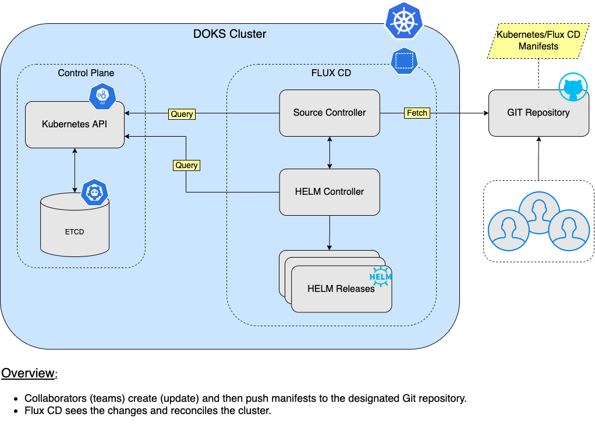
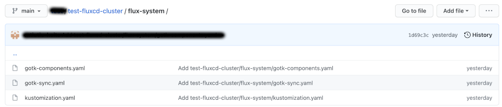

# Implementing GitOps using Flux CD

## Introduction

[Flux CD](https://fluxcd.io) helps you `synchronize` the `state` of your infrastructure using `Git` as the source of truth, thus following `GitOps` principles. Flux also helps you implement continuous delivery for your applications. It knows how to handle Helm releases as well, thus you can control application deployment and lifecycle via the standard package manager for Kubernetes.

The process of `synchronizing` your `DOKS` cluster `state` with a `Git` repository, is called `reconciliation`. Reconciliation makes sure that your applications state match a desired state declaratively defined somewhere (can be a Git repository, Helm repository or a S3 bucket).

Flux CD provides several ways to achieve reconciliation:

- [HelmRelease](https://fluxcd.io/docs/components/helm/helmreleases): matches state using Helm releases (also performs a release if not present).
- [Bucket](https://fluxcd.io/docs/components/source/buckets): matches state using contents of objects coming from S3 compatible storage.
- [Kustomization](https://fluxcd.io/docs/components/kustomize/kustomization): matches state using `kustomization` manifests defined in a Git repository or S3 bucket.

For each of the enumerated resources, there is an associated controller containing necessary logic to fetch artifacts containing declarative state manifests, and apply required changes to your cluster (maintain desired state):

- [Source Controller](https://fluxcd.io/docs/components/source): manages Git repositories, Helm repositories, Bucket storage, etc.
- [Helm Controller](https://fluxcd.io/docs/components/helm): manages Helm releases.
- [Kustomize Controller](https://fluxcd.io/docs/components/kustomize): manages Kustomizations.

A special component used by Flux is the [Source](https://fluxcd.io/docs/components/source) CRD (Custom Resource Definition). Flux CD treats sources as a way of fetching artifacts containing state configuration (e.g. Git repositories, Helm repositories, S3 buckets, etc).

Starter Kit is using the `Git repository` source type and `HelmReleases` for maintaining application state. Every chapter of the Starter Kit is using `Helm` to perform application deployment, so it's a natural choice to rely on `HelmReleases` to do the job.

In terms of system observability, Flux CD provides support for various alerting/notification solutions via the [Notification Controller](https://fluxcd.io/docs/components/notification), such as:

- [Slack](https://slack.com).
- [Discord](https://discord.com).
- [Microsoft Teams](https://www.microsoft.com/en-us/microsoft-teams/group-chat-software).

System monitoring and logging:

- [Prometheus](https://prometheus.io) (official [guide](https://fluxcd.io/docs/guides/monitoring)).
- [Loki](https://github.com/grafana/loki).

In this tutorial, you will learn to:

- Use `flux` CLI to provision `Flux CD` to your `DOKS` cluster.
- Keep your `Kubernetes` cluster applications state synchronized with a `Git` repository (use `GitOps` principles).
- Install and manage applications via `Flux CD HelmReleases`.
- Install and manage `Sealed Secrets` controller via `Flux CD` to encrypt sensitive data.

After finishing all the steps from this tutorial, you should have a `DOKS` cluster with `Flux CD` deployed, that will:

- Handle cluster reconciliation, via [GitRepository](https://fluxcd.io/docs/components/source/gitrepositories) CRD.
- Handle Helm releases, via [HelmRelease](https://fluxcd.io/docs/components/helm/helmreleases) CRDs.

### DOKS and Flux CD Automation Overview



## Table of Contents

- [Introduction](#introduction)
  - [DOKS and Flux CD Automation Overview](#doks-and-flux-cd-automation-overview)
- [Prerequisites](#prerequisites)
- [Understanding Flux CD Concepts for Automated Helm Releases](#understanding-flux-cd-concepts-for-automated-helm-releases)
  - [Using HelmRepository CRD to Define Helm Repositories](#using-helmrepository-crd-to-define-helm-repositories)
  - [Using HelmRelease CRD to Install Helm Charts](#using-helmrelease-crd-to-install-helm-charts)
  - [Using HelmRelease CRD to Override Helm Values](#using-helmrelease-crd-to-override-helm-values)
  - [Using Sealed Secrets Controller to Encrypt Kubernetes Secrets](#using-sealed-secrets-controller-to-encrypt-kubernetes-secrets)
- [Step 1 - Bootstrapping Flux CD](#step-1---bootstrapping-flux-cd)
- [Step 4 - Cloning the Flux CD Git Repository and Preparing the Layout](#step-4---cloning-the-flux-cd-git-repository-and-preparing-the-layout)
- [Step 5 - Creating the Sealed Secrets Helm Release](#step-5---creating-the-sealed-secrets-helm-release)
  - [Exporting the Sealed Secrets Controller Public Key](#exporting-the-sealed-secrets-controller-public-key)
- [Step 6 [OPTIONAL] - Creating the Cert-Manager Helm Release](#step-6-optional---creating-the-cert-manager-helm-release)
- [Step 7 - Creating the Ingress Controller Helm Release](#step-7---creating-the-ingress-controller-helm-release)
- [Step 8 - Creating the Prometheus Stack Helm Release](#step-8---creating-the-prometheus-stack-helm-release)
- [Step 9 - Creating the Loki Stack Helm Release](#step-9---creating-the-loki-stack-helm-release)
- [Step 10 - Creating the Velero Helm Release](#step-10---creating-the-velero-helm-release)
- [Conclusion](#conclusion)

## Prerequisites

To complete this tutorial, you will need:

1. A working `DOKS` cluster that you have access to. Please follow the Starter Kit [DOKS Setup Guide](../01-setup-DOKS/README.md) to find out more.
2. A [GitHub](https://github.com) repository and branch, to store Flux CD and your applications manifests.
3. A [Git](https://git-scm.com/downloads) client, for cloning the `Starter Kit` repository.
4. [Kubectl](https://kubernetes.io/docs/tasks/tools) CLI, for `Kubernetes` interaction. Follow these [instructions](https://www.digitalocean.com/docs/kubernetes/how-to/connect-to-cluster/) to connect to your cluster with `kubectl` and `doctl`.
5. [Flux CLI](https://fluxcd.io/docs/installation), to deploy and interact with `Flux CD`.
6. [Kubeseal](https://github.com/bitnami-labs/sealed-secrets/releases/tag/v0.17.3), for encrypting secrets and [Sealed Secrets Controller](https://github.com/bitnami-labs/sealed-secrets) interaction.

## Understanding Flux CD Concepts for Automated Helm Releases

The way `Flux CD` knows how to handle `Helm` releases is via a dedicated custom resource definition named [HelmRelease](https://fluxcd.io/docs/components/helm/helmreleases). Next, each `HelmRelease` makes use of a [HelmRepository](https://fluxcd.io/docs/components/source/helmrepositories) CRD, to fetch the required chart to install. So, a `HelmRepository` is the `source` of Helm `charts` for the `HelmRelease` to consume.

You have some familiarity now with `Helm` installations performed via CLI (each section of the `Starter Kit` makes use of it). `Flux CD` is achieving the same thing via the [Helm Controller](https://fluxcd.io/docs/components/helm). You define `manifests` that make use of specific CRDs (`HelmRepository`, `HelmRelease`), which in turn instruct the `Helm Controller` to perform the same steps as the helm CLI counterpart (`helm install/upgrade`).

Below picture shows FluxCD Helm CRs relationship:


### Using HelmRepository CRD to Define Helm Repositories

The `HelmRepository` CRD is used by `Flux CD` to handle Helm `repositories` and fetch the `charts` from remote (the `CLI` equivalent of `helm repo add <name> <url>` and `helm repo update`).

Typical structure of a `HelmRepository` manifest looks like below:

```yaml
apiVersion: source.toolkit.fluxcd.io/v1beta1
kind: HelmRepository
metadata:
  name: ambassador
  namespace: flux-system
spec:
  interval: 10m0s
  url: https://app.getambassador.io
```

Explanations for the above configuration:

- `<kind>`: Tells Flux CD what type of `CRD` the manifest is using (`HelmRepository`, in above example).
- `<metadata.name>`: Name of the `HelmRepository` CRD (`ambassador`, in above example).
- `<metadata.namespace>`: Namespace to use for the `HelmRepository` resource (`flux-system`, in above example).
- `<spec.interval>`: Time interval to use for synchronizing with the remote Helm repository (to fetch new chart releases metadata - CLI equivalent of: `helm repo update`).
- `<spec.url>`: Helm chart repository URL.

### Using HelmRelease CRD to Install Helm Charts

The `HelmRelease` CRD is used by `Flux CD` to handle Helm `releases` in your `DOKS` cluster (the `CLI` equivalent of `helm install <name> <chart> -f <values.yaml>`). It can also take care of `upgrades`, as well as how to `recover` in case of a failure, like: how many `retries` to perform for a failed `install` operation, `rollbacks`, etc.

Each `HelmRelease` makes use of a `source` type, so that it knows where to pull the `Helm` chart from:

- [HelmRepository](https://fluxcd.io/docs/components/source/helmrepositories), for use with `Helm` chart repositories.
- [GitRepository](https://fluxcd.io/docs/components/source/gitrepositories), for use with `Git` repositories.
- [S3 Bucket](https://fluxcd.io/docs/components/source/buckets), for use with `S3` compatible buckets.

Typical structure of a `HelmRelease` manifest, looks like below:

```yaml
apiVersion: helm.toolkit.fluxcd.io/v2beta1
kind: HelmRelease
metadata:
  name: ambassador-stack
  namespace: flux-system
spec:
  chart:
    spec:
      chart: edge-stack
      sourceRef:
        kind: HelmRepository
        name: ambassador
      version: 7.3.2
  install:
    createNamespace: true
  interval: 1m0s
  targetNamespace: ambassador
```

Explanations for the above configuration:

- `<kind>`: Tells Flux CD what type of `CRD` the manifest is using (`HelmRelease`, in above example).
- `<metadata.name>`: Name of the `HelmRelease` CRD (`ambassador-stack`, in above example).
- `<metadata.namespace>`: Namespace to use for the `HelmRelease` resource (`flux-system`, in above example).
- `<chart.spec.chart>`: Specifies the `chart name` to fetch and install from the `HelmRepository` (`ambassador`, in above example).
- `<chart.spec.sourceRef.kind>`: Tells Flux CD to use a `HelmRepository` resource for fetching Helm charts (this is a good example that illustrates CRDs dependency).
- `<chart.spec.sourceRef.name>`: HelmRepository CRD name to reference.
- `<chart.spec.version>`: version of the Helm chart to install.
- `<spec.install.createNamespace>`: Tells Flux CD if a namespace needs to be created before installing the chart (Helm CLI equivalent of: `helm install --create-namespace`).
- `<spec.interval>`: Time interval at which to reconcile the Helm release.
- `<spec.targetNamespace>`: Namespace to place the Helm release (Helm CLI equivalent of: `helm install --namespace <name>`).

### Using HelmRelease CRD to Override Helm Values

Each Flux CD `HelmRelease` can override `values` via a values file - the equivalent of `helm install <name> <chart> -f values.yaml`, or by setting each value individually - the equivalent of `helm instal <name> <chart> --set <key> <value>`.

`Flux CD` lets you override `Helm` values via two spec types:

- `<spec.values>`: Allows you to override values `inline` as seen in a standard `values.yaml` file). This is the equivalent of: `helm install -f <values_file>`.
- `<spec.valuesFrom>`: Allows you to override values `individually`, by using each key `fully qualified path` from the values file (e.g.: `aws.access_key_id`). This is the equivalent of `helm install --set <key> <value>`.

Typical usage of `spec.values`:

```yaml
...
spec:
  values:
    loki:
      enabled: true
      config:
        schema_config:
          configs:
            - from: "2020-10-24"
              store: boltdb-shipper
              object_store: aws
              schema: v11
              index:
                prefix: index_
                period: 24h
...
```

Explanations for the above configuration:

`<spec.values>`: Holds application specific key-value pairs, just as a Helm values file does.

As mentioned earlier, the `<spec.values>` field stores key-value pairs exactly as seen in the `YAML` file. It means that `sensitive` data, like `DO Spaces` credentials or `API` tokens will be exposed, and that is not a good thing. Flux CD has a solution for this situation, meaning you can override values from other data sources like `Kubernetes Secrets` or `ConfigMaps` (can be secured by using protected namespaces).

Typical usage of `spec.valuesFrom` in combination with a `Kubernetes Secret` (the below example expects that the `do-credentials` Kubernetes secret to be created beforehand):

```yaml
spec:
  valuesFrom:
    - kind: Secret
      name: do-credentials
      valuesKey: spaces_access_key
      targetPath: aws.access_key_id
```

Explanations for the above configuration:

- `<spec.valuesFrom.kind>`: Kind of the values referent (`Kubernetes Secret`, in this example - can be a `ConfigMap` as well).
- `<spec.valuesFrom.name>`: Name of the values referent (e.g. Kubernetes `Secret`), in the `same namespace` as the `HelmRelease`.
- `<spec.valuesFrom.valuesKey>`: The data key where a specific value can be found (defaults to `values.yaml` when omitted).
- `<spec.valuesFrom.targetPath>`: The `YAML` dot notation `path` at which the value should be merged. When set, the `valuesKey` is expected to be a single flat value (defaults to `None` when omitted, which results in the `values` getting `merged` at the `root`).

You can have a combination of `spec.values` for storing non-sensitive data, and `spec.valuesFrom` that reference Kubernetes secrets for sensitive data. In the end, each Flux CD `HelmRelease` will `merge` all the values together, so you can benefit from both worlds. In fact, this is how `Helm` works, so the same principles apply.

In a `GitOps` flow, it's not wise to store `Kubernetes Secrets` directly in a `Git` repository, so you're going to use `Sealed Secrets` to encrypt sensitive data.

### Using Sealed Secrets Controller to Encrypt Kubernetes Secrets

`Sealed Secrets` allows you to `encrypt` generic `Kubernetes` secrets and `store` them `safely` in `Git` (even in `public` repositories). Then, `Flux CD` will create a corresponding `Sealed Secret Object` in your cluster when `syncing` the `Git` repository. `Sealed Secrets Controller` notices the sealed objects, and decrypts each to a classic Kubernetes secret. Applications can consume the secrets as usual.

**Flux CD Sealed Secrets GitOps Flow:**


For more details, please refer to [Section 08 - Encrypt Kubernetes Secrets Using Sealed Secrets](../08-kubernetes-sealed-secrets/README.md).

Next, you will learn how to deploy Flux CD to your DOKS cluster.

## Step 1 - Bootstrapping Flux CD

`Flux CD` provides a `CLI` binary which you can use for provisioning `Flux CD` itself, as well as for main system interaction. Using the `flux bootstrap` subcommand, you can install Flux on a Kubernetes cluster and configure it to manage itself from a Git repository.

If the Flux components are present on the cluster, the bootstrap command will perform an upgrade if needed. The bootstrap is idempotent, it’s safe to run the command as many times as you want.

Bootstrapping Flux CD on an existing DOKS cluster:

1. Generate a [personal access token](https://help.github.com/en/github/authenticating-to-github/creating-a-personal-access-token-for-the-command-line) (PAT) that can create repositories by checking all permissions under `repo`.
2. Export your GitHub personal access token as an environment variable (make sure to replace the `<>` placeholders accordingly):

    ```shell
    export GITHUB_TOKEN=<YOUR_PERSONAL_ACCESS_TOKEN_HERE>
    ```

3. Run the bootstrap for a repository on your personal GitHub account (make sure to replace the `<>` placeholders accordingly):

    ```shell
    flux bootstrap github \
      --owner=<YOUR_GITHUB_USER> \
      --repository=<YOUR_GITHUB_REPOSITORY_NAME> \
      --path=clusters/dev \
      --personal
    ```

Explanations for the above command:

- `--owner`: Holds your GitHub user name.
- `--repository`: Git repository to use by Flux CD (the repository will be created if it doesn't exist).
- `--path`: Directory path to use inside the repository to store all manifests (the directory path will be created if it doesn't exist). This argument is important, because Flux CD will monitor all changes happening under the directory path you define here.

The flux bootstrap command will create the specified GitHub repository if it doesn't exist, and will start the provisioning process for Flux CD. In the end, you should have a bunch of YAML manifests created in your Git repository, as well as all Kubernetes resources required by Flux CD to work.

Next, you can perform some `sanity checks` via:

```shell
flux check
```

The output looks similar to the following:

```text
► checking prerequisites
✔ Kubernetes 1.21.9 >=1.20.6-0
► checking controllers
✔ helm-controller: deployment ready
► ghcr.io/fluxcd/helm-controller:v0.17.2
✔ kustomize-controller: deployment ready
► ghcr.io/fluxcd/kustomize-controller:v0.21.1
✔ notification-controller: deployment ready
► ghcr.io/fluxcd/notification-controller:v0.22.3
✔ source-controller: deployment ready
► ghcr.io/fluxcd/source-controller:v0.21.2
✔ all checks passed
```

Then, inspect all `Flux CD` resources via:

```shell
flux get all
```

The output looks similar to the following (you can notice the `gitrepository/flux-system` component fetching the latest revision from your main branch, as well as the `kustomization/flux-system` component):

```text
NAME                            READY   MESSAGE                         REVISION        SUSPENDED 
gitrepository/flux-system       True    Fetched revision: main/6e9b41b  main/6e9b41b    False 

NAME                            READY   MESSAGE                         REVISION        SUSPENDED 
kustomization/flux-system       True    Applied revision: main/6e9b41b  main/6e9b41b    False  
```

In case you need to perform some troubleshooting, and see what `Flux CD` is doing, you can access the logs via:

```shell
flux logs
```

The output looks similar to the following:

```text
...
2022-03-17T10:47:21.976Z info Kustomization/flux-system.flux-system - server-side apply completed 
2022-03-17T10:47:22.662Z info Kustomization/flux-system.flux-system - server-side apply completed 
2022-03-17T10:47:22.702Z info Kustomization/flux-system.flux-system - Reconciliation finished in 9.631064885s, next run in 10m0s 
2022-03-17T10:47:19.167Z info GitRepository/flux-system.flux-system - Discarding event, no alerts found for the involved object 
2022-03-17T10:47:22.691Z info Kustomization/flux-system.flux-system - Discarding event, no alerts found for the involved object 
2022-03-17T10:47:22.709Z info Kustomization/flux-system.flux-system - Discarding event, no alerts found for the involved object 
2022-03-17T10:47:19.168Z info GitRepository/flux-system.flux-system - Reconciliation finished in 7.79283477s, next run in 1m0s 
2022-03-17T10:48:20.594Z info GitRepository/flux-system.flux-system - Reconciliation finished in 1.424279853s, next run in 1m0s 
...
```

Finally, check that `Flux CD` points to your `Git` repository:

```shell
kubectl get gitrepositories.source.toolkit.fluxcd.io -n flux-system
```

The output looks similar to (notice the `URL` column value - should point to your `Git` repository, and the `READY` state set to `True`):

```text
NAME         URL                                                       READY  STATUS                             AGE
flux-system  ssh://git@github.com/test-starterkit/starterkit_fra1.git  True   Fetched revision: main/6e9b41b...  9m59s
```

You should also see a bunch of Flux CD system manifests present in your Git repository as well:



In the next step, you will prepare the `Git` repository layout for use in this tutorial. Flux CD is watching for changes present in the `--path` argument that you passed to the `flux bootstrap` command. Starter Kit is using the `clusters/dev` directory path. You can create any directory structure under the `clusters/dev` path to keep things organized. Flux CD will perform a recursive search for all manifests under the `clusters/dev` path.

You can throw all the manifests under the Flux CD sync path (e.g. `clusters/dev`), but it's best practice to keep things organized and follow naming conventions as much as possible to avoid frustration in the future.

## Step 4 - Cloning the Flux CD Git Repository and Preparing the Layout

In this step, you will learn how to `organize` your `Git` repository used by `Flux CD` to sync your `DOKS` cluster `state`. For simplicity, this tutorial is based on a `monorepo` structure, and is using a `single environment` to hold all your manifests (e.g. `clusters/dev`). You can check the official Flux CD documentation for some guidance on how to setup your [Git repository structure](https://fluxcd.io/docs/guides/repository-structure).

Please make sure that the following steps are performed in order:

1. First, clone your Flux CD Git repository. This is the `main repository` used for your `DOKS` cluster `reconciliation` (please replace the `<>` placeholders accordingly):

   ```shell
   git clone https://github.com/<YOUR_GITHUB_USER>/<YOUR_GITHUB_REPOSITORY_NAME>.git
   ```

    Explanations for the above command:

    - `<YOUR_GITHUB_USER>` - your GitHub `username` as defined by the `--owner` argument of the flux bootstrap command.
    - `<YOUR_GITHUB_REPOSITORY_NAME>` - GitHub repository name used for your `DOKS` cluster `reconciliation` as defined by the `--repository` argument of the flux bootstrap command.

2. Next, change directory where your Flux CD `Git` repository was cloned, and checkout the correct branch (usually `main`).
3. Now, create the `directory structure` to store Flux CD `HelmRepository`, `HelmRelease` and `SealedSecret` manifests for each component of the `Starter Kit`. Please replace the `FLUXCD_SYNC_PATH` variable value with your `Flux CD` cluster sync directory path, as defined by the `--path` argument of the flux bootstrap command (Starter Kit is using the `clusters/dev` path):

    ```shell
    FLUXCD_SYNC_PATH="clusters/dev"
    FLUXCD_HELM_MANIFESTS_PATH="${FLUXCD_SYNC_PATH}/helm"

    mkdir -p "${FLUXCD_HELM_MANIFESTS_PATH}/repositories" 
    
    mkdir -p "${FLUXCD_HELM_MANIFESTS_PATH}/releases" 
    
    mkdir -p "${FLUXCD_HELM_MANIFESTS_PATH}/secrets"
    ```

4. Finally, add the `.gitignore` file to `avoid` committing `unencrypted` Helm value files in your repository, that may contain sensitive data. Using your favorite `text editor`, paste the following (below example is using the `Starter Kit` naming convention):

    ```text
    # Ignore all YAML files containing the `-values-` string.
    *-values-*.yaml

    # Do not ignore sealed YAML files.
    !*-sealed.yaml
    ```

After finishing all the steps from this tutorial, you should have a `Git` repository structure similar to:

```text
├── README.md
├── clusters
│   └── dev
│       ├── flux-system
│       │   ├── gotk-components.yaml
│       │   ├── gotk-sync.yaml
│       │   └── kustomization.yaml
│       └── helm
│           ├── releases
│           │   ├── ambassador-stack-v7.3.2.yaml
│           │   ├── loki-stack-v2.6.4.yaml
│           │   ├── prometheus-stack-v35.5.1.yaml
│           │   ├── sealed-secrets-v2.4.0.yaml
│           │   └── velero-v2.29.7.yaml
│           ├── repositories
│           │   ├── ambassador.yaml
│           │   ├── grafana.yaml
│           │   ├── prometheus-community.yaml
│           │   ├── sealed-secrets.yaml
│           │   └── vmware-tanzu.yaml
│           └── secrets
│               ├── do-api-credentials-sealed.yaml
│               ├── do-spaces-credentials-sealed.yaml
│               └── prometheus-stack-credentials-sealed.yaml
└── pub-sealed-secrets-dev-cluster.pem
```

Next, you're going to provision the required `Flux CD` manifests for each component of the `Starter Kit`. Then, you will inspect and commit each manifest to your `Git` repository used by `Flux CD` to reconcile your `DOKS` cluster. For sensitive data, a `Kubernetes Secrets` will be created and `encrypted` using `Sealed Secrets`, and then stored in your `Git` repository as well.

First example will make use of the `Flux CLI` for you to accommodate and get familiarized with creating manifests via the `CLI`. Then, you will use the already prepared `manifests` provided by the `Starter Kit` repository, to speed up the steps from this tutorial.

You're going to start with the `Sealed Secrets` Helm release first, because it's a prerequisite for the rest of the `Starter Kit` components.

## Step 5 - Creating the Sealed Secrets Helm Release

In this step, you will learn how to create manifests using the `Flux CLI`, to define the `Sealed Secrets` Helm release. Then, `Flux` will trigger the `Sealed Secrets Controller` installation process for your `DOKS` cluster.

Please use the following steps, to create required manifests for the `Sealed Secrets` Helm release:

1. First, change directory where your `Flux CD` Git repository was cloned. Also, please check that the required directory structure for this tutorial is created, and that the `FLUXCD_HELM_MANIFESTS_PATH` environment variable is set (please refer to [Step 4 - Cloning the Flux CD Git Repository and Preparing the Layout](#step-4---cloning-the-flux-cd-git-repository-and-preparing-the-layout), for details).
2. Then, create the `Sealed Secrets` HelmRepository manifest for `Flux`:

    ```shell
    flux create source helm sealed-secrets \
      --url="https://bitnami-labs.github.io/sealed-secrets" \
      --interval="10m" \
      --export > "${FLUXCD_HELM_MANIFESTS_PATH}/repositories/sealed-secrets.yaml"
    ```

    Explanations for the above command:

    - `--url`: Helm repository address.
    - `--interval`: Source sync interval (default `1m0s`).
    - `--export`: Export in `YAML` format to stdout.

    The output looks similar to (you can notice that it has a similar structure as explained in [Using HelmRepository CRD to Define Helm Repositories](#using-helmrepository-crd-to-define-helm-repositories)):

    ```yaml
    ---
    apiVersion: source.toolkit.fluxcd.io/v1beta1
    kind: HelmRepository
    metadata:
      name: sealed-secrets
      namespace: flux-system
    spec:
      interval: 10m0s
      url: https://bitnami-labs.github.io/sealed-secrets
    ```

3. Next, fetch the `Starter Kit` values file for `Sealed Secrets`. Please make sure to inspect the values file first, and replace the `<>` placeholders where needed:

    ```shell
    SEALED_SECRETS_CHART_VERSION="2.4.0"

    curl "https://raw.githubusercontent.com/digitalocean/Kubernetes-Starter-Kit-Developers/main/08-kubernetes-sealed-secrets/assets/manifests/sealed-secrets-values-v${SEALED_SECRETS_CHART_VERSION}.yaml" > "sealed-secrets-values-v${SEALED_SECRETS_CHART_VERSION}.yaml"
    ```

4. Now, create the `Sealed Secrets` HelmRelease manifest for `Flux CD`. `Kubeseal` CLI expects by default to find the controller in the `kube-system` namespace and to be named `sealed-secrets-controller`, hence we override the release name via the `--release-name` and `--target-namespace` flags. This is not mandatory, but `kube-system` is usually accessible only to power users (administrators):

    ```shell
    SEALED_SECRETS_CHART_VERSION="2.4.0"

    flux create helmrelease "sealed-secrets-controller" \
      --release-name="sealed-secrets-controller" \
      --source="HelmRepository/sealed-secrets" \
      --chart="sealed-secrets" \
      --chart-version "$SEALED_SECRETS_CHART_VERSION" \
      --values="sealed-secrets-values-v${SEALED_SECRETS_CHART_VERSION}.yaml" \
      --target-namespace="flux-system" \
      --crds=CreateReplace \
      --export > "${FLUXCD_HELM_MANIFESTS_PATH}/releases/sealed-secrets-v${SEALED_SECRETS_CHART_VERSION}.yaml"
    ```

    Explanations for the above command:

    - `--release-name`: What name to use for the Helm release (defaults to `<target-namespace>-<HelmRelease-name>` otherwise).
    - `--source`: Source that contains the chart in the format `<kind>/<name>.<namespace>`, where kind must be one of: (`HelmRepository`, `GitRepository`, `Bucket`).
    - `--chart`: Helm chart name.
    - `--chart-version`: Helm chart version.
    - `--values`: Local path to values file.
    - `--target-namespace`: Namespace to install this release.
    - `--crds`: Upgrade CRDs policy, available options are: (`Skip`, `Create`, `CreateReplace`).
    - `--export`: Export in `YAML` format to stdout.

    The output looks similar to (you can observe that it has a similar structure as explained in [Using HelmRelease CRD to Install Helm Charts](#using-helmrelease-crd-to-install-helm-charts)):

    ```yaml
    ---
    apiVersion: helm.toolkit.fluxcd.io/v2beta1
    kind: HelmRelease
    metadata:
      name: sealed-secrets-controller
      namespace: flux-system
    spec:
      chart:
        spec:
          chart: sealed-secrets
          sourceRef:
            kind: HelmRepository
            name: sealed-secrets
          version: 2.4.0
      interval: 1m0s
      releaseName: sealed-secrets-controller
      targetNamespace: flux-system
      install:
        crds: Create
      upgrade:
        crds: CreateReplace
      values:
        ingress:
          enabled: false
    ```

5. Finally, commit `Git` changes to `remote` branch:

    ```shell
    SEALED_SECRETS_CHART_VERSION="2.4.0"

    git add "${FLUXCD_HELM_MANIFESTS_PATH}/repositories/sealed-secrets.yaml"

    git add "${FLUXCD_HELM_MANIFESTS_PATH}/releases/sealed-secrets-v${SEALED_SECRETS_CHART_VERSION}.yaml"

    git commit -am "Adding Sealed Secrets manifests for Flux CD"

    git push origin
    ```

After completing the above steps, `Flux CD` will start your `DOKS` cluster `reconciliation` (in about `one minute` or so, if using the `default` interval). If you don't want to wait, you can always `force` reconciliation via:

```shell
flux reconcile source git flux-system
```

After a few moments, please inspect the Flux CD `Sealed Secrets` Helm release:

```shell
flux get helmrelease sealed-secrets-controller
```
  
The output looks similar to:

```text
NAME                        READY   MESSAGE                                 REVISION        SUSPENDED 
sealed-secrets-controller   True    Release reconciliation succeeded        2.4.0          False 
```

Look for the `READY` column value - it should say `True`. Reconciliation status is displayed in the `MESSAGE` column, along with the `REVISION` number, which represents the `Helm` chart `version`. Please bear in mind that some releases take longer to complete (like `Prometheus` stack, for example), so please be patient.

**Hints:**

- The `MESSAGE` column will display `Reconciliation in progress`, as long as the `HelmController` is performing the installation for the specified `Helm` chart. If something goes wrong, you'll get another message stating the reason, so please make sure to check Helm release state.
- You can use the `--watch` flag for example: `flux get helmrelease <name> --wait`, to wait until the command finishes. Please bear in mind that in this mode, `Flux` will block your terminal prompt until the default timeout of `5 minutes` occurs (can be overridden via the `--timeout` flag).
- In case something goes wrong, you can search the `Flux` logs, and filter `HelmRelease` messages only:

    ```shell
    flux logs --kind=HelmRelease
    ```

- In case the `Flux` logs do not offer sufficient information you can use the `describe` command on the `helmrelease` using `kubectl` as follows:

    ```shell
    kubectl describe helmrelease sealed-secrets-controller -n flux-system
    ```

### Exporting the Sealed Secrets Controller Public Key

To be able to `encrypt` secrets, you need the `public key` that was generated by the `Sealed Secrets Controller` when it was deployed by `Flux CD` in your `DOKS` cluster.

First, change directory where you cloned your `Flux CD` Git repository, and do the following (please replace the `<>` placeholders accordingly):

```shell
kubeseal --controller-namespace=flux-system --fetch-cert > pub-sealed-secrets-<YOUR_DOKS_CLUSTER_NAME_HERE>.pem
```

**Note:**

If for some reason the `kubeseal` certificate fetch command hangs (or you get an empty/invalid certificate file), you can use the following steps to work around this issue:

- First, open a new terminal window, and `expose` the `Sealed Secrets Controller` service on your `localhost` (you can use `CTRL - C` to terminate, after fetching the public key):

  ```shell
  kubectl port-forward service/sealed-secrets-controller 8080:8080 -n flux-system 
  ```

- Then, you can go back to your working terminal and fetch the public key (please replace the `<>` placeholders accordingly):

  ```shell
  curl --retry 5 --retry-connrefused localhost:8080/v1/cert.pem > pub-sealed-secrets-<YOUR_DOKS_CLUSTER_NAME_HERE>.pem
  ```

Finally, `commit` the public key file to remote `Git` repository for later use (it's `safe` to do this, because the `public key` is useless without the `private key` which is stored in your `DOKS` cluster only). Please run bellow commands, and make sure to replace the `<>` placeholders accordingly:

```shell
git add pub-sealed-secrets-<YOUR_DOKS_CLUSTER_NAME_HERE>.pem

git commit -m "Adding Sealed Secrets public key for cluster <YOUR_DOKS_CLUSTER_NAME_HERE>"

git push origin
```

**Important note:**

**In this tutorial the `flux-system` namespace is used to hold `Kubernetes Secrets`, so please make sure that it is `restricted` to regular users/ applications via `RBAC`.**

Next, you're going to perform similar steps to define `Helm` releases for the remaining components of the `Starter Kit`.

## Step 6 [OPTIONAL] - Creating the Cert-Manager Helm Release

If you want to have `wildcard certificates` support for your cluster, you need to provision `Cert-Manager` as well. This step is also required if proper `TLS` termination is needed for the `Nginx Ingress Controller`.

Steps to follow:

1. First, change directory where your `Flux CD` Git repository was cloned. Also, please check that the required directory structure for this tutorial is created, and that the `FLUXCD_HELM_MANIFESTS_PATH` environment variable is set (please refer to [Step 4 - Cloning the Flux CD Git Repository and Preparing the Layout](#step-4---cloning-the-flux-cd-git-repository-and-preparing-the-layout), for details).
2. Then, fetch the Jetstack `HelmRepository` manifest file provided by the `Starter Kit` Git repository:

    ```shell
    curl "https://raw.githubusercontent.com/digitalocean/Kubernetes-Starter-Kit-Developers/main/15-continuous-delivery-using-gitops/assets/manifests/fluxcd/helm/repositories/jetstack.yaml" > "${FLUXCD_HELM_MANIFESTS_PATH}/repositories/jetstack.yaml"
    ```

3. Now, fetch the Cert-Manager `HelmRelease` manifest file provided by the `Starter Kit` Git repository:

    ```shell
    CERT_MANAGER_CHART_VERSION="1.8.0"

    curl "https://raw.githubusercontent.com/digitalocean/Kubernetes-Starter-Kit-Developers/main/15-continuous-delivery-using-gitops/assets/manifests/fluxcd/helm/releases/cert-manager-v${CERT_MANAGER_CHART_VERSION}.yaml" > "${FLUXCD_HELM_MANIFESTS_PATH}/releases/cert-manager-v${CERT_MANAGER_CHART_VERSION}.yaml"
    ```

4. Next, inspect the downloaded `HelmRelease` manifest file using an editor of your choice (preferably with `YAML` lint support), and adjust to your needs. For example, you can use [VS Code](https://code.visualstudio.com) (make sure to replace the `<>` placeholders accordingly, if present):

    ```shell
    CERT_MANAGER_CHART_VERSION="1.8.0"

    code "${FLUXCD_HELM_MANIFESTS_PATH}/releases/cert-manager-v${CERT_MANAGER_CHART_VERSION}.yaml"
    ```

5. Finally, commit `Git` changes to `remote` branch:

    ```shell
    CERT_MANAGER_CHART_VERSION="1.8.0"

    git add "${FLUXCD_HELM_MANIFESTS_PATH}/repositories/jetstack.yaml"

    git add "${FLUXCD_HELM_MANIFESTS_PATH}/releases/cert-manager-v${CERT_MANAGER_CHART_VERSION}.yaml"

    git commit -am "Adding Cert-Manager manifests for Flux CD"

    git push origin
    ```

After completing the above steps, `Flux CD` will start your `DOKS` cluster `reconciliation` (in about `one minute` or so, if using the `default` interval). If you don't want to wait, you can always `force` reconciliation via:

```shell
flux reconcile source git flux-system
```

After a few moments, please inspect the `HelmRelease` status:

```shell
flux get helmrelease cert-manager
```
  
The output looks similar to:

```text
NAME                READY   MESSAGE                                 REVISION       SUSPENDED 
cert-manager        True    Release reconciliation succeeded        v1.6.1         False 
```

Look for the `READY` column value - it should say `True`. Reconciliation status is displayed in the `MESSAGE` column, along with the `REVISION` number, which represents the `Helm` chart `version`. Please bear in mind that some releases take longer to complete (like `Prometheus` stack, for example), so please be patient.

**Hints:**

- The `MESSAGE` column will display `Reconciliation in progress`, as long as the `HelmController` is performing the installation for the specified `Helm` chart. If something goes wrong, you'll get another message stating the reason, so please make sure to check Helm release state.
- You can use the `--watch` flag for example: `flux get helmrelease <name> --wait`, to wait until the command finishes. Please bear in mind that in this mode, `Flux` will block your terminal prompt until the default timeout of `5 minutes` occurs (can be overridden via the `--timeout` flag).
- In case something goes wrong, you can search the `Flux` logs, and filter `HelmRelease` messages only:

    ```shell
    flux logs --kind=HelmRelease
    ```

- In case the `Flux` logs do not offer sufficient information you can use the `describe` command on the `helmrelease` using ``kubectl` as follows:

    ```shell
    kubectl describe helmrelease cert-manager -n flux-system
    ```

Next, you're going to create `Flux CD` manifests for the `Ambassador` (or `Nginx`) ingress.

## Step 7 - Creating the Ingress Controller Helm Release

In this step, you will use pre-made manifests to create your preferred `Ingress Controller` Helm release for `Flux CD`. Then, `Flux` will trigger the `Ingress Controller` installation process for your `DOKS` cluster.

There are two options available, depending on what `Ingress Controller` you feel most comfortable:

- `Ambassador` Ingress Helm Release.
- `Nginx` Ingress Helm Release.

Steps to follow:

1. First, change directory where your `Flux CD` Git repository was cloned. Also, please check that the required directory structure for this tutorial is created, and that the `FLUXCD_HELM_MANIFESTS_PATH` environment variable is set (please refer to [Step 4 - Cloning the Flux CD Git Repository and Preparing the Layout](#step-4---cloning-the-flux-cd-git-repository-and-preparing-the-layout), for details).
2. Then, fetch the `HelmRepository` manifest file provided by the `Starter Kit` Git repository (please pick only one option, depending on what `Ingress Controller` you want to install and configure):

    `Ambassador` Ingress:

    ```shell
    curl "https://raw.githubusercontent.com/digitalocean/Kubernetes-Starter-Kit-Developers/main/15-continuous-delivery-using-gitops/assets/manifests/fluxcd/helm/repositories/ambassador.yaml" > "${FLUXCD_HELM_MANIFESTS_PATH}/repositories/ambassador.yaml"
    ```

    `Nginx` Ingress:

    ```shell
    curl "https://raw.githubusercontent.com/digitalocean/Kubernetes-Starter-Kit-Developers/main/15-continuous-delivery-using-gitops/assets/manifests/fluxcd/helm/repositories/kubernetes-community-nginx.yaml" > "${FLUXCD_HELM_MANIFESTS_PATH}/repositories/kubernetes-community-nginx.yaml"
    ```

3. Now, fetch the `HelmRelease` manifest file provided by the `Starter Kit` Git repository (please pick only one option, depending on what `Ingress Controller` you want to install and configure):

    `Ambassador` Ingress:

    ```shell
    AMBASSADOR_CHART_VERSION="7.3.2"

    curl "https://raw.githubusercontent.com/digitalocean/Kubernetes-Starter-Kit-Developers/main/15-continuous-delivery-using-gitops/assets/manifests/fluxcd/helm/releases/ambassador-stack-v${AMBASSADOR_CHART_VERSION}.yaml" > "${FLUXCD_HELM_MANIFESTS_PATH}/releases/ambassador-stack-v${AMBASSADOR_CHART_VERSION}.yaml"
    ```

    `Nginx` Ingress:

    ```shell
    NGINX_CHART_VERSION="4.1.3"

    curl "https://raw.githubusercontent.com/digitalocean/Kubernetes-Starter-Kit-Developers/main/15-continuous-delivery-using-gitops/assets/manifests/fluxcd/helm/releases/nginx-v${NGINX_CHART_VERSION}.yaml" > "${FLUXCD_HELM_MANIFESTS_PATH}/releases/nginx-v${NGINX_CHART_VERSION}.yaml"
    ```

4. Next, inspect the downloaded `HelmRelease` manifest file using an editor of your choice (preferably with `YAML` lint support), and adjust to your needs. For example, you can use [VS Code](https://code.visualstudio.com). Make sure to replace the `<>` placeholders accordingly, if present ((please pick only one option, depending on what `Ingress Controller` you want to install and configure):

    `Ambassador` Ingress:

    ```shell
    AMBASSADOR_CHART_VERSION="7.3.2"

    code "${FLUXCD_HELM_MANIFESTS_PATH}/releases/ambassador-stack-v${AMBASSADOR_CHART_VERSION}.yaml"
    ```

    `Nginx` Ingress:

    ```shell
    NGINX_CHART_VERSION="4.1.3"

    code "${FLUXCD_HELM_MANIFESTS_PATH}/releases/nginx-v${NGINX_CHART_VERSION}.yaml"
    ```

    **Hint:**

    Notice how the `HelmRelease` manifest configures remediation actions (you can visit [Configuring Failure Remediation](https://fluxcd.io/docs/components/helm/helmreleases/#configuring-failure-remediation), for more details about `Helm` install/upgrade failure remediation options available in `Flux CD`):

      ```yaml
      ...
      install:
        createNamespace: true
        remediation:
          retries: 3
      upgrade:
        remediation:
          retries: 3
      ...
      ```

5. Finally, commit `Git` changes to `remote` branch (please pick only one option, depending on what `Ingress Controller` you want to install and configure):

    `Ambassador` Ingress:

    ```shell
    AMBASSADOR_CHART_VERSION="7.3.2"

    git add "${FLUXCD_HELM_MANIFESTS_PATH}/repositories/ambassador.yaml"

    git add "${FLUXCD_HELM_MANIFESTS_PATH}/releases/ambassador-stack-v${AMBASSADOR_CHART_VERSION}.yaml"

    git commit -am "Adding Ambassador manifests for Flux CD"

    git push origin
    ```

    `Nginx` Ingress:

    ```shell
    NGINX_CHART_VERSION="4.1.3"

    git add "${FLUXCD_HELM_MANIFESTS_PATH}/repositories/kubernetes-community-nginx.yaml"

    git add "${FLUXCD_HELM_MANIFESTS_PATH}/releases/nginx-v${NGINX_CHART_VERSION}.yaml"

    git commit -am "Adding Nginx manifests for Flux CD"

    git push origin
    ```

After completing the above steps, `Flux CD` will start your `DOKS` cluster `reconciliation` (in about `one minute` or so, if using the `default` interval). If you don't want to wait, you can always `force` reconciliation via:

```shell
flux reconcile source git flux-system
```

After a few moments, please inspect the `HelmRelease` status (please pick only one option, depending on the installed `Ingress Controller`):

`Ambassador` Ingress:

```shell
flux get helmrelease ambassador-stack
```

The output looks similar to:

```text
NAME                    READY   MESSAGE                                 REVISION       SUSPENDED
ambassador-stack        True    Release reconciliation succeeded        7.3.2          False
```

`Nginx` Ingress:

```shell
flux get helmrelease ingress-nginx
```

The output looks similar to:

```text
NAME                 READY   MESSAGE                                 REVISION       SUSPENDED
ingress-nginx        True    Release reconciliation succeeded        4.1.3          False
```

Look for the `READY` column value - it should say `True`. Reconciliation status is displayed in the `MESSAGE` column, along with the `REVISION` number, which represents the `Helm` chart `version`. Please bear in mind that some releases take longer to complete (like `Prometheus` stack, for example), so please be patient.

**Hints:**

- The `MESSAGE` column will display `Reconciliation in progress`, as long as the `HelmController` is performing the installation for the specified `Helm` chart. If something goes wrong, you'll get another message stating the reason, so please make sure to check Helm release state.
- You can use the `--watch` flag for example: `flux get helmrelease <name> --wait`, to wait until the command finishes. Please bear in mind that in this mode, `Flux` will block your terminal prompt until the default timeout of `5 minutes` occurs (can be overridden via the `--timeout` flag).
- In case something goes wrong, you can search the `Flux` logs, and filter `HelmRelease` messages only:

    ```shell
    flux logs --kind=HelmRelease
    ```
  
- In case the `Flux` logs do not offer sufficient information you can use the `describe` command on the `helmrelease` using `kubectl` as follows:

    ```shell
    kubectl describe helmrelease ingress-nginx -n flux-system
    ```

Please refer to the [Ambassador Ingress](../03-setup-ingress-controller/ambassador.md) or [Nginx Ingress](../03-setup-ingress-controller/nginx.md) tutorial, for more details about checking `Ingress Controller` deployment status and functionality.

Next, you're going to create `Flux CD` manifests for the `Prometheus` stack.

## Step 8 - Creating the Prometheus Stack Helm Release

In this step, you will use pre-made manifests to create the `Prometheus` Helm release for `Flux CD`. Then, `Flux` will trigger the `Prometheus` installation process for your `DOKS` cluster. The `Prometheus` stack deploys `Grafana` as well, so you need to set the `administrator` credentials for accessing the `dashboards`. You will learn how to use `kubeseal` CLI with `Sealed Secrets Controller` to encrypt `sensitive` data stored in `Kubernetes Secrets`. Then, you will see how the Flux CD `HelmRelease` manifest is used to `reference` Grafana `credentials` stored in the `Kubernetes Secret`.

Steps to follow:

1. First, change directory where your `Flux CD` Git repository was cloned. Also, please check that the required directory structure for this tutorial is created, and that the `FLUXCD_HELM_MANIFESTS_PATH` environment variable is set (please refer to [Step 4 - Cloning the Flux CD Git Repository and Preparing the Layout](#step-4---cloning-the-flux-cd-git-repository-and-preparing-the-layout), for details).
2. Then, fetch the `Prometheus` HelmRepository manifest provided by the `Starter Kit` Git repository:

    ```shell
    curl "https://raw.githubusercontent.com/digitalocean/Kubernetes-Starter-Kit-Developers/main/15-continuous-delivery-using-gitops/assets/manifests/fluxcd/helm/repositories/prometheus-community.yaml" > "${FLUXCD_HELM_MANIFESTS_PATH}/repositories/prometheus-community.yaml"
    ```

3. Next, `create` and `encrypt` the `Kubernetes Secret` holding your `Grafana` dashboard `admin password`. Make sure that you have the `Sealed Secrets` public key exported as mentioned in [Exporting the Sealed Secrets Controller Public Key](#exporting-the-sealed-secrets-controller-public-key) (please replace the `<>` placeholders accordingly):

    ```shell
    SEALED_SECRETS_PUB_KEY="<YOUR_SEALED_SECRETS_PUB_KEY_NAME_HERE>"
    GRAFANA_ADMIN_PASSWORD="<YOUR_GRAFANA_ADMIN_PASSWORD_HERE>"

    kubectl create secret generic "prometheus-stack-credentials" \
        --namespace flux-system \
        --from-literal=grafana_admin_password="${GRAFANA_ADMIN_PASSWORD}" \
        --dry-run=client -o yaml | kubeseal --cert="${SEALED_SECRETS_PUB_KEY}" \
        --format=yaml > "${FLUXCD_HELM_MANIFESTS_PATH}/secrets/prometheus-stack-credentials-sealed.yaml"
    ```

    Explanations for the above command:

    - `--namespace`: Namespace where the Kubernetes secret should be created.
    - `--from-literal`: Create a Kubernetes secret from a literal value containing the `grafana_admin_password`. The `prometheus-stack-credentials` secret and `grafana_admin_password` value is used by the [prometheus-stack-v35.5.1.yaml](assets/manifests/fluxcd/helm/releases/prometheus-stack-v35.5.1.yaml#L81) manifest (`spec.valuesFrom` key).
    - `--dry-run=client`: Exports the Kubernetes secret on your local machine using standard output (and afterwards, piped to `kubeseal` to encrypt the final result).
4. Now, fetch the `Prometheus` HelmRelease manifest provided by the `Starter Kit` Git repository:

    ```shell
    PROMETHEUS_CHART_VERSION="35.5.1"

    curl "https://raw.githubusercontent.com/digitalocean/Kubernetes-Starter-Kit-Developers/main/15-continuous-delivery-using-gitops/assets/manifests/fluxcd/helm/releases/prometheus-stack-v${PROMETHEUS_CHART_VERSION}.yaml" > "${FLUXCD_HELM_MANIFESTS_PATH}/releases/prometheus-stack-v${PROMETHEUS_CHART_VERSION}.yaml"
    ```

5. Then, inspect the downloaded Prometheus `HelmRelease` manifest using an editor of your choice (preferably with `YAML` lint support), and adjust to your needs. For example, you can use [VS Code](https://code.visualstudio.com) (please make sure to replace the `<>` placeholders accordingly, if present):

    ```shell
    PROMETHEUS_CHART_VERSION="35.5.1"

    code "${FLUXCD_HELM_MANIFESTS_PATH}/releases/prometheus-stack-v${PROMETHEUS_CHART_VERSION}.yaml"
    ```

    **Note:**
    You can see how the `prometheus-stack-credentials` secret is referenced inside the Prometheus `HelmRelease` manifest, by looking at below snippet:

    ```yaml
    valuesFrom:
      - kind: Secret
        name: prometheus-stack-credentials # Kubernetes secret holding Prometheus stack credentials
        valuesKey: grafana_admin_password  # Key from the `prometheus-stack-credentials` secret, holding the Grafana admin password
        targetPath: grafana.adminPassword  # Helm value to override
        optional: false  # Helm release will fail if value is not found
    ```

6. Finally, commit `Git` changes to `remote` branch:

    ```shell
    PROMETHEUS_CHART_VERSION="35.5.1"

    git add "${FLUXCD_HELM_MANIFESTS_PATH}/repositories/prometheus-community.yaml"

    git add "${FLUXCD_HELM_MANIFESTS_PATH}/releases/prometheus-stack-v${PROMETHEUS_CHART_VERSION}.yaml"

    git add "${FLUXCD_HELM_MANIFESTS_PATH}/secrets/prometheus-stack-credentials-sealed.yaml"

    git commit -am "Adding Prometheus manifests for Flux CD"

    git push origin
    ```

After a few moments, please inspect the Prometheus `HelmRelease`:

```shell
flux get helmrelease kube-prometheus-stack
```
  
The output looks similar to:

```text
NAME                    READY   MESSAGE                                 REVISION        SUSPENDED 
kube-prometheus-stack   True    Release reconciliation succeeded        35.5.1          False
```

Look for the `READY` column value - it should say `True`. Reconciliation status is displayed in the `MESSAGE` column, along with the `REVISION` number, which represents the `Helm` chart `version`. Please bear in mind that some releases take longer to complete (like `Prometheus` stack, for example), so please be patient.

**Hints:**

- The `MESSAGE` column will display `Reconciliation in progress`, as long as the `HelmController` is performing the installation for the specified `Helm` chart. If something goes wrong, you'll get another message stating the reason, so please make sure to check Helm release state.
- You can use the `--watch` flag for example: `flux get helmrelease <name> --wait`, to wait until the command finishes. Please bear in mind that in this mode, `Flux` will block your terminal prompt until the default timeout of `5 minutes` occurs (can be overridden via the `--timeout` flag).
- In case something goes wrong, you can search the `Flux` logs, and filter `HelmRelease` messages only:

    ```shell
    flux logs --kind=HelmRelease
    ```

- In case the `Flux` logs do not offer sufficient information you can use the `describe` command on the `helmrelease` using `kubectl` as follows:

    ```shell
    kubectl describe helmrelease kube-prometheus-stack -n flux-system
    ```

Now, check if the `prometheus-stack-credentials` Kubernetes secret was created as well (then, you can use `kubectl get secret prometheus-stack-credentials -n flux-system -o yaml` for secret contents inspection):

```shell
kubectl get secret prometheus-stack-credentials -n flux-system
```

Finally, perform a quick check of `Prometheus` stack main `services`, and `PVC`:

- Prometheus dashboard: `kubectl port-forward svc/kube-prom-stack-kube-prome-prometheus 9090:9090 -n monitoring`.
- Grafana dashboards: `kubectl --namespace monitoring port-forward svc/kube-prom-stack-grafana 3000:80`.
- Prometheus PVC: `kubectl get pvc -n monitoring`.

Please refer to the [04-setup-prometheus-stack](../04-setup-prometheus-stack/README.md) tutorial, for more details about checking `Loki` stack deployment status and functionality.

Next, you're going to create the manifests for `Loki` stack, and let `Flux CD` handle the `Helm` release automatically.

## Step 9 - Creating the Loki Stack Helm Release

In this step, you will use pre-made manifests to create the `Loki` Helm release for `Flux CD`. Then, `Flux` will trigger the `Loki` installation process for your `DOKS` cluster. `Loki` needs a `DO Spaces bucket` for storing backups, hence you need to use `DO Spaces credentials`. You will learn how to use `kubeseal` CLI with `Sealed Secrets Controller` to encrypt `sensitive` data stored in `Kubernetes Secrets`. Then, you will see how the Flux CD `HelmRelease` manifest is used to `reference` DO Spaces `credentials` stored in the `Kubernetes Secret`.

Steps to follow:

1. First, change directory where your `Flux CD` Git repository was cloned. Also, please check that the required directory structure for this tutorial is created, and that the `FLUXCD_HELM_MANIFESTS_PATH` environment variable is set (please refer to [Step 4 - Cloning the Flux CD Git Repository and Preparing the Layout](#step-4---cloning-the-flux-cd-git-repository-and-preparing-the-layout), for details).
2. Then, fetch the `Loki` HelmRepository manifest provided by the `Starter Kit` Git repository:

    ```shell
    curl "https://raw.githubusercontent.com/digitalocean/Kubernetes-Starter-Kit-Developers/main/15-continuous-delivery-using-gitops/assets/manifests/fluxcd/helm/repositories/grafana.yaml" > "${FLUXCD_HELM_MANIFESTS_PATH}/repositories/grafana.yaml"
    ```

3. Next, `create` and `encrypt` the Kubernetes secret for your `DO Spaces` credentials. Make sure that you have the `Sealed Secrets` public key exported as mentioned in [Exporting the Sealed Secrets Controller Public Key](#exporting-the-sealed-secrets-controller-public-key) (please replace the `<>` placeholders accordingly):

   ```shell
   SEALED_SECRETS_PUB_KEY="<YOUR_SEALED_SECRETS_PUB_KEY_NAME_HERE>"
   DO_SPACES_ACCESS_KEY="<YOUR_DO_SPACES_ACCESS_KEY_HERE>"
   DO_SPACES_SECRET_KEY="<YOUR_DO_SPACES_SECRET_KEY_HERE>"

   kubectl create secret generic "do-spaces-credentials" \
      --namespace flux-system \
      --from-literal=access_key_id="${DO_SPACES_ACCESS_KEY}" \
      --from-literal=secret_access_key="${DO_SPACES_SECRET_KEY}" \
      --dry-run=client -o yaml | kubeseal --cert="${SEALED_SECRETS_PUB_KEY}" \
      --format=yaml > "${FLUXCD_HELM_MANIFESTS_PATH}/secrets/do-spaces-credentials-sealed.yaml"
   ```

   Explanations for the above command:

   - `--namespace`: Namespace where the Kubernetes secret should be created.
   - `--from-literal`: Create a Kubernetes secret from a literal value containing the DO Spaces `access_key_id` and `secret_access_key`. The `do-spaces-credentials` secret and `access_key_id/secret_access_key` value is used by the [loki-stack-v2.6.4.yaml](assets/manifests/fluxcd/helm/releases/loki-stack-v2.5.1.yaml#L51) manifest (`spec.valuesFrom` key).
   - `--dry-run=client`: Exports the Kubernetes secret on your local machine using standard output (and afterwards, piped to `kubeseal` to encrypt the final result).
4. Now, fetch the `Loki` stack HelmRelease manifest provided by the `Starter Kit` Git repository:

    ```shell
    LOKI_CHART_VERSION="2.6.4"

    curl "https://raw.githubusercontent.com/digitalocean/Kubernetes-Starter-Kit-Developers/main/15-continuous-delivery-using-gitops/assets/manifests/fluxcd/helm/releases/loki-stack-v${LOKI_CHART_VERSION}.yaml" > "${FLUXCD_HELM_MANIFESTS_PATH}/releases/loki-stack-v${LOKI_CHART_VERSION}.yaml"
    ```

5. Then, inspect the downloaded Loki `HelmRelease` manifest using an editor of your choice (preferably with `YAML` lint support), and adjust to your needs. For example, you can use [VS Code](https://code.visualstudio.com) (please make sure to replace the `<>` placeholders accordingly, if present):

    ```shell
    LOKI_CHART_VERSION="2.6.4"

    code "${FLUXCD_HELM_MANIFESTS_PATH}/releases/loki-stack-v${LOKI_CHART_VERSION}.yaml"
    ```

    **Note:**
    You can see how the `do-spaces-credentials` secret is referenced inside the Loki `HelmRelease` manifest, by looking at below snippet:

    ```yaml
    valuesFrom:
      - kind: Secret
        name: do-spaces-credentials  # Kubernetes secret holding DO Spaces credentials
        valuesKey: access_key_id     # Key from the `do-spaces-credentials` secret, holding the DO Spaces Access Key ID
        targetPath: loki.config.storage_config.aws.access_key_id  # Helm value to override
        optional: false  # Helm release will fail if value is not found
      - kind: Secret
        name: do-spaces-credentials
        valuesKey: secret_access_key  # Key from the `do-spaces-credentials` secret, holding the DO Spaces Secret Key
        targetPath: loki.config.storage_config.aws.secret_access_key
        optional: false
    ```

6. Finally, commit `Git` changes to `remote` branch:

    ```shell
    LOKI_CHART_VERSION="2.6.4"

    git add "${FLUXCD_HELM_MANIFESTS_PATH}/repositories/grafana.yaml"

    git add "${FLUXCD_HELM_MANIFESTS_PATH}/releases/loki-stack-v${LOKI_CHART_VERSION}.yaml"

    git add "${FLUXCD_HELM_MANIFESTS_PATH}/secrets/do-spaces-credentials-sealed.yaml"

    git commit -am "Adding Loki stack manifests for Flux CD"

    git push origin
    ```

After a few moments, please inspect the Loki `HelmRelease`:

```shell
flux get helmrelease loki-stack
```
  
The output looks similar to:

```text
NAME         READY   MESSAGE                                 REVISION       SUSPENDED 
loki-stack   True    Release reconciliation succeeded        2.6.4          False
```

Look for the `READY` column value - it should say `True`. Reconciliation status is displayed in the `MESSAGE` column, along with the `REVISION` number, which represents the `Helm` chart `version`. Please bear in mind that some releases take longer to complete (like `Prometheus` stack, for example), so please be patient.

**Hints:**

- The `MESSAGE` column will display `Reconciliation in progress`, as long as the `HelmController` is performing the installation for the specified `Helm` chart. If something goes wrong, you'll get another message stating the reason, so please make sure to check Helm release state.
- You can use the `--watch` flag for example: `flux get helmrelease <name> --wait`, to wait until the command finishes. Please bear in mind that in this mode, `Flux` will block your terminal prompt until the default timeout of `5 minutes` occurs (can be overridden via the `--timeout` flag).
- In case something goes wrong, you can search the `Flux` logs, and filter `HelmRelease` messages only:

    ```shell
    flux logs --kind=HelmRelease
    ```

- In case the `Flux` logs do not offer sufficient information you can use the `describe` command on the `helmrelease` using `kubectl` as follows:

    ```shell
    kubectl describe helmrelease loki-stack -n flux-system
    ```

Finally, check if the `do-spaces-credentials` Kubernetes secret was created as well (then, you can use `kubectl get secret do-spaces-credentials -n flux-system -o yaml` for secret contents inspection):

```shell
kubectl get secret do-spaces-credentials -n flux-system
```

Please refer to the [05-setup-loki-stack](../05-setup-loki-stack/README.md) tutorial, for more details about checking `Loki Stack` deployment status and functionality.

Next, you're going to create the manifests and let `Flux CD` handle the `Velero` Helm release automatically.

## Step 10 - Creating the Velero Helm Release

In this step, you will use pre-made manifests to create the `Velero` Helm release for `Flux CD`. Then, `Flux` will trigger the `Velero` installation process for your `DOKS` cluster. `Velero` needs a `DO Spaces bucket` for storing backups, hence you need to use `DO Spaces credentials`. You will learn how to use `kubeseal` CLI with `Sealed Secrets Controller` to encrypt `sensitive` data stored in `Kubernetes Secrets`. Then, you will see how the Flux CD `HelmRelease` manifest is used to `reference` DO API `credentials` stored in the `Kubernetes Secret`.

**Important note:**

Before following the steps, make sure that the `do-spaces-credentials` sealed secret was provisioned to your `DOKS` cluster as detailed in [Step 8 - Creating the Loki Stack Helm Release](#step-8---creating-the-loki-stack-helm-release).

Steps to follow:

1. First, change directory where your `Flux CD` Git repository was cloned. Also, please check that the required directory structure for this tutorial is created, and that the `FLUXCD_HELM_MANIFESTS_PATH` environment variable is set (please refer to [Step 4 - Cloning the Flux CD Git Repository and Preparing the Layout](#step-4---cloning-the-flux-cd-git-repository-and-preparing-the-layout), for details).
2. Then, fetch the `Velero` HelmRepository manifest provided by the `Starter Kit` Git repository:

    ```shell
    curl "https://raw.githubusercontent.com/digitalocean/Kubernetes-Starter-Kit-Developers/main/15-continuous-delivery-using-gitops/assets/manifests/fluxcd/helm/repositories/vmware-tanzu.yaml" > "${FLUXCD_HELM_MANIFESTS_PATH}/repositories/vmware-tanzu.yaml"
    ```

3. Next, `create` and `encrypt` the Kubernetes secret for Velero `HelmRelease` to consume (`DO API TOKEN`). Make sure that you have the `Sealed Secrets` public key exported as mentioned in [Exporting the Sealed Secrets Controller Public Key](#exporting-the-sealed-secrets-controller-public-key) (please replace the `<>` placeholders accordingly):

   ```shell
   SEALED_SECRETS_PUB_KEY="<YOUR_SEALED_SECRETS_PUB_KEY_NAME_HERE>"
   DO_API_TOKEN="<YOUR_DO_API_TOKEN_HERE>"

   kubectl create secret generic "do-api-credentials" \
      --namespace flux-system \
      --from-literal=do_api_token="${DO_API_TOKEN}" \
      --dry-run=client -o yaml | kubeseal --cert="${SEALED_SECRETS_PUB_KEY}" \
      --format=yaml > "${FLUXCD_HELM_MANIFESTS_PATH}/secrets/do-api-credentials-sealed.yaml"
   ```

   Explanations for the above command:

   - `--namespace`: Namespace where the Kubernetes secret should be created.
   - `--from-literal`: Create a Kubernetes secret from a literal value containing the DO API token. The `do-credentials` secret and `do_api_token` value is used by the [velero-v2.27.3.yaml](assets/manifests/fluxcd/helm/releases/velero-v2.27.3.yaml#L43) manifest (`spec.valuesFrom` key).
   - `--dry-run=client`: Exports the Kubernetes secret on your local machine using standard output (and afterwards, piped to `kubeseal` to encrypt the final result).
4. Now, fetch the `Loki` stack HelmRelease manifest provided by the `Starter Kit` Git repository:

    ```shell
    VELERO_CHART_VERSION="2.29.7"

    curl "https://raw.githubusercontent.com/digitalocean/Kubernetes-Starter-Kit-Developers/main/15-continuous-delivery-using-gitops/assets/manifests/fluxcd/helm/releases/velero-v${VELERO_CHART_VERSION}.yaml" > "${FLUXCD_HELM_MANIFESTS_PATH}/releases/velero-v${VELERO_CHART_VERSION}.yaml"
    ```

5. Then, inspect the downloaded Velero `HelmRelease` manifest using an editor of your choice (preferably with `YAML` lint support), and adjust to your needs. For example, you can use [VS Code](https://code.visualstudio.com) (please make sure to replace the `<>` placeholders accordingly, if present):

    ```shell
    VELERO_CHART_VERSION="2.29.7"

    code "${FLUXCD_HELM_MANIFESTS_PATH}/releases/velero-v${VELERO_CHART_VERSION}.yaml"
    ```

    **Notes:**
    - You can see how `do-api-credentials` and `do-spaces-credentials` secrets are referenced inside the Velero `HelmRelease` manifest, by looking at below snippet:

      ```yaml
      valuesFrom:
        - kind: Secret
          name: do-api-credentials  # Kubernetes secret holding DO API token
          valuesKey: do_api_token   # Key from the `do-api-credentials` secret, holding the DO API token
          targetPath: configuration.extraEnvVars.DIGITALOCEAN_TOKEN  # Helm value to override
          optional: false  # Helm release will fail if value is not found
        - kind: Secret
          name: do-spaces-credentials  # Kubernetes secret holding DO Spaces credentials
          valuesKey: access_key_id     # Key from the `do-spaces-credentials` secret, holding the DO Spaces Access Key ID
          targetPath: configuration.extraEnvVars.AWS_ACCESS_KEY_ID
          optional: false
        - kind: Secret
          name: do-spaces-credentials
          valuesKey: secret_access_key  # Key from the `do-spaces-credentials` secret, holding the DO Spaces Secret Key
          targetPath: configuration.extraEnvVars.AWS_SECRET_ACCESS_KEY
          optional: false
      ```

    - Please bear in mind that the above secret data is placed inside environment variables (`configuration.extraEnvVars`), so values will be visible in clear text if you describe the `Velero` deployment (on `production` environments you can restrict `velero namespace` access via `RBAC`, for example).

        ```shell
        kubectl describe deployment velero -n velero | grep AWS_ACCESS_KEY_ID
        ```

6. Finally, commit `Git` changes to `remote` branch:

    ```shell
    VELERO_CHART_VERSION="2.29.7"

    git add "${FLUXCD_HELM_MANIFESTS_PATH}/repositories/vmware-tanzu.yaml"

    git add "${FLUXCD_HELM_MANIFESTS_PATH}/releases/velero-v${VELERO_CHART_VERSION}.yaml"

    git add "${FLUXCD_HELM_MANIFESTS_PATH}/secrets/do-api-credentials-sealed.yaml"

    git commit -am "Adding Velero manifests for Flux CD"

    git push origin
    ```

After a few moments, please inspect the Velero `HelmRelease`:

```shell
flux get helmrelease velero-stack
```

The output looks similar to:

```text
NAME                 READY  MESSAGE                             REVISION    SUSPENDED 
velero-stack         True   Release reconciliation succeeded    2.29.7      False
```

Look for the `READY` column value - it should say `True`. Reconciliation status is displayed in the `MESSAGE` column, along with the `REVISION` number, which represents the `Helm` chart `version`. Please bear in mind that some releases take longer to complete (like `Prometheus` stack, for example), so please be patient.

**Hints:**

- The `MESSAGE` column will display `Reconciliation in progress`, as long as the `HelmController` is performing the installation for the specified `Helm` chart. If something goes wrong, you'll get another message stating the reason, so please make sure to check Helm release state.
- You can use the `--watch` flag for example: `flux get helmrelease <name> --wait`, to wait until the command finishes. Please bear in mind that in this mode, `Flux` will block your terminal prompt until the default timeout of `5 minutes` occurs (can be overridden via the `--timeout` flag).
- In case something goes wrong, you can search the `Flux` logs, and filter `HelmRelease` messages only:

    ```shell
    flux logs --kind=HelmRelease
    ```

- In case the `Flux` logs do not offer sufficient information you can use the `describe` command on the `helmrelease` using `kubectl` as follows:

    ```shell
    kubectl describe helmrelease velero-stack -n flux-system
    ```

Finally, check if the `do-api-credentials` Kubernetes secret was created as well (then, you can use `kubectl get secret do-api-credentials -n flux-system -o yaml` for secret contents inspection):

```shell
kubectl get secret do-api-credentials -n flux-system
```

Please refer to the [Velero](../06-setup-backup-restore/velero.md) tutorial, for more details about checking `Velero` deployment status and functionality.

## Conclusion

In this tutorial, you learned the automation basics for a `GitOps` based setup using `Flux CD`. Then, you configured `Flux CD` to perform `Helm releases` for you automatically, and deploy all the `Starter Kit` components in a `GitOps` fashion. Finally, you applied `security` best practices as well, by using the `Sealed Secrets` controller to encrypt `sensitive` data for your applications.

Going further, `Flux CD` supports other features, like:

- [Notifications](https://fluxcd.io/docs/guides/notifications), to configure notifications (e.g. `Slack`).
- [Images Update Automation](https://fluxcd.io/docs/guides/image-update), to update a Git repository when new container images are available.
- [Prometheus Monitoring](https://fluxcd.io/docs/guides/monitoring)
- [Progressive Delivery using Flagger](https://docs.flagger.app)
- [Security Considerations](https://fluxcd.io/docs/security)

You can visit the official [Flux CD Guides](https://fluxcd.io/docs/guides) page for more interesting stuff and ideas, like how to structure your `Git` repositories, as well as application `manifests` for `multi-cluster` and `multi-environment` setups.
