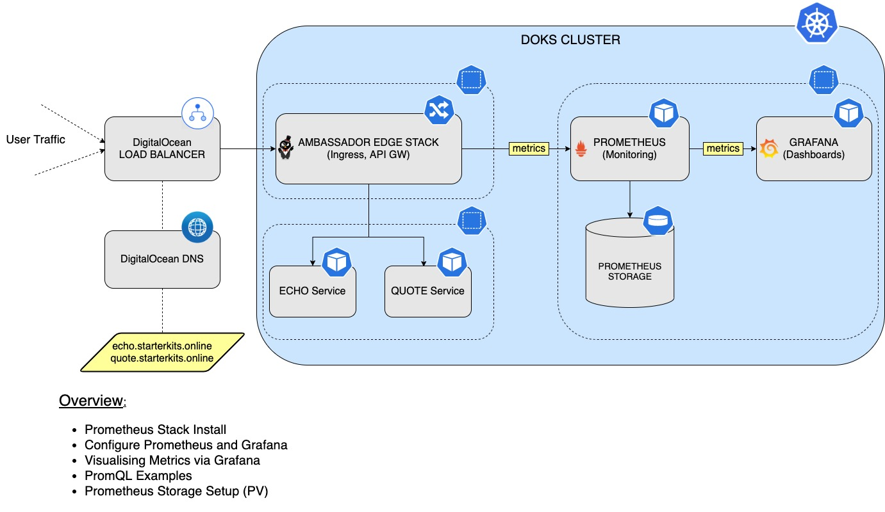
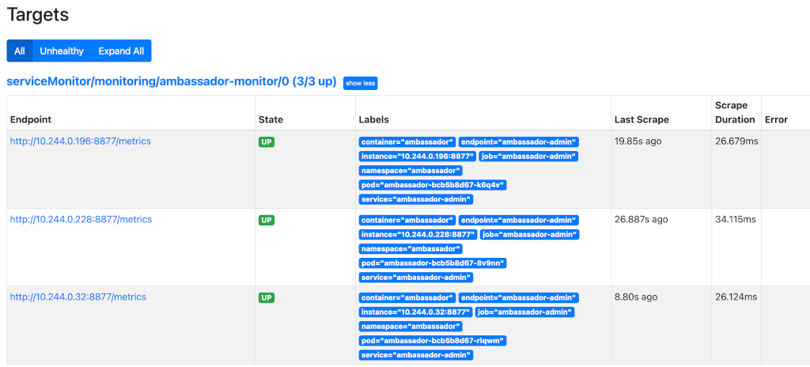

## Prometheus Monitoring Stack

### Table of contents

- [Overview](#overview)
- [Installing Prometheus Stack](#installing-prometheus-stack)
- [Configure Prometheus and Grafana](#configure-prometheus-and-grafana)
- [PromQL (Prometheus Query Language)](#promql-prometheus-query-language)
- [Grafana](#grafana)
- [Configuring Persistent Storage for Prometheus](#configuring-persistent-storage-for-prometheus)


### Overview

So, why `Prometheus` in the first place? 

Because it supports `multidimensional data collection` and `data queuing`, it's reliable and allows customers to quickly diagnose problems. Since each server is independent, it can be leaned on when other infrastructure is damaged, without requiring additional infrastructure. It also integrates very well with the `Kubernetes` model and way of working and that's a big plus as well.

`Prometheus` follows a `pull` model when it comes to metrics gathering meaning that it expects a `/metrics` endpoint to be exposed by the service in question for scraping. 

In this tutorial you'll install and configure `Prometheus` to monitor the `AES` stack and not only - `Kubernetes` cluster state metrics is an extra bonus! You'll configure `Grafana` as well to visualise metrics.

In the end, this is how the setup will look like (`AES` + `Prometheus` + `Grafana`):




### Installing Prometheus Stack

You will install the `kube-prometheus` stack using `Helm`, which is an opinionated full monitoring stack for `Kubernetes`. It includes the `Prometheus Operator`, `kube-state-metrics`, pre-built manifests, `Node Exporters`, `Metrics API`, the `Alerts Manager` and `Grafana`. 

`Helm` chart is available [here](https://github.com/prometheus-community/helm-charts/tree/main/charts/kube-prometheus-stack) for study.

Steps to follow:

1. Add the `Helm` repo and list the available charts:

    ```
    helm repo add prometheus-community https://prometheus-community.github.io/helm-charts

    helm search repo prometheus-community
    ```

    The output looks similar to the following:

    ```
    NAME                                                    CHART VERSION   APP VERSION     DESCRIPTION                                       
    prometheus-community/alertmanager                       0.12.2          v0.22.1         The Alertmanager handles alerts sent by client ...
    prometheus-community/kube-prometheus-stack              17.1.3          0.49.0          kube-prometheus-stack collects Kubernetes manif...
    ...
    ```

    **Note:**

    The chart of interes is `prometheus-community/kube-prometheus-stack`, which will install `Prometheus`, `Promtail`, `Alertmanager` and `Grafana` on the cluster. Please visit the [kube-prometheus-stack](https://github.com/prometheus-community/helm-charts/tree/main/charts/kube-prometheus-stack) page for more details about this chart.
2. Fetch and inspect the `values.yaml` file:

    ```shell
    helm show values prometheus-community/kube-prometheus-stack --version 17.1.3 > prom-stack-values.yaml
    ```

    **Hint:**

    * It's good practice in general to fetch the values file and inspect it to see what options are available. This way, you can keep for example only the features that you need for your project and disable others to save on resources.
3. Modify the `prom-stack-values.yaml` file to disable metrics for `etcd` and `kubeScheduler` (set their corresponding values to `false`). Those components are managed by `DOKS` and are not accessible to `Prometheus`. Note that we're keeping the `storage` to be `emptyDir`. It means the **storage will be gone** if `Prometheus` pods restart. For your convenience, the [prom-stack-values.yaml](res/manifests/prom-stack-values.yaml) file provided in this `Git` repository, contains the required changes already.
4. Change directory where this repository was cloned and install the `kube-prometheus-stack`:

    ```
    helm install kube-prom-stack prometheus-community/kube-prometheus-stack --version 17.1.3 \
    --namespace monitoring \
    --create-namespace \
    -f 4-setup-prometheus-stack/res/manifests/prom-stack-values.yaml
    ```

    **Note:**

    A `specific` version for the `Helm` chart is used in this tutorial (`17.1.3`). It's good practice in general to lock on a specific version or range (e.g. `^17.1.3`). This helps to avoid future issues caused by breaking changes introduced in major version releases. On the other hand, it doesn't mean that a future major version ugrade is not an option. You need to make sure that the new version is tested first. Having a good strategy in place for backups and snapshots becomes handy here (covered in more detail in [Section 6 - Backup Using Velero](../6-setup-velero)).

Now you can connect to `Grafana` (`admin/prom-operator`, see `prom-stack-values.yaml`) by port forwarding to local machine. Once in, you can go to dashboards - manage, and choose different dashboards.  You should NOT expose grafana to public network (eg. create an ingress mapping or LB service) with default login/password.

```
kubectl --namespace monitoring port-forward svc/kube-prom-stack-grafana 3000:80
```

**Hints:**

* `Grafana` installation comes with a number of dashboards. Review those by going to `Grafana -> Dashboards -> Manage`.
* Please keep the `prom-stack-values.yaml` file because it reflects the current state of the deployment (we need it later on as well).

In the next part you will discover how to set up Prometheus to discover targets for monitoring. As an example, the `Ambassador Edge Stack` will be used. You'll learn what a `ServiceMonitor` is, as well.


### Configure Prometheus and Grafana

You already deployed `Prometheus` and `Grafana` into the cluster. In this section you will learn how to use a `ServiceMonitor`. A `ServiceMonitor` is one of the preferred ways to tell `Prometheus` how to discover a new target for scraping (monitoring).

Luckily for us, the [Ambassador Edge Stack Deployment](../3-setup-ingress-ambassador/README.md#ambassador-edge-stack-deployment) created earlier in the tutorial provides the `/metrics` endpoint by default on port `8877` via a `Kubernetes` service.

The service in question is called `ambassador-admin` from the `ambassador` namespace as seen below:

```shell
kubectl get svc -n ambassador
```

The output looks similar to the following:

```
NAME               TYPE           CLUSTER-IP     EXTERNAL-IP      PORT(S)                      AGE
ambassador         LoadBalancer   10.245.39.13   68.183.252.190   80:31499/TCP,443:30759/TCP   3d3h
ambassador-admin   ClusterIP      10.245.68.14   <none>           8877/TCP,8005/TCP            3d3h
ambassador-redis   ClusterIP      10.245.9.81    <none>           6379/TCP                     3d3h
```

Then it's just a matter of invoking the `port-forward` subcommand of `kubectl` for the corresponding `Kubernetes` service:

```shell
kubectl port-forward svc/ambassador-admin 8877:8877 -n ambassador
```

The exposed metrics can be visualised using the web browser on [localhost](http://localhost:8877/metrics) or via a simple `curl` command like this:

```
curl -s http://localhost:8877/metrics
```

The output looks similar to the following:

```
# TYPE envoy_cluster_assignment_stale counter
envoy_cluster_assignment_stale{envoy_cluster_name="cluster_127_0_0_1_8500_ambassador"} 0
envoy_cluster_assignment_stale{envoy_cluster_name="cluster_127_0_0_1_8877_ambassador"} 0
envoy_cluster_assignment_stale{envoy_cluster_name="cluster_echo_backend_ambassador"} 0
envoy_cluster_assignment_stale{envoy_cluster_name="cluster_extauth_127_0_0_1_8500_ambassador"} 0
envoy_cluster_assignment_stale{envoy_cluster_name="cluster_quote_backend_ambassador"} 0
envoy_cluster_assignment_stale{envoy_cluster_name="cluster_quote_default_default"} 0
envoy_cluster_assignment_stale{envoy_cluster_name="xds_cluster"} 0
```

Next, connect `Prometheus` to this new `target`. There are several ways of achieving this:
* [<static_config>](https://prometheus.io/docs/prometheus/latest/configuration/configuration/#static_config) - allows specifying a list of targets and a common label set for them.
* [<kubernetes_sd_config>](https://prometheus.io/docs/prometheus/latest/configuration/configuration/#kubernetes_sd_config) - allows retrieving scrape targets from `Kubernetes' REST API` and always staying synchronized with the cluster state.
* [Prometheus Operator](https://github.com/prometheus-operator/prometheus-operator) - simplifies `Prometheus` monitoring inside a `Kubernetes` cluster via `CRDs`.

As you can see, there are many ways to tell `Prometheus` to scrape an endpoint, so which one should you pick? Because you're on the `Kubernetes` side, the best way is to `speak its language`, right? This means that you should always pick an option that fits best with the toolset. So which one is a perfect match if not a `Kubernetes Operator` ?
Good news is that you already have access to the `Prometheus Operator` because it comes bundled into the [Prometheus Monitoring Stack](#installing-prometheus-stack) installed earlier. So, you're going to focus on it in the next steps and see how easy it is to add a new scraping endpoint for `Prometheus` to use. On top of that, managing the [kube-prometheus-stack](https://github.com/prometheus-community/helm-charts/tree/main/charts/kube-prometheus-stack) via `Helm` simplifies things even more.
A really cool feature of `Prometheus Operator` is the `ServiceMonitor` CRD which lets us define a new target for monitoring.

Let's configure it right now and see how it works. You're going to use the `prom-stack-values.yaml` file downloaded earlier. Open it using a text editor of your choice (it's recommended to have one that has `YAML` linting support).

There are only two steps needed in order to add a new service for monitoring:

1. Add a new `ServiceMonitor` in the `prom-stack-values.yaml` values file. Make sure to adjust the `YAML` indentation, and add a new entry in the `additionalServiceMonitors` array, as seen below. For your convenience, you can use the [prom-stack-values.yaml](res/manifests/prom-stack-values.yaml#L2441) file that comes with this `Git` repository. Just uncomment the following section (search for the `# Add the Ambassador Service for monitoring` comment):

    ```
    additionalServiceMonitors:
      - name: "ambassador-monitor"
        selector:
          matchLabels:
            service: "ambassador-admin"
        namespaceSelector:
          matchNames:
            - ambassador
        endpoints:
        - port: "ambassador-admin"
          path: /metrics
          scheme: http
    ```

    Important configuration elements to be highlighted here:

    * `matchLabel` - tells what pods the deployment will apply to.
    * `selector` - specifies the resource to match (service, deployment, etc), according to the label key-pair from the `matchLabels` key.
    * `port` - can be a literal port `number` as defined in the `ambassador-metrics` service or a reference to the port `name`. 
    * `namespaceSelector` - here, you want to match the namespace of the `Ambassador Metrics Service` we have just created via the `matchNames` key.

2. Apply the changes via `Helm`:
   
    ```shell
    helm upgrade kube-prom-stack prometheus-community/kube-prometheus-stack --version 17.1.3 \
      -n monitoring \
      -f 4-setup-prometheus-stack/res/manifests/prom-stack-values.yaml
    ```

**Observation and Results:**

That's it! You can inspect now the `Ambassador` target that was added to `Prometheus` for scraping. But first, a `port-forward` is needed, so that you can see it in the web interface:

```shell
kubectl port-forward svc/kube-prom-stack-kube-prome-prometheus 9090:9090 -n monitoring
```

Navigating to the `Status -> Targets` page should give the following result (notice the `serviceMonitor/monitoring/ambassador-monitor/0` path):



**Note:**

There are **2 entries** under the discovered target because the `AES` deployment consists of 2 `Pods`. Verify it via:

```shell
kubectl get deployments -n ambassador
```

The output looks similar to the following (notice the `ambassador` line):

```
NAME               READY   UP-TO-DATE   AVAILABLE   AGE
ambassador         2/2     2            2           4d17h
ambassador-agent   1/1     1            1           4d17h
ambassador-redis   1/1     1            1           4d17h
```

In the next section you'll discover `PromQL` along with some simple examples in order to get a basic understanding of its powerful features.


### PromQL (Prometheus Query Language)

Another powerful feature of `Prometheus` that is worth mentioning is `PromQL` or the `Prometheus Query Language`. In this section we'll cover just some basics and a practical example later on. For more in depth explanations and features, please visit the official [PromQL](https://prometheus.io/docs/prometheus/latest/querying/basics/) page.

What is `PromQL` in the first place? 

It's a `DSL` or `Domain Specific Language` that is specifically built for `Prometheus` and allows you to query for metrics. Because it’s a `DSL` built upon `Go`, you’ll find that `PromQL` has a lot in common with the language. But it’s also a `NFL` or `Nested Functional Language`, where data appears as nested expressions within larger expressions. The outermost, or overall, expression defines the final value, while nested expressions represent values for arguments and operands.

Let's move to a practical example now. You're going to inspect one of the `Ambassador Edge Static` exposed metrics, namely the `ambassador_edge_stack_promhttp_metric_handler_requests_total`, which represents the total of `HTTP` requests `Prometheus` performed for the `AES` metrics endpoint.

Steps to follow:

1. Get access to the `Prometheus` web interface:

    ```
    kubectl port-forward svc/kube-prom-stack-kube-prome-prometheus 9090:9090 -n monitoring
    ```
2. Open the [expression browser](http://localhost:9090/graph).
3. In the query input field paste `ambassador_edge_stack_promhttp_metric_handler_requests_total` and hit `Enter`. The ouput looks similar to the following:

    ```
    ambassador_edge_stack_promhttp_metric_handler_requests_total{code="200", container="ambassador", endpoint="ambassador-admin", instance="10.244.0.196:8877", job="ambassador-admin", namespace="ambassador", pod="ambassador-bcb5b8d67-k6q4v", service="ambassador-admin"} 21829
    ambassador_edge_stack_promhttp_metric_handler_requests_total{code="200", container="ambassador", endpoint="ambassador-admin", instance="10.244.0.228:8877", job="ambassador-admin", namespace="ambassador", pod="ambassador-bcb5b8d67-8v9nn", service="ambassador-admin"} 21829
    ambassador_edge_stack_promhttp_metric_handler_requests_total{code="200", container="ambassador", endpoint="ambassador-admin", instance="10.244.0.32:8877", job="ambassador-admin", namespace="ambassador", pod="ambassador-bcb5b8d67-rlqwm", service="ambassador-admin"}  21832
    ambassador_edge_stack_promhttp_metric_handler_requests_total{code="500", container="ambassador", endpoint="ambassador-admin", instance="10.244.0.196:8877", job="ambassador-admin", namespace="ambassador", pod="ambassador-bcb5b8d67-k6q4v", service="ambassador-admin"} 0
    ambassador_edge_stack_promhttp_metric_handler_requests_total{code="500", container="ambassador", endpoint="ambassador-admin", instance="10.244.0.228:8877", job="ambassador-admin", namespace="ambassador", pod="ambassador-bcb5b8d67-8v9nn", service="ambassador-admin"} 0
    ambassador_edge_stack_promhttp_metric_handler_requests_total{code="500", container="ambassador", endpoint="ambassador-admin", instance="10.244.0.32:8877", job="ambassador-admin", namespace="ambassador", pod="ambassador-bcb5b8d67-rlqwm", service="ambassador-admin"}  0
    ambassador_edge_stack_promhttp_metric_handler_requests_total{code="503", container="ambassador", endpoint="ambassador-admin", instance="10.244.0.196:8877", job="ambassador-admin", namespace="ambassador", pod="ambassador-bcb5b8d67-k6q4v", service="ambassador-admin"} 0
    ambassador_edge_stack_promhttp_metric_handler_requests_total{code="503", container="ambassador", endpoint="ambassador-admin", instance="10.244.0.228:8877", job="ambassador-admin", namespace="ambassador", pod="ambassador-bcb5b8d67-8v9nn", service="ambassador-admin"} 0
    ambassador_edge_stack_promhttp_metric_handler_requests_total{code="503", container="ambassador", endpoint="ambassador-admin", instance="10.244.0.32:8877", job="ambassador-admin", namespace="ambassador", pod="ambassador-bcb5b8d67-rlqwm", service="ambassador-admin"}  0
    ```
4. `PromQL` groups similar data in what's called a `vector`. As seen above, each `vector` has a set of `attributes` which differentiates it from one another. What you can do then, is to group results based on an attribute of interest. For example, if you care only about `HTTP` requests that ended with a `200` response code then it's just a matter of writing this in the query field:

    ```
    ambassador_edge_stack_promhttp_metric_handler_requests_total{code="200"}
    ```

    The output looks similar to the following (note that it selects only the results that match our criteria):
    
    ```
    ambassador_edge_stack_promhttp_metric_handler_requests_total{code="200", container="ambassador", endpoint="ambassador-admin", instance="10.244.0.196:8877", job="ambassador-admin", namespace="ambassador", pod="ambassador-bcb5b8d67-k6q4v", service="ambassador-admin"} 21843
    ambassador_edge_stack_promhttp_metric_handler_requests_total{code="200", container="ambassador", endpoint="ambassador-admin", instance="10.244.0.228:8877", job="ambassador-admin", namespace="ambassador", pod="ambassador-bcb5b8d67-8v9nn", service="ambassador-admin"} 21843
    ambassador_edge_stack_promhttp_metric_handler_requests_total{code="200", container="ambassador", endpoint="ambassador-admin", instance="10.244.0.32:8877", job="ambassador-admin", namespace="ambassador", pod="ambassador-bcb5b8d67-rlqwm", service="ambassador-admin"}  21845
    ```

 **Note:**

  The above result shows the total requests for each `Pod` from the `AES` deployment (which consists of `3`, as seen in the `kubectl get deployments -n ambassador` command output). Each `Pod` exposes the same `/metrics` endpoint and the `Kubernetes` service makes sure that the requests are distributed to each `Pod`. Numbers at the end of each line represent the total `HTTP` requests, so you can see that is roughly the same: `21843`, `21843`, `21845`. This demonstrates the `Round Robin` method being used by the service.

This is just a very simple introduction to what `PromQL` is and what it's capable of. But it can do much more than that, like: counting metrics, computing the rate over a predefined interval, etc. Please visit the official [PromQL](https://prometheus.io/docs/prometheus/latest/querying/basics/) page for more features of the language.


### Grafana

Although `Prometheus` has some support for visualising data built in, a better way of doing it is via `Grafana` which is an open-source platform for monitoring and observability that lets you visualize and explore the state of your systems.

On the official page is described as being able to:

> Query, visualize, alert on, and understand your data no matter where it’s stored.

Why use `Grafana`?

Because it's the leading open source monitoring and analytics platform available nowadays for visualising data coming from a vast number of data sources, including `Prometheus` as well. It offers some advanced features for organising the graphs and it supports real time testing for queries. Not to mention that you can customize the views and make some beautiful panels which can be rendered on big screens so you never miss a single data point.

No extra steps are needed for installation because the [Prometheus Monitoring Stack](#installing-prometheus-stack) deployed earlier already took care of it. All you have to do is a port forwarding like below and get immediate access to the dashboards (default credentials: `admin/prom-monitor`):

```
kubectl --namespace monitoring port-forward svc/kube-prom-stack-grafana 3000:80
```

In order to see all the `Ambassador Edge Stack` metrics, you're going to add this well-designed [dashboard](https://grafana.com/grafana/dashboards/4698) from the `Grafana` community.

Creating the above dashboard is easy:

1. Navigate to the [dashboard import](http://localhost:3000/dashboard/import) section (or hover the mouse on the `+` sign from the left pane, then click `Import`).
2. In the `Import via grafana.com` section just paste the ID: `4698`, then click `Load`.
3. The final step would be to select a data source - `Prometheus` in this case, then hit the `Import` button.

The picture down below shows the available options:


Fields description:

* `Name` - the dashboard name (defaults to `Ambassador`).
* `Folder` - the folder name where to store this dashboard (defaults to `General`).
* `Prometheus` - the `Prometheus` instance to use (you have only one in this example).
* `Listener port` - the `Envoy listener port` (defaults to `8080`).

After clicking `Import`, it will create the following dashboard as seen below:


In the next part, you're going to monitor the number of `API` calls for the `quote` backend service created in the [AES - Backend Services](../3-setup-ingress-ambassador/README.md#creating-aes-backend-services) section. The graph of interest is: `API Response Codes`.

If you call the service 2 times, you will see 4 responses being plotted. This is normal behavior because the `API Gateway` (from the `Ambassador Edge Stack`) is hit first and then the real service. Same thing happens when a reply is being sent back, so we have a total of: `2 + 2 = 4` responses being plotted in the `API Response Codes` graph.

`CLI` command used for testing the above scenario:

```shell
curl -Lk https://quote.starterkits.online/quote/
```

The output looks similar to the following:
```
{
    "server": "buoyant-pear-girnlk37",
    "quote": "A small mercy is nothing at all?",
    "time": "2021-08-11T18:18:56.654108372Z"
}
```
This concludes the `Grafana` setup. You can play around and add more panels for visualising other data sources, as well as group them together based on scope.


### Configuring Persistent Storage for Prometheus

In this section, you will learn how to enable `persistent storage` for `Prometheus`, so that relevant data is persisted across `Pod` restarts. You will define a `5 Gi Persistent Volume Claim` (PVC), using the `DigitalOcean Block Storage`. Later on, a quick and easy guide is provided on how to plan the size of the PVC to suit your monitoring storage needs. To learn more about `PVCs`, please consult the [Persistent Volumes](https://kubernetes.io/docs/concepts/storage/persistent-volumes) page from the official `Kubernetes` documentation.

First, check what storage class is present. You must have one ready and available in order to proceed:

```shell
kubectl get storageclass
```

The output should look similar to:

```
NAME                         PROVISIONER                 RECLAIMPOLICY   VOLUMEBINDINGMODE   ALLOWVOLUMEEXPANSION   AGE
do-block-storage (default)   dobs.csi.digitalocean.com   Delete          Immediate           true                   4d2h
```

If the result looks like the one from above, you can proceed with the next steps.

To enable `persistent` storage, the `storageSpec` must be defined for `Prometheus`, as seen below. For your convenience, the [prom-stack-values.yaml](res/manifests/prom-stack-values.yaml#L2241) file present in this `Git` repository, contains the changes already. Just uncomment the required section for Prometheus as seen below (search for the `# Prometheus StorageSpec for persistent data` comment):

```
storageSpec:
  volumeClaimTemplate:
    spec:
      storageClassName: do-block-storage
      accessModes: ["ReadWriteOnce"]
      resources:
        requests:
          storage: 5Gi
```

Explanations for the above configuration:

* `volumeClaimTemplate` - defines a new `PVC`.
* `storageClassName` - defines the storage class (should use the same value as from the `kubectl get storageclass` command output).
* The `resources` section sets the storage requests value - in this case a total capacity of `5 Gi` is requested for the new volume.

Apply the new setting with:

```shell
helm upgrade kube-prom-stack prometheus-community/kube-prometheus-stack --version 17.1.3 \
  -n monitoring \
  -f 4-setup-prometheus-stack/res/manifests/prom-stack-values.yaml
```

Check the new PVC status:

```shell
kubectl get pvc -n monitoring
```

The output looks similar to:

```
NAME                      STATUS   VOLUME                                     CAPACITY   ACCESS         MODES              AGE
kube-prome-prometheus-0   Bound    pvc-768d85ff-17e7-4043-9aea-4929df6a35f4   5Gi        RWO            do-block-storage   4d2h
```

If the output looks like the one seen above (`Status` set to `Bound`), then you're all set. 

A new `Volume` should appear as well in the [Volumes](https://cloud.digitalocean.com/volumes) section from your `DigitalOcean` account panel:


**Best practices for PV sizing**

In order to compute the size needed for the volume based on your needs, please follow the official documentation advice and formula.

> `Prometheus` stores an average of only `1-2 bytes` per sample. Thus, to `plan the capacity` of a `Prometheus` server, you can use the rough formula:

> `needed_disk_space = retention_time_seconds * ingested_samples_per_second * bytes_per_sample`

> To lower the rate of ingested samples, you can either `reduce` the `number of time series` you scrape (fewer targets or fewer series per target), or you can `increase` the `scrape interval`. However, `reducing` the number of series is likely more effective, due to `compression` of samples within a series.

Please follow the official [Operational Aspects](https://prometheus.io/docs/prometheus/latest/storage/#operational-aspects) section for more details on the subject.

**Next steps**

This concludes the `Prometheus` stack setup. In the next section, you will learn about `logs` collection and aggregation via `Loki`.

Go to [Section 5 - Logs Aggregation via Loki Stack](../5-setup-loki-stack)
