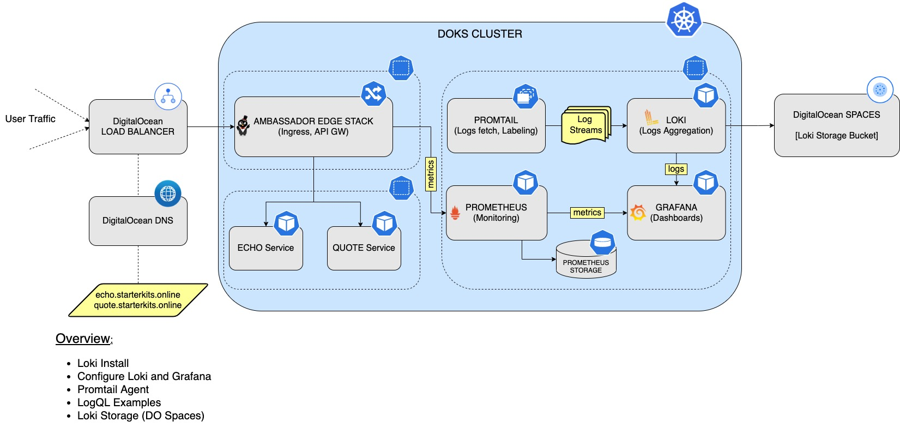
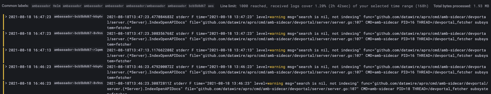
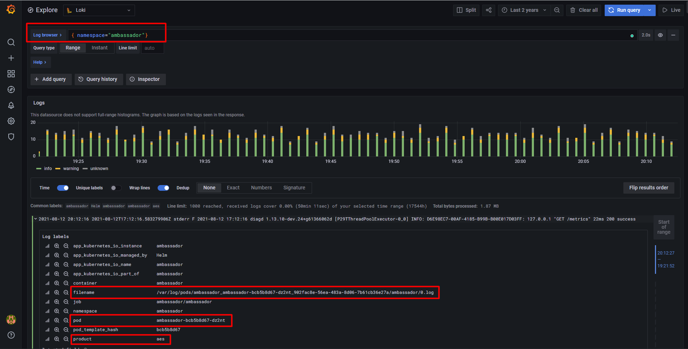

## Logs Aggregation via Loki Stack

### Table of contents

- [Logs Aggregation via Loki Stack](#logs-aggregation-via-loki-stack)
  - [Table of contents](#table-of-contents)
  - [Overview](#overview)
  - [Installing LOKI](#installing-loki)
  - [Configure Grafana with Loki](#configure-grafana-with-loki)
  - [Promtail](#promtail)
  - [LogQL](#logql)
  - [Persistence Storage Changes](#persistence-storage-changes)


### Overview

What is `Loki`?

> Loki is a `horizontally-scalable`, `highly-available`, `multi-tenant` log aggregation system inspired by `Prometheus`.

Why use `Loki` in the first place? The main reasons are (some were already highlighted above):

* `Horizontally scalable`
* `High availabilty`
* `Multi-tenant` mode available
* `Stores` and `indexes` data in a very `efficient` way
* `Cost` effective
* `Easy` to operate
* `LogQL` DSL (offers the same functionality as `PromQL` from `Prometheus`, which is a plus if you're already familiar with it)

This is how the main setup looks like after completing this tutorial:




### Installing LOKI

We need [Loki](https://github.com/grafana/helm-charts/tree/main/charts/loki-stack) for logs. `Loki` runs on the cluster itself as a `StatefulSet`. Logs are `aggregated` and `compressed` by `Loki`, then sent to the configured `storage`. Then, you can connect `Loki` data source to `Grafana` and view the logs.

Steps to follow:

1. Add the `Helm` repo and list the available charts:

    ```shell
    helm repo add grafana https://grafana.github.io/helm-charts

    helm search repo grafana
    ```

    The output looks similar to the following:

    ```
    NAME                                            CHART VERSION   APP VERSION     DESCRIPTION                                       
    grafana/grafana                                 6.16.2          8.1.2           The leading tool for querying and visualizing t...
    grafana/enterprise-metrics                      1.5.0           v1.5.0          Grafana Enterprise Metrics                        
    grafana/fluent-bit                              2.3.0           v2.1.0          Uses fluent-bit Loki go plugin for gathering lo...
    grafana/loki                                    2.4.1           v2.1.0          Loki: like Prometheus, but for logs.
    ...
    ```

    **Note:**

    The chart of interes is `grafana/loki-stack`, which will install standalone `Loki` on the cluster. Please visit the [loki-stack](https://github.com/grafana/helm-charts/tree/main/charts/loki-stack) page for more details about this chart.

2. Fetch and inspect the values file:

    ```shell
    helm show values grafana/loki-stack --version 2.4.1 > loki-values.yaml
    ```

    **Hint:**

    It's good practice in general to fetch the values file and inspect it to see what options are available. This way, you can keep for example only the features that you need for your project and disable others to save on resource usage.

3. Install the stack. The following command will take care of everything for you:

    ```shell
    helm install loki grafana/loki-stack --version 2.4.1 \
      --namespace=monitoring \
      --create-namespace \
      --set grafana.enabled=false \
      --set prometheus.enabled=false \
      --set promtail.enabled=true \
    ``` 

    **Notes:**

    * A `specific` version for the `Helm` chart is used. In this case `2.4.1` was picked, which maps to the `2.1.0` release of `Loki` (see the output from `Step 1.`). It's good practice in general to lock on a specific version or range (e.g. `^2.4.1`). This helps to avoid future issues caused by breaking changes introduced in major version releases. On the other hand, it doesn't mean that a future major version ugrade is not an option. You need to make sure that the new version is tested first. Having a good strategy in place for backups and snapshots becomes handy here (covered in more detail in [Section 6 - Backup Using Velero](../6-setup-velero)).
    * `Promtail` is needed so it will be enabled (explained in [Promtail](#promtail) section).
    * `Prometheus` and `Grafana` installation is disabled because [Section 4 - Set up Prometheus Stack](../4-setup-prometheus-stack) took care of it already.

In the next part you will configure `Grafana` to use the `Loki` datasource so that you can query for logs.


### Configure Grafana with Loki

You already have `Loki` and `Grafana` installed. Now it's time to connect things together to benefit from both worlds.

Let's add the `Loki` data source to `Grafana`. Go to the `Grafana` web console and follow these steps: 

1. Click the `Settings` gear from the left panel.
2. Select `Data sources`.
3. Click the `Add data source` blue button.
4. Select `Loki` from the list and add `Loki` url `http://loki:3100`. 
5. Save and test.

If everything went well a green label message will appear saying `Data source connected and labels found.`

Now you can access logs from the `Explore` tab of `Grafana`. Make sure to select `Loki` as the data source. Use `Help` button for log search cheat sheet.

In the next section you will discover `Promtail`, which is the agent responsible with `fetching` the logs and `labeling` the data.


### Promtail

`Promtail` is an `agent` which ships the contents of local logs to a private `Loki` instance. It is usually deployed to every machine that has applications needed to be monitored. It comes bundled with the [Loki Stack](#installing-loki) stack you deployed earlier and it was enabled via the `<promtail.enabled>` Helm value.

What `Promtail` does is:

* `Discovers` targets
* `Attaches labels` to `log streams`
* `Pushes` them to the `Loki` instance.

**Log file discovery:**

Before `Promtail` can ship any data from log files to `Loki`, it needs to find out information about its environment. Specifically, this means discovering applications emitting log lines to files that need to be monitored.

`Promtail` borrows the same service discovery mechanism from `Prometheus`, although it currently only supports `Static` and `Kubernetes` service discovery. This limitation is due to the fact that `Promtail` is deployed as a daemon to every local machine and, as such, does not discover label from other machines. `Kubernetes` service discovery fetches required labels from the `Kubernetes API` server while `Static` usually covers all other use cases.

As with every `monitoring agent` you need to have a way for it to be up all the time. The `Loki` stack `Helm` deployment already makes this possible via a `DaemonSet`, as seen below:

```shell
kubectl get ds -n monitoring
```

The output looks similar to the following (notice the `loki-promtail` line):

```
NAME                                       DESIRED   CURRENT   READY   UP-TO-DATE   AVAILABLE   NODE SELECTOR   AGE
kube-prom-stack-prometheus-node-exporter   2         2         2       2            2           <none>          7d4h
loki-promtail                              2         2         2       2            2           <none>          5h6m
```

This is great! But how does it discover `Kubernetes` pods and assigns labels? Let's have a look at the associated `ConfigMap`:

```shell
kubectl get cm loki-promtail -n monitoring -o yaml
```

The output looks similar to the following:

```
scrape_configs:
  - job_name: kubernetes-pods-name
    pipeline_stages:
      - docker: {}
    kubernetes_sd_configs:
    - role: pod
    relabel_configs:
    - action: replace
      source_labels:
      - __meta_kubernetes_namespace
      target_label: namespace
```

As seen above in the `scrape_configs` section, there's a `kubernetes-pods-name` job, which:

* Helps with `service discovery` on the `Kubernetes` side via `kubernetes_sd_configs` (works by using the `Kubernetes API` from the node that the `loki-prommtail DaemonSet` runs on).
* Re-labels `__meta_kubernetes_namespace` to `namespace` in the `relabel_configs` section.

For more features and in depth explanations please visit the [Promtail](https://grafana.com/docs/loki/latest/clients/promtail) official page.

In the next section you'll be introduced to `LogQL` which is the `PromQL` brother, but for logs. Some basic features of `LogQL` will be presented as well.


### LogQL

`Loki` comes with its very own language for querying the logs called `LogQL`. `LogQL` can be considered a `distributed grep` with `labels` for filtering.

A basic `LogQL` query consists of two parts: the `log stream selector` and a `filter` expression. Due to Loki’s design, all `LogQL` queries are required to contain a `log stream selector`.

The `log stream selector` will reduce the number of log streams to a manageable volume. Depending on how many labels you use to filter down the log streams it will affect the relative performance of the query’s execution. The filter expression is then used to do a distributed grep over the retrieved log streams.

Let's move to a practical example now and query `Ambassador` logs from the `AES` deployment. Please follow the steps below:

1. Get access to `Grafana` web interface:

    ```shell
    kubectl port-forward svc/kube-prom-stack-grafana 3000:80 -n monitoring
    ```
2. Open the [web console](http://localhost:3000) and navigate to the `Explore` tab from the left panel. Select `Loki` from the data source menu and run this query:
    
    ```
    {container="ambassador",namespace="ambassador"}
    ```

    The output looks similar to the following:

    
3. Let's query again, but this time filter the results to include only `warning` messages:

    ```
    {container="ambassador",namespace="ambassador"} |= "warning"
    ```

    The output looks similar to the following (notice the `warning` word being highlighted in the results window):

    

As seen in the above examples, each query is composed of:

* A `log stream` selector `{container="ambassador",namespace="ambassador"}` which targets the `ambassador container` from the `ambassador namespace`.
* A `filter` like `|= "warning"`, which will filter out lines that contain only the `warning` word

More complex queries can be created using `aggregation` operators. For more details on that and other advanced topics, please visit the official [LogQL](https://grafana.com/docs/loki/latest/logql) page.

Another feature of `Loki` that is worth mentioning is [Labels](https://grafana.com/docs/loki/latest/getting-started/labels). `Labels` allows us to organize streams. In other words, `labels` add `metadata` to a log stream in order to distinguish it later. Essentially, they are `key-value` pairs that can be anything you want as long as they have a meaning for the data that is being tagged. 

The picture down below will highlight this feature in the `Log labels` sub-window from the query page (namely the: `filename`, `pod` and `product`):



Let's simplify it a little bit by taking the example from the above picture:

```
{namespace="ambassador"}
```

The `label` in question is called `namespace` - remember that labels are `key-value` pairs ? You can see it right there inside the curly braces. This tells `LogQL` that you want to fetch all the log streams that are tagged with the label called `namespace` and has the value equal to `ambassador`.

This concludes the `Loki` setup. For more details and in depth explanations please visit the [Loki](https://grafana.com/docs/loki/latest) official documentation page.

Go to [Section 6 - Backup Using Velero](../6-setup-velero)

### Persistence Storage Changes

When we decide Persistence Storage from default loki storage to Digital Ocean Storage, we have to create a space named `loki-starterkit-storage` and region part is prefered as `fra1` besides these, you have to add `access_key_id`, `secret_access_key` and `endpoint` at the end of `loki-values.yaml` file. S3 config now supports expanded config. Either s3 endpoint URL can be used or expanded config can be used. Changing storage by adding some config values in loki-values.yaml get described below.

```
storage_config:
  aws:
    bucketnames: loki-starterkit-storage
    endpoint: fra1.digitaloceanspaces.com
    region: fra1
    access_key_id: 5NPIUJ7DPF4B5THD3TK5
    secret_access_key: CetB1roHmBuLYtT4XxlO0ieP+5Q9GdB114vcjIcKd6s
    insecure: false
    sse_encryption: false
    http_config:
      idle_conn_timeout: 90s
      response_header_timeout: 0s
      insecure_skip_verify: false
    s3forcepathstyle: true

```
Upgrading modified `loki-values.yaml` helps us applying persistence storage changes for Digital Ocean Spaces. 
```
 helm upgrade  loki grafana/loki-stack --version 2.4.1 \
      --namespace=monitoring \
      --create-namespace \
      --set grafana.enabled=false \
      --set prometheus.enabled=false \
      --set promtail.enabled=true \
      -f loki-values.yaml \

```