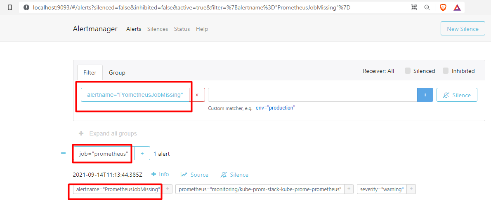

## Alerting and Notification

### Table of contents

-[Alerting and Notification Overview](#Alerting-and-Notification-Overview)
-[List of Included Alerts](#List-of-Included-Alerts)
-[Creating a new Alert](#Creating-a-new-Alert)
-[Notification By Slack](#Notification-By-Slack)

### Overview

Alerts and Notifications are a critical part of your day 2 workflow. When things go wrong (eg. any service is down, or a pod is crashing etc.), you need to fire the appropriate alerts and notifications to handle these situations. `The Starter Kit` includes a set of default alerts as part of the kube-prom-stack installation.

`AlertManager` is part of the kube-prom-stack and it allows you to receive alerts from various clients (sources), like Prometheus for example. Rules are created on the Prometheus side, which in turn can fire alerts. Then, it’s the responsibility of `AlertManager` to intercept those alerts, group them (aggregation), apply other transformations and finally route to the configured receivers. Notification messages can be further formatted to include additional details if desired. Talking about receivers, you can use Slack, Gmail, etc to send real time notifications.

In this tutorial, you will learn how to inspect the existing alerts, create new ones, and then configure `AlertManager` to send notifications via `Slack`.

### List of Included Alerts

In this part, we will focus on default rules provided by Prometheus `AlertManager`. Rules are important parts in prom-stack-values.yaml. These are alert,expr,for. Also you can run the below command in your local terminal and easily see all default alerts by writing your internet browser localhost:9091/alerts.The page includes inactive,pending and firing rules list.

kubectl --namespace monitoring port-forward svc/kube-prom-stack-kube-prome-prometheus 9091:9090

- *TargetDown:* One or more targets are unreachable or down.
- *Watchdog :* An alert that should always be firing to certify that Alertmanager is working properly.
- *KubePodCrashLooping:* when Pod is crash-looping, Pod is restarting some times / 10 minutes. Also AlertManager creates an alert.
- *KubePodNotReady:* An alert that Pod has been in a non-ready state for longer than 15 minutes.
- *KubeDeploymentReplicasMismatch:* when deployment has not matched the expected number of replicas, AlertManager is creating this alert.
- *KubeStatefulSetReplicasMismatch:* when StatefulSet has not matched the expected number of replicas for longer than 15 minutes, AlertManager creates an alert.
- *KubeJobCompletion:* when job is taking more than 12 hours to complete, Job did not complete in time
- *KubeJobFailed:* when job failed to complete. Removing a failed job after investigation should clear this alert.
- *CPUThrottlingHigh:* when you reach CPU Limits, CPUthrottling is firing this rule to urge you.
- *KubeControllerManagerDown:* kube-controller-manager is a kind of job that helps kube-controller-manager run or not when it has disappeared from Prometheus target discovery.this rule will detect this unwanted situation.
- *KubeSchedulerDown:* kube-scheduler is an important part of kubernetes. This job is searching for a kube-scheduler that is running when it is absent. This rule helps us to understand it’s health.

### Creating New Alert

For sending notifications about firing alerts to an external service, Alerting rules allow you to define alert conditions based on Prometheus expression language expressions. Whenever the alert expression results in one or more vector elements at a given point in time, the alert counts as active for these elements' label sets. Because of that, we need to change the values file before helming. when you visit  `http://localhost:9093/alerts`, you can see one of the created rules by yourself when you make filtering. When you `port-forward` to see the `AlertManager` created and the existing rule list, you can use `Filter` and `Group` to see your custom rules.

```shell
kubectl --namespace monitoring port-forward svc/kube-prom-stack-kube-prome-alertmanager 9093
```

Here there is a Filter tab, you can filter your custom alert name and by clicking on the Info button you can see all details about yours and existing rules.



Add rules in part of `additionalPrometheusRules` , This part is used to add new rules and you can see these rules in `AlertManager` web UI by grouping or filtering. We are trying to explain the whole structure as template below.

```shell
additionalPrometheusRules: 
 - name: <my-rule-file-name>
groups:
- name: <example>
  rules:
  - alert: <alert-name>
    expr: <Condition for alerting - Prometheus Query>
    for: <Repeating Time Interval>
    labels:
      severity: <warning|critical>
    Annotations:
      title: <title>
      summary: <summary> 
      description: <informational labels to store more information>

```

Creating the below rules helps us to understand our cluster needs and health condition. `additionalPrometheusRules` part enables you to use PromQL to define metric expressions that you can alert on. You define the alert conditions using the PromQL-based metric expression. This way, you can combine different metrics and warn on cases like service-level agreement breach, running out of disk space in a day, and so on.You can add the code block inside of  `prom-stack-values.yaml` for testing.

- `InstanceDown` helps us to catch any replica not running or unhealthy pod(s) appearing in ambassador namespace.when you run 'kubectl get pods -n ambassador' you will see that there are 5 pods. 3 of them belong to gateways and remained 2 belong to Redis and agent. In the first rule, "<5" means you have 5 pods when your pods become less than 5 pods, this will throw a critical error.

```shell
additionalPrometheusRules:
- name: my-rule-file
   groups:
  - name: AllInstances
     rules:
    - alert: InstanceDown
       expr: sum(kube_pod_owner{namespace="ambassador"}) by (namespace) < 5
       for: 1m
       labels:
         severity: 'critical'
 annotations:
         title: 'Instance {{ $labels.instance }} down'
         description: 'ambassador pod(s) is down for more than 1 minute.'
```

- `PrometheusJobMissing` is detecting whether a prometheus job is missing or not alive by using an absent function.

```shell
- alert: PrometheusJobMissing
  expr: absent(up{job="prometheus"})
  for: 1m
  labels:
    severity: warning
  annotations:
    summary: 'Prometheus job missing (instance {{ $labels.instance }})'
    description: 'A Prometheus job has disappeared'
```  

- `PrometheusAllTargetsMissing` helps to understand Prometheus' target health conditions

```shell
- alert: PrometheusAllTargetsMissing
  expr: count by (job) (up) != 0
  for: 0m
  labels:
    severity: critical
  annotations:
    summary: 'Prometheus all targets missing' 
    description: 'A Prometheus job does not have living target anymore.'
```

 Also There are a documentation about Kubernetes Alert Runbooks, you can visit this documentation and learn message and severity information.

### Notification By Slack

Creating Alert is not sufficient enough if you don’t care about Prometheus or alertmanager page.Because you have to visit Prometheus and see your alerts firing result. You can run also below query to see your results by evaluation time

```shell
ALERTS{alertname="InstanceDown"} 
```

When you need to control alert results, you have to focus on Alertmanager during all days. But there is another possibility to notify you about the condition of your cluster. There is an important part of AlertManager.this section we will explain how to create a notification for detecting unwanted situations in your cluster.Config part help us to tell alertmanager how to access slack api, routing match receiver and channel name for notifications.


#### How to create a webhook for a testing channel in Slack App?

When we decide to create a channel in `Slack`, By clicking `Plus` in the `Left panel` and then giving a name for your channel, the essential part is webhook which is a kind of inbound/outbound sub-pub technology for special purposes. Here, we have to visit your company's slack application web page. In the post channel section, you can choose your channel name and then click Add `Incoming WebbHooks` Integration will create a webhook with a token located at the end of the URL as a parameter. This URL will be used for communication with slackapi.

Add the config part should include `slack_api_url`, `routes`, and `slack_config` parts:

```shell
alertmanager:  
  config:
    global:
      resolve_timeout: 5m
      slack_api_url: "https://hooks.slack.com/services/TXXXX/BXXXX/<token>"
    route:
      group_by: ['job']
      group_wait: 30s
      group_interval: 5m
      repeat_interval: 1h
      routes:
      - match:
        receiver: 'slack'
        continue: true
    receivers:
    - name: 'slack'
      slack_configs:
      - channel: '#promalerts'
        send_resolved: false
        title: '[{{ .Status | toUpper }}{{ if eq .Status "firing" }}:{{ .Alerts.Firing | len }}{{ end }}] Monitoring Event Notification'
        text: "this is a test from blueprint team from Digital Ocean"
```

Apply below upgrading command:

```shell
helm upgrade kube-prom-stack prometheus-community/kube-prometheus-stack --version 17.1.3 --namespace monitoring --create-namespace -f prom-stack-values.yaml
```

#### Notes

- `slack_api_url:` When you decide to send a notification by using slack you have to create a channel that gives you a token inside of the url. We prefer here Incoming WebHooks for hooking. it is the easiest way to send a notification. Please visit to create a channel and get your own token from Slack.[Please visit for more details](https://api.slack.com/legacy/custom-integrations/messaging/webhooks)
- `routes:` in this part, you will have some receivers and tell routes for the matching receiver here.
- `slack_configs:` this segment includes more than 4 parts but here, channel, title, text are important parts for telling Slack router which channel and which title-text message will have. This part is totally related to how to use notifications in prom-stack-values.yaml. Please visit the Prometheus-Notifications page for more details about this chart.
