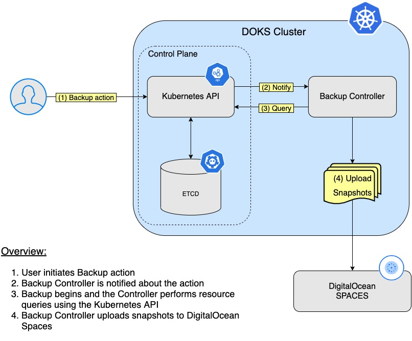
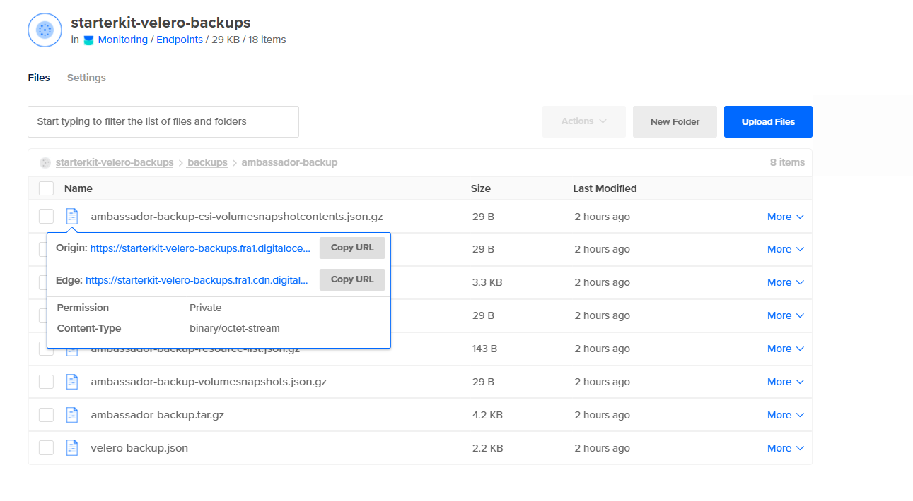

## Backup Using Velero <a name="VELE"></a>


### Table of contents
- [Overview](#overview)
- [How Velero Works](#how-velero-works)
- [Prerequisites](#prerequisites)
- [Velero Installation](#velero-installation)
- [Namespace Backup and Restore](#namespace-backup-and-restore)
- [Backup and Restore Whole Cluster](#backup-and-restore-whole-cluster)
- [Scheduled Backup and Restore](#scheduled-backup-and-restore)
- [Deleting Snapshots](#deleting-snapshots)
- [Final Notes](#final-notes)
- [Learn More](#learn-more)


### Overview

This guide will show you how to deploy `Velero` to your `Kubernetes` cluster, create backups, and recover from a backup after something goes wrong in the cluster.

You can back up your `entire` cluster, or optionally choose a `namespace` or `label selector` to back up.

`Backups` can be run `one off` or `scheduled`. It’s a good idea to have `scheduled` backups so you are certain you have a recent backup to easily fall back to. You can also create backup [hooks](https://velero.io/docs/v1.6/backup-hooks/) if you want to execute actions before or after a backup is made.

Why `Velero`?

`Velero` gives you tools to `back up` and `restore` your `Kubernetes cluster resources` and `persistent volumes`. You can run `Velero` with a `cloud provider` or `on-premises`. 

Advantages of using `Velero`:

* Take `backups` of your cluster and `restore` in case of loss.
* `Migrate` cluster resources to other clusters.
* `Replicate` your `production` cluster to `development` and `testing` clusters.


### How Velero Works

`Velero` consists of two parts:

* A `server` that runs on your cluster
* A `command-line` client that runs locally

Each `Velero` operation – `on-demand backup`, `scheduled backup`, `restore` – is a `custom resource`, defined with a `Kubernetes Custom Resource Definition` (CRD) and stored in `etcd`. `Velero` also includes `controllers` that process the custom resources to perform backups, restores, and all related operations.

You can `back up` or `restore all objects` in your cluster, or you can `filter objects` by `type`, `namespace`, and/or `label`.

Below is a diagram that shows the backup workflow:



`Velero` is `ideal` for the `disaster` recovery use case, as well as for snapshotting your application state, prior to performing system operations on your cluster, like upgrades. For more details on this topic, please visit the [How Velero Works](https://velero.io/docs/v1.6/how-velero-works/) official page.


### Prerequisites

Before you get started you will need to do the following:

* Create a [Spaces](https://docs.digitalocean.com/products/spaces/how-to/create/) bucket and access keys. Save the `access` key and `secret` in a safe place for later usage. 
* You should have an DigitalOcean `API token`. If not, [create one](https://docs.digitalocean.com/reference/api/create-personal-access-token/) for `Velero` from the cloud console.


### Velero Installation

There are three parts involved:

1. A `client` (used to interact with the `Velero Server` and perform Backup/Restore operations)
2. A `server` (runs on the `DOKS Cluster` as a `Kubernetes` resource)
3. A `storage` provider for `Velero` to store your `resources` and `volumes`. In case of DigitalOcean this is `Spaces` (`S3` like objects storage) - already covered in the [Prerequisites](#prerequisites) section.

**Installing the Velero CLI**

Just follow the [CLI installation](https://velero.io/docs/v1.6/basic-install/#install-the-cli) steps for your OS distribution as detailed on the official page (in this tutorial `v1.6` is used).

**Installing the Velero Server and Storage Provider Plugins**

In the steps to follow you will deploy `Velero` and all the required components so that it will be able to perform backups for `Kubernetes` resources and `PV's`. The backup data will be stored in the DO `Spaces` bucket created earlier in the [Prerequisites](#prerequisites) section.

Steps to follow:

1. Add the `Helm` repository:

    ```
    helm repo add vmware-tanzu https://vmware-tanzu.github.io/helm-charts
    ```

2. A cloud credentials file is needed in order for `Velero` to access `DO Spaces`. Create a `secrets.txt` file under the current working directory with the following content (make sure to replace the `<>` placeholders accordingly):

    ```
    [default]
    aws_access_key_id=<DO_SPACES_ACCESS_KEY_ID>
    aws_secret_access_key=<DO_SPACES_SECRET_ACCESS_KEY>
    ```

    The `<DO_SPACES_ACCESS_KEY_ID>` and `<DO_SPACES_SECRET_ACCESS_KEY>` represent your `DigitalOcean Spaces` key name and secret created in the [Prerequisites](#prerequisites) section.
3. Start the `deployment` for `Velero` and replace the required `<>` placehholders accordingly (each is explained down below):

    ```
    helm install velero vmware-tanzu/velero \
    --namespace velero \
    --create-namespace \
    --set credentials.extraEnvVars.digitalocean_token=<DIGITALOCEAN_API_TOKEN>  \
    --set-file credentials.secretContents.cloud=./secrets.txt \
    --set configuration.provider=aws \
    --set configuration.backupStorageLocation.bucket=<BUCKET_NAME> \
    --set configuration.backupStorageLocation.config.region=<REGION> \
    --set configuration.backupStorageLocation.config.s3Url=https://<REGION>.digitaloceanspaces.com \
    --set initContainers[0].name=velero-plugin-for-aws \
    --set initContainers[0].image=velero/velero-plugin-for-aws:v1.0.0 \
    --set initContainers[0].volumeMounts[0].mountPath=/target \
    --set initContainers[0].volumeMounts[0].name=plugins \
    --set initContainers[1].name=velero-plugin \
    --set initContainers[1].image=digitalocean/velero-plugin:v1.0.0 \
    --set initContainers[1].volumeMounts[0].mountPath=/target \
    --set initContainers[1].volumeMounts[0].name=plugins \
    --set snapshotsEnabled=true \
    --set configuration.volumeSnapshotLocation.provider=digitalocean.com/velero \
    --set deployRestic=false
    ```

    Explanations for the above configuration:

    * `<configuration.provider=aws>` - enables the DigitalOcean S3 like storage provider.
    * `<configuration.volumeSnapshotLocation.provider=digitalocean.com/velero>` - enables the DigitalOcean Block Storage provider. It is designed to create filesystem snapshots of Block Storage backed PersistentVolumes.
    * `<initContainers[<index>]= ...>` - stores plugin configuration for each provider being used.
    * `<snapshotsEnabled=true>` - enables the Snapshots feature.
    * `<deployRestic=false>` - whether to deploy the restic daemonset (disabled in this example because it's considered beta).
    * `<DIGITALOCEAN_API_TOKEN>` - your DigitalOcean API Token. Velero needs it in order to authenticate with the DigitalOcean API when manipulating snapshots.
    * `<BUCKET_NAME>` and `<REGION>` - your DigitalOcean Spaces bucket name and region (e.g.: `nyc3`) created in the [Prerequisites](#prerequisites) section.

**Verify the installation**

Check the `Velero` deployment:

```bash
helm ls -n velero
```

The output looks similar to the following:

```
NAME    NAMESPACE       REVISION        UPDATED                                 STATUS          CHART           APP VERSIONvelero  backup          1               2021-08-25 13:16:24.383446 +0300 EEST   deployed        velero-2.23.6   1.6.3 
```

Check that `Velero` is up and running:

```bash
kubectl get deployment velero -n velero
```

The output looks similar to the following:

```
NAME     READY   UP-TO-DATE   AVAILABLE   AGE
velero   1/1     1            1           67s
```

If you’re interested in looking further, you can view Velero’s server-side components by running (replace the `<>` placeholders accordingly):

```bash
kubectl -n velero get all
```

`Velero` also uses a number of `CRDs` (Custom Resource Definitions) to represents its own resources like backups, backups schedules, etc.

Some basic backup/restore examples will be provided in the next part.


### Namespace Backup and Restore

In this scenario you'll backup an entire namespace from the cluster and restore it afterwards making sure that all the resources are re-created. The namespace in question is `ambassador`.

Ensure that the `Ambassador` deployment is running and there is a `Service` with an `EXTERNAL-IP` (`kubectl get service --namespace ambassador`). Browse the `IP` a few times to write some log entries to the persistent volume. Then create a `backup` with `Velero`:

Steps to follow:

1. Initiate the backup:

    ```bash
    velero backup create ambassador-backup --include-namespaces ambassador
    ```

2. Check that the backup was created:

    ```bash
    velero backup get
    ```

    The output lools similar to:

    ```
    NAME                                       STATUS      ERRORS   WARNINGS   CREATED                          EXPIRES   STORAGE LOCATION   SELECTOR
    ambassador-backup                          Completed   0        0          2021-08-25 19:33:03 +0300 EEST   29d       default            <none>
    ```
3. After a few moments, you can inspect it:

    ```bash
    velero backup describe ambassador-backup --details
    ```

    The output looks similar to:

    ```
    Name:         ambassador-backup
    Namespace:    velero
    Labels:       velero.io/storage-location=default
    Annotations:  velero.io/source-cluster-k8s-gitversion=v1.21.2
                  velero.io/source-cluster-k8s-major-version=1
                  velero.io/source-cluster-k8s-minor-version=21

    Phase:  Completed

    Errors:    0
    Warnings:  0

    Namespaces:
      Included:  ambassador
      Excluded:  <none>
      ...
    ```

    **Hints:**
    
    * Look for the `Phase` line. It should say `Completed`. 
    * Check that no `Errors` are reported as well.
    * A new Kubernetes `Backup` object is created, as seen below:

      ```
      ~ kubectl get backup/ambassador-backup -n velero -o yaml

      apiVersion: velero.io/v1
      kind: Backup
      metadata:
      annotations:
        velero.io/source-cluster-k8s-gitversion: v1.21.2
        velero.io/source-cluster-k8s-major-version: "1"
        velero.io/source-cluster-k8s-minor-version: "21"
      ...
      ``` 
4. Take a look at the `DO Spaces` bucket, there's a new folder named `backups`. The folder listing looks similar to:

    

    As seen above, the backup files will be in your `Spaces` bucket. A snapshot of the persistent volume will be listed in the `DigitalOcean` control panel under the `Images` link. 

5. Simulate a disaster by deleting the  `ambassador` namespace:

    ```bash
    kubectl delete namespace ambassador
    ```

6. Restore the `ambassador-backup`:

    ```bash
    velero restore create --from-backup ambassador-backup
    ```

**Results and Observations:**

* Check the `Phase` line from the `velero restore describe ambassador-backup` command output. It should say `Completed`.
* Take a note of the `Warnings` section from the above command as well - it tells if something went bad or not.
* Check that the restored `PersistentVolume`, `Deployment`, and `Service` are back using `kubectl`:

  ```bash
  kubectl get persistentvolume --namespace ambassador
  kubectl get service --namespace ambassador
  kubectl get deployment --namespace ambassador
  ```


### Backup and Restore Whole Cluster

In this section you will simulate a `disaster recovery` scenario. The whole `DOKS` cluster will be deleted and then restored from a previous backup.

Steps to follow:

1. Inspect cluster resources first (save the output to a file for later comparison):

    ```bash
    kubectl get all --all-namespaces
    ```
2. Create a backup for the whole `DOKS` cluster:
   
    ```
    velero backup create all-cluster-backup
    ```

    **Hints:**

    * Check that the backup was created and it's not reporting any errors before moving to the next step. 
    
        The following command lists all the available backups:

        ```bash
        velero backup get
        ```

        The output looks similar to:

        ```
        NAME                                       STATUS      ERRORS   WARNINGS   CREATED                          EXPIRES   STORAGE LOCATION   SELECTOR
        all-cluster-backup                         Completed   0        0          2021-08-25 19:43:03 +0300 EEST   29d       default            <none>
        ```
    * For both curiosity and debugging, it’s useful to do a describe and logs on your backups:

        ```bash
        velero backup describe all-cluster-backup
        velero backup logs all-cluster-backup
        ```
3. Delete the whole `DOKS` cluster (make sure to replace the `<>` placeholders accordingly):
   
    ```
    doctl kubernetes cluster delete <DOKS_CLUSTER_NAME>
    ```
4. Restore everything by using the below command:

    ```
    velero restore create --from-backup all-cluster-backup
    ```

**Results and Observations:**

* Check the `Phase` line from the `velero restore describe all-cluster-backup` command output. It should say `Completed`.
* Take a note of the `Warnings` section from the above command as well - it tells if something went bad or not.

After the restore process finishes you should be able to see all resources re-created. Take a look at the `kubectl get all --all-namespaces` output and compare with the saved results before destroying the cluster.


### Scheduled Backup and Restore

Taking backups automatically based on a schedule is a really useful feature to have. It allows to `rewind back time` and restore the system to a previous working state if something goes wrong.

Creating a scheduled backup is a very straightforward process. An example is provided below for a `1 minute` interval (the `kube-system` namespace was picked):

Steps to follow:

1. Create the schedule:

    ```bash
    velero schedule create kube-system-minute-backup --schedule="@every 1m" --include-namespaces kube-system
    ```

    **Hint:**

    Linux cronjob format is supported also:

    ```
    schedule="*/1 * * * *"
    ```

2. Verify that the schedule was created:

    ```bash
    velero schedule get
    ```

    The output looks similar to:

    ```
    NAME                        STATUS    CREATED                          SCHEDULE    BACKUP TTL   LAST BACKUP   SELECTOR
    kube-system-minute-backup   Enabled   2021-08-26 12:37:44 +0300 EEST   @every 1m   720h0m0s     32s ago       <none>
    ```

3. Inspect all the backups after a minute or so:

    ```bash
    velero backup get
    ```

    The output looks similar to:

    ```
    NAME                                       STATUS      ERRORS   WARNINGS   CREATED                          EXPIRES   STORAGE LOCATION   SELECTOR
    kube-system-minute-backup-20210826093916   Completed   0        0          2021-08-26 12:39:20 +0300 EEST   29d       default            <none>
    kube-system-minute-backup-20210826093744   Completed   0        0          2021-08-26 12:37:44 +0300 EEST   29d       default            <none>
    ```

**Results and Observations:**

* Check the `Phase` line from one of the backups: `velero backup describe kube-system-minute-backup-20210826093916`. It should say `Completed`.
* Take a note of the `Erros` and `Warnings` sections from the above command as well - it tells if something went bad or not.
  
To restore one of the `minute` backups please follow the same steps as you learned in the previous parts of this tutorial. This is a good way to exercise and test your experience accumulated so far.


### Deleting Snapshots

When you decide that some older snapshots are not needed anymore and want to free up some space on the `DO Spaces` bucket, then this command will help:

```
kubectl delete volumesnapshotlocation.velero.io -n velero starterkit-velero-backups
```

### Final Notes

In this part of the tutorial you learned how to perform `one time` as well as `scheduled` backups and how to restore everything back. Having a scheduled backups mechanism in place is very important as it allows you to revert to a previous snapshot in time if something goes wrong along the way. You walked through a disaster recovery scenario as well.

It's always a good idea to see all what you can do with backups by inspecting the available `Velero` options of the `CLI` executable:

```bash
velero -h
```

And for each command/subcommand:

```bash
velero <command> -h
```

Some other useful resources:

* [Backup command reference](https://velero.io/docs/v1.6/backup-reference)
* [Restore command reference](https://velero.io/docs/v1.6/restore-reference/)
* [Cluster migration](https://velero.io/docs/v1.6/migration-case/)

### Learn More

Hopefully you found this guide helpful. Here are some other resources to help you learn more.

[Velero](https://velero.io/)
[Velero Documentation](https://velero.io/docs/latest/)
[Velero GitHub](https://github.com/vmware-tanzu/velero)

Go to [Section 14 - Estimate resources for startup kit](../14-starter-kit-resource-usage)
