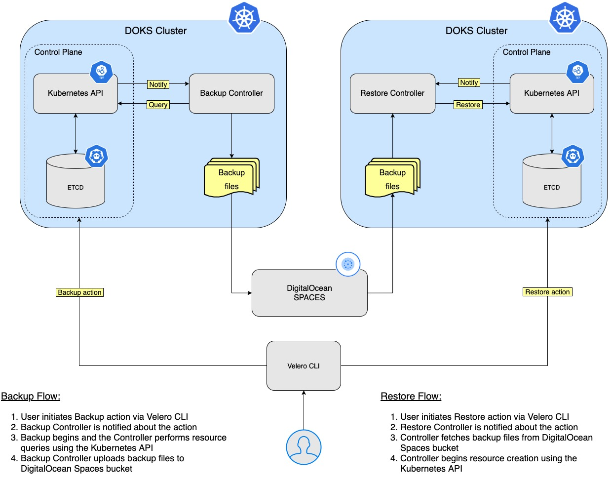

## Backup Using Velero


### Table of contents

- [Overview](#overview)
- [How Velero Works](#how-velero-works)
- [Prerequisites](#prerequisites)
- [Velero Installation](#velero-installation)
- [Namespace Backup and Restore](#namespace-backup-and-restore)
- [Backup and Restore Whole Cluster](#backup-and-restore-whole-cluster)
- [Scheduled Backup and Restore](#scheduled-backup-and-restore)
- [Deleting Backups](#deleting-backups)
- [Final Notes](#final-notes)
- [Learn More](#learn-more)


### Overview

This guide will show you how to `deploy Velero` to your `Kubernetes cluster`, create `backups`, and `recover` from a backup after something goes wrong in the cluster.

You can back up your `entire` cluster, or optionally choose a `namespace` or `label` selector to back up.

`Backups` can be run `one off` or `scheduled`. It’s a good idea to have `scheduled` backups so you are certain you have a recent backup to easily fall back to. You can also create backup [hooks](https://velero.io/docs/v1.6/backup-hooks/) if you want to execute actions before or after a backup is made.

Why `Velero`?

`Velero` gives you tools to `back up` and `restore` your `Kubernetes cluster resources` and `persistent volumes`. You can run `Velero` with a `cloud provider` or `on-premises`. 

Advantages of using `Velero`:

* Take `backups` of your cluster and `restore` in case of loss.
* `Migrate` cluster resources to other clusters.
* `Replicate` your `production` cluster to `development` and `testing` clusters.


### How Velero Works

`Velero` consists of two parts:

* A `server` that runs on your cluster
* A `command-line` client that runs locally

Each `Velero` operation – `on-demand backup`, `scheduled backup`, `restore` – is a `custom resource`, defined with a `Kubernetes Custom Resource Definition` (CRD) and stored in `etcd`. `Velero` also includes `controllers` that process the custom resources to perform backups, restores, and all related operations.

**Backup and Restore workflow**

Whenever you execute a `backup command`, the `Velero CLI` makes a call to the `Kubernetes API` server to create a `Backup` object. The `Backup Controller` then validates the backup object i.e. whether it is `cluster` backup, `namespace` backup, etc. and then it makes a call to the `API` server to query the data to be backed up. Finally it starts the backup process once it collects the data to be backed up. `Backup Controller` then makes a call to `DigitalOcean Spaces` to store the backup file. The backup file is stored as a `tarball` file (`.tar.gz`).

Similarly whenever you execute a `restore command`, the `Velero CLI` makes a call to `Kubernetes API` server to restore from a backup object. Based on the restore command executed, Velero `Restore Controller` makes a call to `DigitalOcean Spaces` and initiates restore from the particular backup object.

Below is a diagram that shows the `Backup/Restore` workflow:



`Velero` is `ideal` for the `disaster` recovery use case, as well as for snapshotting your application state, prior to performing system operations on your cluster, like upgrades. For more details on this topic, please visit the [How Velero Works](https://velero.io/docs/v1.6/how-velero-works/) official page.


### Prerequisites

Before you get started, you will need to do the following:

* Create a [Spaces](https://docs.digitalocean.com/products/spaces/how-to/create/) bucket and access keys. Save the `access` key and `secret` in a safe place for later use. 
* You should have an DigitalOcean `API token`. If not, [create one](https://docs.digitalocean.com/reference/api/create-personal-access-token/) for `Velero` from the cloud console.


### Velero Installation

There are three parts involved:

1. A `client` (used to interact with the `Velero Server` and perform Backup/Restore operations)
2. A `server` (runs on the `DOKS Cluster` as a `Kubernetes` resource)
3. A `storage` provider for `Velero` to store your `resources` and `volumes`. In case of DigitalOcean this is `Spaces` (`S3` like objects storage) - already covered in the [Prerequisites](#prerequisites) section.

**Installing the Velero CLI**

Just follow the [CLI installation](https://velero.io/docs/v1.6/basic-install/#install-the-cli) steps for your OS distribution, as detailed on the official page (in this tutorial `v1.6` is used).

**Installing the Velero Server and Storage Provider Plugins**

In the next part, you will deploy `Velero` and all the required components so that it will be able to perform backups for `Kubernetes` resources and `PV's`. The backup data will be stored in the DO `Spaces` bucket created earlier in the [Prerequisites](#prerequisites) section.

Steps to follow:

1. Add the `Helm` repo and list the available charts:

    ```
    helm repo add vmware-tanzu https://vmware-tanzu.github.io/helm-charts

    helm search repo vmware-tanzu
    ```

    The output looks similar to the following:

    ```
    NAME                    CHART VERSION   APP VERSION     DESCRIPTION            
    vmware-tanzu/velero     2.23.6          1.6.3           A Helm chart for velero
    ```

    **Note:**

    The chart of interes is `vmware-tanzu/velero`, which will install `Velero` on the cluster. Please visit the [velero-chart](https://github.com/vmware-tanzu/helm-charts/tree/main/charts/velero) page for more details about this chart.
2. Fetch and inspect the values file to see what options are available:

    ```shell
    helm show values vmware-tanzu/velero --version 2.23.6 > velero-values.yaml
    ```

    **Hint:**

    It's good practice in general to fetch the values file and inspect it to see what options are available. This way, you can keep for example only the features that you need for your project and disable others to save on resources.
3. A cloud credentials file is needed in order for `Velero` to access `DO Spaces`. Create a file named `secrets.txt` under the current working directory with the following content (make sure to replace the `<>` placeholders accordingly):

    ```
    [default]
    aws_access_key_id=<DO_SPACES_ACCESS_KEY_ID>
    aws_secret_access_key=<DO_SPACES_SECRET_ACCESS_KEY>
    ```
4. Deploy `Velero` using `Helm` (make sure to replace the `<>` placeholders accordingly):

    ```shell
    helm install velero vmware-tanzu/velero --version 2.23.6 \
    --namespace velero \
    --create-namespace \
    --set configuration.extraEnvVars.DIGITALOCEAN_TOKEN=<DIGITALOCEAN_API_TOKEN>  \
    --set-file credentials.secretContents.cloud=secrets.txt \
    --set configuration.provider=aws \
    --set configuration.backupStorageLocation.bucket=<BUCKET_NAME> \
    --set configuration.backupStorageLocation.config.region=<REGION> \
    --set configuration.backupStorageLocation.config.s3Url=https://<REGION>.digitaloceanspaces.com \
    --set initContainers[0].name=velero-plugin-for-aws \
    --set initContainers[0].image=velero/velero-plugin-for-aws:v1.0.0 \
    --set initContainers[0].volumeMounts[0].mountPath=/target \
    --set initContainers[0].volumeMounts[0].name=plugins \
    --set initContainers[1].name=velero-plugin \
    --set initContainers[1].image=digitalocean/velero-plugin:v1.0.0 \
    --set initContainers[1].volumeMounts[0].mountPath=/target \
    --set initContainers[1].volumeMounts[0].name=plugins \
    --set snapshotsEnabled=true \
    --set configuration.volumeSnapshotLocation.provider=digitalocean.com/velero \
    --set deployRestic=false
    ```

    Explanations for the above configuration:

    * `<configuration.provider=aws>` - enables the DigitalOcean `S3` like storage provider.
    * `<configuration.volumeSnapshotLocation.provider=digitalocean.com/velero>` - enables the DigitalOcean `Block Storage` provider. It is designed to create filesystem snapshots of `Block Storage` backed `PersistentVolumes`.
    * `<initContainers[<index>]= ...>` - stores plugin configuration for each provider being used.
    * `<snapshotsEnabled=true>` - enables the `Snapshots` feature.
    * `<deployRestic=false>` - [OPTIONAL] whether to deploy the `Restic` DaemonSet (please visit the official [Restic Integration](https://velero.io/docs/v1.6/restic/) page for more details)). Disabled in this tutorial as it takes extra resources and it's not needed anyway.
    * `<DIGITALOCEAN_API_TOKEN>` - your DigitalOcean `API` token. Velero needs it in order to authenticate with the `DigitalOcean API` when manipulating snapshots.
    * `<BUCKET_NAME>` and `<REGION>` - your DigitalOcean `Spaces` bucket `name` and `region` (e.g.: `nyc3`) created in the [Prerequisites](#prerequisites) section.

    **Note:**

    A `specific` version for the `Helm` chart is used. In this case `2.23.6` was picked, which maps to the `1.6.3` release of `Velero` (see the output from `Step 1.`). It's good practice in general to lock on a specific version or range (e.g. `^2.23.6`). This helps to avoid future issues caused by breaking changes introduced in major version releases. On the other hand, it doesn't mean that a future major version ugrade is not an option. You need to make sure that the new version is tested first. Having a good strategy in place for backups and snapshots becomes handy here.
5. Check the `Velero` deployment:

    ```shell
    helm ls -n velero
    ```

    The output looks similar to the following:

    ```
    NAME    NAMESPACE       REVISION        UPDATED                                 STATUS          CHART           APP VERSION
    velero  velero          1               2021-08-25 13:16:24.383446 +0300 EEST   deployed        velero-2.23.6   1.6.3 
    ```
6. Check that `Velero` is up and running:

    ```shell
    kubectl get deployment velero -n velero
    ```

    The output looks similar to the following:

    ```
    NAME     READY   UP-TO-DATE   AVAILABLE   AGE
    velero   1/1     1            1           67s
    ```
    
    **Note:**
    If you’re interested in looking further, you can view Velero’s server-side components by running (replace the `<>` placeholders accordingly):

    ```shell
    kubectl -n velero get all
    ```

`Velero` uses a number of `CRD`'s (Custom Resource Definitions) to represents its own resources like backups, backups schedules, etc. You'll discover each in the next topics of the tutorial, along with some basic examples.


### Namespace Backup and Restore

In this scenario you'll backup an entire namespace from the cluster and restore it afterwards making sure that all the resources are re-created. The namespace in question is `ambassador`. For each backup and restore operation a new `Backup` and `Restore` Kubernetes object is created.

Ensure that the `Ambassador` deployment is running and there is a `Service` with an `EXTERNAL-IP` (`kubectl get service --namespace ambassador`). Browse the `IP` a few times to write some log entries to the persistent volume. Then create a `backup` with `Velero`:

Steps to follow:

1. Initiate the backup:

    ```shell
    velero backup create ambassador-backup --include-namespaces ambassador
    ```
2. Check that the backup was created:

    ```shell
    velero backup get
    ```

    The output lools similar to:

    ```
    NAME                                       STATUS      ERRORS   WARNINGS   CREATED                          EXPIRES   STORAGE LOCATION   SELECTOR
    ambassador-backup                          Completed   0        0          2021-08-25 19:33:03 +0300 EEST   29d       default            <none>
    ```
3. After a few moments, you can inspect it:

    ```shell
    velero backup describe ambassador-backup --details
    ```

    The output looks similar to:

    ```
    Name:         ambassador-backup
    Namespace:    velero
    Labels:       velero.io/storage-location=default
    Annotations:  velero.io/source-cluster-k8s-gitversion=v1.21.2
                  velero.io/source-cluster-k8s-major-version=1
                  velero.io/source-cluster-k8s-minor-version=21

    Phase:  Completed

    Errors:    0
    Warnings:  0

    Namespaces:
      Included:  ambassador
      Excluded:  <none>
      ...
    ```

    **Hints:**
    
    * Look for the `Phase` line. It should say `Completed`. 
    * Check that no `Errors` are reported as well.
    * A new Kubernetes `Backup` object is created, as seen below:

      ```
      ~ kubectl get backup/ambassador-backup -n velero -o yaml

      apiVersion: velero.io/v1
      kind: Backup
      metadata:
      annotations:
        velero.io/source-cluster-k8s-gitversion: v1.21.2
        velero.io/source-cluster-k8s-major-version: "1"
        velero.io/source-cluster-k8s-minor-version: "21"
      ...
      ``` 
4. Take a look at the `DO Spaces` bucket, there's a new folder named `backups`. The folder listing reveals the assets that were created for the `ambassador-backup`:

    
5. Simulate a disaster by deleting the  `ambassador` namespace:

    ```shell
    kubectl delete namespace ambassador
    ```
6. Restore the `ambassador-backup`:

    ```shell
    velero restore create --from-backup ambassador-backup
    ```

**Results and Observations:**

* Check the `Phase` line from the `velero restore describe ambassador-backup` command output. It should say `Completed`.
* Take a note of the `Warnings` section from the above command as well - it tells if something went bad or not.
* Check that all the resources were restored for the `ambassador` namespace:

  ```shell
  kubectl get all --namespace ambassador
  ```


### Backup and Restore Whole Cluster

In this section you will simulate a `disaster recovery` scenario. The whole `DOKS` cluster will be deleted and then restored from a previous backup.

Steps to follow:

1. Inspect cluster resources first (save the output to a file for later comparison):

    ```shell
    kubectl get all --all-namespaces
    ```
2. Create a backup for the whole `DOKS` cluster:
   
    ```
    velero backup create all-cluster-backup
    ```

    **Hints:**

    * Check that the backup was created and it's not reporting any errors before moving to the next step. 
    
        The following command lists all the available backups:

        ```shell
        velero backup get
        ```

        The output looks similar to:

        ```
        NAME                                       STATUS      ERRORS   WARNINGS   CREATED                          EXPIRES   STORAGE LOCATION   SELECTOR
        all-cluster-backup                         Completed   0        0          2021-08-25 19:43:03 +0300 EEST   29d       default            <none>
        ```
    * For both curiosity and debugging, it’s useful to do a describe and logs on your backups:

        ```shell
        velero backup describe all-cluster-backup
        velero backup logs all-cluster-backup
        ```
3. Delete the whole `DOKS` cluster (make sure to replace the `<>` placeholders accordingly):
   
    ```
    doctl kubernetes cluster delete <DOKS_CLUSTER_NAME>
    ```
4. Re-create the cluster as described in [Section 1 - Set up DigitalOcean Kubernetes](1-setup-DOKS). Make sure the new `DOKS` cluster nodes is `equal or greater` with to the original one - this is important!
5. Install `Velero Server` and `CLI` as described in [Velero Installation](#velero-installation). Make sure to use the `same Helm Chart version` - this is important!
6. Restore everything by using the below command:

    ```
    velero restore create --from-backup all-cluster-backup
    ```

**Results and Observations:**

* Check the `Phase` line from the `velero restore describe all-cluster-backup` command output. It should say `Completed`.
* Take a note of the `Warnings` section from the above command as well - it tells if something went bad or not.
* An important aspect to keep in mind is that whenever you destroy a `DOKS` cluster, the associated `Load Balancer` is destroyed as well. This means that each time the `DOKS` cluster is re-created the `Load Balancer` is re-created as well with a different `IP` address. You have to make sure that `DNS` records will be `updated` as well to reflect the change.

After the restore process finishes you should be able to see all resources re-created. Take a look at the `kubectl get all --all-namespaces` output and compare with the saved results before destroying the cluster. Also, the `backend applications` should respond to `HTTP` requests as well.


### Scheduled Backup and Restore

Taking backups automatically based on a schedule is a really useful feature to have. It allows to `rewind back time` and restore the system to a previous working state if something goes wrong.

Creating a scheduled backup is a very straightforward process. An example is provided below for a `1 minute` interval (the `kube-system` namespace was picked):

Steps to follow:

1. Create the schedule:

    ```shell
    velero schedule create kube-system-minute-backup --schedule="@every 1m" --include-namespaces kube-system
    ```

    **Hint:**

    Linux cronjob format is supported also:

    ```
    schedule="*/1 * * * *"
    ```
2. Verify that the schedule was created:

    ```shell
    velero schedule get
    ```

    The output looks similar to:

    ```
    NAME                        STATUS    CREATED                          SCHEDULE    BACKUP TTL   LAST BACKUP   SELECTOR
    kube-system-minute-backup   Enabled   2021-08-26 12:37:44 +0300 EEST   @every 1m   720h0m0s     32s ago       <none>
    ```
3. Inspect all the backups after a minute or so:

    ```shell
    velero backup get
    ```

    The output looks similar to:

    ```
    NAME                                       STATUS      ERRORS   WARNINGS   CREATED                          EXPIRES   STORAGE LOCATION   SELECTOR
    kube-system-minute-backup-20210826093916   Completed   0        0          2021-08-26 12:39:20 +0300 EEST   29d       default            <none>
    kube-system-minute-backup-20210826093744   Completed   0        0          2021-08-26 12:37:44 +0300 EEST   29d       default            <none>
    ```

**Results and Observations:**

* Check the `Phase` line from one of the backups: `velero backup describe kube-system-minute-backup-20210826093916`. It should say `Completed`.
* Take a note of the `Erros` and `Warnings` sections from the above command as well - it tells if something went bad or not.
  
To restore one of the `minute` backups please follow the same steps as you learned in the previous parts of this tutorial. This is a good way to exercise and test your experience accumulated so far.


### Deleting Backups

When you decide that some older backups are not needed anymore, you can free up some resources both on the `Kubernetes` cluster as well as on the `DO Spaces` bucket.

There are two options available in this case:

1. `Manually` deleting backups by hand via the `CLI`
2. `Automatically` by setting backups `TTL` (Time To Live)

**Manually deleting a specific backup via the CLI**

Deleting a specific backup:

```shell
velero backup delete kube-system-minute-backup-20210826094116
```

After a few moments, check that it's gone from the `velero backup get` command output. It should be deleted from the `DO Spaces` bucket as well.

**Manually deleting multiple backups via the CLI**

The `velero backup delete` subcommand provides another useful flag called `--selector`. It allows you to delete multiple backups at once based on `Kubernetes Labels`. The same rules apply as for [Kubernetes Label Selectors](https://kubernetes.io/docs/concepts/overview/working-with-objects/labels/#label-selectors).

Steps to follow:

1. List the available backups:

    ```shell
    velero backup get
    ```

    The output looks similar to:

    ```
    NAME                                       STATUS      ERRORS   WARNINGS   CREATED                          EXPIRES   STORAGE LOCATION   SELECTOR
    ambassador-backup                          Completed   0        0          2021-08-25 19:33:03 +0300 EEST   23d       default            <none>
    backend-minute-backup-20210826094116       Completed   0        0          2021-08-26 12:41:16 +0300 EEST   24d       default            <none>
    backend-minute-backup-20210826094016       Completed   0        0          2021-08-26 12:40:16 +0300 EEST   24d       default            <none>
    backend-minute-backup-20210826093916       Completed   0        0          2021-08-26 12:39:16 +0300 EEST   24d       default            <none>
    backend-minute-backup-20210826093816       Completed   0        0          2021-08-26 12:38:16 +0300 EEST   24d       default            <none>
    backend-minute-backup-20210826093716       Completed   0        0          2021-08-26 12:37:16 +0300 EEST   24d       default            <none>
    backend-minute-backup-20210826093616       Completed   0        0          2021-08-26 12:36:16 +0300 EEST   24d       default            <none>
    backend-minute-backup-20210826093509       Completed   0        0          2021-08-26 12:35:09 +0300 EEST   24d       default            <none>
    ```
2. Say that you want to delete all the `backend-minute-backup-*` assets:

    Pick a backup from the list and inspect the `Labels`:

    ```shell
    velero describe backup backend-minute-backup-20210826094116
    ```

    The output looks similar to:

    ```
    Name:         backend-minute-backup-20210826094116
    Namespace:    velero
    Labels:       velero.io/schedule-name=backend-minute-backup
                  velero.io/storage-location=default
    Annotations:  velero.io/source-cluster-k8s-gitversion=v1.21.2
                  velero.io/source-cluster-k8s-major-version=1
                  velero.io/source-cluster-k8s-minor-version=21

    Phase:  Completed

    Errors:    0
    Warnings:  0

    Namespaces:
    Included:  backend
    Excluded:  <none>
    ...
    ```

    Looking at the above, the `velero.io/schedule-name` label is a perfect match:

    ```shell
    velero backup delete --selector velero.io/schedule-name=backend-minute-backup
    ```

Expected results:

All the `backend-minute-backup-*` assets should dissapear from the `velero backup get` command output, as well as from the `DO Spaces` bucket.

**Automatic backup deletion via TTL**

When you create a backup, you can specify a `TTL` (Time To Live) by adding the flag --ttl <DURATION>. If `Velero` sees that an existing backup resource is expired, it removes:

* The `Backup` resource
* The backup `file` from cloud object `storage`
* All `PersistentVolume` snapshots
* All associated `Restores`

The `TTL` flag allows the user to specify the backup retention period with the value specified in hours, minutes and seconds in the form `--ttl 24h0m0s`. If not specified, a default `TTL` value of `30 days` will be applied.

In the next steps you will create a short lived backup with a `TTL` value set to `3 minutes` in order to quickly see the results.

Steps to follow:

1. Create a backup using a `TTL` value of `3 minutes`:
   
    ```shell
    velero backup create ambassador-backup-3min-ttl --ttl 0h3m0s
    ```
2. Inspect the backup:

    ```shell
    velero backup describe ambassador-backup-3min-ttl
    ```

    The output looks similar to:

    ```
    Name:         ambassador-backup-3min-ttl
    Namespace:    velero
    Labels:       velero.io/storage-location=default
    Annotations:  velero.io/source-cluster-k8s-gitversion=v1.21.2
                velero.io/source-cluster-k8s-major-version=1
                velero.io/source-cluster-k8s-minor-version=21

    Phase:  Completed

    Errors:    0
    Warnings:  0

    Namespaces:
    Included:  *
    Excluded:  <none>

    Resources:
    Included:        *
    Excluded:        <none>
    Cluster-scoped:  auto

    Label selector:  <none>

    Storage Location:  default

    Velero-Native Snapshot PVs:  auto

    TTL:  3m0s
    ...
    ```

Expected results:

* A new Velero `Backup` object is created with the `TTL` field set to `3ms0`
* A new folder is created in the `DO Spaces` bucket as well, named `ambassador-backup-3min-ttl`

After three minutes or so, the backup and associated resources should be automatically deleted. You can verify that the backup object was destroyed via: `velero backup describe ambassador-backup-3min-ttl`. It should fail with an error stating that the backup doesn't exist anymore. The corresponding `DO Spaces` bucket folder should be gone as well.

Going further, you can explore the other available options via:

```shell
velero backup delete -h
```

### Final Notes

In this part of the tutorial you learned how to perform `one time` as well as `scheduled` backups and how to restore everything back. Having a scheduled backups mechanism in place is very important as it allows you to revert to a previous snapshot in time if something goes wrong along the way. You walked through a disaster recovery scenario as well.

It's always a good idea to see all what you can do with backups by inspecting the available `Velero` options of the `CLI` executable:

```shell
velero -h
```

And for each command/subcommand:

```shell
velero <command> -h
```

Some other useful resources:

* [Backup Command Reference](https://velero.io/docs/v1.6/backup-reference)
* [Restore Command Reference](https://velero.io/docs/v1.6/restore-reference/)
* [Backup Hooks](https://velero.io/docs/v1.6/backup-hooks/)
* [Cluster Migration](https://velero.io/docs/v1.6/migration-case/)
* [Velero Troubleshooting](https://velero.io/docs/v1.6/troubleshooting)

### Learn More

Hopefully you found this guide helpful. Here are some other resources to help you learn more:

* [Velero](https://velero.io/)
* [Velero Documentation](https://velero.io/docs/latest/)
* [Velero GitHub](https://github.com/vmware-tanzu/velero)

**Next steps**

This concludes the `Velero` setup. The next section will give you some insights about `DOKS` cluster resources usage.

Go to [Section 14 - Estimate Resource Usage for Startup Kit](../14-starter-kit-resource-usage)
