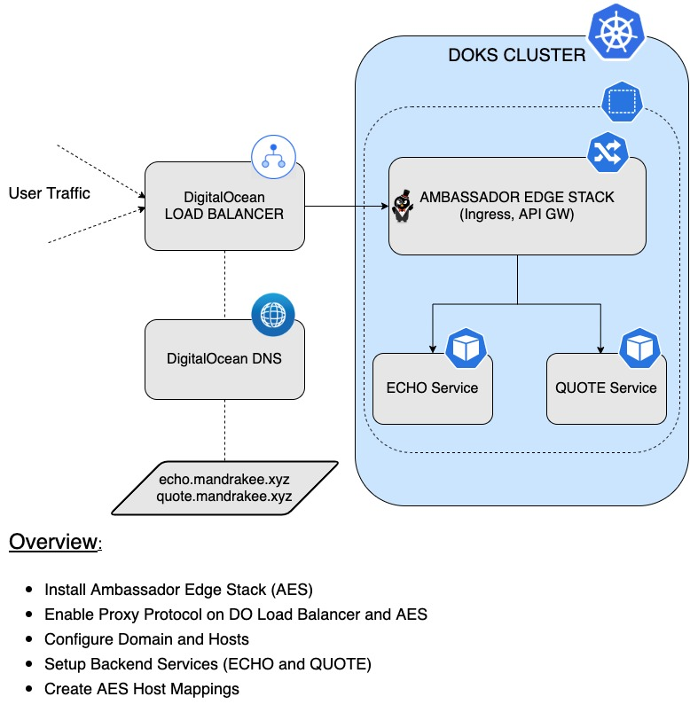
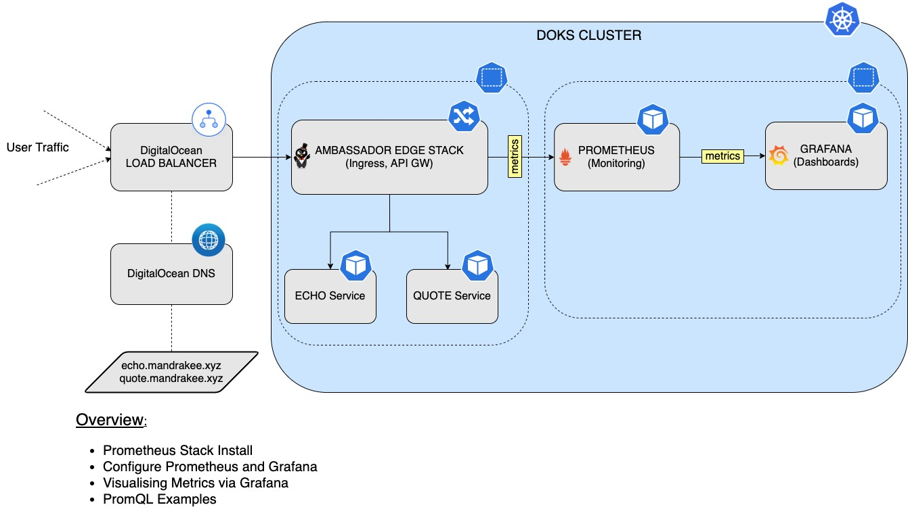
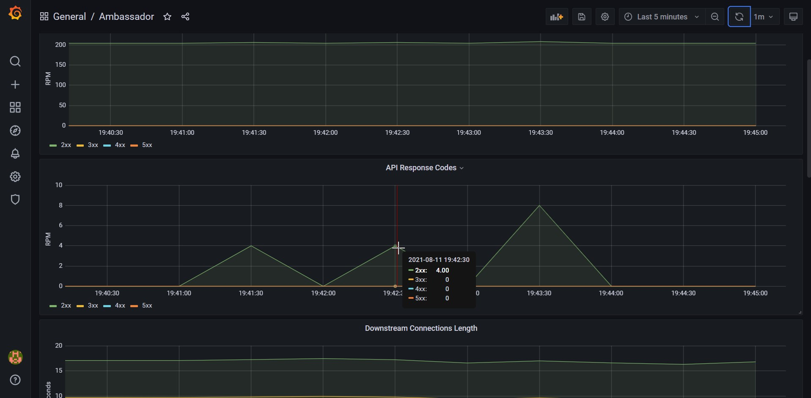
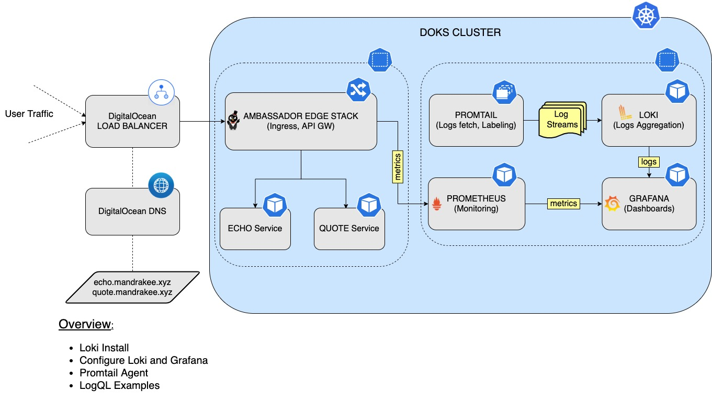
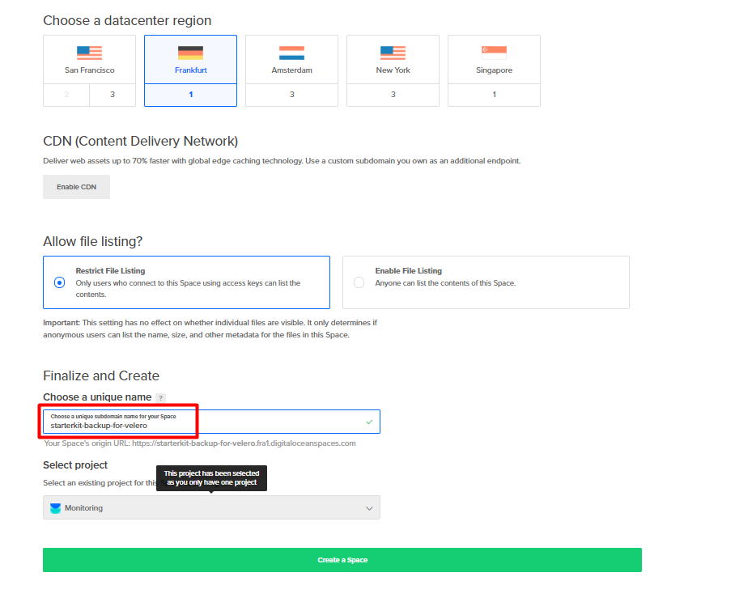

# Day-2 Operations-ready DOKS (DigitalOcean Kubernetes) for Developers

`Kubernetes` has become really simple to understand and setup. In a way, it has democratized the cloud. With `Kubernetes`, developers can use identical tooling and configurations across any cloud.

Installing `Kubernetes` is only the beginning of the journey. Making it operationally ready requires lot more things. The objective of this tutorial is to provide developers a hands-on `introduction` on how to get started with an operations-ready `Kubernetes` cluster on `DO Kubernetes`.

## Operations-ready Setup Overview

Below is a diagram giving a high level overview of the setup presented in this tutorial as well as the main steps:


# Table of contents
1. [Scope](#SCOP)
2. [Set up DO Kubernetes](#DOKS)
3. [Set up DO Container Registry](#DOCR)
4. [Ingress Using Ambassador](#AMBA)
5. [Prometheus Monitoring Stack](#PROM)
6. [Logs Aggregation via Loki Stack](#LOKI)
7. [Backup Using Velero](#VELE)
8. [Estimate resources for startup kit](#COST)
9. [Automate Everything Using Terraform and Flux](#AUTO)


## Scope <a name="SCOP"></a>
This is meant to be a `beginner tutorial` to demonstrate the basic setup you need to be `operations-ready`.

All the steps are done manually using the `commandline` interface (`CLI`). If you need `end-to-end automation`, refer to the last section.

None of the installed tools are exposed using `Ingress` or `LB`. To access the console for individual tools, we use `kubectl port-forward`.

We will use `brew` (on `MacOS`) to install the required `commmand line utilities` on our local machine. We will skip the how-to-install and command on your local laptop, and focus on using the command to work on `DOKS` cluster. 

For every `service` that gets deployed, we will make sure to enable `metrics` and `logs`. At the end, we will review the `overhead` from all these additional tools and services. That gives an idea of what it takes to be `operations-ready` after your first cluster install. <br/><br/>


## Set up DO Kubernetes <a name="DOKS"></a>

Explore `doctl` options.

```
~ doctl version
doctl version 1.61.0-release
~ doctl auth list
bgdo (current)
default
~ 
```

Explore options for creating the cluster.

```
~ doctl k8s -h
~ doctl k8s options -h
~ doctl k8s options regions
~ doctl k8s options sizes  
~ doctl k8s options versions
~ doctl k8s cluster create -h
```

Let us create a `DOKS` cluster with `3 worker nodes`. Use `--wait false`, if you do not want the command to wait until cluster is ready.

```
~ doctl kubernetes cluster create bg-cluster-2 \
--auto-upgrade=false \
--maintenance-window "saturday=21:00" \
--node-pool "name=basicnp;size=s-2vcpu-4gb;count=3;tag=cluster2;label=type=basic;auto-scale=true;min-nodes=3;max-nodes=5" \
--region sfo3 \

Notice: Cluster is provisioning, waiting for cluster to be running
..................................................................
Notice: Cluster created, fetching credentials
Notice: Adding cluster credentials to kubeconfig file found in "/Users/bgupta/.kube/config"
Notice: Setting current-context to do-sfo3-bg-cluster-1
ID                                      Name            Region    Version        Auto Upgrade    Status     Node Pools
0922a629-7f2e-4bda-940c-4d42a3f987ad    bg-cluster-1    sfo3      1.20.7-do.0    false           running    basicnp
~ 
```

Now let us set up `kubectl`, if the context is not set.

```
~ kubectl config current-context 
do-sfo3-bg-cluster-1
~ 
~ doctl k8s cluster list
ID                                      Name            Region    Version        Auto Upgrade    Status          Node Pools
0922a629-7f2e-4bda-940c-4d42a3f987ad    bg-cluster-1    sfo3      1.20.7-do.0    false           provisioning    basicnp
# YOU MAY NOT NEED THIS COMMAND, IF CONTEXT IS ALREADY SET.
~ doctl kubernetes cluster kubeconfig save 0922a629-7f2e-4bda-940c-4d42a3f987ad
Notice: Adding cluster credentials to kubeconfig file found in "/Users/bgupta/.kube/config"
Notice: Setting current-context to do-sfo3-bg-cluster-1
~ 
~ kubectl get nodes
NAME            STATUS   ROLES    AGE     VERSION
basicnp-865x3   Ready    <none>   2m55s   v1.20.7
basicnp-865x8   Ready    <none>   2m21s   v1.20.7
basicnp-865xu   Ready    <none>   2m56s   v1.20.7
~ 
```

## Set up DO Container Registry <a name="DOCR"></a>
You need a container registry (`Docker Hub`, `DO container registry`, etc.) when you need to build a container image and deploy it to the cluster. The cluster can pull images from a configured registry. Here we will set up a DO container registry (`DOCR`) for our cluster.

```
~ doctl registry create bg-reg-1 --subscription-tier basic
Name        Endpoint
bg-reg-1    registry.digitalocean.com/bg-reg-1
~ 
```

You can have only `1 registry endpoint` per account in `DOCR`. A `repository` in a `registry` refers to a collection of `container images` using different versions (`tags`). Given that the `DOCR` registry is a private endpoint, we need to configure the `DOKS` cluster to be able to fetch images from the `DOCR` registry.

```
~ doctl registry kubernetes-manifest | kubectl apply -f -
secret/registry-bg-reg-1 created
~ k get secrets registry-bg-reg-1
NAME                TYPE                             DATA   AGE
registry-bg-reg-1   kubernetes.io/dockerconfigjson   1      13s
~
```

This creates the above secret in the `default` namespace. 


## Ingress using Ambassador <a name="AMBA"></a>

### Options for Load Balancer and Ingress

In most of the cases you will use the `Load Balancer` that is made available by the `Cloud` provider of your choice. In case of `DigitalOcean` when you configure a service as a `Load Balancer`, `DOKS` automatically provisions one in your account (unless you configure to use an existing one). Now the `service` is exposed to the outside world and can be accessed via the `Load Balancer` endpoint. In a real world scenario you do not want to use one `Load Balancer` per service so you need a `proxy` inside the cluster. That is `Ingress`.

When an `Ingress Proxy` is installed it creates a service and exposes it as a `Load Balancer`. Now you can have as many services behind the ingress and all accessible through a single endpoint. Ingress operates at the `HTTP` layer.

Let us say you are exposing `REST` or `GRPC` APIs for different tasks (reading account info, writing orders, searching orders, etc.). Depending on the `API` you will want to be able to route to a specific target. For this to happen more functionality needs to be built inside the ingress proxy. That is `API Gateway` and it is capable of doing more things besides routing traffic. For this tutorial we are going to pick an ingress that can do both `HTTP` routing and `API Gateway`.

As there are many vendors, `Kubernetes API` has an `Ingress` spec. The idea is that developers should be able to use the `Ingress API` and it should work with any vendor. That works well but has limited capability in the current version. The new version of ingress is called `API Gateway` and is currently in alpha. The idea is the same - users should be able to provide a rich set of ingress configuration using the `API Gateway` syntax. As long as the vendor supports it users will be able to manage the ingress in a vendor-agnostic way.

We will use the `Ambassador Edge Stack` in this tutorial. You can pick any `Ingress/API Gateway` solution as long as it has good support from the community because we may want more options to be available in the near future as well.

Why use the `Ambassador Edge Stack`?

`Ambassador Edge Stack` gives platform engineers a comprehensive, self-service edge stack for managing the boundary between `end-users` and `Kubernetes`. Built on the `Envoy Proxy` and fully `Kubernetes-native`, `Ambassador Edge Stack` is made to support multiple, independent teams that need to rapidly publish, monitor, and update services for end-users. A true edge stack, `Ambassador Edge Stack` can also be used to handle the functions of an `API Gateway`, a `Kubernetes ingress controller` and a `layer 7 load balancer`.

### Ambassador Edge Stack (AES)

The `Ambassador Edge Stack` or `AES` for short, is a specialized [Control Plane](https://blog.getambassador.io/the-importance-of-control-planes-with-service-meshes-and-front-proxies-665f90c80b3d) for the `Envoy Proxy`. In this architecture, `Ambassador Edge Stack` translates configuration (in the form of `Kubernetes Custom Resources`) to `Envoy` configuration. All the actual traffic is directly handled by the high-performance [Envoy Proxy](https://www.envoyproxy.io).

At a very high level `AES` works as follows:
1.  The service owner defines configuration via `Kubernetes` manifests.
2.  When the manifest is applied to the cluster, the `Kubernetes API` notifies `Ambassador Edge Stack` of the change.
3.  `Ambassador Edge Stack` parses the change and transforms the configuration into a semantic intermediate representation. `Envoy` configuration is generated from this `IR`.
4.  The new configuration is passed to `Envoy` via the `gRPC-based Aggregated Discovery Service (ADS) API`.
5.  Traffic flows through the reconfigured `Envoy`, without dropping any connections.

For more details and in depth explanation please visit: [The Ambassador Edge Stack Architecture](https://www.getambassador.io/docs/edge-stack/2.0/topics/concepts/architecture) 

The set of configuration steps are as follows:
1. Install `AES`.
2. Configure two hosts (`quote`, `echo`) on the cluster. For this example we're going to use `quote.mandake.xyz` and `echo.mandrake.xyz` as two different hosts on the same cluster.
3. Hosts will have `TLS` termination enabled.
4. Verify the installation.

This is how the `Ambassador Edge Stack` setup will look like after following the steps:



### Ambassador Edge Stack Deployment

Deploying the `Ambassador Edge Stack` into the `DOKS` cluster via [Helm](https://helm.sh):
1. Adding the Helm repo:

    ```bash
    helm repo add datawire https://www.getambassador.io
    ```
2. Listing the available versions (we will use the `6.7.13 ` version of the `Chart` which maps to the `1.13.0` release of `AES`):

    ```bash
    helm search repo datawire
    ```
   
   The output looks similar to the following:
   ```
   NAME                            CHART VERSION   APP VERSION     DESCRIPTION                                       
   datawire/ambassador             6.7.13          1.13.10         A Helm chart for Datawire Ambassador              
   datawire/ambassador-operator    0.3.0           v1.3.0          A Helm chart for Kubernetes                       
   datawire/telepresence           2.4.0           2.4.0           A chart for deploying the server-side component...
   ```
3. Creating a dedicated `ambassador` namespace and finishing the installation:

    ```bash
    kubectl create namespace ambassador &&  \
    helm install ambassador --namespace ambassador datawire/ambassador --version 6.7.13 &&  \
    kubectl -n ambassador wait --for condition=available --timeout=90s deploy -lproduct=aes
    ```

### Defining the Domain and Hosts

In a real world scenario each `host` maps to a `service` so we need a way to tell `AES` about our intentions - meet the [Host](https://www.getambassador.io/docs/edge-stack/1.13/topics/running/host-crd/) CRD.

The custom `Host` resource defines how `Ambassador Edge Stack` will be visible to the outside world. It collects all the following information in a single configuration resource. The most relevant parts are:

* The `hostname` by which `Ambassador Edge Stack` will be reachable
* How `Ambassador Edge Stack` should handle `TLS` certificates
* How `Ambassador Edge Stack` should handle secure and insecure requests

For more details please visit the [AES Host CRD](https://www.getambassador.io/docs/edge-stack/1.13/topics/running/host-crd/) official documentation.

Notes on `ACME` support:

* If the `Authority` is not supplied then a `Let’s Encrypt` **production environment** is assumed.
* In general the `registrant email address` is mandatory when using `ACME` and it should be a valid one in order to receive notifications when the certificates are going to expire.
* `ACME` stores certificates using `Kubernetes Secrets`. The name of the secret can be set using the `tlsSecret` element.

The following example will configure the `TLS` enabled hosts for this tutorial:

```bash
cat << EOF | kubectl apply -f -
apiVersion: getambassador.io/v2
kind: Host
metadata:
  name: quote-host
  namespace: ambassador
spec:
  hostname: quote.mandrakee.xyz
  acmeProvider:
    email: quote@gmail.com
  tlsSecret:
    name: tls-cert
  requestPolicy:
    insecure:
       action: Redirect
       additionalPort: 8080
---
apiVersion: getambassador.io/v2
kind: Host
metadata:
  name: echo-host
  namespace: ambassador
spec:
  hostname: echo.mandrakee.xyz
  acmeProvider:
    email: echo@gmail.com
  tlsSecret:
    name: tls2-cert
  requestPolicy:
    insecure:
       action: Redirect
       additionalPort: 8080
EOF
```

Let's review the hosts that were created:

```bash
kubectl get hosts -n ambassador
```

The output looks similar to the following:

```
NAME         HOSTNAME              STATE     PHASE COMPLETED      PHASE PENDING              AGE
echo-host    echo.mandrakee.xyz    Pending   ACMEUserRegistered   ACMECertificateChallenge   3s
quote-host   quote.mandrakee.xyz   Pending   ACMEUserRegistered   ACMECertificateChallenge   3s
```

It takes `~30 seconds` to get the signed certificate for the hosts. At this point we have the `Ambassador Edge Stack` installed and the hosts configured. But we still don't have the networking (eg. `DNS` and `Load Balancer`) configured to route traffic to the cluster. The missing parts can be noticed in the `Kubernetes` events of the hosts that were configured earlier.

Let's take a look and see what happens for the `echo-host`:

```bash
kubectl describe host echo-host -n ambassador
```

The output looks similar to the following:

```
Events:
  Type     Reason   Age                From                   Message
  ----     ------   ----               ----                   -------
  Normal   Pending  32m                Ambassador Edge Stack  waiting for Host DefaultsFilled change to be reflected in snapshot
  Normal   Pending  32m                Ambassador Edge Stack  creating private key Secret
  Normal   Pending  32m                Ambassador Edge Stack  waiting for private key Secret creation to be reflected in snapshot
  Normal   Pending  32m                Ambassador Edge Stack  waiting for Host status change to be reflected in snapshot
  Normal   Pending  32m                Ambassador Edge Stack  registering ACME account
  Normal   Pending  32m                Ambassador Edge Stack  ACME account registered
  Normal   Pending  32m                Ambassador Edge Stack  waiting for Host ACME account registration change to be reflected in snapshot
  Normal   Pending  16m (x4 over 32m)  Ambassador Edge Stack  tlsSecret "tls2-cert"."ambassador" (hostnames=["echo.mandrakee.xyz"]): needs updated: tlsSecret does not exist
  Normal   Pending  16m (x4 over 32m)  Ambassador Edge Stack  performing ACME challenge for tlsSecret "tls2-cert"."ambassador" (hostnames=["echo.mandrakee.xyz"])...
  Warning  Error    16m (x4 over 32m)  Ambassador Edge Stack  obtaining tlsSecret "tls2-cert"."ambassador" (hostnames=["echo.mandrakee.xyz"]): acme: Error -> One or more domains had a problem:
[echo.mandrakee.xyz] acme: error: 400 :: urn:ietf:params:acme:error:dns :: DNS problem: SERVFAIL looking up A for echo.mandrakee.xyz - the domain's nameservers may be malfunctioning
...
```
As seen above, the last event tells us that there's no `A` record to point to the `echo` host for the `mandrakee.xyz` domain which results in a lookup failure. Let's fix this in the next section of the tutorial.

### Configuring Domain Mappings

Adding a domain you own to your `DigitalOcean` account lets you manage the domain’s `DNS` records via the `Control Panel` and `API`. Domains you manage on `DigitalOcean` also integrate with `DigitalOcean Load Balancers` and `Spaces` to streamline automatic `SSL` certificate management.

What we need to do next is to create a `domain` and add the required `A` records for the new hosts: `echo` and `quote`. Let's do that via the [doctl](https://docs.digitalocean.com/reference/doctl/how-to/install) utility.

First we create a new `domain` (`mandrakee.xyz` in this example):

```bash
doctl compute domain create mandrakee.xyz
```

The output looks similar to the following:

```
Domain           TTL
mandrakee.xyz    0
```

Let's add some `A` records now for the hosts created earlier. First we need to identify the `Load Balancer` IP that points to your `Kubernetes` cluster (one should be already available when the cluster was created). Pick the one that matches your configuration from the list:

```bash
doctl compute load-balancer list
```

Then add the records (please replace the `<>` placheholders accordingly):

```bash
doctl compute domain records create mandrakee.xyz --record-type "A" --record-name "echo" --record-data "<your_lb_ip_address>"
doctl compute domain records create mandrakee.xyz --record-type "A" --record-name "quote" --record-data "<your_lb_ip_address>"
```

**Note:**

If you have only one `LB` in your account then this snippet should help:

```bash
LOAD_BALANCER_IP=$(doctl compute load-balancer list --format IP --no-header)
doctl compute domain records create mandrakee.xyz --record-type "A" --record-name "echo" --record-data "$LOAD_BALANCER_IP"
doctl compute domain records create mandrakee.xyz --record-type "A" --record-name "quote" --record-data "$LOAD_BALANCER_IP"
```

List the available records for the `mandrakee.xyz` domain:

```bash
doctl compute domain records list mandrakee.xyz
```

The output looks similar to the following:

```
ID           Type    Name     Data                    Priority    Port    TTL     Weight
164171755    SOA     @        1800                    0           0       1800    0
164171756    NS      @        ns1.digitalocean.com    0           0       1800    0
164171757    NS      @        ns2.digitalocean.com    0           0       1800    0
164171758    NS      @        ns3.digitalocean.com    0           0       1800    0
164171801    A       echo     143.244.208.191         0           0       3600    0
164171809    A       quote    143.244.208.191         0           0       3600    0
```

Great! Now let's see if the `AES Hosts` are OK:

```bash
kubectl get hosts -n ambassador
```

The output looks similar to the following:

```
NAME         HOSTNAME              STATE   PHASE COMPLETED   PHASE PENDING   AGE
echo-host    echo.mandrakee.xyz    Ready                                     2m11s
quote-host   quote.mandrakee.xyz   Ready                                     2m12s
```

If the `STATE` column prints `Ready` then awesome! Now we're ready to rock!

At this point the network traffic will reach the `AES enabled` cluster but we need to configure the `backend services paths` for each of the hosts. All `DNS` records have one thing in common: `TTL` or time to live. It determines how long a `record` can remain cached before it expires. Loading data from a local cache is faster but visitors won’t see `DNS` changes until their local cache expires and gets updated after a new `DNS` lookup. As a result, higher `TTL` values give visitors faster performance and lower `TTL` values ensure that `DNS` changes are picked up quickly. All `DNS` records require a minimum `TTL` value of `30 seconds`.

Please visit the [How to Create, Edit and Delete DNS Records](https://docs.digitalocean.com/products/networking/dns/how-to/manage-records) page for more information.

### Creating AES Backend Services <a name="AMBA_BK_SVC"></a>

In this section we will deploy two example `backend applications`, named `echo` and `quote`. The main goal here is to have a basic understanding on how the `AES` stack will route requests to each application by introducing a new custom `AES` resource named `Mapping`.

We can have multiple `TLS enabled` hosts on the same cluster. On the other hand we can have multiple deployments and services as well. So for each `backend application` a corresponding `Kubernetes Deployment` and `Service` has to be created.

Let's define a new `namespace` for our `quote` and `echo` backend applications. This is a good practice because we don't want to pollute the `AES` space (or any other) with our application specific stuff.

```bash
kubectl create ns backend
```

Spinning up the deployments for the `quote` and `echo` applications in the `backend` namespace:

```bash
cat << EOF | kubectl apply -f -
---
apiVersion: apps/v1
kind: Deployment
metadata:
  name: quote
  namespace: backend
spec:
  replicas: 1
  selector:
    matchLabels:
      app: quote
  strategy:
    type: RollingUpdate
  template:
    metadata:
      labels:
        app: quote
    spec:
      containers:
      - name: backend
        image: docker.io/datawire/quote:0.4.1
        ports:
        - name: http
          containerPort: 8080

---
apiVersion: apps/v1
kind: Deployment
metadata:
  name: echo
  namespace: backend
spec:
  replicas: 1
  selector:
    matchLabels:
      app: echo
  strategy:
    type: RollingUpdate
  template:
    metadata:
      labels:
        app: echo
    spec:
      containers:
      - name: echo
        image: jmalloc/echo-server
        ports:
        - name: http
          containerPort: 8080
EOF
```

Creating the corresponding services is just a matter of:

```bash
cat << EOF | kubectl apply -f -
apiVersion: v1
kind: Service
metadata:
  name: quote
  namespace: backend
spec:
  ports:
  - name: http
    port: 80
    targetPort: 8080
  selector:
    app: quote
---
apiVersion: v1
kind: Service
metadata:
  name: echo
  namespace: backend
spec:
  ports:
  - name: http
    port: 80
    targetPort: 8080
  selector:
    app: echo
EOF
```

Inspecting the deployments and services we just created:

```bash
kubectl get deployments -n backend
```

The output looks similar to the following:

```
NAME    READY   UP-TO-DATE   AVAILABLE   AGE
echo    1/1     1            1           2m22s
quote   1/1     1            1           2m23s
```

```bash
kubectl get svc -n backend
```

The output looks similar to the following:

```
NAME    TYPE        CLUSTER-IP       EXTERNAL-IP   PORT(S)   AGE
echo    ClusterIP   10.245.175.185   <none>        80/TCP    2m32s
quote   ClusterIP   10.245.158.116   <none>        80/TCP    2m33s
```

As the last configuration step, create the `mappings` for Ambassador.

### Configuring the AES Mapping for each Host

`Ambassador Edge Stack` is designed around a [declarative, self-service management model](https://www.getambassador.io/docs/edge-stack/latest/topics/concepts/gitops-continuous-delivery). It means that you can manage the `Edge` via a dedicated `Kubernetes CRD`, namely the `Mapping` resource. More info about [Mappings](https://www.getambassador.io/docs/edge-stack/1.13/topics/using/intro-mappings) can be found on the official page.

What a `Mapping` does is to manage routing for all inbound traffic to the `/quote/` path for the `quote` service and `/echo/` for the `echo` service.

**Mapping fields description:**

* `name` - a string identifying the `Mapping` (e.g. in diagnostics).
* `prefix` - the `URL` prefix identifying your resource.
* `service` - the name of the service handling the resource; must include the `namespace` (e.g. myservice.othernamespace) if the service is in a different namespace than `Ambassador Edge Stack`.

Creating a `Mapping` for each of our applications:

```bash
cat << EOF | kubectl apply -f -
---
apiVersion: getambassador.io/v2
kind: Mapping
metadata:
  name: quote-backend
  namespace: ambassador
spec:
  prefix: /quote/
  host: quote.mandrakee.xyz
  service: quote.backend
 
---
apiVersion: getambassador.io/v2
kind: Mapping
metadata:
  name: echo-backend
  namespace: ambassador
spec:
  prefix: /echo/
  host: echo.mandrakee.xyz
  service: echo.backend
EOF
```

Inspecting the results:

```bash
kubectl get mappings -n ambassador
```

The output looks similar to the following (notice the `echo-backend` and `quote-backend` lines):

```
NAME                          SOURCE HOST           SOURCE PREFIX                               DEST SERVICE     STATE   REASON
ambassador-devportal                                /documentation/                             127.0.0.1:8500           
ambassador-devportal-api                            /openapi/                                   127.0.0.1:8500           
ambassador-devportal-assets                         /documentation/(assets|styles)/(.*)(.css)   127.0.0.1:8500           
ambassador-devportal-demo                           /docs/                                      127.0.0.1:8500           
echo-backend                  echo.mandrakee.xyz    /echo/                                      echo.backend             
quote-backend                 quote.mandrakee.xyz   /quote/                                     quote.backend 
```

**Next Steps**

Further explore some of the concepts you learned about so far:

* [Mapping](https://www.getambassador.io/docs/edge-stack/1.13/topics/using/intro-mappings/) resource: `routes` traffic from the `edge` of your cluster to a `Kubernetes` service
* [Host](https://www.getambassador.io/docs/edge-stack/1.13/topics/running/host-crd/) resource: sets the `hostname` by which `Ambassador Edge Stack` will be accessed and secured with `TLS` certificates

### Enabling Proxy Protocol

Proxy protocol enables a `L4 Load Balancer` to communicate with the original `client IP`. For this to work we need to configure both `DigitalOcean Load Balancer` and `AES`. After deploying the `Services` as seen earlier in the tutorial and manually enabling the `proxy protocol`, you need to deploy a specific `Ambassador Module` to enable `AES` to use the proxy protocol. An `AES` restart is needed for the configuration to take effect.

For more details please follow the examples from the official [DigitalOcean Cloud Controller Manager](https://github.com/digitalocean/digitalocean-cloud-controller-manager/tree/master/docs/controllers/services/examples) documentation.

You can create a load balancer with `Proxy` support by using the `DO` web console. If you navigate to the `Advanced Settings` page of the `Load Balancer` associated with your `Kubernetes` cluster there's a dedicated section for it.

Please visit the [LB with Proxy Protocol enabled](https://www.digitalocean.com/community/questions/how-to-set-up-nginx-ingress-for-load-balancers-with-proxy-protocol-support) page for more information about this option.

You can enable proxy support in the `Ambassador` stack by using the below configuration:

```bash
cat << EOF | kubectl apply -f -
apiVersion: getambassador.io/v2
kind: Module
metadata:
  name: ambassador
  namespace: ambassador
spec:
  config:
    use_proxy_proto: true
EOF
```

### Verifying the AES Setup

In the current setup we have two hosts configured with `TLS` termination and `ACME` protocol: `quote.mandrakee.xyz` and `echo.mandrakee.xyz`. By creating `AES Mappings` it's very easy to have `TLS termination` support and `API Gateway` capabilities. 

If pinging `quote.mandrakee.xyz` or `echo.mandrakee.xyz` in the terminal one can see that packets are being sent to the `AES` external `IP`. Then, `AES` is using the mapping feature to reach the endpoints. 

```bash
kubectl get svc -n ambassador 
```

The output looks similar to the following:

```
NAME               TYPE           CLUSTER-IP     EXTERNAL-IP      PORT(S)                      AGE
ambassador         LoadBalancer   10.245.39.13   68.183.252.190   80:31499/TCP,443:30759/TCP   2d8h
ambassador-admin   ClusterIP      10.245.68.14   <none>           8877/TCP,8005/TCP            2d8h
ambassador-redis   ClusterIP      10.245.9.81    <none>           6379/TCP                     2d8h
```

```bash
ping quote.mandrakee.xyz
```

The output looks similar to the following:

```
PING quote.mandrakee.xyz (68.183.252.190): 56 data bytes
64 bytes from 68.183.252.190: icmp_seq=0 ttl=54 time=199.863 ms
64 bytes from 68.183.252.190: icmp_seq=1 ttl=54 time=202.999 ms
...
```

As explained above, notice that it hits the `AES` external IP (`68.183.252.190`).

We're going to test the backend services now via `curl` and use the `quote` service first. You can also inspect and see the results in a web browser if desired.

```bash
curl -Li http://quote.mandrakee.xyz/quote/
```

The output looks similar to the following (notice how it automatically redirects and uses `https` instead):

```
HTTP/1.1 301 Moved Permanently
location: https://quote.mandrakee.xyz/quote/
date: Thu, 12 Aug 2021 18:28:43 GMT
server: envoy
content-length: 0

HTTP/1.1 200 OK
content-type: application/json
date: Thu, 12 Aug 2021 18:28:43 GMT
content-length: 167
x-envoy-upstream-service-time: 0
server: envoy

{
    "server": "avaricious-blackberry-5xw0vf5k",
    "quote": "The last sentence you read is often sensible nonsense.",
    "time": "2021-08-12T18:28:43.861400709Z"
}
```

Let's do the same for the `echo` service:

```bash
curl -Li http://echo.mandrakee.xyz/echo/
```

The output looks similar to the following (notice how it automatically redirects and uses `https` instead):
```
HTTP/1.1 301 Moved Permanently
location: https://echo.mandrakee.xyz/echo/
date: Thu, 12 Aug 2021 18:31:27 GMT
server: envoy
content-length: 0

HTTP/1.1 200 OK
content-type: text/plain
date: Thu, 12 Aug 2021 18:31:28 GMT
content-length: 331
x-envoy-upstream-service-time: 0
server: envoy

Request served by echo-5d5bdf99cf-cq8nh

HTTP/1.1 GET /

Host: echo.mandrakee.xyz
X-Forwarded-Proto: https
X-Envoy-Internal: true
X-Request-Id: 07afec17-4535-4157-bf5f-ad19dafb7bff
Content-Length: 0
X-Forwarded-For: 10.106.0.3
User-Agent: curl/7.64.1
Accept: */*
X-Envoy-Expected-Rq-Timeout-Ms: 3000
X-Envoy-Original-Path: /echo/
```

If everything looks like above we're all set and configured the `Ambassador Edge Stack` successfully. 

Because `Monitoring` and `Logging` is a very important aspect of every production ready system in the next section we're going to focus on how to enable it via `Prometheus` and `Loki` for the `AES` stack as well as other backend services.

## Prometheus Monitoring Stack <a name="PROM"></a>

### Installing Prometheus Stack

We will install the `kube-prometheus` stack using `Helm`, which is an opinionated full monitoring stack for `Kubernetes`. It includes the `Prometheus Operator`, `kube-state-metrics`, pre-built manifests, `Node Exporters`, `Metrics API`, the `Alerts Manager` and `Grafana`. 

`Helm` chart: https://github.com/prometheus-community/helm-charts/tree/main/charts/kube-prometheus-stack

Update the `Helm` repo:

```
helm repo add prometheus-community https://prometheus-community.github.io/helm-charts
helm repo update
```

Download the `values.yaml` file:

```bash
curl https://raw.githubusercontent.com/prometheus-community/helm-charts/main/charts/kube-prometheus-stack/values.yaml -o prom-stack-values.yaml
```

Modify the `prom-stack-values.yaml` file to disable metrics for `etcd` and `kubeScheduler` (set their corresponding values to `false`). Those components are managed by `DOKS` and are not accessible to `Prometheus`. Note that we're keeping the `storage` to be `emptyDir`. It means the **storage will be gone** if `Prometheus` pods restart.

Install `kube-prometheus-stack`:

```
helm install kube-prom-stack prometheus-community/kube-prometheus-stack -n monitoring -f prom-stack-values.yaml --create-namespace --wait
```

Now you can connect to `Grafana` (`admin/prom-monitor`, see `prom-stack-values.yaml`) by port forwarding to local machine. Once in, you can go to dashboards - manage, and choose different dashboards. 

```
kubectl --namespace monitoring port-forward svc/kube-prom-stack-grafana 3000:80
```

**Important Note:**

Please save and keep somewhere safe the `prom-stack-values.yaml` file because it reflects the current state of the deployment (we need it later on as well).

### Configure Prometheus and Grafana

We already deployed `Prometheus` and `Grafana` into the cluster as explained in the [Prometheus Monitoring Stack](#PROM) chapter.

So, why `Prometheus` in the first place? Because it supports `multidimensional data collection` and `data queuing`, it's reliable and allows customers to quickly diagnose problems. Since each server is independent, it can be leaned on when other infrastructure is damaged, without requiring additional infrastructure. It also integrates very well with the `Kubernetes` model and way of working and that's a big plus as well.

`Prometheus` follows a `pull` model when it comes to metrics gathering meaning that it expects a `/metrics` endpoint to be exposed by the service in question for scraping. 

In the next steps you'll configure `Prometheus` to monitor the `AES` stack. You'll configure `Grafana` as well to visualise metrics.

In the end, this is how the setup will look like (`AES` + `Prometheus` + `Grafana`):



Luckily for us the `Ambassador Edge Stack` deployment created earlier in the tutorial provides the `/metrics` endpoint by default on port `8877` via a `Kubernetes` service.

The service in question is called `ambassador-admin` from the `ambassador` namespace as seen below:

```bash
kubectl get svc -n ambassador
```

The output looks similar to the following:

```
NAME               TYPE           CLUSTER-IP     EXTERNAL-IP      PORT(S)                      AGE
ambassador         LoadBalancer   10.245.39.13   68.183.252.190   80:31499/TCP,443:30759/TCP   3d3h
ambassador-admin   ClusterIP      10.245.68.14   <none>           8877/TCP,8005/TCP            3d3h
ambassador-redis   ClusterIP      10.245.9.81    <none>           6379/TCP                     3d3h
```

Then it's just a matter of invoking the `port-forward` subcommand of `kubectl` for the corresponding `Kubernetes Service`:

```bash
kubectl port-forward svc/ambassador-admin 8877:8877 -n ambassador
```

The exposed metrics can be fetched using the web browser on [localhost](http://localhost:8877/metrics) or via a simple `curl` command like this:

```
curl -s http://localhost:8877/metrics
```

The output looks similar to the following:

```
# TYPE envoy_cluster_assignment_stale counter
envoy_cluster_assignment_stale{envoy_cluster_name="cluster_127_0_0_1_8500_ambassador"} 0
envoy_cluster_assignment_stale{envoy_cluster_name="cluster_127_0_0_1_8877_ambassador"} 0
envoy_cluster_assignment_stale{envoy_cluster_name="cluster_echo_backend_ambassador"} 0
envoy_cluster_assignment_stale{envoy_cluster_name="cluster_extauth_127_0_0_1_8500_ambassador"} 0
envoy_cluster_assignment_stale{envoy_cluster_name="cluster_quote_backend_ambassador"} 0
envoy_cluster_assignment_stale{envoy_cluster_name="cluster_quote_default_default"} 0
envoy_cluster_assignment_stale{envoy_cluster_name="xds_cluster"} 0
```

Great! But how do we tell `Prometheus` about this new target? There are several ways of achieving this:
* [<static_config>](https://prometheus.io/docs/prometheus/latest/configuration/configuration/#static_config) - allows specifying a list of targets and a common label set for them.
* [<kubernetes_sd_config>](https://prometheus.io/docs/prometheus/latest/configuration/configuration/#kubernetes_sd_config) - allows retrieving scrape targets from `Kubernetes' REST API` and always staying synchronized with the cluster state.
* [Prometheus Operator](https://github.com/prometheus-operator/prometheus-operator) - simplifies `Prometheus` monitoring inside a `Kubernetes` cluster via `CRDs`.

As we can see there are many ways to tell `Prometheus` to scrape an endpoint, so which one should you pick? Because we're on the Kubernetes side, the best way is to **"speak its language"**, right? This means that we should always pick an option that fits best with the toolset. So which one is a perfect match if not a `Kubernetes Operator` ?
Good news is that we already have access to the `Prometheus Operator` because it comes bundled into the [Prometheus Monitoring Stack](#PROM) configured earlier. So we're going to focus on it in the next steps and see how easy it is to add a new scraping endpoint for `Prometheus` to use. On top of that, managing the [kube-prometheus-stack](https://github.com/prometheus-community/helm-charts/tree/main/charts/kube-prometheus-stack) via `Helm` simplifies things even more.
A really cool feature of `Prometheus Operator` is the `ServiceMonitor` CRD which lets us define a new target for monitoring.

Let's configure it right now and see how it works. We're going to use the *prom-stack-values.yaml* file downloaded in the [Prometheus Monitoring Stack](#PROM) section. Open it using a text editor of your choice (it's recommended to have one that has `YAML` linting support).

There are only two steps needed in order to add a new service for monitoring:

1. Add a new `ServiceMonitor` in the `additionalServiceMonitors` section:
    ```
    additionalServiceMonitors:
      - name: "ambassador-monitor"
        selector:
          matchLabels:
            service: "ambassador-admin"
        namespaceSelector:
          matchNames:
            - ambassador
        endpoints:
        - port: "ambassador-admin"
          path: /metrics
          scheme: http
    ```

    Important configuration elements to be highlighted here:

    * `matchLabel` - tells what pods the deployment will apply to.
    * `selector` - specifies the resource to match (service, deployment, etc), according to the label key-pair from the `matchLabels` key.
    * `port` - can be a literal port `number` as defined in the `ambassador-metrics` service or a reference to the port `name`. 
    * `namespaceSelector` - here we want to match the namespace of the `Ambassador Metrics Service` we have just created via the `matchNames` key.
2. Apply the changes via `Helm`:
   
    ```bash
    helm upgrade kube-prom-stack prometheus-community/kube-prometheus-stack -n monitoring -f prom-stack-values.yaml
    ```
      **Important note:**

      If the `Helm` upgrade process fails, then there's either a mistake in the `prom-stack-values.yaml` file or the `kube-prometheus-stack` chart was updated. This happens when using `helm repo update`. `Helm` will always use the latest chart available if no version is specified. Things may break because some `Helm` chart versions are **not backwards compatible**.

      In order to fix this we have to find what version was deployed via:

      ```bash
      helm ls -n monitoring
      ```

      The output looks similar to the following:

      ```
      NAME            NAMESPACE       REVISION        UPDATED                                 STATUS          CHART                           APP VERSION
      kube-prom-stack monitoring      2               2021-08-14 00:08:16.520902 +0300 EEST   deployed        kube-prometheus-stack-17.1.3    0.49.0 
      ```

      Looking at the `CHART` column we can see that the deployed version is `17.1.3` in this case, so we add the `--version` flag to the `upgrade` command:

      ```bash
      helm upgrade kube-prom-stack prometheus-community/kube-prometheus-stack -n monitoring --version 17.1.3 -f prom-stack-values.yaml
      ```

### Seeing the Results

That's it! We can inspect now the `Ambassador` target that was added to `Prometheus` for scraping. But first, let's do a `port-forward` so that we can see it the web interface:

```bash
kubectl port-forward svc/kube-prom-stack-kube-prome-prometheus 9090:9090 -n monitoring
```

Navigating to the `Status -> Targets` page should give the following result (notice the `serviceMonitor/monitoring/ambassador-monitor/0` path):


**Note:**

There are **3 entries** under the discovered target because the `AES` deployment consists of 3 `Pods`. Verify it via:

```bash
kubectl get deployments -n ambassador
```

The output looks similar to the following (notice the `ambassador` line):

```
NAME               READY   UP-TO-DATE   AVAILABLE   AGE
ambassador         3/3     3            3           3d3h
ambassador-agent   1/1     1            1           3d3h
ambassador-redis   1/1     1            1           3d3h
```

### PromQL (Prometheus Query Language)

Another powerful feature of `Prometheus` that is worth mentioning is `PromQL` or the `Prometheus Query Language`. In this section we'll cover just some basics and a practical example later on. For more in depth explanations and features, please visit the official [PromQL](https://prometheus.io/docs/prometheus/latest/querying/basics/) page.

What is `PromQL` in the first place? It's a `DSL` or `Domain Specific Language` that is specifically built for `Prometheus` and allows us to query for metrics. Because it’s a `DSL` built upon `Go`, you’ll find that `PromQL` has a lot in common with the language. But it’s also a `NFL` or `Nested Functional Language`, where data appears as nested expressions within larger expressions. The outermost, or overall, expression defines the final value, while nested expressions represent values for arguments and operands.

Let's move to a practical example now. We're going to inspect one of the `Ambassador Edge Static` exposed metrics, namely the `ambassador_edge_stack_promhttp_metric_handler_requests_total`, which represents the total of `HTTP` requests `Prometheus` performed for the `AES` metrics endpoint.

Steps:

1. Get access to the `Prometheus` web interface:

    ```
    kubectl port-forward svc/kube-prom-stack-kube-prome-prometheus 9090:9090 -n monitoring
    ```
2. Open the [expression browser](http://localhost:9090/graph).
3. In the query input field paste `ambassador_edge_stack_promhttp_metric_handler_requests_total` and hit `Enter`. The ouput looks similar to the following:

    ```
    ambassador_edge_stack_promhttp_metric_handler_requests_total{code="200", container="ambassador", endpoint="ambassador-admin", instance="10.244.0.196:8877", job="ambassador-admin", namespace="ambassador", pod="ambassador-bcb5b8d67-k6q4v", service="ambassador-admin"} 21829
    ambassador_edge_stack_promhttp_metric_handler_requests_total{code="200", container="ambassador", endpoint="ambassador-admin", instance="10.244.0.228:8877", job="ambassador-admin", namespace="ambassador", pod="ambassador-bcb5b8d67-8v9nn", service="ambassador-admin"} 21829
    ambassador_edge_stack_promhttp_metric_handler_requests_total{code="200", container="ambassador", endpoint="ambassador-admin", instance="10.244.0.32:8877", job="ambassador-admin", namespace="ambassador", pod="ambassador-bcb5b8d67-rlqwm", service="ambassador-admin"}  21832
    ambassador_edge_stack_promhttp_metric_handler_requests_total{code="500", container="ambassador", endpoint="ambassador-admin", instance="10.244.0.196:8877", job="ambassador-admin", namespace="ambassador", pod="ambassador-bcb5b8d67-k6q4v", service="ambassador-admin"} 0
    ambassador_edge_stack_promhttp_metric_handler_requests_total{code="500", container="ambassador", endpoint="ambassador-admin", instance="10.244.0.228:8877", job="ambassador-admin", namespace="ambassador", pod="ambassador-bcb5b8d67-8v9nn", service="ambassador-admin"} 0
    ambassador_edge_stack_promhttp_metric_handler_requests_total{code="500", container="ambassador", endpoint="ambassador-admin", instance="10.244.0.32:8877", job="ambassador-admin", namespace="ambassador", pod="ambassador-bcb5b8d67-rlqwm", service="ambassador-admin"}  0
    ambassador_edge_stack_promhttp_metric_handler_requests_total{code="503", container="ambassador", endpoint="ambassador-admin", instance="10.244.0.196:8877", job="ambassador-admin", namespace="ambassador", pod="ambassador-bcb5b8d67-k6q4v", service="ambassador-admin"} 0
    ambassador_edge_stack_promhttp_metric_handler_requests_total{code="503", container="ambassador", endpoint="ambassador-admin", instance="10.244.0.228:8877", job="ambassador-admin", namespace="ambassador", pod="ambassador-bcb5b8d67-8v9nn", service="ambassador-admin"} 0
    ambassador_edge_stack_promhttp_metric_handler_requests_total{code="503", container="ambassador", endpoint="ambassador-admin", instance="10.244.0.32:8877", job="ambassador-admin", namespace="ambassador", pod="ambassador-bcb5b8d67-rlqwm", service="ambassador-admin"}  0
    ```
4. `PromQL` groups similar data in what's called a `vector`. As seen above, each `vector` has a set of `attributes` which differentiates it from one another. What we can do then is to group results based on an attribute of interest. For example, if we care only about `HTTP` requests that ended with a `200` response code then it's just a matter of writing this in the query field:

    ```
    ambassador_edge_stack_promhttp_metric_handler_requests_total{code="200"}
    ```

  The output looks similar to the following (note that it selects only the results that match our criteria):
  ```
  ambassador_edge_stack_promhttp_metric_handler_requests_total{code="200", container="ambassador", endpoint="ambassador-admin", instance="10.244.0.196:8877", job="ambassador-admin", namespace="ambassador", pod="ambassador-bcb5b8d67-k6q4v", service="ambassador-admin"} 21843
  ambassador_edge_stack_promhttp_metric_handler_requests_total{code="200", container="ambassador", endpoint="ambassador-admin", instance="10.244.0.228:8877", job="ambassador-admin", namespace="ambassador", pod="ambassador-bcb5b8d67-8v9nn", service="ambassador-admin"} 21843
  ambassador_edge_stack_promhttp_metric_handler_requests_total{code="200", container="ambassador", endpoint="ambassador-admin", instance="10.244.0.32:8877", job="ambassador-admin", namespace="ambassador", pod="ambassador-bcb5b8d67-rlqwm", service="ambassador-admin"}  21845
  ```

 **Note:**

  The above result shows the total requests for each `Pod` from the `AES` deployment (which consists of `3` as seen in the `kubectl get deployments -n ambassador` command output). Each `Pod` exposes the same `/metrics` endpoint and the `Kubernetes` service makes sure that the requests are distributed to each `Pod`. Numbers at the end of each line represent the total `HTTP` requests, so we can see that is roughly the same: `21843`, `21843`, `21845`. This demonstrates the `Round Robin` method being used by the service.

This is just a very simple introduction to what `PromQL` is and what it's capable of. But it can do much more than that, like: counting metrics, computing the rate over a predefined interval, etc. Please visit the official [PromQL](https://prometheus.io/docs/prometheus/latest/querying/basics/) page for more features of the language.

### Grafana

Although `Prometheus` has some support for visualising data built in, a better way of doing it is via `Grafana` which is an open-source platform for monitoring and observability that lets you visualize and explore the state of your systems.

On the official page is described as being able to:

> Query, visualize, alert on, and understand your data no matter where it’s stored.

Why use `Grafana`? Because it's the leading open source monitoring and analytics platform available nowadays for visualising data coming from a vast number of data sources, including `Prometheus` as well. It offers some advanced features for organising the graphs and it supports real time testing for queries. Not to mention that you can customize the views and make some beautiful panels which can be rendered on big screens so you never miss a single data point.

No extra steps are needed for installation because the [Prometheus Monitoring Stack](#PROM) deployed earlier did it already for us. All we have to do is a port forwarding like below and get immediate access to the dashboards (default credentials: `admin/prom-monitor`):

```
kubectl --namespace monitoring port-forward svc/kube-prom-stack-grafana 3000:80
```

In order to see all the `Ambassador Edge Stack` metrics, we're going to add this well-designed [dashboard](https://grafana.com/grafana/dashboards/4698) from the `Grafana` community.

Creating the above dashboard is easy:
1. Navigate to the [dashboard import](http://localhost:3000/dashboard/import) section (or hover the mouse on the `+` sign from the left pane, then click `Import`).
2. In the `Import via grafana.com` section just paste the ID: `4698`, then click `Load`.
3. The final step would be to select a data source - `Prometheus` in this case, then hit the `Import` button.

The picture down below shows the available options:


Fields description:
* `Name` - the dashboard name (defaults to `Ambassador`).
* `Folder` - the folder name where to store this dashboard (defaults to `General`).
* `Prometheus` - the `Prometheus` instance to use (we have only one in this example).
* `Listener port` - the `Envoy listener port` (defaults to `8080`).

After clicking `Import`, it will create the following dashboard as seen below:



In the next part we want to monitor the number of `API` calls for our `quote` backend service created earlier in the [Ambassador Edge Stack - Backend Services](#AMBA_BK_SVC) section. The graph of interest is: `API Response Codes`.

If you call the service 2 times, you will see 4 responses being plotted. This is normal behavior because the `API Gateway` (from the `Ambassador Edge Stack`) is hit first and then the real service. Same thing happens when a reply is being sent back so we have a total of: `2 + 2 = 4` responses being plotted in the `API Response Codes` graph as seen in the above picture.

`CLI` command used for testing the above scenario:

```bash
curl -Lk https://quote.mandrakee.xyz/quote/
```

The output looks similar to the following:
```
{
    "server": "buoyant-pear-girnlk37",
    "quote": "A small mercy is nothing at all?",
    "time": "2021-08-11T18:18:56.654108372Z"
}
```
This concludes the `Grafana` setup. You can play around and add more panels for visualising other data sources, as well as group them together based on scope.

## Logs Aggregation via Loki Stack <a name="LOKI"></a>

### Installing LOKI Stack

We need [Loki](https://github.com/grafana/helm-charts/tree/main/charts/loki-stack) for logs. `Loki` runs on the cluster itself as a `statefulset`. Logs are aggregated and compressed by `Loki`, then sent to the configured storage. Then we can connect `Loki` data source to `Grafana` and view the logs.

This is how the main setup will look like after completing this part of the tutorial:



Add the required `Helm` repository first:

```bash
helm repo add grafana https://grafana.github.io/helm-charts
helm search repo grafana
```

We are interested in the `grafana/loki-stack`, which will install standalone `Loki` on the cluster.

Fetch the values file:

```
curl https://raw.githubusercontent.com/grafana/helm-charts/main/charts/loki-stack/values.yaml -o loki-values.yaml
```

Before deploying the stack via `Helm`, edit the  `loki-values.yaml` file and make sure that the `prometheus` and `grafana` options are disabled (set their corresponding `enabled` fields to `false`). The `Prometheus` stack deployed in the previous chapter took care of it already. 

Install the stack:

```bash
helm upgrade --install loki --namespace=monitoring grafana/loki-stack -f loki-values.yaml --create-namespace --wait
``` 

Let's add the `Loki` data source to `Grafana`. Go to the `Grafana` web console and follow these steps: 

1. Click the `Settings` gear from the left panel.
2. Select `Data sources`.
3. Click the `Add data source` blue button.
4. Select `Loki` from the list and add `Loki` url `http://loki:3100`. 
5. Save and test.

If everything went well a green label message will appear saying `Data source connected and labels found.`

Now you can access logs from the `Explore` tab of `Grafana`. Make sure to select `Loki` as the data source. Use `Help` button for log search cheat sheet.

**Important Note:**

Please save and keep somewhere safe the `prom-stack-values.yaml` file because it reflects the current state of the deployment (we might need it later as well).

### Configure Loki and Grafana

We already have `Loki` and `Grafana` installed from the previous chapters of this tutorial (`Grafana` comes bundled with the `Prometheus` stack deployed earlier).

What is `Loki` anyway?

> Loki is a `horizontally-scalable`, `highly-available`, `multi-tenant` log aggregation system inspired by `Prometheus`.

Why use `Loki` in the first place? The main reasons are (some were already highlighted above):

* `Horizontally scalable`
* `High availabilty`
* `Multi-tenant` mode available
* `Stores` and `indexes` data in a very `efficient` way
* `Cost` effective
* `Easy` to operate
* `LogQL` DSL (offers the same functionality as `PromQL` from `Prometheus`, which is a plus if you're already familiar with it)

In the next section we will introduce and discuss about `Promtail` which is the agent responsible with fetching the logs and `labeling` the data.

### Promtail

`Promtail` is an `agent` which ships the contents of local logs to a private `Loki` instance. It is usually deployed to every machine that has applications needed to be monitored. It comes bundled with the [Loki](#LOKI) stack we deployed earlier and it's enabled by default as seen in the `loki-values.yaml` file.

What `Promtail` does is:

* `Discovers` targets
* `Attaches labels` to `log streams`
* `Pushes` them to the `Loki` instance.

**Log file discovery:**

Before `Promtail` can ship any data from log files to `Loki`, it needs to find out information about its environment. Specifically, this means discovering applications emitting log lines to files that need to be monitored.

`Promtail` borrows the same service discovery mechanism from `Prometheus`, although it currently only supports `Static` and `Kubernetes` service discovery. This limitation is due to the fact that `Promtail` is deployed as a daemon to every local machine and, as such, does not discover label from other machines. `Kubernetes` service discovery fetches required labels from the `Kubernetes API` server while `Static` usually covers all other use cases.

As with every `monitoring agent` we need to have a way for it to be up all the time. The `Loki` stack `Helm` deployment already makes this possible via a `DaemonSet`, as seen below:

```bash
kubectl get ds -n monitoring
```

The output looks similar to the following (notice the `loki-promtail` line):

```
NAME                                       DESIRED   CURRENT   READY   UP-TO-DATE   AVAILABLE   NODE SELECTOR   AGE
kube-prom-stack-prometheus-node-exporter   2         2         2       2            2           <none>          7d4h
loki-promtail                              2         2         2       2            2           <none>          5h6m
```

This is great! But how does it discover `Kubernetes` pods and assigns labels? Let's have a look at the associated `ConfigMap`:

```bash
kubectl get cm loki-promtail -n monitoring -o yaml
```

The output looks similar to the following:

```
scrape_configs:
  - job_name: kubernetes-pods-name
    pipeline_stages:
      - docker: {}
    kubernetes_sd_configs:
    - role: pod
    relabel_configs:
    - action: replace
      source_labels:
      - __meta_kubernetes_namespace
      target_label: namespace
```

As seen above in the `scrape_configs` section, we have the `kubernetes-pods-name` job which:

* Helps with `service discovery` on the `Kubernetes` side via `kubernetes_sd_configs` (works by using the `Kubernetes API` from the node that the `loki-prommtail DaemonSet` runs on).
* Re-labels `__meta_kubernetes_namespace` to `namespace` in the `relabel_configs` section.

For more features and in depth explanations please visit the [Promtail](https://grafana.com/docs/loki/latest/clients/promtail) official page.

The `Loki` data source for `Grafana` was already configured in the `LOKI` stack install section, so all you have to do now is test some basic features of `LogQL`.

### LogQL

`Loki` comes with its very own language for querying the logs called `LogQL`. `LogQL` can be considered a `distributed grep` with `labels` for filtering.

A basic `LogQL` query consists of two parts: the `log stream selector` and a `filter` expression. Due to Loki’s design, all `LogQL` queries are required to contain a `log stream selector`.

The `log stream selector` will reduce the number of log streams to a manageable volume. Depending on how many labels you use to filter down the log streams it will affect the relative performance of the query’s execution. The filter expression is then used to do a distributed grep over the retrieved log streams.

Let's move to a practical example now and query `Ambassador` logs from the `AES` deployment. Please follow the steps below:

1. Get access to `Grafana` web interface:

    ```bash
    kubectl port-forward svc/kube-prom-stack-grafana 3000:80 -n monitoring
    ```
2. Open the [web console](http://localhost:3000) and navigate to the `Explore` tab from the left panel. Select `Loki` from the data source menu and run this query:
    
    ```
    {container="ambassador",namespace="ambassador"}
    ```

    The output looks similar to the following:

    
3. Let's query again, but this time filter the results to include only `warning` messages:

    ```
    {container="ambassador",namespace="ambassador"} |= "warning"
    ```

    The output looks similar to the following (notice the `warning` word being highlighted in the results window):

    

As seen in the above examples, each query is composed of:

* A `log stream` selector `{container="ambassador",namespace="ambassador"}` which targets the `ambassador container` from the `ambassador namespace`.
* A `filter` like `|= "warning"`, which will filter out lines that contain only the `warning` word

More complex queries can be created using `aggregation` operators. For more details on that and other advanced topics, please visit the official [LogQL](https://grafana.com/docs/loki/latest/logql) page.

Another feature of `Loki` that is worth mentioning is [Labels](https://grafana.com/docs/loki/latest/getting-started/labels). `Labels` allows us to organize streams. In other words, `labels` add `metadata` to a log stream in order to distinguish it later. Essentially, they are `key-value` pairs that can be anything we want as long as they have a meaning for the data that is being tagged. 

The picture down below will highlight this feature in the `Log labels` sub-window from the query page (namely the: `filename`, `pod` and `product`):


Let's simplify it a little bit by taking the example from the above picture:

```
{namespace="ambassador"}
```

The `label` in question is called `namespace` - remember that labels are `key-value` pairs ? We can see it right there inside the curly braces. This tells `LogQL` that we want to fetch all the log streams that are tagged with the label called `namespace` and has the value equal to `ambassador`.

This concludes our `Loki` setup. For more details and in depth explanations please visit the [Loki](https://grafana.com/docs/loki/latest) official documentation page.


## Backup using Velero <a name="VELE"></a>

 Below explanations show how to install and configure the DigitalOcean Block Storage provider plugin for [Velero](https://velero.io). The plugin is designed to create filesystem  snapshots of Block Storage backed [PersistentVolumes](https://kubernetes.io/docs/concepts/storage/persistent-volumes/) that are used in a Kubernetes cluster running on DigitalOcean.

- [Getting Started](#getting-started)
  - [Prerequisites](#prerequisites)
  - [Credentials setup](#credentials-setup)
  - [Velero installation](#velero-installation)
  - [Snapshot configuration](#snapshot-configuration)
  - [Backup and restore example](#backup-and-restore-example)
  - [Build the plugin](#build-the-plugin)

### Prerequisites

Here, there are two kinds of installation.first one is Installing the Velero Client (please check below for velero client installation).Last installation is that "Installing the Velero Server". We will focus on server installation and Digital Ocean backup storage for velero snapshot-location.  

* A Kubernetes cluster running on DigitalOcean. It can be a managed cluster or self-hosted
* DigitalOcean account and resources
  * [API personal access token](https://www.digitalocean.com/docs/api/create-personal-access-token/)
  * [Spaces access keys](https://www.digitalocean.com/docs/spaces/how-to/administrative-access/)
  * Spaces bucket
  * Spaces bucket region
* [Velero-Installing the Velero Client]([Installing the Velero Client](https://www.digitalocean.com/community/tutorials/how-to-back-up-and-restore-a-kubernetes-cluster-on-digitalocean-using-velero)) v1.20 or newer & prerequisites

### Credentials setup

1. To use this plugin with Velero to create persistent volume snapshots, you will need a [DigitalOcean API token](https://www.digitalocean.com/docs/api/create-personal-access-token/). Create one before proceeding with the rest of these steps.

2. For the object storage Velero component, generate a [Spaces access key and secret key](https://www.digitalocean.com/docs/spaces/how-to/administrative-access/)


### Velero installation

1. Complete the Prerequisites and Credentials setup steps mentioned above.
   
2. Clone this repository. `cd` into the `examples` directory and edit the `cloud-credentials` file. The file will look like this:

    ```
    [default]
    aws_access_key_id=<AWS_ACCESS_KEY_ID>
    aws_secret_access_key=<AWS_SECRET_ACCESS_KEY>
    ```

Edit the `<AWS_ACCESS_KEY_ID>` and `<AWS_SECRET_ACCESS_KEY>` placeholders to use your DigitalOcean Spaces keys. Be sure to remove the `<` and `>` characters.Please check below screenshot for better understanding because creating some spaces with frankfurt location That's Why you will see backup location config `fra1`



3. Still in the `examples` directory, edit the `01-velero-secret.patch.yaml` file. It should look like this:

    ```
    ---
    apiVersion: v1
    kind: Secret
    stringData:
    digitalocean_token: <DIGITALOCEAN_API_TOKEN>
    type: Opaque
    ```

   * Change the entire `<DIGITALOCEAN_API_TOKEN>` portion to use your DigitalOcean personal API token. The line should look something like `digitalocean_token: 18a0d730c0e0....`


4. Now you're ready to install velero, configure the snapshot storage location, and work with backups. Ensure that you edit each of the following settings to match your Spaces configuration befor running the `velero install` command:
   
   * `--bucket velero-backups` - Ensure you change the `velero-backups` value to match the name of your Space.
   * `--backup-location-config s3Url=https://nyc3.digitaloceanspaces.com,region=nyc3` - Change the URL and region to match your Space's settings. Specifically, edit the `nyc3` portion in both to match the region where your Space is hosted. Use one of `nyc3`, `sfo2`, `sgp1`, or `fra1` depending on your region.

5. Now run the install command:

    ```
    velero install \
      --provider velero.io/aws \
      --bucket starterkit-velero-backups \
      --plugins velero/velero-plugin-for-aws:v1.0.0,digitalocean/velero-plugin:v1.0.0 \
      --backup-location-config s3Url=https://fra1.digitaloceanspaces.com,region=fra1 \
      --use-volume-snapshots=false \
      --use-restic \
      --secret-file ./velero-plugin-1.0.0/examples/cloud-credentials
    ```
Explanation above configuration:

* provider aws instructs Velero to utilize S3 storage which is running on-prem, in my case
* secret-file is our DO credentials
* use-restic flag ensures Velero knows to deploy restic for persistentvolume backups
* s3Url value is the address of the DO service that is only resolvable from within the Kubernetes cluster.
### Snapshot configuration

1. Enable the `digitalocean/velero-plugin:v1.0.0` snapshot provider. This command will configure Velero to use the plugin for persistent volume snapshots.

    ```
    velero snapshot-location create default --provider digitalocean.com/velero
    ```

2. Patch the `cloud-credentials` Kubernetes Secret object that the `velero install` command installed in the cluster. This command will add your DigitalOcean API token to the `cloud-credentials` object so that this plugin can use the DigitalOcean API:


    ```
    kubectl patch secret cloud-credentials -p "$(cat 01-velero-secret.patch.yaml)" --namespace velero
    ```

3. Patch the `velero` Kubernetes Deployment to expose your API token to the Velero pod(s). Velero needs this change in order to authenticate to the DigitalOcean API when manipulating snapshots:

    ```
    kubectl patch deployment velero -p "$(cat 02-velero-deployment.patch.yaml)" --namespace velero
    ```


### Backup and restore example

1. Ensure that your Ambassador Deployment is running and there is a Service with an `EXTERNAL-IP` (`kubectl get service --namespace ambassador`). Browse the IP a few times to write some log entries to the persistent volume. Then create a backup with Velero:

    ```
    velero backup create ambassador-backup --include-namespaces ambassador
    velero backup describe ambassador-backup --details
    ```
    Let's look at deeply structure of backups by using below command.
    ```
    ~ kubectl get backup/ambassador-backup -n velero -o yaml

    apiVersion: velero.io/v1
    kind: Backup
    metadata:
      annotations:
        velero.io/source-cluster-k8s-gitversion: v1.21.2
        velero.io/source-cluster-k8s-major-version: "1"
        velero.io/source-cluster-k8s-minor-version: "21"
      creationTimestamp: "2021-08-18T17:11:14Z"
      generation: 5
      labels:
        velero.io/storage-location: default
      name: ambassador-backup
      namespace: velero
      resourceVersion: "1870184"
      uid: 1163afa8-4521-4b6c-bc9c-2856666fd2e1
    spec:
      defaultVolumesToRestic: false
      hooks: {}
      includedNamespaces:
      - ambassador
      storageLocation: default
      ttl: 720h0m0s
      volumeSnapshotLocations:
      - default
    status:
      completionTimestamp: "2021-08-18T17:11:19Z"
      expiration: "2021-09-17T17:11:14Z"
      formatVersion: 1.1.0
      phase: Completed
      progress:
        itemsBackedUp: 86
        totalItems: 86
      startTimestamp: "2021-08-18T17:11:14Z"
      version: 1
    ```
    When you look at the result,please check `includedNamespaces` is ambassador and also you can confuse when you see .*velero.io/storage-location: default* . Default means that `starterkit-velero-backups` .
    ```
    ~# velero backup-location get
    
    NAME      PROVIDER        BUCKET/PREFIX               PHASE       LAST VALIDATED                  ACCESS MODE   DEFAULT
    default   velero.io/aws   starterkit-velero-backups   Available   2021-08-18 17:22:44 +0000 UTC   ReadWrite     true

    ```
    

Check below image for understanding of backup process better.


2. The various backup files will be in your Spaces bucket. A snapshot of the persistent volume will be listed in the DigitalOcean control panel under the *Images* link. Now you can simulate a disaster by deleting the  ambassador` namespace.

    ```
    kubectl delete namespace ambassador
    ```

3. Once the delete finishes, restore the `ambassador-backup` backup:

    ```
    velero restore create --from-backup ambassador-backup
    ```

4. Check the restored PersistentVolume, Deployment, and Service are back using `kubectl`:
    ```
    kubectl get persistentvolume --namespace ambassador
    kubectl get service --namespace ambassador
    kubectl get deployment --namespace ambassador
    ```
### Backup and Restore Whole NameSpaces

1. Create a backup after ensuring all services running without adding namespace at the end of the command.
   
   ```
   velero backup create all-cluster
   ```
2. Delete everything without velero namespace(or you can separate backup service and target services in a different cluster).
   
   ```
   kubectl delete ns --namespace=velero --all

   ```
3. Restore everything by using the below simple command. When you call  `kubectl get all --all-namespaces` you will see only velero and default services but be sure, recovering whole system takes time (~30s).

   ```
   velero restore create --from-backup all-cluster
   ```


### Backup and Restore All Cluster


1. Create a backup after ensuring all services running without adding namespace at the end of the command.
   
   ```
   velero backup create all-cluster
   ```
2. Delete whole cluster via below code.This command deletes the specified `Kubernetes clusters` and the `Droplets` associated with them.
   
   ```
    doctl kubernetes cluster delete

   ```
3. Restore everything by using the below simple command. When you call  `kubectl get all --all-namespaces` you will see nothing. But After restoring like below.When you call the same command ,you will see all services running.

   ```
   velero restore create --from-backup all-cluster
   ```


### Some Useful Command for Helping Better Understanding 
The output of the following commands will help us better understand what's going on: (Pasting long output into a GitHub gist or other pastebin is fine.)
```
kubectl logs deployment/velero -n velero
velero backup describe <backupname> or kubectl get backup/<backupname> -n velero -o yaml
velero backup logs <backupname>
velero restore describe <restorename> or kubectl get restore/<restorename> -n velero -o yaml
velero restore logs <restorename>
```
#### Delete SnapShot

```
kubectl delete volumesnapshotlocation.velero.io -n velero starterkit-velero-backups
```
#### About Backups
When you decide to check under the hood, you can use the below code to understand better what is going on in your backup process.

```
velero backup get
velero backup delete backupname
velero get snapshot-location

```
## Estimate resources for startup kit<a name="COST"></a>

In this part, we’ll focus on introductory CPU monitoring by using simple method, Grafana has some custom dashboards for these purposes.  the size of `Overall CPU Utilisation`,`RAM Utilisation`, `Network IO`, `Disk IO`, `Pod cost` and `utilisation analysis`.These are all key elements that affect the performance of your infrastructure. In grafana, you can use  `6876` or `6873` or `6879` number of dashboard in 'http://localhost:3000/dashboard/import'. Look Below for Dashboard.


As we already have the Grafana installed, we can review the dashboards (go to dashboards -> manage) to look at the cpu/memory utilized by each of the namespaces (velero, ambassador, prometheus/loki/grafana). 
Refer to these dashboards.For our starter kit, we're using  `cpu`, and `memory`. 

For a ballpark sizing, say you're using a node pool for 2 nodes, 4cpu/8gb each. This is about $96/month for the cluster. You will have 6cpu/8gb RAM remaining for use after DOKS installation. If you install the starter kit, then you will have 4cpu/6gb RAM remaining for your applications.


This is the last section for manual setup of startup kit.


## Automate everything using Terraform and Flux <a name="AUTO"></a>
TBD

