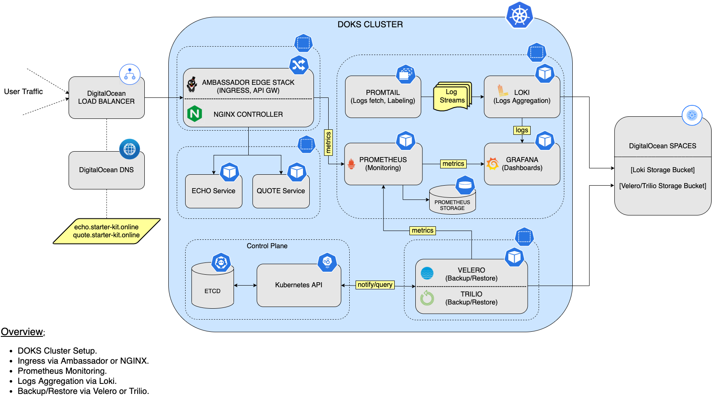

# Day-2 Operations-ready DigitalOcean Kubernetes (DOKS) for Developers

[Webinar video from 9/28/2021](https://www.youtube.com/watch?v=C48gUklH1DU&t=5s)

[Automating GitOps and Continuous Delivery With DigitalOcean Kubernetes](https://www.youtube.com/watch?v=zNfbjpOQRxQ&t=3s)

In this tutorial, we provide developers a hands-on introduction on how to get started with an operations-ready Kubernetes cluster on DigitalOcean Kubernetes (DOKS). Kubernetes is easy to set up and developers can use identical tooling and configurations across any cloud. Making Kubernetes operationally ready requires a few more tools to be set up, which are described in this tutorial.

Resources used by the Starter Kit include the following:

- DigitalOcean `Droplets` (for `DOKS` cluster).
- DigitalOcean `Load Balancer`.
- DigitalOcean `Block Storage` for persistent storage.
- DigitalOcean `Spaces` for object storage.
- Kubernetes Helm Charts:

    [](https://artifacthub.io/packages/helm/ingress-nginx/ingress-nginx/4.0.13)
    [](https://artifacthub.io/packages/helm/datawire/edge-stack/7.2.2)
    [](https://artifacthub.io/packages/helm/prometheus-community/kube-prometheus-stack/30.0.1)
    [](https://artifacthub.io/packages/helm/grafana/loki-stack/2.5.1)
    [](https://artifacthub.io/packages/helm/vmware-tanzu/velero/2.27.3)
    
    [](https://artifacthub.io/packages/helm/bitnami-labs/sealed-secrets/2.0.2)

**Notes:**

- Main branch should generally work. Just note that it is being frequently updated. If you want to be safe, pick a specific tag version corresponding to DOKS release (eg. v1.21.3, v1.21.5).
- Tags specific points in a repository’s history when an important change applied.

Remember to verify and delete the resources at the end of the tutorial, if you no longer need those.

## Operations-ready Setup Overview

Below is a diagram that gives a high-level overview of the `Starter Kit` setup, as well as the main steps:



## Table of contents

1. [Scope](#scope)
2. [Set up DO Kubernetes](01-setup-DOKS/README.md)
3. [Set up DO Container Registry](02-setup-DOCR/README.md)
4. [Set up Ingress Controller](03-setup-ingress-controller/README.md)
5. [Prometheus Monitoring Stack](04-setup-prometheus-stack/README.md)
6. [Logs Aggregation via Loki Stack](05-setup-loki-stack/README.md)
7. [Set up Backup and Restore](06-setup-backup-restore/README.md)
8. [Alerts and Notifications](07-alerting-and-notification/README.md)
9. [Kubernetes Sealed Secrets](08-kubernetes-sealed-secrets/README.md)
10. [Scaling Application Workloads](09-scaling-application-workloads/README.md)
11. [Estimate resource usage of starter kit](14-starter-kit-resource-usage/README.md)
12. [Continuous Delivery using GitOps](15-continuous-delivery-using-gitops/README.md)

## Scope

This tutorial demonstrates the basic setup you need to be operations-ready.

All the steps are done manually using the `command line interface` (CLI). If you need end-to-end automation, refer to the last section.

None of the installed tools are exposed using `Ingress` or `Load Balancer`. To access the console for individual tools, we use `kubectl port-forward`.

We will use `brew` (on MacOS) to install the required command-line utilities on our local machine and use the command to work on a `DOKS` cluster.

For every `service` that gets `deployed`, we will enable `metrics` and `logs`. At the end, we will review the `overhead` from all these additional tools and services. That gives an idea of what it takes to be `operations-ready` after your first cluster install.

This tutorial will use manifest files from this repo. It is recommended to clone this repository to your local environment. The below command can be used to clone this repository.

```shell
git clone https://github.com/digitalocean/Kubernetes-Starter-Kit-Developers.git

git checkout <TAG>   # If you want to pick a tested tag corresponding to DOKS release, eg. v1.21.3
```

**Notes:**

- For this `Starter Kit`, we recommend to start with a node pool of higher capacity nodes (say, `4cpu/8gb RAM`) and have at least `2` nodes. Otherwise, review and allocate node capacity if you run into pods in `PENDING` state.
- We customize the value files for `Helm` installs of individual components. To get the original value file, use `helm show values`. For example: `helm show values prometheus-community/kube-prometheus-stack  --version 30.0.1`.
- There are multiple places where you will change a manifest file to include a secret token for your cluster. Please be mindful of `handling` the `secrets`, and do not `commit` to `public Git` repositories. A safer method to use is `Sealed Secrets`, explained in [Kubernetes Sealed Secrets](08-kubernetes-sealed-secrets/README.md). The sample manifests provided in the [Section 15 - Continuous Delivery using GitOps](15-continuous-delivery-using-gitops/README.md) section, shows you how to use `Sealed Secrets` in combination with `Flux CD`, and reference `sensitive` data in each manifest that require secrets.
- To keep the components up to date, helm provides you the option to upgrade them to latest version or desired version. For example `helm upgrade kube-prom-stack prometheus-community/kube-prometheus-stack --version 30.0.0 --namespace monitoring -f "04-setup-prometheus-stack/assets/manifests/prom-stack-values-v30.0.1.yaml"`.

If you want to automate installation for all the components, refer to [Section 15 - Continuous Delivery using GitOps](15-continuous-delivery-using-gitops/README.md).

Go to [Section 1 - Set up DigitalOcean Kubernetes](01-setup-DOKS/README.md).
