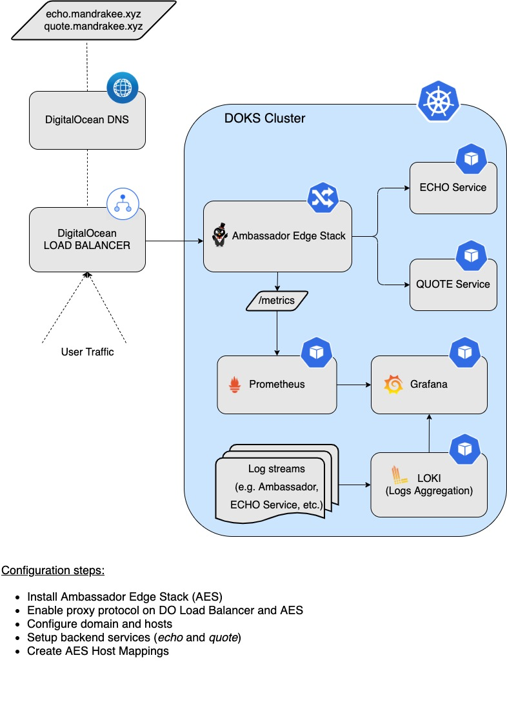

# Day-2 Operations-ready DOKS (DigitalOcean Kubernetes) for Developers

**WORK-IN-PROGRESS**

**TBD- Opinionated configuration** </br>
**TBD- Automation to set up the stack** </br>

Kubernetes has become really simple to understand and setup. In a way, it has democratized the cloud. With kubernetes, developers can use the identical tooling and configurations across any cloud.

Installing kubernetes is only getting started. Making it operationally ready requires lot more things. The objective of this tutorial is to provide developers an hands-on introduction on how to get started with an operations-ready kubernetes cluster on DO Kubernetes.


# Table of contents
1. [Scope](#SCOP)
2. [Set up DO Kubernetes](#DOKS)
3. [Set up DO Container Registry](#DOCR)
4. [Prometheus monitoring stack](#PROM)
5. [Configure logging using Loki](#LOKI)
6. [Ingress using Ambassador](#AMBA)
7. [Backup using Velero](#VELE)
8. [Automate everything using Terraform and Flux](#AUTO)


## Scope <a name="SCOP"></a>
This is meant to be a beginner tutorial to demonstrate the setups you need to be operations-ready. The list is an work-in-progress.

All the steps are done manually using commandline. If you need end-to-end automation, refer to the last section.

None of the installed tools are exposed using ingress or LB. To access the console for individual tools, we use kubectl port-forward.

We will use brew (on mac) to install the commmands on our local machine. We will skip the how-to-install and command on your local laptop, and focus on using the command to work on DOKS cluster. 

For every tool, we will make sure to enable metrics and logs. At the end, we will review the overhead from all these additional tools. That gives an idea of what it takes to be operations-ready after your first cluster install. <br/><br/>


## Set up DO Kubernetes <a name="DOKS"></a>
Explore doctl options.
```
~ doctl version
doctl version 1.61.0-release
~ doctl auth list
bgdo (current)
default
~ 
```

Explore options for creating the cluster.
```
~ doctl k8s -h
~ doctl k8s options -h
~ doctl k8s options regions
~ doctl k8s options sizes  
~ doctl k8s options versions
~ doctl k8s cluster create -h
```

Let us create a DOKS cluster with 3 worker nodes. Use "--wait false", if you do not want the command to wait until cluster is ready.

```
~ doctl kubernetes cluster create bg-cluster-2 \
--auto-upgrade=false \
--maintenance-window "saturday=21:00" \
--node-pool "name=basicnp;size=s-2vcpu-4gb;count=3;tag=cluster2;label=type=basic;auto-scale=true;min-nodes=3;max-nodes=5" \
--region sfo3 \

Notice: Cluster is provisioning, waiting for cluster to be running
..................................................................
Notice: Cluster created, fetching credentials
Notice: Adding cluster credentials to kubeconfig file found in "/Users/bgupta/.kube/config"
Notice: Setting current-context to do-sfo3-bg-cluster-1
ID                                      Name            Region    Version        Auto Upgrade    Status     Node Pools
0922a629-7f2e-4bda-940c-4d42a3f987ad    bg-cluster-1    sfo3      1.20.7-do.0    false           running    basicnp
~ 
```

Now let us set up kubectl, if the context is not set.

```
~ kubectl config current-context 
do-sfo3-bg-cluster-1
~ 
~ doctl k8s cluster list
ID                                      Name            Region    Version        Auto Upgrade    Status          Node Pools
0922a629-7f2e-4bda-940c-4d42a3f987ad    bg-cluster-1    sfo3      1.20.7-do.0    false           provisioning    basicnp
# YOU MAY NOT NEED THIS COMMAND, IF CONTEXT IS ALREADY SET.
~ doctl kubernetes cluster kubeconfig save 0922a629-7f2e-4bda-940c-4d42a3f987ad
Notice: Adding cluster credentials to kubeconfig file found in "/Users/bgupta/.kube/config"
Notice: Setting current-context to do-sfo3-bg-cluster-1
~ 
~ kubectl get nodes
NAME            STATUS   ROLES    AGE     VERSION
basicnp-865x3   Ready    <none>   2m55s   v1.20.7
basicnp-865x8   Ready    <none>   2m21s   v1.20.7
basicnp-865xu   Ready    <none>   2m56s   v1.20.7
~ 
```

## Set up DO Container Registry <a name="DOCR"></a>
You need a container registry (Docker Hub, DO container registry, etc.) when you need to build a container image and deploy it to the cluster. The cluster can pull images from a configured registry. Here we will set up a DO container registry (DOCR) for our cluster.

```
~ doctl registry create bg-reg-1 --subscription-tier basic
Name        Endpoint
bg-reg-1    registry.digitalocean.com/bg-reg-1
~ 
```

You can have only 1 registry endpoint per account in DOCR. A repository in a registry refers to the collection of a container image with different versions (tags). Given that the DOCR registry is a private endpoint, we need to configure the DOKS cluster to be able to fetch images from the DOCR registry.

```
~ doctl registry kubernetes-manifest | kubectl apply -f -
secret/registry-bg-reg-1 created
~ k get secrets registry-bg-reg-1
NAME                TYPE                             DATA   AGE
registry-bg-reg-1   kubernetes.io/dockerconfigjson   1      13s
~
```

This create the above secret in default namespace. 

## Prometheus monitoring stack <a name="PROM"></a>
We will install kube-prometheus stack using helm, which is an opinionated full monitoring stack for kubernetes. It includes prometheus operator, kube-state-metrics, pre-built manifests, node exporters, metrics api, and alerts manager. 

Helm chart: https://github.com/prometheus-community/helm-charts/tree/main/charts/kube-prometheus-stack

Update helm repo
```
helm repo add prometheus-community https://prometheus-community.github.io/helm-charts
helm repo update
```

Download values.yaml
```
curl https://raw.githubusercontent.com/prometheus-community/helm-charts/main/charts/kube-prometheus-stack/values.yaml -o prom-stack-values.yaml
```

Modify values.yaml file to disable (false) metrics for etcd and kubeScheduler. Those components are managed by DOKS, and are not accessible to prometheus. Note that we're keeping the storage to be emptyDir. It means the storage will be gone if prometheus pods restart.

Install kube-prometheus-stack. 

```
helm install kube-prom-stack prometheus-community/kube-prometheus-stack -n monitoring -f prom-stack-values.yaml --create-namespace --wait
```

Now you can connect to grafana (admin/prom-monitor, see values.yaml) by port forwarding to local machine. Once in, you can go to dashboards - manage, and choose different dashboards. 

```
kubectl --namespace monitoring port-forward svc/kube-prom-stack-grafana 3000:80
```


## Configure logging using Loki <a name="LOKI"></a>
We need loki for logs. Loki runs on the cluster itself as a statefulset. Logs are aggregated and compressed by loki, then sent to the configured storage. Then we can connect loki data source to grafana, and view the logs.

```
helm repo add grafana https://grafana.github.io/helm-charts
helm search repo grafana
```

We are interested in loki-stack (https://github.com/grafana/helm-charts/tree/main/charts/loki-stack), which will install standalone loki on the cluster.

```
curl https://raw.githubusercontent.com/grafana/helm-charts/main/charts/loki-stack/values.yaml -o loki-values.yaml
helm upgrade --install loki --namespace=monitoring grafana/loki-stack -f loki-values.yaml --create-namespace --wait
```

Now connect loki data source to grafana. Go the grafana web console, and add settings - data sources - add - loki. Add loki url "http://loki:3100". Save and quote.

Now you can access logs from explore tab of grafana. Make sure to select loki as the data source. Use help button for log search cheat sheet.

## Ingress using Ambassador <a name="AMBA"></a>

### Options for Load Balancer and Ingress

In most of the cases you will use the `Load Balancer` that is made available by the `Cloud` provider of your choice. In case of `DigitalOcean` when you configure a service as a `Load Balancer`, DOKS automatically provisions one in your account (unless you configure to use an existing one). Now the service is exposed to the outside world and can be accessed via the `Load Balancer` endpoint. In a real world scenario you do not want to use one `Load Balancer` per service so you need a proxy inside the cluster. That is `Ingress`.

When an `Ingress Proxy` is installed it creates a service and exposes it as a `Load Balancer`. Now you can have as many services behind the ingress and all accessible through a single endpoint. Ingress operates at the `HTTP` layer.

Let us say you are exposing `REST` or `GRPC` APIs for different tasks (reading account info, writing orders, searching orders, etc.). Depending on the `API` you will want to be able to route to a specific target. For this to happen more functionality needs to be built inside the ingress proxy. That is `API Gateway` and it is capable of doing more things besides routing traffic. For this tutorial we are going to pick an ingress that can do both `HTTP` routing and `API Gateway`.

As there are many vendors, `Kubernetes API` has an `Ingress` spec. The idea is that developers should be able to use the `Ingress API` and it should work with any vendor. That works well but has limited capability in the current version. The new version of ingress is called `API Gateway` and is currently in alpha. The idea is the same - users should be able to provide a rich set of ingress configuration using the `API Gateway` syntax. As long as the vendor supports it users will be able to manage the ingress in a vendor-agnostic way.

We will use the `Ambassador Edge Stack` in this tutorial. You can pick any `Ingress/API Gateway` solution as long as it has good support from the community because we may want more options to be available in the near future as well.

### Ambassador Edge Stack (AES)

The `Ambassador Edge Stack` or `AES` for short is a specialized [Control Plane](https://blog.getambassador.io/the-importance-of-control-planes-with-service-meshes-and-front-proxies-665f90c80b3d) for the `Envoy Proxy`. In this architecture, `Ambassador Edge Stack` translates configuration (in the form of `Kubernetes Custom Resources`) to `Envoy` configuration. All the actual traffic is directly handled by the high-performance [Envoy Proxy](https://www.envoyproxy.io).

At a very high level `AES` works as follows:
1.  The service owner defines configuration in `Kubernetes` manifests.
2.  When the manifest is applied to the cluster, the `Kubernetes API` notifies `Ambassador Edge Stack` of the change.
3.  `Ambassador Edge Stack` parses the change and transforms the configuration into a semantic intermediate representation. `Envoy` configuration is generated from this `IR`.
4.  The new configuration is passed to `Envoy` via the `gRPC-based Aggregated Discovery Service (ADS) API`.
5.  Traffic flows through the reconfigured `Envoy`, without dropping any connections.

For more details and in depth explanation please visit: [The Ambassador Edge Stack Architecture](https://www.getambassador.io/docs/edge-stack/2.0/topics/concepts/architecture) 

The set of configuration steps are as follows:
1. Install `AES`.
2. Enable `Prometheus` for metrics and `Loki` for logs.
3. Configure two hosts (`domain1`, `domain2`) on the cluster. For this example we're going to use `quote.mandake.xyz` and `echo.mandrake.xyz` as two different hosts on the same cluster.
4. Enable different paths for the domains. For `quote.mandrake.xyz` we create a backend service called `quote`. For `echo.mandrake.xyz` we create a echo service called `echo`.
5. Domains are configured with `TLS` and have different `URL` paths.
6. Verify the installation.

Below is a diagram giving a high level overview of the setup presented in this tutorial:



### Ambassador Edge Stack Deployment

Deploying the `Ambassador Edge Stack` into the `DOKS` cluster via [Helm](https://helm.sh):
1. Adding the Helm repo:

    ```bash
    helm repo add datawire https://www.getambassador.io
    ```
2. Listing the available versions (we will use the `6.7.13 ` version of the `Chart` which maps to the `1.13.0` release of `AES`):

    ```bash
    helm search repo datawire
    ```
   
   The output looks similar to the following:
   ```
   NAME                            CHART VERSION   APP VERSION     DESCRIPTION                                       
   datawire/ambassador             6.7.13          1.13.10         A Helm chart for Datawire Ambassador              
   datawire/ambassador-operator    0.3.0           v1.3.0          A Helm chart for Kubernetes                       
   datawire/telepresence           2.4.0           2.4.0           A chart for deploying the server-side component...
   ```
3. Creating a dedicated `ambassador` namespace and finishing the installation:

    ```bash
    kubectl create namespace ambassador &&  \
    helm install ambassador --namespace ambassador datawire/ambassador --version 6.7.13 &&  \
    kubectl -n ambassador wait --for condition=available --timeout=90s deploy -lproduct=aes
    ```

### Defining the Hosts (Domains)

In a real world scenario each host maps to a service so we need a way to tell AES about our intentions - meet the [Host](https://www.getambassador.io/docs/edge-stack/1.13/topics/running/host-crd/) CRD.

The custom `Host` resource defines how `Ambassador Edge Stack` will be visible to the outside world. It collects all the following information in a single configuration resource. The most relevant parts are:

* The hostname by which `Ambassador Edge Stack` will be reachable
* How `Ambassador Edge Stack` should handle `TLS` certificates
* How `Ambassador Edge Stack` should handle secure and insecure requests

For more details please visit the [AES Host CRD](https://www.getambassador.io/docs/edge-stack/1.13/topics/running/host-crd/) official documentation.

Notes on `ACME` support:

* If the `Authority` is not supplied then a `Let’s Encrypt` **production environment** is assumed.
* In general the registrant email address is mandatory when using `ACME` and it should be a valid one in order to receive notifications when the certificates are going to expire.
* `ACME` stores certificates using `Kubernetes` secrets. The name of the secret can be set using the `tlsSecret` element:

The following example will configure the required `TLS` enabled hosts for this tutorial:

```bash
cat << EOF | kubectl apply -f -
apiVersion: getambassador.io/v2
kind: Host
metadata:
  name: quote-host
  namespace: ambassador
spec:
  hostname: quote.mandrakee.xyz
  acmeProvider:
    email: quote@gmail.com
  tlsSecret:
    name: tls-cert
  requestPolicy:
    insecure:
       action: Redirect
       additionalPort: 8080
---
apiVersion: getambassador.io/v2
kind: Host
metadata:
  name: echo-host
  namespace: ambassador
spec:
  hostname: echo.mandrakee.xyz
  acmeProvider:
    email: echo@gmail.com
  tlsSecret:
    name: tls2-cert
  requestPolicy:
    insecure:
       action: Redirect
       additionalPort: 8080
EOF
```
Let's review the hosts that were created:

```bash
kubectl get hosts -n ambassador
```

The output looks similar to the following:

```
NAME         HOSTNAME              STATE     PHASE COMPLETED      PHASE PENDING              AGE
echo-host    echo.mandrakee.xyz    Pending   ACMEUserRegistered   ACMECertificateChallenge   3s
quote-host   quote.mandrakee.xyz   Pending   ACMEUserRegistered   ACMECertificateChallenge   3s
```

It takes ~30 seconds to get the signed certificate for the hosts. At this point we have the `Ambassador Edge Stack` installed and the hosts configured. But we still don't have the networking (eg. DNS and Load balancer) configured to route the traffic to the cluster. The missing parts can be noticed in the `Kubernetes` events of the hosts that were configured earlier.

Let's take a look and see what happens for the `echo-host`:

```bash
kubectl describe host echo-host -n ambassador
```

The output looks similar to the following:

```
Events:
  Type     Reason   Age                From                   Message
  ----     ------   ----               ----                   -------
  Normal   Pending  32m                Ambassador Edge Stack  waiting for Host DefaultsFilled change to be reflected in snapshot
  Normal   Pending  32m                Ambassador Edge Stack  creating private key Secret
  Normal   Pending  32m                Ambassador Edge Stack  waiting for private key Secret creation to be reflected in snapshot
  Normal   Pending  32m                Ambassador Edge Stack  waiting for Host status change to be reflected in snapshot
  Normal   Pending  32m                Ambassador Edge Stack  registering ACME account
  Normal   Pending  32m                Ambassador Edge Stack  ACME account registered
  Normal   Pending  32m                Ambassador Edge Stack  waiting for Host ACME account registration change to be reflected in snapshot
  Normal   Pending  16m (x4 over 32m)  Ambassador Edge Stack  tlsSecret "tls2-cert"."ambassador" (hostnames=["echo.mandrakee.xyz"]): needs updated: tlsSecret does not exist
  Normal   Pending  16m (x4 over 32m)  Ambassador Edge Stack  performing ACME challenge for tlsSecret "tls2-cert"."ambassador" (hostnames=["echo.mandrakee.xyz"])...
  Warning  Error    16m (x4 over 32m)  Ambassador Edge Stack  obtaining tlsSecret "tls2-cert"."ambassador" (hostnames=["echo.mandrakee.xyz"]): acme: Error -> One or more domains had a problem:
[echo.mandrakee.xyz] acme: error: 400 :: urn:ietf:params:acme:error:dns :: DNS problem: SERVFAIL looking up A for echo.mandrakee.xyz - the domain's nameservers may be malfunctioning
...
```
As seen above, the last event tells us that there's no A record to point to the `echo` host for the `mandrakee.xyz` domain which results in a lookup failure. Let's fix this in the next section of the tutorial.

### Configuring domain mappings

Adding a domain you own to your `DigitalOcean` account lets you manage the domain’s `DNS` records with the control panel and `API`. Domains you manage on `DigitalOcean` also integrate with `DigitalOcean Load Balancers` and `Spaces` to streamline automatic `SSL` certificate management.

What we need to do next is to create a `domain` and add the required `A` records for the new hosts: `echo` and `quote`. Let's do that via the [doctl](https://docs.digitalocean.com/reference/doctl/how-to/install) utility.

First we spin up a new domain:

```bash
doctl compute domain create mandrakee.xyz
```

The output looks similar to the following:

```
Domain           TTL
mandrakee.xyz    0
```

Let's add some `A` records now for the hosts created earlier. First we need to identify the Load Balancer IP that points to your `Kubernetes` cluster (one should be already created when the cluster was created). Pick the one that matches your configuration from the list:

```bash
doctl compute load-balancer list
```

Then add the records (please replace the `<>` placheholders accordingly):

```bash
doctl compute domain records create mandrakee.xyz --record-type "A" --record-name "echo" --record-data "<your_lb_ip_address>"
doctl compute domain records create mandrakee.xyz --record-type "A" --record-name "quote" --record-data "<your_lb_ip_address>"
```

**Note:**

If you have only one LB in your account then this snippet should help:

```bash
LOAD_BALANCER_IP=$(doctl compute load-balancer list --format IP --no-header)
doctl compute domain records create mandrakee.xyz --record-type "A" --record-name "echo" --record-data "$LOAD_BALANCER_IP"
doctl compute domain records create mandrakee.xyz --record-type "A" --record-name "quote" --record-data "$LOAD_BALANCER_IP"
```

List the available records for the `mandrakee.xyz` domain:

```bash
doctl compute domain records list mandrakee.xyz
```

The output looks similar to the following:

```
ID           Type    Name     Data                    Priority    Port    TTL     Weight
164171755    SOA     @        1800                    0           0       1800    0
164171756    NS      @        ns1.digitalocean.com    0           0       1800    0
164171757    NS      @        ns2.digitalocean.com    0           0       1800    0
164171758    NS      @        ns3.digitalocean.com    0           0       1800    0
164171801    A       echo     143.244.208.191         0           0       3600    0
164171809    A       quote    143.244.208.191         0           0       3600    0
```

Great! Now let's see if the `AES Hosts` are OK:

```bash
kubectl get hosts -n ambassador
```

The output looks similar to the following:

```
NAME         HOSTNAME              STATE   PHASE COMPLETED   PHASE PENDING   AGE
echo-host    echo.mandrakee.xyz    Ready                                     2m11s
quote-host   quote.mandrakee.xyz   Ready                                     2m12s
```

If the `STATE` column prints `Ready` then awesome! Now we're ready to rock!

At this point the network traffic will reach the `AES enabled` cluster but we need to configure the `backend services paths` for each of the hosts. All `DNS` records have one thing in common: `TTL` or time to live. It determines how long a `record` can remain cached before it expires. Loading data from a local cache is faster but visitors won’t see `DNS` changes until their local cache expires and gets updated after a new `DNS` lookup. As a result, higher `TTL` values give visitors faster performance and lower `TTL` values ensure that `DNS` changes are picked up quickly. All `DNS` records require a minimum `TTL` value of `30 seconds`.

Please visit the [How to Create, Edit and Delete DNS Records](https://docs.digitalocean.com/products/networking/dns/how-to/manage-records) page for more information.

### Creating the Backend Services

We can have multiple `TLS enabled` hosts on the same cluster. On the other hand we can have multiple deployments and services as well. So for each `Backend Service` a corresponding `Kubernetes Deployment` and `Service` has to be created.

Let's create a dedicated namespace for our `quote` and `echo` backend applications. This is a good practice because we don't want to pollute the `AES` space (or any other) with our application specific stuff.

```bash
kubectl create ns backend
```

Spinning up the deployments for the `quote` and `echo` applications in the `backend` namespace:

```bash
cat << EOF | kubectl apply -f -
---
apiVersion: apps/v1
kind: Deployment
metadata:
  name: quote
  namespace: backend
spec:
  replicas: 1
  selector:
    matchLabels:
      app: quote
  strategy:
    type: RollingUpdate
  template:
    metadata:
      labels:
        app: quote
    spec:
      containers:
      - name: backend
        image: docker.io/datawire/quote:0.4.1
        ports:
        - name: http
          containerPort: 8080

---
apiVersion: apps/v1
kind: Deployment
metadata:
  name: echo
  namespace: backend
spec:
  replicas: 1
  selector:
    matchLabels:
      app: echo
  strategy:
    type: RollingUpdate
  template:
    metadata:
      labels:
        app: echo
    spec:
      containers:
      - name: echo
        image: jmalloc/echo-server
        ports:
        - name: http
          containerPort: 8080
EOF
```

Creating the corresponding services is just a matter of:

```bash
cat << EOF | kubectl apply -f -
apiVersion: v1
kind: Service
metadata:
  name: quote
  namespace: backend
spec:
  ports:
  - name: http
    port: 80
    targetPort: 8080
  selector:
    app: quote
---
apiVersion: v1
kind: Service
metadata:
  name: echo
  namespace: backend
spec:
  ports:
  - name: http
    port: 80
    targetPort: 8080
  selector:
    app: echo
EOF
```

Inspecting the deployments and services we just created:

```bash
kubectl get deployments -n backend
```

The output looks similar to the following:

```
NAME    READY   UP-TO-DATE   AVAILABLE   AGE
echo    1/1     1            1           2m22s
quote   1/1     1            1           2m23s
```

```bash
kubectl get svc -n backend
```

The output looks similar to the following:

```
NAME    TYPE        CLUSTER-IP       EXTERNAL-IP   PORT(S)   AGE
echo    ClusterIP   10.245.175.185   <none>        80/TCP    2m32s
quote   ClusterIP   10.245.158.116   <none>        80/TCP    2m33s
```

As the last configuration step, create the `mappings` for Ambassador.

#### Configuring the AES Mapping for each Host

`Ambassador Edge Stack` is designed around a [declarative, self-service management model](https://www.getambassador.io/docs/edge-stack/latest/topics/concepts/gitops-continuous-delivery). It means that you can manage the `Edge` via a dedicated Kubernetes `CRD`, namely the `Mapping` resource. More info about [Mappings](https://www.getambassador.io/docs/edge-stack/1.13/topics/using/intro-mappings) can be found on the official page.

What a `Mapping` does is to manage routing for all inbound traffic to the `/backend/` path of the `quote` service and `/echo/` for the `echo` service.

**Mapping fields description**

* `name` - a string identifying the `Mapping` (e.g. in diagnostics).
* `prefix` - the `URL` prefix identifying your resource.
* `service` - the name of the service handling the resource; must include the namespace (e.g. myservice.othernamespace) if the service is in a different namespace than `Ambassador Edge Stack`.

Creating the mappings for each of our applications:

```bash
cat << EOF | kubectl apply -f -
---
apiVersion: getambassador.io/v2
kind: Mapping
metadata:
  name: quote-backend
  namespace: ambassador
spec:
  prefix: /quote/
  host: quote.mandrakee.xyz
  service: quote.backend
 
---
apiVersion: getambassador.io/v2
kind: Mapping
metadata:
  name: echo-backend
  namespace: ambassador
spec:
  prefix: /echo/
  host: echo.mandrakee.xyz
  service: echo.backend
EOF
```

Inspecting the results:

```bash
kubectl get mappings -n ambassador
```

The output looks similar to the following (notice the `echo-backend` and `quote-backend` lines):

```
NAME                          SOURCE HOST           SOURCE PREFIX                               DEST SERVICE     STATE   REASON
ambassador-devportal                                /documentation/                             127.0.0.1:8500           
ambassador-devportal-api                            /openapi/                                   127.0.0.1:8500           
ambassador-devportal-assets                         /documentation/(assets|styles)/(.*)(.css)   127.0.0.1:8500           
ambassador-devportal-demo                           /docs/                                      127.0.0.1:8500           
echo-backend                  echo.mandrakee.xyz    /echo/                                      echo.backend             
quote-backend                 quote.mandrakee.xyz   /quote/                                     quote.backend 
```

### Enabling Proxy Protocol

Proxy protocol enables a `L4 Load Balancer` to communicate with the original `client IP`. For this to work we need to configure both `DigitalOcean Load Balancer` and `AES`. After deploying the `Services` as seen earlier in the tutorial and manually enabling the `proxy protocol` you need to deploy a specific `Ambassador Module` to enable `AES` to use the proxy protocol. An `AES` restart is needed for the configuration to take effect.

For more details please follow the examples from the official [DigitalOcean Cloud Controller Manager](https://github.com/digitalocean/digitalocean-cloud-controller-manager/tree/master/docs/controllers/services/examples) documentation.


You can create a load balancer with `Proxy` support by using the `DO` web console. If you navigate to the advanced settings page of the `Load Balancer` associated with your `Kubernetes` cluster there's a dedicated section for it.

Please visit the [LB with Proxy Protocol enabled](https://www.digitalocean.com/community/questions/how-to-set-up-nginx-ingress-for-load-balancers-with-proxy-protocol-support) page for more information about this option.

You can enable proxy support in the Ambassador stack by using the below configuration:

```bash
cat << EOF | kubectl apply -f -
apiVersion: getambassador.io/v2
kind: Module
metadata:
  name: ambassador
  namespace: ambassador
spec:
  config:
    use_proxy_proto: true
EOF
```

### Verifying the AES Setup

In the current setup we have two hosts configured with `TLS` termination and `ACME` protocol: `quote.mandrakee.xyz` and `echo.mandrakee.xyz`. By creating `AES Mappings` it's very easy to have `TLS termination` support and `API Gateway` capabilities. 

If pinging `quote.mandrakee.xyz` or `echo.mandrakee.xyz` in the terminal one can see that packets are being sent to the `AES` external `IP`. Then, `AES` is using the mapping feature to reach the endpoints. 

```bash
kubectl get svc -n ambassador 
```

The output looks similar to the following:

```
NAME               TYPE           CLUSTER-IP     EXTERNAL-IP      PORT(S)                      AGE
ambassador         LoadBalancer   10.245.39.13   68.183.252.190   80:31499/TCP,443:30759/TCP   2d8h
ambassador-admin   ClusterIP      10.245.68.14   <none>           8877/TCP,8005/TCP            2d8h
ambassador-redis   ClusterIP      10.245.9.81    <none>           6379/TCP                     2d8h
```

```bash
ping quote.mandrakee.xyz
```

The output looks similar to the following:

```
PING quote.mandrakee.xyz (68.183.252.190): 56 data bytes
64 bytes from 68.183.252.190: icmp_seq=0 ttl=54 time=199.863 ms
64 bytes from 68.183.252.190: icmp_seq=1 ttl=54 time=202.999 ms
...
```

As explained above, notice that it hits the `AES` external IP (`68.183.252.190`).

We're going to test the backend services now via `curl` and use the `quote` service first. You can also inspect and see the results in a web browser if desired.

```bash
curl -Li http://quote.mandrakee.xyz/quote/
```

The output looks similar to the following (notice how it automatically redirects and use `https` instead):

```
HTTP/1.1 301 Moved Permanently
location: https://quote.mandrakee.xyz/quote/
date: Thu, 12 Aug 2021 18:28:43 GMT
server: envoy
content-length: 0

HTTP/1.1 200 OK
content-type: application/json
date: Thu, 12 Aug 2021 18:28:43 GMT
content-length: 167
x-envoy-upstream-service-time: 0
server: envoy

{
    "server": "avaricious-blackberry-5xw0vf5k",
    "quote": "The last sentence you read is often sensible nonsense.",
    "time": "2021-08-12T18:28:43.861400709Z"
}
```

Let's do the same for the `echo` service:

```bash
curl -Li http://echo.mandrakee.xyz/echo/
```

The output looks similar to the following (notice how it automatically redirects and use `https` instead):
```
HTTP/1.1 301 Moved Permanently
location: https://echo.mandrakee.xyz/echo/
date: Thu, 12 Aug 2021 18:31:27 GMT
server: envoy
content-length: 0

HTTP/1.1 200 OK
content-type: text/plain
date: Thu, 12 Aug 2021 18:31:28 GMT
content-length: 331
x-envoy-upstream-service-time: 0
server: envoy

Request served by echo-5d5bdf99cf-cq8nh

HTTP/1.1 GET /

Host: echo.mandrakee.xyz
X-Forwarded-Proto: https
X-Envoy-Internal: true
X-Request-Id: 07afec17-4535-4157-bf5f-ad19dafb7bff
Content-Length: 0
X-Forwarded-For: 10.106.0.3
User-Agent: curl/7.64.1
Accept: */*
X-Envoy-Expected-Rq-Timeout-Ms: 3000
X-Envoy-Original-Path: /echo/
```

If everything looks like above we're all set and configured the `Ambassador Edge Stack` successfully. 

Because `Monitoring` and `Logging` is a very important aspect of every production ready system in the next section we're going to focus on how to enable it via `Prometheus` and `Loki` for the `AES` stack as well as other backend services.

### Configure Prometheus & Grafana
We already install Prometheus, and grafana into our cluster by using the above prior sections called [Prometheus monitoring stack](#PROM). Also, you can make your own environment again from scratch by using the following link. 
(Monitoring with Prometheus and Grafana for Ambassador)[https://www.getambassador.io/docs/edge-stack/latest/howtos/prometheus/#monitoring-with-prometheus-and-grafana]

But we are considering you have a Prometheus environment and you want to bind a new ambassador gateway cluster with existed Prometheus environment. Before creating a service monitor to let Prometheus know how to scrap the metrics, you should know that ambassador is broadcasting its own metrics by using metrics endpoint. The /metrics endpoint can be accessed internally via the Ambassador Edge Stack admin port (default 8877). Please test it by calling the below link on your web browser yourself.

```
http(s)://ambassador:8877/metrics
```
we have existed monitoring configuration YAML file called *prom-stack-values.YAML*. it has a really important section and we have to change with service monitor configuration and then run helm upgrade to modify the existed chart. There are 2 steps for that.

(1) Please find *additionalServiceMonitors* section and modify tihs part like below in *prom-stack-values.yaml*
```
  additionalServiceMonitors:
      - name: "ambassador-monitor"
        selector:
          matchLabels:
            service: "ambassador-admin"
        namespaceSelector:
          matchNames:
            - ambassador
        endpoints:
        - port: "ambassador-admin"
          path: /metrics
          scheme: http
```
Let's explain keywords:

* matchLabel: tells what pods the deployment will apply to.
* selector: matchLabels tells the resource, whatever it may be, service, deployment, etc, to match the pod, according to that label.
* port: The port may be a literal port number as defined in the ambassador-metrics service, or may reference the port in the same service by name. 
* matchNames: Here we want to match the namespace of the Ambassador Metrics Service we have just created.

(2) Last step is *helm upgrade* to modify existed Prometheus chart for seeing changes.
```
helm upgrade kube-prom-stack prometheus-community/kube-prometheus-stack -n monitoring -f prom-stack-values.yaml
```
That's it! The final touch for seeing metrics values on Prometheus dashboard. For that, you have to forward your 9090 port to another available port.
```
 kubectl --namespace monitoring port-forward svc/kube-prom-stack-kube-prome-prometheus 9090:9090
```

#### DashBoard

After port forwarding like below, you can access the metrics in Grafana. 
```
kubectl --namespace monitoring port-forward svc/kube-prom-stack-grafana 3000:80
```
if you want to see all ambassador metrics in a well-designed dashboard Add the following dashboard in grafana: https://grafana.com/grafana/dashboards/4698


When you decide to test your first Grafana DashBoard, please call below ambassador test service. if you call the below service 2 times, you will see that 4 responses. Because it is a gateway, your request passes a gateway and arrives in real service. Because of that, your response also will have the same steps. 

```
~# curl -Lk https://104.248.102.80/backend/
{
    "server": "buoyant-pear-girnlk37",
    "quote": "A small mercy is nothing at all?",
    "time": "2021-08-11T18:18:56.654108372Z"
}
```

<TBD>


### Configure Loki and Grafana

We already install loki, and grafana into our cluster by following prior sections. 

<TBD>

## Backup using Velero <a name="VELE"></a>
TBD


## Automate everything using Terraform and Flux <a name="AUTO"></a>
TBD

