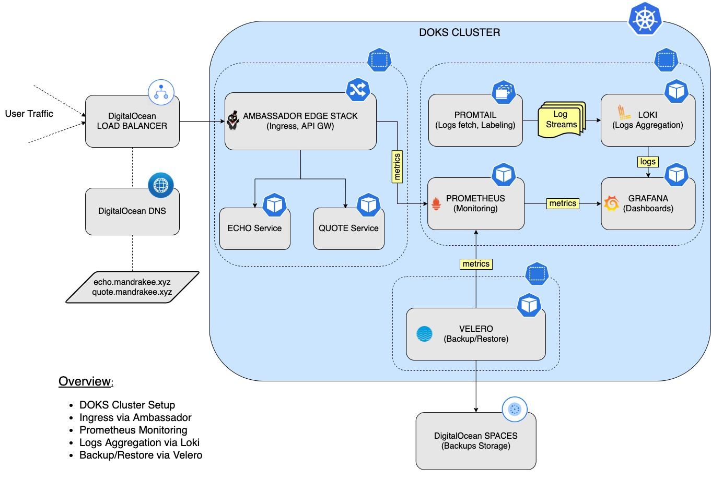

# Day-2 Operations-ready DigitalOcean Kubernetes (DOKS) for Developers

`Kubernetes` has become really simple to understand and setup. In a way, it has democratized the cloud. With `Kubernetes`, developers can use identical tooling and configurations across any cloud.

Installing `Kubernetes` is only the beginning of the journey. Making it operationally ready requires lot more things. The objective of this tutorial is to provide developers a hands-on `introduction` on how to get started with an operations-ready `Kubernetes` cluster on `DO Kubernetes (DOKS)`. 

**TBD 
- Need to fix the emptydir storage for prometheus, and use block storage instead. Likewise, use Spaces for Loki. 
- Need to move velero installation using helm. 
- Move the manifests under separate YAML files, so one can customize after cloning. Have images & manifests for each section.
- Adjust the replicas and requests/limits for different namespaces.
- Re-do section 7 with focus on cost analysis. Change input parameters for DO cloud.
- Automation using terraform/flux. 

## Operations-ready Setup Overview

Below is a diagram giving a high level overview of the setup presented in this tutorial as well as the main steps:

# Table of contents
0. [Scope](#SCOP)
1. [Set up DO Kubernetes](1-setup-DOKS)
2. [Set up DO Container Registry](2-setup-DOCR)
3. [Ingress Using Ambassador](3-setup-ingress-ambassador)
4. [Prometheus Monitoring Stack](4-setup-prometheus-stack)
5. [Logs Aggregation via Loki Stack](5-setup-loki-stack)
6. [Backup Using Velero](6-setup-velero)
7. [Cost analysis for your DOKS cluster](14-starter-kit-resource-usage)
7. [Estimate resource usage of starter kit](14-starter-kit-resource-usage)
15. [Automate Everything Using Terraform and Flux](50-automate-with-terraform-flux)

## Scope 
This is meant to be a `tutorial` to demonstrate the basic setup you need to be `operations-ready`.

All the steps are done manually using the `commandline` interface (`CLI`). If you need `end-to-end automation`, refer to the last section.

None of the installed tools are exposed using `Ingress` or `LB`. To access the console for individual tools, we use `kubectl port-forward`.

We will use `brew` (on `MacOS`) to install the required `commmand line utilities` on our local machine. We will skip the how-to-install and command on your local laptop, and focus on using the command to work on `DOKS` cluster. 

For every `service` that gets deployed, we will make sure to enable `metrics` and `logs`. At the end, we will review the `overhead` from all these additional tools and services. That gives an idea of what it takes to be `operations-ready` after your first cluster install. 

Note: It is better to start with a nodepool of higher capacity nodes (say, 4cpu/8gb RAM) and have 2 nodes for going through this starter kit. Otherwise, review and allocate node capacty if you run into pods in PENDING state.
  

If you just want to automate installation for all the components, refer to [section 50 - Automate with terraform & flux](50-automate-with-terraform-flux).

Go to [section 1 - setup DOKS](1-setup-DOKS).

